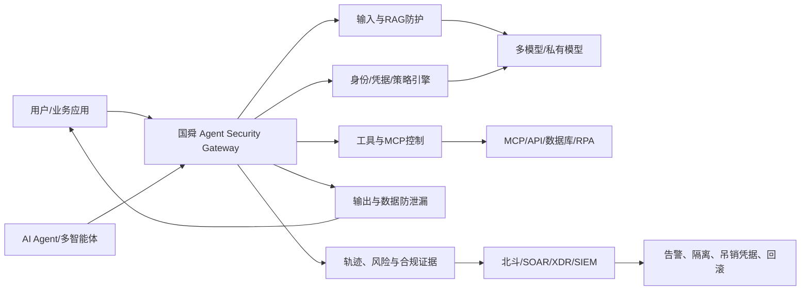

# 国舜大模型与智能体安全产品商业计划书

> 研究对象：北京国舜科技股份有限公司（以下简称“国舜”）  
> 研究基准日：2026 年 9 月 1 日  
> 文档性质：董事会/经营层立项建议稿  
> 结论口径：公开资料研究 + 可复核的自下而上测算，不构成审计、法律或证券意见

---

## 0. 一页结论

### 0.1 是否建议投入

**建议有条件投入，但不建议研发一个仅做敏感词、内容合规和提示词注入识别的通用“大模型防火墙”。**

建议立项方向是：

> **“国舜智能体安全控制与运营平台”**，以可私有化的 **Agent/MCP 安全网关** 为产品入口，以动作级授权、工具调用控制、敏感数据保护、运行时检测响应和合规审计为核心，并复用国舜现有 DevSecOps、SOAR/XDR、Web 应用安全和金融/政企安全服务能力。

推荐优先级：

| 方向 | 建议 | 原因 |
|---|---:|---|
| 智能体/MCP 运行时安全控制 | **优先投入** | 技术和标准仍在快速形成；客户痛点从“说错话”转向“做错事”；与零信任、API、SOAR 强协同 |
| 私有化大模型安全护栏 | **作为基础模块投入** | 是进入客户 AI 流量路径的必要能力，但国内外云厂商正在快速压低单纯过滤能力的价格 |
| AI 安全评估与持续红队 | **同步投入** | 销售周期短于平台，可作为获客入口和数据飞轮；能带动网关订阅 |
| AI 资产发现、AI-SPM、AI-BOM | **第二阶段投入** | 有平台价值，但与云安全、数据安全厂商重叠度高，第一阶段不宜铺得过宽 |
| 自研通用安全大模型/基础模型 | **不建议** | 资金、算力和数据投入过大，无法形成与国舜渠道优势相匹配的回报 |
| 面向大众互联网的内容审核 SaaS | **不建议作为主战场** | 云厂商和内容安全厂商规模优势明显，价格低、流量大、毛利承压 |

### 0.2 投资额度和硬门槛

- 建议采用 **18 个月分阶段投资、总上限 3,500 万至 4,500 万元**，而不是一次性建设“大而全”平台。
- 首期 6 个月预算上限建议 **1,200 万至 1,500 万元**，完成可收费 MVP、3 家共创客户和不少于 2 家付费试点后再释放下一阶段预算。
- 基准情景下，预计第 1 至第 3 个完整商业年度收入分别为 **1,500 万、5,500 万、1.25 亿元**，第 3 年实现经营性盈利；该数字是规划模型，不是收入承诺。
- 若 90 天内拿不到 3 家设计伙伴，或 6 个月内拿不到 2 家付费试点，建议暂停产品化扩张，保留为安全服务工具。

### 0.3 为什么是现在

1. Gartner 2026 年 8 月预测，全球“Securing AI”市场 2026 年约 **28.35 亿美元**，2027 年约 **47.83 亿美元**，同比增长 68.7%；其中 AI 应用安全、AI 使用控制、AI 治理平台和 AI 网关都是明确预算项。[来源](https://www.gartner.com/en/newsroom/press-releases/2026-08-26-gartner-forecasts-the-market-for-securing-ai-will-reach-almost-5-billion-in-2027)
2. 赛道已经出现并购验证：Cisco 收购 Robust Intelligence，Palo Alto Networks 以披露口径 **6.345 亿美元**收购 Protect AI，SentinelOne 约 **1.8 亿美元**收购 Prompt Security，Check Point 收购 Lakera。资本买的不是“关键词过滤器”，而是 AI 全生命周期和智能体运行时控制能力。
3. 学术证据显示单纯提示词防御并不可靠。ICLR 2025 的 Agent Security Bench 在 13 个模型底座上测得最高平均攻击成功率 **84.30%**；NAACL 2025 研究用自适应攻击绕过 8 类防御，攻击成功率均超过 **50%**。这意味着商业产品必须把安全边界从“模型是否听话”移到“系统是否允许动作发生”。
4. 国内监管、国家标准和采购口径已经进入可执行阶段：GB/T 45654-2025《网络安全技术 生成式人工智能服务安全基本要求》已实施；生成合成内容标识办法及强制性标准已生效；智能体互操作安全标准正在制定。合规和审计能力可以直接转化为项目预算。

---

## 1. 研究范围、方法与证据等级

### 1.1 研究范围

本报告覆盖四个相邻但不同的市场：

- **大模型安全护栏（LLM Guardrails）**：输入、输出、RAG 内容、主题、PII、越狱、幻觉和合规控制。
- **大模型防火墙/AI Gateway**：部署在应用与模型之间的运行时流量代理、策略执行和审计控制面。
- **智能体安全（Agent Security）**：Agent 身份、权限、工具/MCP、记忆、动作、协议、凭证、沙箱和可追溯性。
- **AI TRiSM/AI-SPM**：AI 资产发现、风险治理、模型供应链、红队评估、合规和运营。

### 1.2 证据等级

| 标签 | 含义 | 使用方式 |
|---|---|---|
| **A：公开可核验** | 法规、标准、论文原文、监管文件、上市公司文件、公开价目表 | 可直接用于决策基线 |
| **B：厂商披露** | 厂商性能、客户案例、ARR 增长、产品效果 | 用于趋势判断，不视为第三方验证 |
| **C：规划测算** | 国舜 TAM/SAM/SOM、价格、收入、成本、CAC | 需用客户访谈和内部财务数据校准 |

说明：本领域最新成果大量先发表于 ICLR、NeurIPS、ACL、EMNLP 等顶会或 arXiv。报告将 **SCI/SCIE 期刊、顶会论文、预印本分列**，不把所有论文笼统称为 SCI。期刊实时收录状态仍应以国舜采购的 Web of Science 数据库核验。

---

## 2. 国舜的战略适配度

### 2.1 可复用资产

公开资料显示，国舜定位为面向政企、金融、通信、能源、交通等行业的信息安全产品与解决方案厂商，能力覆盖 DevSecOps、XDR、安全运营、态势感知、Web 应用安全、风控反欺诈等，已服务百余家银行及上千家事业单位。[来源](https://pdf.dfcfw.com/pdf/H3_AP202501171641963552_1.pdf)

国舜现有优势与拟议产品的复用关系如下：

| 国舜现有资产 | 可复用到新产品的能力 |
|---|---|
| 金融/政企客户与销售网络 | 获得共创客户、缩短信任建立和供应商准入周期 |
| DevSecOps/代码安全 | 把智能体安全测试嵌入 CI/CD；建设 Agent-BOM、工具和提示词版本治理 |
| SOAR/XDR/北斗安全运营平台 | 承接 AI 告警、会话轨迹、工具调用，形成检测、研判、处置闭环 |
| Web/WAF/API 安全经验 | 建设反向代理、API/MCP 网关、限流、身份鉴别和策略执行点 |
| 安全服务与攻防经验 | 构建中文攻击语料、行业评估服务、持续红队和托管运营 |
| 银行业经验 | 建立账户、交易、客户信息、授信、营销、客服等业务动作的风险模板 |

### 2.2 明显短板

- 缺少公开可验证的 AI 安全产品规模化落地、模型安全研究和国际基准成绩。
- 私有公司当前收入、现金流、研发人员和可承受投入未公开，不能仅凭市场增长率决定投资。
- 国内一线厂商已形成“大模型卫士/护栏/AI Agent 安全网关”产品，国舜无法仅凭“也有一个网关”形成差异化。
- 智能体安全要求产品团队同时具备身份权限、应用安全、模型评测、协议、数据安全和业务风控能力，组织协同难度高于传统单品。

### 2.3 适配度评分

| 维度 | 评分（5 分制） | 判断 |
|---|---:|---|
| 客户与渠道复用 | 4.5 | 最强优势，尤其是金融和政企存量客户 |
| 产品技术邻近性 | 4.0 | WAF/API、DevSecOps、SOAR 与智能体安全高度邻近 |
| 数据和威胁情报 | 3.0 | 有传统安全数据，但需重建 AI/Agent 攻击与业务动作数据 |
| 品牌领先窗口 | 2.5 | 市场已有头部产品，必须做垂直差异化 |
| 资金和组织确定性 | 2.5 | 缺少最新公开财务，必须分阶段投资 |
| 综合 | **3.5** | **适合有条件投入，不适合重资产全面下注** |

---

## 3. 技术进展与最新论文研究

### 3.1 2025-2026 年 SCI/SCIE 期刊代表成果

| 年份 | 论文与出处 | 关键发现 | 对产品的含义 |
|---|---|---|---|
| 2026 | *Attack and defense techniques in large language models: A survey and new perspectives*, **Neural Networks 196**, DOI [10.1016/j.neunet.2025.108388](https://doi.org/10.1016/j.neunet.2025.108388) | 攻击已覆盖提示、优化攻击、模型窃取和应用层；防御面临泛化、效用和资源开销三难 | 产品必须采用分层检测和持续更新，不能承诺“一次部署永久有效” |
| 2026 | *Prompt Injection Attacks on Large Language Models*, **Computers, Materials & Continua 87(1)**, DOI [10.32604/cmc.2025.074081](https://doi.org/10.32604/cmc.2025.074081) | 汇总 128 项研究；未防护系统攻击成功率可超过 90%；识别 37 类防御，但对新型攻击仍有明显缺口 | 评测必须包含未知攻击、自适应攻击和业务良性集，不能只测公开攻击模板 |
| 2026 | *From prompt injections to protocol exploits*, **ICT Express**, DOI [10.1016/j.icte.2025.12.001](https://doi.org/10.1016/j.icte.2025.12.001) | 梳理 30 多种 Agent 攻击，风险从输入层扩展到 host-to-tool、agent-to-agent 和协议层 | 产品边界要覆盖 MCP/A2A、工具供应链、身份、来源和沙箱 |
| 2025 | *Security and Privacy Challenges of Large Language Models*, **ACM Computing Surveys 57(6)**, DOI [10.1145/3712001](https://doi.org/10.1145/3712001) | 系统归纳越狱、投毒、PII 泄露、模型窃取与防御；强调安全、隐私、效用的平衡 | 策略需要按场景和角色配置，不能使用全局统一阻断阈值 |
| 2025 | *Security concerns for Large Language Models: A survey*, **Journal of Information Security and Applications 95**, DOI [10.1016/j.jisa.2025.104284](https://doi.org/10.1016/j.jisa.2025.104284) | 将威胁扩展到自主智能体的目标错位、欺骗、持续性行为与恶意使用 | 运行时需要动作序列和会话级分析，而不仅是单条 prompt 分类 |

### 3.2 顶会与前沿成果

| 年份/级别 | 研究 | 可量化结果 | 商业化启示 |
|---|---|---|---|
| ICLR 2026 | [Constitutional Classifiers++](https://proceedings.iclr.cc/paper_files/paper/2026/hash/4f697305ef1f868ad77c3c0027989a6f-Abstract-Conference.html) | 两级分类器级联使计算成本降低 40 倍，生产流量拒绝率 0.05%；1,700 小时红队未找到满足其定义的通用越狱 | “轻量筛查 + 可疑流量深度研判”是可落地架构 |
| ACL 2026 Industry | [ShieldMCP](https://aclanthology.org/2026.acl-industry.58/) | 工具投毒 ASR 从 74% 降至 9% 以下；工具响应间接注入从 47% 降至 6% 以下；中位开销低于 120ms | MCP 调用拦截、结构检查和语义意图验证可成为独立付费模块 |
| ACL 2025 | [Task Shield](https://aclanthology.org/2025.acl-long.1435/) | GPT-4o 上攻击成功率 2.07%，任务效用 69.79% | 每一步动作都要证明服务于用户原始目标，适合形成“任务对齐”策略引擎 |
| NAACL 2025 Findings | [Adaptive Attacks Break Defenses](https://aclanthology.org/2025.findings-naacl.395/) | 自适应攻击绕过 8 类防御，ASR 均超过 50% | 厂商自测必须由攻击方适配防御，静态准确率不足以支撑采购 |
| ICLR 2025 | [Agent Security Bench](https://proceedings.iclr.cc/paper_files/paper/2025/file/5750f91d8fb9d5c02bd8ad2c3b44456b-Paper-Conference.pdf) | 10 场景、400+ 工具、13 模型；最高平均 ASR 84.30% | Agent 风险覆盖系统提示、用户输入、工具、记忆和计划链，需统一轨迹治理 |
| NeurIPS 2024 | [AgentDojo](https://proceedings.nips.cc/paper_files/paper/2024/hash/97091a5177d8dc64b1da8bf3e1f6fb54-Abstract-Datasets_and_Benchmarks_Track.html) | 97 个任务、629 个安全用例；现有攻击和防御均存在明显边界 | 国舜应建设金融/政务版 AgentDojo，而非只复用英文公共集 |
| 2025 前沿架构 | [CaMeL: Defeating Prompt Injections by Design](https://arxiv.org/abs/2503.18813) | 通过显式控制流、数据流和 capability 约束，在 AgentDojo 上完成 67% 任务并提供可证明安全边界 | 把不可信数据从控制流中隔离，比“再加一句系统提示”更可靠 |
| EMNLP 2025 | [IPIGuard](https://aclanthology.org/2025.emnlp-main.53/) | 用工具依赖图分离规划与外部数据，降低间接注入触发的非预期调用 | 工具调用白名单应升级为“依赖图 + 状态机 + 参数约束” |

### 3.3 六项关键技术判断

1. **纯文本检测是必要但不充分条件。** 输入/输出分类器能拦截大量已知攻击，但不能建立系统级授权边界。
2. **控制流与数据流分离成为主线。** 外部文档、网页、邮件、RAG 片段和工具响应必须被视为不可信数据，不能直接改变 Agent 的动作计划。
3. **权限与动作约束比“模型对齐”更接近传统安全的确定性。** 高风险动作要由独立策略引擎、RBAC/ABAC、交易规则和人审决定，不能交给 LLM 自我裁决。
4. **MCP/工具层是 2026 年最重要的新攻击面。** 工具描述投毒、工具替换、参数诱导、凭证窃取、组合调用和返回值注入都要求网关位于工具调用路径上。
5. **级联检测是性能与成本的现实解。** 规则/小模型处理大部分流量，疑难样本进入大模型研判；高风险写操作再触发强校验和人审。
6. **评价指标必须从“检出率”升级为净韧性。** 至少同时度量 ASR、良性任务成功率、误报率、延迟、成本、未授权动作率和回滚成功率。

---

## 4. 国外产品、厂商与商业化成熟度

### 4.1 代表产品比较

> 价格均为公开价目或 Marketplace 标价；“询价”表示未发现公开企业成交价。美元与人民币不做实时汇率换算，避免造成伪精确。

| 厂商/产品 | 核心能力 | 部署与商业模式 | 公开价格/客单价证据 | 主要获客方式 |
|---|---|---|---|---|
| **AWS Bedrock Guardrails** | 内容、敏感信息、禁止主题、提示攻击、grounding、自动推理 | 云原生 API，按量付费，绑定 Bedrock | 文本内容/主题 $0.15/千文本单元；Prompt Attack $0.08/千文本单元；自动推理 $0.17/千文本单元/策略。[价目](https://aws.amazon.com/bedrock/pricing/) | 云控制台自助、开发者文档、云销售交叉销售 |
| **Google Model Armor** | 模型无关的输入输出防护、PII、恶意输入、MCP/Apigee 集成 | API + 云安全平台捆绑 | 每月 200 万 token 免费，超出后公开价 $0.10/百万 token。[价目](https://cloud.google.com/security/products/model-armor) | 免费额度、云平台集成、Security Command Center 捆绑 |
| **Azure AI Content Safety** | Prompt Shields、内容/图像、多模态、groundedness、受保护材料 | F0/S0 分层、按量、Azure 销售 | 有 F0/S0，具体企业价格需 Azure 报价。[说明](https://learn.microsoft.com/en-us/azure/ai-services/content-safety/overview) | Azure OpenAI 默认生态、Studio 试用、微软企业协议 |
| **NVIDIA NeMo Guardrails** | 输入、RAG、对话、执行、输出 rails；内容、越狱、PII、Agent 注入 | 开源工具 + NIM/AI Enterprise 商业支持 | 核心库开源；企业支持随 NVIDIA 体系询价。[文档](https://docs.nvidia.com/nemo/guardrails/latest/home) | 开源开发者、GPU/AI Enterprise 渠道、生态集成 |
| **Check Point AI Guardrails（Lakera）** | 提示注入、内容、PII、Agent/tool 调用、红队；SaaS/自托管 | 社区版导流，企业 SaaS 或自托管，年度合同 | 社区版 1 万次 screening/月；企业询价。[文档](https://docs.lakera.ai/docs/platform) | Gandalf 教育游戏、研究内容、开发者 API、Dropbox 等灯塔案例、Check Point 渠道 |
| **Cisco AI Defense** | AI 资产发现、供应链、红队、运行时防护、MCP/工具风险 | Cisco 安全平台订阅，企业询价 | 未公开；Robust Intelligence 于 2024 年被收购。[来源](https://www.cisco.com/site/us/en/products/security/ai-defense/robust-intelligence-is-part-of-cisco/index.html) | Cisco 网络/安全存量客户、Talos 情报、合作伙伴 |
| **Palo Alto Prisma AIRS** | AI Runtime Firewall/API、模型扫描、红队、姿态与 Agent 防护 | 模块化平台订阅，API/网络拦截，企业询价 | 未公开；Protect AI 收购对价披露为 $634.5M。[10-K](https://investors.paloaltonetworks.com/static-files/821765bc-6121-4f8e-b898-1755b8e26ac8) | 防火墙/Prisma/Cortex 客户交叉销售、平台打包、并购整合 |
| **Noma Security** | AI 发现、AI-SPM、红队、运行时与 Agent 访问控制 | 统一平台，年度合同，AWS Marketplace/私有报价 | AWS Marketplace 公开 12 个月合同 **$200,000**。[价目](https://aws.amazon.com/marketplace/pp/prodview-kd2qklag2zzym) | CISO 设计伙伴、云市场、渠道激励、Fortune 500 案例 |
| **Zenity** | Agent 资产、暴露链、运行时轨迹、动作控制、自动修复 | SaaS，按资源和 token 计费 | $130/资源/月；Runtime $16/百万 token；Guardrails $2/百万 token。[价目](https://aws.amazon.com/marketplace/pp/prodview-knsvrrk7hnifo) | AWS/Azure 生态、Agent Security Summit、研究披露、企业直销 |
| **WitnessAI** | Shadow AI、员工和 Agent 使用控制、意图策略、数据保护 | 单租户企业 SaaS、直接销售 + MSSP/转售 | 公开价未发现；厂商披露 12 个月 ARR 增长 500%。[来源](https://witness.ai/blog/witnessai-raises-58m-to-help-enterprises-move-faster-with-ai-safely/) | 金融/航空案例、NTT DATA 等转售、MSSP、企业 bake-off |
| **SentinelOne Prompt Security** | Shadow AI、浏览器/桌面/API、DLP、运行时、MCP Gateway | 并入 Singularity 平台，企业订阅 | 企业询价；SEC 文件披露交易总对价约 **$180M**。[来源](https://www.sec.gov/Archives/edgar/data/1583708/000110465925088079/tm2525181d1_8k.htm) | Endpoint/SIEM 客户交叉销售、渠道伙伴、平台捆绑 |
| **HiddenLayer AISec** | AI 发现、模型供应链、攻击模拟、运行时检测 | 全平台年度合同、AWS Marketplace | Marketplace “全平台”标价 **$5M/年**，应视为公开目录上限而非典型成交价。[价目](https://aws.amazon.com/marketplace/pp/prodview-2haypjrayfxgw) | 高端企业直销、AWS 合作、专利/研究驱动 |

### 4.2 国外成熟产品的商业模式

| 模式 | 收入结构 | 适用买家 | 优点 | 局限 |
|---|---|---|---|---|
| 云厂商按量 API | 按字符/token/请求 | 开发团队、云原生客户 | 上手快、低门槛、与模型调用同账单 | 容易锁定云生态；私有化和复杂业务策略有限 |
| 安全平台模块订阅 | 平台基础费 + 模块/容量许可 | 大中型企业 CISO | 与现有 SIEM、SSE、CNAPP、Firewall 协同，ACV 高 | 销售周期长，采购依赖既有厂商关系 |
| 专业 AI 安全平台 | 年度订阅 + 使用量 + 专业服务 | 强监管、AI 使用规模较大的企业 | 产品深、迭代快、跨模型和跨云 | 容易被大安全厂商并购或挤压 |
| 开源核心 + 企业版 | 免费框架 + 商业模型/支持/托管 | 开发者和平台团队 | 建立开发者心智和事实标准 | 免费替代强，商业转化依赖企业功能 |
| 评估/红队切入 | 一次性评估 + 持续平台订阅 | 尚未形成 AI 安全预算的企业 | 容易建立风险共识，销售入口清晰 | 若不能转订阅，会退化为低毛利人力服务 |
| MSSP/渠道转售 | 软件订阅 + 托管运营 | 缺 AI 安全团队的传统企业 | 扩大地域覆盖，形成持续收入 | 需要清晰的渠道利润和可运营产品 |

### 4.3 典型应用场景

- **员工使用 GenAI/AI 编程工具**：Shadow AI 发现、源代码/客户数据/凭证泄漏控制。
- **客户服务机器人和知识助手**：提示注入、越权检索、错误承诺、品牌与内容风险。
- **金融/支付**：PCI/PII 流量控制、顾问行为审计、交易动作授权、监管证据留存。
- **研发与模型供应链**：模型文件恶意代码、反序列化、后门、依赖和 AI-BOM。
- **Agent/MCP**：工具投毒、凭证滥用、间接注入、越权动作、组合工具攻击和轨迹取证。
- **高风险行业**：医疗、能源、航空、政府、国防等需要单租户、私有化、审计和数据主权的场景。

### 4.4 获客方法的成熟规律

1. **研究/挑战赛制造需求**：Lakera 用 Gandalf 将抽象的提示注入变成可体验风险，再导向 Guard API 和企业版。
2. **灯塔客户公开背书**：Dropbox 公开说明对多个方案和开源工具进行测试后选择 Lakera，并采用自托管容器；这类工程细节比广告更能影响技术买家。[案例](https://dropbox.tech/security/how-we-use-lakera-guard-to-secure-our-llms)
3. **云市场降低采购摩擦**：Noma、Zenity、HiddenLayer 等通过 AWS Marketplace 使用客户云预算和已有采购框架。
4. **从既有安全平台交叉销售**：Cisco、Palo Alto、SentinelOne、Check Point 的核心优势是既有 CISO 关系、渠道和遥测数据。
5. **MSSP/集成商放大覆盖**：WitnessAI 与 NTT DATA Japan 采用战略转售，将软件嵌入“Responsible and Secure AI”服务。[来源](https://witness.ai/resources/witnessai-and-ntt-data-japan-partner-to-accelerate-secure-ai-adoption-for-japanese-enterprises/)
6. **评估落地、订阅扩张**：先对一个 Agent/应用做安全评估，再扩展到运行时、员工 AI、更多业务和持续运营。

---

## 5. 国内市场环境与竞争判断

### 5.1 法规和标准形成刚性需求

- 《生成式人工智能服务管理暂行办法》要求服务提供者承担内容、数据、个人信息和安全评估责任，并配合监管说明训练数据、标注和算法机制。[官方](https://www.cac.gov.cn/2023-07/13/c_1690898327029107.htm)
- GB/T 45654-2025《网络安全技术 生成式人工智能服务安全基本要求》于 2025 年 11 月 1 日实施，覆盖语料、模型、安全措施和安全评估。[官方](https://openstd.samr.gov.cn/bzgk/std/newGbInfo?hcno=F67D3F376E0A0A0FF5317FB36B32A30A)
- 《人工智能生成合成内容标识办法》及强制性国家标准于 2025 年 9 月 1 日同步实施，要求显式/隐式标识和传播环节治理。[官方](https://www.cac.gov.cn/2025-03/14/c_1743654685899683.htm)
- 2026 年公开立项的“生成式人工智能系统互操作安全规范”已明确身份认证、接入鉴权、上下文隔离、权限传导、级联风险、审计与跨系统追溯要求，直接对应 Agent/MCP 安全产品。[官方](https://std.samr.gov.cn/gb/search/gbDetailed?id=555F12C2B2CE2662E06397BE0A0A4E4F)
- 国际客户还会受 EU AI Act、NIST AI RMF GenAI Profile、ISO/IEC 42001、OWASP LLM/Agentic Top 10 影响；产品的合规映射应预置而非项目定制。

### 5.2 国内竞品已经进入产品化

| 厂商/产品 | 公开能力 | 对国舜的压力 |
|---|---|---|
| 腾讯云 AI Agent 安全网关 | Token 限流、提示词防护、脱敏、身份凭据、MCP/API 资产与审计 | 公开价格透明，基础版 6,000 元/月，最高 300,000 元/月，形成价格锚点。[价目](https://cloud.tencent.cn/document/product/1627/78611) |
| 深信服大模型安全护栏 | 双模型、文本/图片、API/SDK/探针/反代、私有化，厂商宣称快速模型 200ms、准确率 98% | 在政企渠道、私有化交付和性能宣传上强势。[产品](https://www.sangfor.com.cn/AIfirst/AIguardrails) |
| 奇安信大模型卫士/AI 安全网关/SafeSkill | 数据、提示攻击、内容、模型滥用、智能体技能供应链；多形态部署 | 已形成“AI 安全 + 安全智能体”矩阵和红域方案。[产品](https://www.qianxin.com/product/) |
| 天融信 | 大模型安全网关、数据监测、安全评估、API 审计、智能体防护矩阵 | 在资质认证、政府/关键行业和完整产品矩阵上竞争 |
| 国御安全 | 大模型应用防火墙、评测、通用智能体安全、MCP Hub 鉴权和零信任访问 | 与国舜规模更接近，容易在区域/项目型客户直接竞标。[产品](https://www.guoyusec.com/) |

### 5.3 国内外差异

| 维度 | 国外主流 | 国内主流 | 国舜应对 |
|---|---|---|---|
| 部署 | SaaS/API 为主，自托管为高端选项 | 私有化、软硬一体和信创适配重要 | 默认可私有化，SaaS 用于评估和非敏感客户 |
| 合规 | EU AI Act、NIST、ISO、行业监管 | 网信、数据/个保、等保、生成式 AI 标准、内容标识 | 做成证据自动采集和报告，不只是规则列表 |
| 语言/内容 | 英文领先，多语种快速补齐 | 中文违法不良信息和行业术语更重要 | 建设金融/政务中文高难度集和方言/变体攻击 |
| 买家 | CISO、AI Platform、AppSec、Data/Privacy | 安全部门、信息科技部、数据管理、采购/监管 | 以合规评估切入，业务动作安全证明 ROI |
| 收费 | 年订阅、token/资源、Marketplace | 项目制、私有化许可、维保、服务 | 逐步从项目转到“基础平台 + 容量订阅 + 运营服务” |
| 信任 | SOC 2、ISO、云认证、公开 benchmark | 产品检测认证、信创、行业案例、招投标资质 | 先做权威测试和银行联合实验室，再规模销售 |

### 5.4 市场空间测算（C 类）

不采用来源不透明的“百亿美元中国市场”数字，使用可检查的自下而上模型：

| 口径 | 假设 | 年度空间 |
|---|---|---:|
| TAM：国内强监管大中型组织 | 2,000-3,000 家 × 80-150 万元/年 | **16-45 亿元** |
| SAM：国舜可触达的金融、政企、通信、能源客户 | 400-600 家 × 100-150 万元/年 | **4-9 亿元** |
| SOM：3 年可实现 | 60-100 家付费客户 × 80-130 万元经常性收入 | **0.48-1.30 亿元 ARR** |

该测算不包含一次性硬件、咨询和大规模定制开发；也没有把所有上千家事业单位都假定为近期买家。董事会应使用国舜 CRM 中“已有 AI 应用、预算、决策人和采购计划”四个字段重算 SAM。

---

## 6. 推荐产品：国舜智能体安全控制与运营平台

### 6.1 产品定位

**一句话定位：** 为金融和关键行业提供可私有化、可审计、模型无关的 Agent/MCP 运行时安全控制平面，确保智能体“能看什么、能调用什么、能做什么、做过什么”都可验证、可阻断、可追溯。

不以“模型永不越狱”为承诺，承诺的是：

- 未授权的高风险动作不能仅凭 LLM 输出直接执行；
- 敏感数据的流向有独立于模型的策略控制；
- 每次模型、工具、Agent 和人的决策链可复盘；
- 安全策略效果可以持续评测并给出风险证据。

### 6.2 目标架构



### 6.3 产品模块

| 模块 | P0（0-6 个月） | P1（6-12 个月） | P2（12-18 个月） |
|---|---|---|---|
| AI 应用防火墙 | Prompt 注入/越狱、中文内容、PII/凭证、限流、输入输出策略 | 多模态、长上下文、RAG 离线扫描、对抗自适应 | 客户自定义小模型、策略自动校准 |
| Agent/MCP 网关 | MCP 注册、鉴权、工具 allowlist、参数 schema、凭据托管 | 工具依赖图、组合调用风险、任务对齐、会话级检测 | A2A、多智能体信任传播、跨 Agent 权限分析 |
| 动作安全 | 高风险动作分级、双人/人机审批、幂等和回滚钩子 | ABAC/业务规则、交易限额、动态授权 | 形式化策略验证、业务流程数字孪生测试 |
| 安全评估 | OWASP/GB/T 基线、黑盒扫描、报告 | AgentDojo 金融/政务版、持续红队、回归门禁 | 攻击自动生成、客户差异化攻击面学习 |
| 资产与供应链 | 应用、模型、Agent、工具台账 | Agent-BOM、模型文件/技能/插件扫描 | 暴露路径和 AI-SPM |
| 运营与合规 | 轨迹、告警、证据、北斗/SIEM 对接 | 自动研判、策略建议、合规模板 | AI-MDR、跨客户匿名威胁情报 |

### 6.4 差异化壁垒

1. **金融业务动作安全，而不是通用文本安全。** 内置查询、授信、营销、客服、支付、账户、运维等动作模板，把业务身份和交易规则纳入判断。
2. **Agent 到 SOC 的闭环。** 海外新创公司往往缺少本地安全运营体系；国舜可把工具调用风险直接联动账号冻结、凭据吊销、API 阻断、终端隔离和工单。
3. **私有化、信创和数据不出域。** 高敏客户需要本地模型、本地策略、本地日志和离线升级。
4. **中文高难度安全数据。** 覆盖多轮诱导、隐喻、同音字、繁简混写、编码、图片隐写、金融术语和监管分类。
5. **服务产生数据，数据改进产品。** 每个评估项目在脱敏和授权前提下沉淀攻击技术、策略误报和业务动作模板。

### 6.5 哪些部分自研，哪些部分复用

| 必须自研 | 可以复用/采购 |
|---|---|
| Agent/MCP 控制面、身份与 capability、动作策略、轨迹和处置闭环 | 开源分类模型、NeMo Guardrails、YARA/规则引擎 |
| 中文/行业风险体系、评测集、策略校准与误报反馈 | 通用 PII NER、向量模型、基础 LLM 推理服务 |
| 私有化控制台、北斗/SOAR/DevSecOps 集成 | OPA/Cedar 类策略思想、OpenTelemetry、标准 SIEM 接口 |
| 金融/政务合规证据、报告和审计链 | 公共 OWASP、NIST、MITRE ATLAS、AgentDojo 等知识库 |

**不建议从头训练通用基础大模型。** 自研重点应是小型检测模型、规则/语义/图的级联决策、动作控制和数据资产。

---

## 7. 客户、场景与价值主张

### 7.1 第一目标客户

| 优先级 | 客户 | 进入条件 | 首个场景 |
|---|---|---|---|
| P0 | 现有银行、券商、保险客户 | 已上线内部知识库、客服、代码助手或 Agent | AI 安全评估 + 私有化网关 + 轨迹审计 |
| P0 | 政务/事业单位 | 有政务问答、公文、热线或办公智能体 | 内容合规、敏感数据、RAG 越权和审计 |
| P1 | 通信、能源、交通 | Agent 接入运维系统或关键数据 | 工具权限、运维写操作、人审和回滚 |
| P1 | 大型软件/金融科技公司 | 有 AI 原生应用和 CI/CD | 安全测试门禁、API/MCP 网关、开发者 SDK |
| P2 | 一般企业员工 AI 使用 | 大量使用外部 AI 工具 | Shadow AI 与 AI-DLP，可与端点/零信任伙伴合作 |

### 7.2 不宜优先的场景

- 仅需要互联网内容审核的超大流量平台；
- 没有生产 AI 应用、只想“先买一台设备”的客户；
- 要求国舜对模型输出正确性承担无限责任的医疗诊断、自动驾驶控制等场景；
- 无法接入业务身份、工具权限和审计数据，却要求保证 Agent 绝对安全的项目。

### 7.3 可量化价值

| 买家 | 价值指标 |
|---|---|
| CISO | 未授权高风险动作下降、AI 事件发现时间、可审计覆盖率、策略误报率 |
| AI 平台团队 | 接入时间、p95 延迟、良性任务成功率、跨模型策略复用 |
| 合规/审计 | GB/T/个保/数据安全控制项覆盖、证据自动生成、追溯完整率 |
| 业务负责人 | AI 上线审批周期、因安全被阻断的项目数、人工复核工时、事故损失避免 |

---

## 8. 商业模式、定价与获客

### 8.1 推荐收费模型（C 类规划价）

国内公开锚点显示，腾讯云 AI Agent 安全网关价格从 **7.2 万元/年**基础版到 **360 万元/年**尊享版；海外 Noma 公开合同为 **20 万美元/年**。国舜应避免低价 SaaS 正面竞争，采用“私有化平台基础费 + 受保护应用/Agent/吞吐容量 + 安全服务”的组合。

| SKU | 建议目录价 | 适用范围 | 备注 |
|---|---:|---|---|
| AI/Agent 安全快速评估 | 8-20 万元/次 | 1-2 个应用/Agent，2-4 周 | 获客产品，可抵扣部分首年许可 |
| 标准版订阅 | 48-68 万元/年 | 低流量、少量应用、基础护栏和审计 | 可 SaaS 或客户 VPC，不承诺复杂动作控制 |
| 专业私有化版 | 98-150 万元/年 | 10-30 个应用/Agent，MCP、安全策略、SIEM | 目标主力 SKU |
| 企业集群版 | 180-300 万元/年 | 多集群、高并发、跨部门、容灾、完整 Agent 控制 | 含一定容量，超量另计 |
| 行业平台/集团版 | 300-800 万元/年 | 集团多租户、行业模板、集中管控、深度集成 | 项目需控制定制边界 |
| AI 安全托管运营 | 30-80 万元/年 | 策略调优、事件研判、月报/季报、应急 | 形成续费和数据反馈 |
| 持续红队/合规验证 | 20-60 万元/年 | 上线门禁、版本回归、年度合规 | 与 DevSecOps 打包 |

推荐目标：

- 新客户首年平均合同额（含实施和服务）**110-150 万元**；
- 第二年经常性收入 **60-100 万元/客户**；
- 软件及订阅毛利率 **70%-82%**，含服务综合毛利率 **60%-70%**；
- 标准产品收入占比第三年达到 **70% 以上**，单客户定制开发不超过合同额的 20%。

### 8.2 Land-and-expand 销售路径

```text
2周风险访谈 -> 2-4周付费评估 -> 1个场景监测模式 -> 运行时阻断
-> 扩展到MCP/工具和更多应用 -> 接入北斗/SOAR -> 托管运营与持续红队
```

### 8.3 获客组合

1. **存量客户交叉销售（首要）**：从已有 DevSecOps、SOAR、WAF、态势感知客户中筛出生产 AI 项目，目标占首年线索 60%。
2. **三家银行共创计划**：选择零售银行、城商行/农商行、券商/保险各一家，交换条件是优惠价格、联合评测和可匿名发表基准结果。
3. **“中国金融 Agent 安全基准”内容营销**：公开方法、部分数据和季度攻击趋势；评测工具社区版免费，执行控制和企业数据私有化收费。
4. **合规评估服务切入**：将 GB/T 45654、OWASP、NIST、ISO 42001 映射为证据报告，减少客户立项障碍。
5. **联合渠道**：与国产大模型、Agent 平台、MCP 平台、信创云、数据库、中间件和系统集成商做 OEM/联合方案。
6. **行业会议与实验室**：继续利用北京交通大学等产学研关系，重点展示可复现实验、误报和业务价值，避免泛泛的“AI+安全”发布会。

### 8.4 销售漏斗目标

| 年度 | 合格线索 | 付费评估 | 付费平台客户 | 年末付费客户 |
|---|---:|---:|---:|---:|
| 商业年 1 | 80 | 25 | 12 | 12 |
| 商业年 2 | 180 | 60 | 新增 30-35 | 40-45 |
| 商业年 3 | 320 | 100 | 新增 55-65 | 85-100 |

核心漏斗假设：评估转平台 35%-50%；试点转正式 60% 以上；年度客户留存 85% 以上。若首年留存或转化明显低于该水平，需要收缩服务范围或重做产品定位。

---

## 9. 研发计划、团队和验收指标

### 9.1 18 个月路线图

| 阶段 | 时间 | 交付 | 商业门槛 |
|---|---|---|---|
| 立项验证 | 0-90 天 | 威胁模型、金融场景清单、技术 PoC、评测基线、3 家设计伙伴 | 3 家签署共创意向，其中至少 1 家接受付费评估 |
| MVP | 4-6 个月 | 私有化代理/API、中文输入输出/RAG、MCP 鉴权与工具策略、审计、北斗对接 | 至少 2 家付费试点；单家合同不低于 10 万元 |
| V1 GA | 7-12 个月 | 任务/动作策略、凭据托管、依赖图、持续红队、HA、信创适配 | 8-12 家付费客户，管线不少于 3,000 万元 |
| V2 | 13-18 个月 | Agent-BOM、A2A、暴露链、自动研判、行业策略市场 | ARR 2,000 万元以上，续费意向 80% 以上 |

### 9.2 建议团队

| 角色 | 人数 | 重点 |
|---|---:|---|
| 产品/行业架构 | 3-4 | 金融流程、合规、平台和 SKU |
| 网关/分布式/协议工程 | 6-8 | 高性能代理、MCP/A2A、HA、信创 |
| 安全研究/红队 | 5-6 | Prompt/RAG/Agent 攻击、自动评估、威胁情报 |
| 算法/数据 | 5-7 | 中文检测小模型、级联、数据与校准 |
| 前端/控制台/数据工程 | 4-5 | 策略、轨迹、分析和运营 |
| QA/SRE/安全合规 | 4-5 | 性能、稳定性、供应链、交付 |
| 解决方案/客户成功 | 4-6 | 试点、模板、标准化实施 |
| 合计 | **31-41** | 可由现有团队转岗 30%-40%，避免全部新增 |

### 9.3 GA 前硬指标

| 类别 | 指标 |
|---|---|
| 安全 | 内部自适应攻击集 ASR < 5%；高风险未授权工具调用成功率 < 1% |
| 准确 | 中文高风险检测召回率 > 97%；生产良性误报率 < 0.5% |
| 效用 | 受保护后良性任务成功率下降不超过 3 个百分点 |
| 性能 | 轻量路径 p50 < 30ms、p95 < 100ms；深度路径 p95 < 300ms（不含主模型耗时） |
| 可用 | 集群 SLA 99.99%；高风险动作可 fail-closed，低风险对话可按策略降级 |
| 审计 | 模型、用户、Agent、工具、凭据、参数、策略和处置轨迹关联完整率 100% |
| 部署 | 支持离线私有化、主流国产 CPU/OS/K8s、OpenAI 兼容 API、主流 MCP 版本 |

任何“准确率 99%”宣传都必须同时给出测试集、基线率、召回、误报、语言、攻击者知识和是否自适应；否则不进入招投标材料。

---

## 10. 三年财务模型（C 类）

### 10.1 基准假设

- 第 1 年 12 家平台客户，另有评估服务；第 2 年末 40-45 家，第 3 年末 85-100 家。
- 新客户首年确认收入约 100-130 万元，续费/扩容约 60-90 万元。
- 综合毛利率由 60% 提升到 70%，原因是标准化和订阅占比提高。
- 研发团队 31-41 人，首 18 个月总资金需求包含研发、算力、第三方测试、销售支持和营运资金。
- 不计入大额硬件转售收入，避免用低毛利收入放大规模。

### 10.2 基准损益模型

单位：人民币万元。

| 项目 | 商业年 1 | 商业年 2 | 商业年 3 |
|---|---:|---:|---:|
| 营业收入 | 1,500 | 5,500 | 12,500 |
| 综合毛利率 | 60% | 65% | 70% |
| 毛利 | 900 | 3,575 | 8,750 |
| 研发费用 | 2,000 | 2,200 | 2,500 |
| 销售与市场 | 800 | 1,200 | 2,200 |
| 管理/合规/云资源 | 400 | 500 | 700 |
| 经营利润 | **-2,300** | **-325** | **3,350** |

预计累计资金峰值约 **3,500 万至 4,500 万元**，取决于现有人员复用、客户回款周期和私有化项目的应收账款。金融/政企客户回款慢，经营层不能只看签约额，应把现金回款纳入继续投资门槛。

### 10.3 三情景收入

| 情景 | 年 1 | 年 2 | 年 3 | 判断 |
|---|---:|---:|---:|---|
| 保守 | 800 万 | 3,000 万 | 6,500 万 | 维持服务工具和少量产品团队，停止大规模扩张 |
| 基准 | 1,500 万 | 5,500 万 | 1.25 亿 | 第 3 年盈利，形成独立产品线 |
| 进取 | 2,500 万 | 9,000 万 | 2.0 亿 | 需要头部银行集团项目和全国渠道成功，不作为预算承诺 |

### 10.4 单位经济目标

| 指标 | 目标 |
|---|---:|
| 存量客户获客成本 CAC | 18-30 万元 |
| 新行业客户 CAC | 30-50 万元 |
| 新客户首年 ACV | 110-150 万元 |
| 第二年净收入留存 NRR | > 105% |
| Logo 年留存 | > 85% |
| LTV/CAC | > 3 |
| CAC 回收期 | < 18 个月 |
| 应收账款回收 | 合同后 12 个月内回款 > 85% |

---

## 11. 主要风险与应对

| 风险 | 可能性/影响 | 应对 |
|---|---|---|
| 云厂商把基础护栏价格压到近零 | 高/高 | 不以 token 过滤为唯一价值，收费核心放在私有化、动作控制、运营和合规 |
| 国内头部安全厂商复制完整功能 | 高/高 | 聚焦金融业务动作、存量 SOAR 闭环和银行联合基准，不打“大而全”口号 |
| 自适应攻击绕过检测 | 高/高 | 默认最小权限、独立策略执行、人审、沙箱和回滚；不依赖单一分类器 |
| 误报阻断正常业务 | 高/高 | 监测/执行双模式、灰度、按风险分层、客户自定义阈值、影子策略回放 |
| 私有化项目过度定制 | 高/中 | 配置优先；单客户定制不超过合同 20%；共性需求进入版本路线图 |
| 协议快速变化 | 高/中 | 协议适配层与策略引擎解耦；建立 MCP/A2A 兼容性测试矩阵 |
| 数据和模型合规 | 中/高 | 本地推理、脱敏遥测、数据使用授权、模型/数据卡、供应链扫描 |
| 销售承诺“绝对安全” | 中/高 | 合同明确责任边界，以控制覆盖、检测指标和响应 SLA 替代绝对保证 |
| 国舜现金流承压 | 中/高 | 分阶段拨款、预付款、订阅先收、限制垫资硬件和长周期免费 PoC |

---

## 12. Go/No-Go 决策门槛

### 12.1 继续投资条件

- 90 天：3 家设计伙伴，其中至少 2 家来自现有金融/政企客户；形成可测试的真实业务动作清单。
- 6 个月：2 家以上付费试点；相对开源基线，中文未知攻击检出或净韧性至少提升 15%，且 p95 延迟满足目标。
- 12 个月：8-12 家付费客户；累计合同额/高可信管线满足 3,000 万元；产品化收入占比超过 60%。
- 18 个月：ARR 超过 2,000 万元；首批续费意向超过 80%；毛利超过 60%；没有单一客户贡献超过 30%。

### 12.2 暂停或转型条件

- 客户只愿意为一次性合规报告付费，不愿为运行时平台续费；
- 产品效果无法显著超过开源组件和云厂商基础护栏；
- 交付收入中定制开发连续两个季度超过 40%；
- 误报率在真实业务长期高于 1%，或无法形成独立于 LLM 的动作授权；
- 现金回收周期使新增 ARR 无法覆盖获客与交付现金成本。

若触发上述条件，建议转型为“AI 安全评估 + 北斗安全运营插件”，停止独立平台大规模投入。

---

## 13. 董事会建议决议事项

1. 批准 6 个月 MVP 阶段，预算上限 1,500 万元，后续预算按里程碑释放。
2. 将产品正式命名为智能体安全控制与运营平台，避免只用“大模型防火墙”限制市场认知。
3. 由一名对收入、产品和交付统一负责的总经理级负责人牵头，避免算法、传统安全和项目交付各自为政。
4. 从存量客户中确定三家共创单位，并在立项 60 天内签署数据、测试、知识产权和案例发布边界。
5. 建立独立产品 P&L，区分订阅、许可、评估、实施、托管运营和硬件收入。
6. 成立外部技术顾问组，至少覆盖 Agent 安全、金融业务风险、身份权限、模型评测和监管合规。
7. 所有市场材料必须披露评测口径，不使用“100% 防护”“彻底解决幻觉”等不可验证表述。

---

## 14. 最终建议

**国舜适合进入 AI/智能体安全，但必须利用自身长板进入，而不是复制国外 SaaS 或国内头部厂商的功能清单。**

最有商业成熟度的路径是：

> 以付费安全评估获取客户和数据，以私有化 Agent/MCP 安全网关进入运行路径，以金融业务动作控制形成差异化，以北斗/SOAR 承接运营闭环，最终形成“平台订阅 + 容量 + 持续红队 + 托管运营”的经常性收入。

这个方向的核心价值不是让模型永远不犯错，而是即使模型受到注入、越狱或幻觉影响，企业的身份、数据、工具和高风险动作仍受一个独立、可审计、可回滚的安全控制面约束。

---

## 附录 A：关键来源

### 市场与商业

1. [Gartner：Securing AI 市场 2027 年达 47.83 亿美元](https://www.gartner.com/en/newsroom/press-releases/2026-08-26-gartner-forecasts-the-market-for-securing-ai-will-reach-almost-5-billion-in-2027)
2. [Gartner：2025 年全球信息安全支出预测](https://www.gartner.com/en/newsroom/press-releases/2024-08-28-gartner-forecasts-global-information-security-spending-to-grow-15-percent-in-2025)
3. [IBM Cost of a Data Breach 2025：AI 访问控制与 Shadow AI](https://uk.newsroom.ibm.com/2025-cost-of-data-breach-UK?asPDF=1)
4. [Palo Alto Networks 完成收购 Protect AI](https://investors.paloaltonetworks.com/news-releases/news-release-details/palo-alto-networks-completes-acquisition-protect-ai)
5. [Cisco：Robust Intelligence 并入 AI Defense](https://www.cisco.com/site/us/en/products/security/ai-defense/robust-intelligence-is-part-of-cisco/index.html)
6. [SentinelOne 收购 Prompt Security](https://www.sentinelone.com/press/sentinelone-to-acquire-prompt-security-to-advance-genai-security/)
7. [Check Point 2025 Q3：完成 Lakera 收购](https://www.checkpoint.com/downloads/investor/check-point-software-third-quarter-2025-financial-results.pdf?v=1.1)
8. [Noma Security $100M Series B](https://www.prnewswire.com/news-releases/noma-security-raises-100m-to-drive-adoption-of-ai-agent-security-302518641.html)
9. [WitnessAI $58M 融资与 500% ARR 增长](https://witness.ai/blog/witnessai-raises-58m-to-help-enterprises-move-faster-with-ai-safely/)

### 产品与价格

10. [AWS Bedrock Guardrails 价格](https://aws.amazon.com/bedrock/pricing/)
11. [Google Model Armor 产品与价格](https://cloud.google.com/security/products/model-armor)
12. [Azure AI Content Safety](https://learn.microsoft.com/en-us/azure/ai-services/content-safety/overview)
13. [NVIDIA NeMo Guardrails 类型](https://docs.nvidia.com/nemo/guardrails/latest/about/rail-types.html)
14. [Check Point/Lakera AI Guardrails 文档](https://docs.lakera.ai/guard)
15. [Cisco AI Defense 数据表](https://www.cisco.com/c/en/us/products/collateral/security/ai-defense/ai-defense-ds.html)
16. [Palo Alto Prisma AIRS 文档](https://docs.paloaltonetworks.com/ai-runtime-security)
17. [Noma Security AWS Marketplace](https://aws.amazon.com/marketplace/pp/prodview-kd2qklag2zzym)
18. [Zenity AWS Marketplace](https://aws.amazon.com/marketplace/pp/prodview-knsvrrk7hnifo)
19. [HiddenLayer AWS Marketplace](https://aws.amazon.com/marketplace/pp/prodview-2haypjrayfxgw)
20. [Cloudflare AI Security for Apps](https://developers.cloudflare.com/waf/detections/ai-security-for-apps/)
21. [腾讯云 AI Agent 安全网关价格](https://cloud.tencent.cn/document/product/1627/78611)
22. [深信服大模型安全护栏](https://www.sangfor.com.cn/AIfirst/AIguardrails)
23. [奇安信 AI 安全产品矩阵](https://www.qianxin.com/product/)

### 法规、标准与框架

24. [生成式人工智能服务管理暂行办法](https://www.cac.gov.cn/2023-07/13/c_1690898327029107.htm)
25. [GB/T 45654-2025 生成式人工智能服务安全基本要求](https://openstd.samr.gov.cn/bzgk/std/newGbInfo?hcno=F67D3F376E0A0A0FF5317FB36B32A30A)
26. [人工智能生成合成内容标识办法](https://www.cac.gov.cn/2025-03/14/c_1743654685899683.htm)
27. [NIST AI RMF Generative AI Profile 600-1](https://www.nist.gov/publications/artificial-intelligence-risk-management-framework-generative-artificial-intelligence)
28. [EU AI Act：GPAI obligations](https://digital-strategy.ec.europa.eu/en/factpages/general-purpose-ai-obligations-under-ai-act)
29. [ISO/IEC 42001:2023](https://www.iso.org/standard/42001)
30. [OWASP Top 10 for LLM Applications 2025](https://genai.owasp.org/resource/owasp-top-10-for-llm-applications-2025/)
31. [OWASP Top 10 for Agentic Applications](https://genai.owasp.org/2025/12/09/owasp-top-10-for-agentic-applications-the-benchmark-for-agentic-security-in-the-age-of-autonomous-ai/)

### 论文与基准

32. [Agent Security Bench, ICLR 2025](https://proceedings.iclr.cc/paper_files/paper/2025/file/5750f91d8fb9d5c02bd8ad2c3b44456b-Paper-Conference.pdf)
33. [AgentDojo, NeurIPS 2024](https://proceedings.nips.cc/paper_files/paper/2024/hash/97091a5177d8dc64b1da8bf3e1f6fb54-Abstract-Datasets_and_Benchmarks_Track.html)
34. [Adaptive Attacks Break Defenses, NAACL 2025](https://aclanthology.org/2025.findings-naacl.395/)
35. [Task Shield, ACL 2025](https://aclanthology.org/2025.acl-long.1435/)
36. [IPIGuard, EMNLP 2025](https://aclanthology.org/2025.emnlp-main.53/)
37. [CaMeL: Defeating Prompt Injections by Design](https://arxiv.org/abs/2503.18813)
38. [Constitutional Classifiers++, ICLR 2026](https://proceedings.iclr.cc/paper_files/paper/2026/hash/4f697305ef1f868ad77c3c0027989a6f-Abstract-Conference.html)
39. [ShieldMCP, ACL 2026 Industry](https://aclanthology.org/2026.acl-industry.58/)
40. [Prompt Injection Attacks Survey, CMC 2026](https://www.techscience.com/cmc/v87n1/66084)

## 附录 B：下一步需要国舜内部补充的数据

1. 最近三年按产品、行业、区域的收入、毛利、回款周期和应收账款。
2. 存量客户中已经上线或计划在 12 个月内上线 AI 应用/Agent 的名单。
3. 现有 WAF、DevSecOps、SOAR/XDR 产品的技术栈、网关吞吐和可复用代码资产。
4. 可转岗的网关、算法、安全研究、交付和销售人员，以及完全成本。
5. 三家以上目标客户的采购预算、决策链、私有化要求、QPS、模型和 Agent/MCP 使用情况。
6. 国舜可用于训练/评测的安全数据权属、脱敏和授权边界。
7. 与国产大模型、云、数据库、Agent 平台和信创生态的现有伙伴合同。

只有补齐上述数据后，才能把本报告的 C 类测算升级为正式预算和经营责任书。
