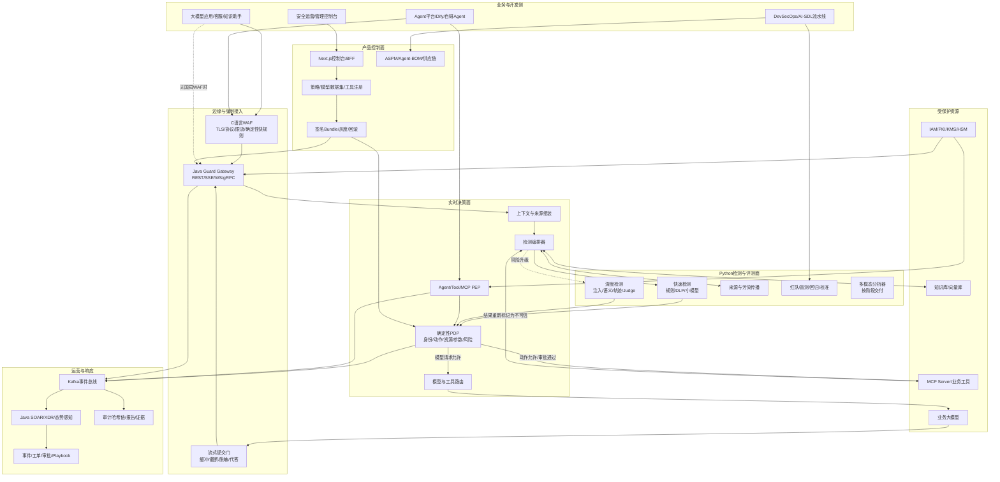
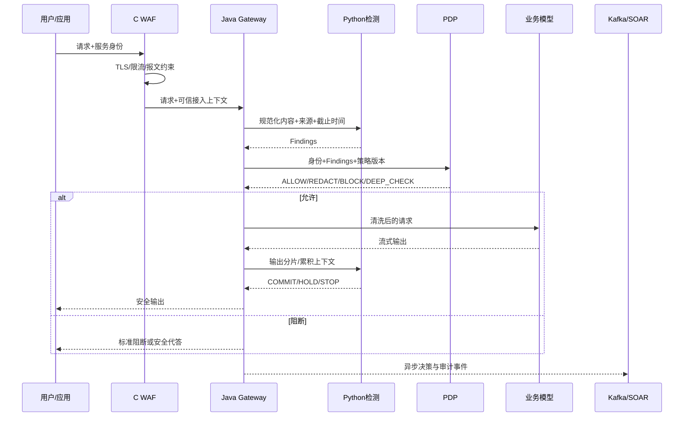
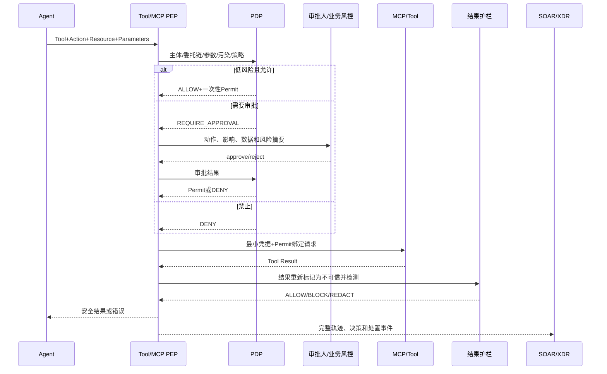

# 国舜智能体安全控制与运营平台产品设计方案

> 文档版本：V1.0  
> 编制日期：2026 年 9 月 2 日  
> 文档用途：产品立项、架构评审、研发拆分、共创客户沟通和 POC 验收  
> 设计对象：北京国舜科技股份有限公司现有大模型护栏、WAF、DevSecOps、SOAR/XDR 与态势感知产品的整合升级  
> 工作名称：国舜智能体安全控制与运营平台（下文简称“平台”）

---

## 0. 执行结论

### 0.1 产品建议

建议国舜不再把现有产品定义为单一“大模型内容安全围栏”，而是升级为：

> **面向金融、政务和关键行业的私有化智能体安全控制与运营平台。平台在模型、RAG、Agent、MCP 和业务工具之间建立不可绕过的安全控制点，对每一次输入、检索、模型输出、工具调用和业务动作执行身份鉴别、风险检测、最小权限授权、审批、审计和响应。**

核心价值不是保证大模型“永远不说错话”，而是保证：

1. 未授权的高风险动作不能执行；
2. 不可信内容不能直接改变 Agent 的控制流；
3. 敏感数据不能未经授权离开安全域；
4. 每次决策、工具调用和处置都有可验证证据；
5. 发生绕过或误报后，能够回放、调整、灰度和回滚。

### 0.2 为什么这一方案适合国舜

国舜已经具备构成该产品的主要技术积木：

| 现有资产 | 在目标产品中的责任 | 产品价值 |
|---|---|---|
| C 语言 WAF | TLS、协议、限流、报文约束、确定性快规则、边缘接入 | 进入客户流量路径，复用高性能网关能力 |
| Python 大模型护栏/智能体安全产品 | 规则、DLP、提示注入、小模型、深度模型、轨迹检测、红队评测 | 形成 AI 风险识别核心 |
| Java Guard Gateway | 唯一 AI 语义执行点、流式提交门、模型路由、Tool/MCP PEP | 建立不可绕过的生产控制点 |
| Java SOAR/XDR/态势感知 + Kafka | 事件关联、工单、审批、自动响应、运营大屏和审计 | 将“检测”转化为可运营闭环 |
| 代码审计/SCA/ASPM/AI-SDL | 上线前测试、Agent-BOM、供应链、发布门禁、风险归并 | 覆盖 AI 应用全生命周期 |
| 现有 Next.js 控制台和数据模型 | 策略、模型、样本、租户、审计和运营配置 | 缩短产品化周期，避免重写成熟界面 |

这套组合比单纯训练一个护栏分类器更难被云厂商低价 API 替代，也比从零研发一套 AI 安全平台风险更低。

### 0.3 关键架构决策

1. **双入口、单语义执行点。** 有国舜 WAF 的客户由 C WAF 接入；无 WAF 的客户直接接入 Java Guard Gateway。但所有 AI 语义决策最终进入同一个 Java PEP/PDP 流程，不能形成两套策略行为。
2. **Python 只提供检测证据，不独立决定高风险动作。** Python 返回风险类型、概率、证据和建议；最终授权由确定性策略引擎根据身份、资源、参数、风险和审批状态产生。
3. **控制面不进入在线关键路径。** Next.js 控制台、数据库或 SOAR 短时不可用时，数据面使用最后一个签名可信策略包继续工作。
4. **Kafka 用于异步事件和运营，不用于同步授权。** 业务动作的放行不能等待 Kafka 消费；Kafka 故障时写本地加密 WAL 并按容量执行降级。
5. **大模型护栏是基础能力，动作安全是付费核心。** 内容、PII 和提示注入作为基础模块；MCP、工具、凭据、审批、回滚和全轨迹审计构成差异化。

### 0.4 投入建议

当前不应按“从零研发”立项，而应按“现有产品生产化整合和智能体增强”立项：

- 首期 6 个月建议预算上限：**800 万至 1,200 万元**；
- 建议核心团队：**18 至 26 人**，优先由现有产品线转岗；
- 若 Python 产品和 C WAF 经代码与性能核验只能达到演示级，则恢复原商业计划中 **1,200 万至 1,500 万元**的首期预算；
- 只有取得不少于 2 家付费试点、完成目标环境 POC，才进入 7 至 18 个月规模化阶段。

以上预算为规划测算，需用现有团队成本、代码复用率和客户合同校准。

---

## 1. 设计依据与事实边界

### 1.1 已核验的工作区证据

截至 2026 年 9 月 2 日，工作区内部研发报告显示：

- 契约检查、TypeScript、ESLint、175 项自动化测试、Next.js 生产构建和 Java 网关镜像构建通过；
- PostgreSQL 基础建表和 23 个迁移已完成空库集成验证；
- Java 网关已经实现 REST、gRPC、身份拦截、Decision 映射、舱壁、TLS 配置和流式提交门；
- Tool/MCP 已具备注册、角色/动作/资源/参数约束、双人审批、短时 Permit、幂等与结果再检测代码；
- 策略包生命周期、审计哈希链、事件研判、数据目录和文本生成内容标识已有工程实现；
- 101 项目标需求中仍没有一项取得目标环境签名验收证据；多模态真实模型、SSO/MFA、PKI/KMS、信创实机、盲测、性能、HA 和灾备仍需外部环境验证。

主要内部依据：

- [研发实施基线与进度追踪](输出/代码分析与升级/05_研发实施基线与进度追踪.md)
- [需求、设计、规范与代码完成度核对](输出/代码分析与升级/06_需求设计规范与代码完成度核对报告.md)
- [全面自动化测试报告](输出/代码分析与升级/07_附件功能性能逐条核对与全面自动化测试报告.md)
- [未实现功能与问题修复设计](输出/代码分析与升级/08_未实现功能与问题修复详细设计方案.md)
- [101 项任务规划与验收清单](输出/代码分析与升级/09_必须完成任务规划与验收清单.md)

### 1.2 用户提供但本工作区尚未独立核验的资产

- WAF 为 C 语言研发；
- 已有 Python 大模型护栏和智能体安全产品；
- 源代码审计、SCA、ASPM、AI-SDL 已产品化；
- SOAR、XDR、态势感知为 Java 技术栈并使用 Kafka。

上述信息作为目标架构输入，但其代码质量、接口、性能、许可证、客户使用和真实复用率仍需专项核验。本文不会把“已有产品名称”直接等同于生产可复用能力。

### 1.3 当前代码对智能体安全的可行性证明

当前 [Tool/MCP 服务](src/lib/tools/service.ts) 已经证明以下关键机制可以落地：

- 按租户、应用、角色、工具、动作和资源授权；
- 对工具参数执行允许键、必填项、枚举和长度约束；
- 污染上下文禁止调用高风险工具；
- 高风险动作进入异人审批；
- Permit 绑定工具、策略版本和参数哈希，并具备短时有效和一次消费语义；
- 工具返回结果重新进入护栏检测。

但它目前仍是工程基线，不是规模化数据面：同步授权包含数据库查询、事务和 advisory lock；参数策略主要覆盖扁平标量；Permit 使用单一 HMAC 密钥；尚缺真实 MCP Server、目标网络和高并发验证。目标产品必须解决这些限制。

---

## 2. 产品定义

### 2.1 产品名称与定位

建议正式名称：**国舜智能体安全控制与运营平台**。

市场副标题：**大模型、RAG、Agent 与 MCP 的统一安全控制面**。

不建议只使用“大模型防火墙”作为正式名称，因为该名称容易使客户把产品理解为输入输出关键词过滤，无法体现身份、权限、工具和运营能力。

### 2.2 目标客户

首批目标客户：

1. 已经上线大模型客服、知识助手或内部办公助手的银行、保险、证券客户；
2. 正在建设 AI 中台、Agent 平台或 MCP 平台的金融与大型央国企；
3. 已采购国舜 WAF、DevSecOps、SOAR/XDR 或态势感知产品的存量客户；
4. 对私有化、信创、国密、数据不出域和审计留痕有明确要求的组织。

第二阶段客户：通信、能源、交通、医疗和政务组织。

不作为首期重点：大众互联网内容审核、纯公有云开发者 API、无高风险动作的简单聊天应用。

### 2.3 核心用户

| 用户 | 主要任务 | 产品提供的结果 |
|---|---|---|
| CISO/安全负责人 | 控制 AI 风险、证明合规、处理事件 | 风险全景、控制覆盖、事件闭环和审计证据 |
| AI 平台负责人 | 统一接入模型和 Agent，不影响业务体验 | 标准网关、SDK、低延迟策略和模型无关接入 |
| Agent/应用开发者 | 在上线前发现问题，快速定位阻断原因 | CI 门禁、调试沙箱、决策解释和测试集 |
| SOC 分析师 | 研判告警、跨系统调查和响应 | 完整轨迹、证据、SOAR Playbook 和处置状态 |
| 合规/审计人员 | 核对控制、导出证据、追溯责任 | 标准映射、签名报告、留存与双人审批 |
| 业务审批人 | 判断某次高风险动作是否可以执行 | 可读的动作、资源、数据、影响和风险摘要 |

### 2.4 需要解决的三个核心问题

#### 问题一：AI 内容风险

处理越狱、提示注入、违法不良内容、PII、商业秘密、幻觉、误导和行业禁限话术。

#### 问题二：Agent 动作风险

处理工具投毒、越权调用、凭据滥用、危险参数、间接注入、组合工具攻击、记忆污染和未授权业务操作。

#### 问题三：AI 治理不可证明

解决策略与实际运行不一致、测试链与生产链不一致、告警无法关联业务动作、审计证据不完整和产品效果不可复现的问题。

### 2.5 非目标

- 不训练通用基础大模型；
- 不替代客户 IAM、API Gateway、WAF、SIEM、SOAR 或业务风控系统；
- 不承诺消除全部幻觉、越狱和未知攻击；
- 不将 LLM Judge 的输出作为资金交易、删库、发文等高风险动作的唯一授权依据；
- 首期不建设面向所有行业的完整 AI-SPM/CNAPP 产品；
- 首期不把图片、音频和视频审核作为主要差异化，按客户合同和模型能力分阶段交付。

---

## 3. 威胁模型与安全目标

### 3.1 受保护对象

- 系统提示、Prompt 模板和策略；
- 用户输入、历史会话和 Agent 记忆；
- RAG 数据源、Chunk、向量索引和检索结果；
- 模型、模型端点、权重、适配器和推理资源；
- Agent、MCP Server、Tool、技能和 A2A 端点；
- API Key、OAuth Token、数据库凭据和临时 Permit；
- 客户数据、个人信息、交易数据和业务秘密；
- 策略包、审计证据、评测集和模型版本。

### 3.2 主要攻击者

| 攻击者 | 能力假设 |
|---|---|
| 外部用户 | 构造输入、多轮诱导、编码混淆、上传恶意文档和媒体 |
| 恶意或被入侵的数据源 | 在网页、邮件、知识文档和工具结果中放置间接指令 |
| 恶意 MCP/Tool 提供者 | 篡改工具描述、返回注入内容、诱导凭据和扩大权限 |
| 内部低权限用户 | 访问越权数据、滥用 Agent、绕过审批和导出证据 |
| 被攻陷的 Agent/应用 | 直接访问模型或工具、伪造身份和重复调用高风险动作 |
| 供应链攻击者 | 污染模型、依赖、镜像、Prompt、策略和插件 |

### 3.3 安全目标

1. 所有生产 AI 流量在网络和身份层面不可绕过控制点；
2. 不可信数据与系统控制指令结构化分离；
3. Agent 没有永久业务凭据，只能获得最小范围、短时、一次性授权；
4. 高风险动作的最终决定独立于业务 LLM；
5. 工具调用前检查主体、动作、资源和参数，调用后检查结果；
6. 策略、模型和数据版本可追溯、可灰度、可回滚；
7. 原始敏感内容默认不进入日志、Kafka 和普通数据库；
8. 每次决策都能回答“谁、在何时、基于哪个策略和模型、对什么内容或动作、为什么允许或阻断”。

### 3.4 信任分级

| 信任等级 | 示例 | 默认策略 |
|---|---|---|
| T0 系统可信 | 签名策略包、系统指令、批准的服务身份 | 可参与控制流，仍需完整性校验 |
| T1 企业可信 | 受控业务数据库、内部 API、已认证用户 | 按身份、用途和数据分级授权 |
| T2 条件可信 | 经扫描的知识库、合作方 API、注册 MCP Server | 带来源和权限标签，持续检测 |
| T3 不可信 | 用户输入、网页、邮件、上传文件、工具返回 | 不允许直接改变控制流或触发高风险动作 |

---

## 4. 总体架构

### 4.1 逻辑架构



### 4.2 组件责任边界

| 组件 | 应做 | 不应做 |
|---|---|---|
| C WAF | TLS、连接、协议、报文限制、速率、基础 DLP/硬规则、流量标识 | 不维护复杂 Agent 语义，不独立调用深度模型决定高风险动作 |
| Java Guard Gateway | 唯一入口、上下文、截止时间、流式提交、路由、PEP、最终动作 | 不在在线线程中运行耗时模型，不依赖控制台数据库实时查询 |
| Python 检测服务 | 规范化视图、规则、小模型、深检、轨迹与评测 | 不持有业务永久凭据，不直接执行工具，不绕过 PDP |
| 确定性 PDP | 汇总身份、资源、参数、风险和审批，产生最终 Decision | 不通过自由生成文本表达授权，不让 LLM 自己批准自己 |
| Kafka | 传输决策、告警、轨迹、审计和运营事件 | 不参与同步放行，不承载未经审批的原始敏感内容 |
| SOAR/XDR | 关联、调查、工单、响应、封禁、回滚和报告 | 不重复实现实时护栏模型 |
| Next.js 控制面 | 策略、工具、模型、评测、租户、运营交互 | 不作为高吞吐生产代理和模型推理服务 |
| DevSecOps/ASPM | 上线前扫描、BOM、风险聚合、发布门禁 | 不替代运行时控制 |

### 4.3 为什么不是全部放入 C WAF

优点是吞吐高、存量客户接入快，但完整 Agent 安全涉及多轮状态、流式输出、RAG 来源、MCP Schema、审批和轨迹。将这些快速变化能力全部写入 C 代码会增加发布风险、内存安全风险和研发成本。

因此 C WAF 负责稳定的数据面能力，AI 语义通过版本化协议调用 Java/Python 服务。只有经过长期验证且高度稳定的规则才下沉 C 快路径。

### 4.4 为什么保留 Java Guard Gateway

当前仓库已实现 Java 21 WebFlux/gRPC 网关、流式提交门、舱壁、限流和身份上下文测试。Java与现有SOAR/XDR技术栈一致，适合承担长连接、并发、策略执行和企业集成。删除这一资产并让 Python 同时承担网关和推理，会把网络稳定性与模型负载耦合。

### 4.5 为什么 Python 不能决定最终授权

提示注入检测器和 LLM Judge 都存在误报、漏报和自适应绕过。高风险动作必须由可测试的确定性规则决定。Python 检测结果是重要证据，但不是完整授权条件。

---

## 5. 产品模块设计

### 5.1 P01 统一 AI 安全网关

#### 功能

- REST、OpenAI-compatible、SSE、WebSocket、gRPC 接入；
- 模型路由、字段映射、配额、并发、Token 和请求大小限制；
- 输入、输出、RAG、Tool Result 五阶段检测；
- 同步、流式、影子、旁路和批量评测模式；
- 应用级 fail-open/fail-close/安全代答/人工复核策略；
- Trace、Deadline、Policy Bundle 和模型版本贯穿全链路；
- 通过 NetworkPolicy、安全组和模型服务身份消除直连路径。

#### 验收重点

- 业务应用无法绕过网关直连模型；
- REST、SSE、WebSocket 和 gRPC 对同一请求产生一致决策；
- 流式输出在高危片段提交前可以截断；
- 控制面故障时仍使用最后可信策略运行。

### 5.2 P02 大模型护栏检测引擎

#### 检测能力

- 直接提示注入、越狱、系统提示窃取、角色扮演；
- Base64、Unicode、零宽、同形字、多语混写和分片混淆；
- 违法不良内容、仇恨、暴力、色情、诈骗和危险行为；
- PII、账户、证件、健康、保单、交易和商业秘密；
- 输出行业合规、虚假承诺、收益夸大、条款误读；
- 事实有据、引用一致性和业务规则一致性；
- 多轮风险累积与跨轮攻击；
- 算力消耗、超长输入和重复请求滥用。

#### 三级检测架构

| 层级 | 处理内容 | 目标流量占比 | 时延目标 |
|---|---|---:|---:|
| L0 硬控制 | 大小、协议、恶意编码、确定性DLP、禁止模式 | 100% | P99 < 20ms |
| L1 快速检测 | 规则、词库、轻量分类器、短文本注入 | 100%或按策略 | P99 < 100ms |
| L2 深度检测 | 长上下文、语义Judge、轨迹、事实校验 | 1%-10% | 同步预算内或异步 |

所有模型必须返回结构化 Finding，不得直接拼接自由文本让网关解析。

### 5.3 P03 Agent/Tool/MCP 安全控制

这是产品的核心差异化模块。

#### Agent 身份

- 为用户、应用、Agent、MCP Server 和 Tool 建立独立身份；
- 用户委托关系不能自动放大 Agent 权限；
- Agent 不保存长期业务凭据；
- 服务身份映射到租户、应用、环境和用途；
- 支持 mTLS/SPIFFE、OAuth2 workload identity 或企业服务账号。

#### MCP/Tool 注册中心

每个 Server/Tool 至少登记：

- 所有者、版本、来源、签名和状态；
- 描述、输入/输出 Schema 和风险等级；
- 允许的身份、角色、动作、资源和网络目的地；
- 需要的数据域、凭据范围和审批规则；
- 依赖工具、调用上限、超时、幂等和回滚能力；
- 最近扫描、变更、使用和异常记录。

未知、未签名、已撤销或描述发生未批准变化的 MCP Server 默认拒绝。

#### 动作授权模型

授权输入采用六元组：

```text
主体 Subject
+ 委托链 Delegation
+ 动作 Action
+ 资源 Resource
+ 参数 Parameters
+ 上下文 Context
```

上下文包括风险状态、数据分类、来源污染、时间、环境、会话、预算和审批状态。

#### 动作等级

| 等级 | 示例 | 默认处理 |
|---|---|---|
| R0 只读低敏 | 查询公开知识、读取公开状态 | 自动允许，完整审计 |
| R1 只读敏感 | 查询客户、保单、内部文档 | 身份、用途、行列权限和DLP |
| R2 可逆写操作 | 创建草稿、生成工单、暂存配置 | 参数约束、限额、必要时确认 |
| R3 高影响操作 | 发信、外发数据、修改业务记录 | 人工确认或双人审批，短时Permit |
| R4 不可逆/资金/特权 | 转账、赔付、删除、发布生产策略 | 独立业务风控批准，Agent不得单独授权 |

#### Permit 设计

Permit 必须绑定：主体、委托链、Agent、Tool、Server 身份、动作、资源、规范化参数哈希、策略版本、风险摘要、审批记录、有效期、Nonce 和最大消费次数。

目标实现建议：

- 低风险 Permit 由网关使用轮换的本地会话签名密钥签发；
- 高风险 Permit 由审批服务签发并通过 KMS/HSM 保护密钥；
- 支持 Ed25519；国密环境支持 SM2/SM3；
- 有效期默认 60 秒，可按动作缩短；
- 通过 Redis Lua 或等价原子存储实现一次消费；
- 数据库异步保存事实记录，不让普通低风险调用每次进入数据库事务；
- Kafka 记录 Permit 的签发、消费、拒绝和异常，但不参与授权。

#### 调用前后双重控制

```text
调用前：身份 -> Tool状态 -> 动作/资源 -> 参数Schema -> 风险/污染 -> 审批
执行中：超时 -> 限额 -> 网络目的地 -> 凭据范围 -> 幂等
调用后：结果来源标记 -> 提示注入/DLP -> 污染传播 -> 写入记忆限制
```

### 5.4 P04 RAG 与记忆安全

- 数据入库前执行恶意文件、敏感数据、注入和来源扫描；
- Chunk 保留 source、owner、ACL、密级、完整性、TTL 和污染标签；
- 检索权限在向量召回前或召回时过滤，不能只依靠 Prompt；
- 检索结果与系统指令使用不同字段和明确边界；
- 间接提示注入命中后标记上下文污染；
- 污染标签沿 Chunk、Context、Output、Tool Argument 传播；
- 高风险污染上下文默认禁止自动写操作；
- Agent 记忆写入前检测并设置来源、目的、用户范围和 TTL；
- 记忆读取按租户、用户、Agent、会话和用途隔离。

### 5.5 P05 AI-SDL、Agent-BOM 与 ASPM

#### Agent-BOM

清单应覆盖：

- 应用、Agent、模型、Prompt、策略；
- RAG 数据源、向量库和Embedding模型；
- MCP Server、Tool、Skill、插件和API；
- 服务身份、凭据引用和权限范围；
- Python/Java/C/Node 依赖、容器和基础镜像；
- 数据分类、所有者、部署环境和网络目的地。

#### CI/CD 门禁

1. SAST、SCA、Secrets、IaC 和镜像扫描；
2. Prompt、Tool 描述和 MCP Schema 差异检查；
3. 自动越狱、注入、RAG 和 Tool 越权回归；
4. Policy Bundle 离线评测；
5. 风险达到阈值后阻断发布；
6. 发布后影子、灰度、指标观察和自动回滚。

ASPM 将传统代码漏洞、AI 模型风险、Tool 权限和运行时事件归并到同一应用责任人，避免分别形成孤立告警。

### 5.6 P06 持续红队与效果评测

- 内置攻击分类、变体生成和多轮编排；
- 支持黑样本、白样本、行业样本、未知攻击和自适应攻击；
- 生产同一 GuardEngine 回放，避免测试链与生产链不一致；
- 按模型、策略、应用和版本对比 ASR、Recall、Precision、FPR 和效用；
- 失败样本进入人工复核、标签仲裁、阈值校准和发布门禁；
- 对 MCP 描述投毒、参数诱导、间接注入和组合工具调用进行专项测试；
- 评测结果绑定代码、镜像、模型、策略、数据集摘要和环境，并签名防覆盖。

### 5.7 P07 AI 安全运营与响应

通过 Kafka 与现有 SOAR/XDR/态势感知集成：

- 会话、Finding、Decision、Tool Invocation 和 Incident 关联；
- 相同主体、Agent、数据源、Tool 和目的地的跨会话聚合；
- 自动封禁用户/API Key、撤销 Agent、隔离 MCP Server、回滚策略；
- 高风险动作触发审批、短信/IM/工单和业务系统确认；
- 误报、已阻断、已整改、已关闭等状态和 SLA；
- 日、周、月、季运营报告；
- GB/T 45654、个保、数据安全、ISO 42001、NIST 和 OWASP 控制映射。

### 5.8 P08 控制台与开放平台

建议菜单：

```text
总览
AI资产
  应用与Agent
  模型与知识库
  MCP Server与Tool
  Agent-BOM
策略
  护栏策略
  动作与权限策略
  数据出域策略
  Bundle发布
检测与评测
  在线调试
  数据集
  持续红队
  A/B与回归
运营
  告警与事件
  Agent轨迹
  审批中心
  报表与合规
系统
  租户/应用/身份
  模型与推理资源
  审计与集成
```

开放能力包括 OpenAPI、gRPC、Webhook、Kafka Schema 和 Java/Python/Go/TypeScript SDK。

---

## 6. 关键业务流程

### 6.1 普通大模型对话



### 6.2 Agent 调用高风险工具



### 6.3 间接提示注入

1. 网页、邮件、文档或 Tool Result 进入平台时标记为 T3；
2. Python 检测服务识别其中的指令性内容、隐藏文本和混淆；
3. RAG Chunk 保留污染与来源标签；
4. Java Gateway 拼装上下文时把系统指令和不可信数据分字段传输；
5. 如果后续 Tool Argument 受污染内容影响，PDP 提高风险等级；
6. 污染上下文禁止自动执行 R3/R4 动作；
7. 输出和记忆写入前再次检测，防止污染持久化。

### 6.4 安全事件闭环

```text
检测 -> 决策 -> Kafka事件 -> XDR关联 -> SOAR工单
-> 调查/审批 -> 封禁/撤销/隔离/回滚 -> 验证
-> 样本沉淀 -> 阈值/策略更新 -> 影子评测 -> 灰度发布
```

---

## 7. 决策、策略和数据设计

### 7.1 统一 Finding

```json
{
  "finding_id": "fd_...",
  "trace_id": "tr_...",
  "stage": "INPUT|RETRIEVAL|TOOL_REQUEST|TOOL_RESULT|OUTPUT|MEMORY",
  "risk_type": "PROMPT_INJECTION.INDIRECT",
  "severity": "HIGH",
  "probability": 0.97,
  "detector_id": "injection-fast",
  "detector_version": "3.2.1",
  "calibration_version": "finance-cn-7",
  "source_trust": "T3",
  "evidence_refs": ["ev_..."],
  "suggested_action": "BLOCK",
  "latency_ms": 38,
  "degraded": false
}
```

### 7.2 统一 Decision

```json
{
  "decision_id": "dc_...",
  "trace_id": "tr_...",
  "action": "ALLOW|REDACT|BLOCK|SAFE_RESPONSE|REQUIRE_APPROVAL|DEFER",
  "risk_level": "LOW|MEDIUM|HIGH|CRITICAL",
  "reason_codes": ["TOOL.TAINTED_CONTEXT", "DATA.CUSTOMER_PII"],
  "policy_bundle_id": "pb_...",
  "policy_version": 17,
  "finding_ids": ["fd_..."],
  "permit_ref": null,
  "expires_at": null,
  "degraded": false
}
```

### 7.3 核心实体

| 实体 | 核心字段 |
|---|---|
| Tenant/Application | 风险等级、数据域、配额、失败策略、环境 |
| Principal/AgentIdentity | 主体、委托链、角色、用途、有效期、状态 |
| ModelEndpoint | 类型、版本、数据出域、凭据引用、允许网络 |
| MCPServer/Tool | 所有者、签名、版本、Schema、风险、状态 |
| RAGSource/Chunk | 来源、ACL、密级、完整性、污染、TTL |
| PolicyBundle | 不可变版本、哈希、签名、适用范围、回滚版本 |
| Finding/Decision | 检测证据、动作、原因、策略和模型版本 |
| ToolInvocation/Permit | 主体、动作、资源、参数哈希、审批、消费状态 |
| AgentTrace | 计划、模型、检索、工具、记忆和输出的关联图 |
| Incident | 责任人、SLA、状态、影响、处置和验证 |

### 7.4 策略包

策略包应包含：规则、词库摘要、模型及校准版本、应用范围、动作矩阵、工具权限、失败策略、有效期和回滚版本。

发布流程：

```text
草稿 -> 离线校验 -> 黑白样本评测 -> 异人审批
-> 签名 -> 影子 -> 灰度 -> 激活 -> 监控 -> 回滚/归档
```

数据面只读取签名、不可变的策略包，不能在在线请求中查询可变数据库策略。

### 7.5 Kafka 事件主题

建议主题：

- `ai.guard.finding.v1`
- `ai.guard.decision.v1`
- `ai.agent.trace.v1`
- `ai.tool.invocation.v1`
- `ai.tool.approval.v1`
- `ai.security.incident.v1`
- `ai.policy.lifecycle.v1`
- `ai.audit.immutable.v1`

事件必须带 `tenant_id`、`application_id`、`trace_id`、`event_id`、`schema_version`、时间和完整性字段。默认只记录内容哈希、长度、分类、证据引用和脱敏摘要；原文进入独立加密证据域。

---

## 8. 部署设计

### 8.1 三种部署模式

| 模式 | 架构 | 适用客户 |
|---|---|---|
| WAF融合模式 | C WAF -> Java Gateway -> Python检测 | 已有国舜WAF、需要统一边界的客户 |
| 独立网关模式 | Ingress/LB -> Java Gateway -> Python检测 | 已有其他WAF或AI中台的客户 |
| 评估旁路模式 | 镜像流量/批量样本 -> Python评测 -> 控制台 | 上线前评估、付费POC和低风险导入 |

生产阻断必须采用前两种模式。旁路模式只能发现风险，不能宣称形成安全控制。

### 8.2 Kubernetes 安全域

| 安全域 | 组件 | 隔离要求 |
|---|---|---|
| edge | C WAF、Ingress、Java Gateway | 对外唯一入口、不保存原文、mTLS |
| runtime | PDP、编排、模型/Tool路由 | 无状态、禁止公网、最后可信Bundle |
| detector | Python快速/深度检测和推理 | GPU/NPU专池、无业务永久凭据 |
| media | OCR/VLM/ASR/FFmpeg | 禁网、只读根、临时盘配额、沙箱 |
| control | Next.js、策略、评测、发布 | 强身份、三员分立、双人审批 |
| data | PostgreSQL、Redis、Kafka、对象存储 | 独立账号、静态加密、备份和审计 |
| ops | OTel、指标、日志、SOAR/XDR | 采集侧脱敏、不能反向调用业务模型 |

### 8.3 信创与离线

- 支持国产 CPU、操作系统、Kubernetes、数据库和中间件的明确版本矩阵；
- Python 模型服务通过统一推理适配层支持 GPU/NPU/CPU；
- 离线包包含镜像、模型、SBOM、AI-BOM、许可证、签名和升级回滚脚本；
- 国密环境支持 SM2/SM3/SM4 和企业密码设备；
- 每一种“兼容”必须在真实设备上完成安装、功能、性能、故障和升级验证。

---

## 9. 性能、可用性与降级

### 9.1 设计指标

| 指标 | MVP目标 | GA目标 |
|---|---:|---:|
| 网关确定性路径 P99 | < 50ms | < 30ms |
| 完整快速护栏附加 P99 | < 300ms | < 200ms |
| PDP 本地决策 P99 | < 10ms | < 5ms |
| Tool 低风险授权 P99 | < 80ms | < 50ms |
| 高风险审批外系统耗时 | 单独统计 | 单独统计 |
| 生产白样本误报率 | < 1% | < 0.5% |
| 高风险未授权动作成功率 | < 1% | < 0.1% |
| 良性任务成功率下降 | <= 5个百分点 | <= 3个百分点 |
| 集群可用性 | 99.9% | 99.99% |
| 决策审计关联完整率 | 100% | 100% |

上述均为目标，不是当前实测。必须按真实报文长度、策略、模型、硬件和并发条件验收。

### 9.2 热路径优化

- C WAF完成TLS、连接和确定性限流；
- Java Gateway复用连接、传播绝对Deadline，采用非阻塞IO和舱壁；
- 策略包预编译并驻留内存，热路径不查询PostgreSQL；
- Python模型按长度和SLA分桶，连续批处理；
- 低风险Tool Permit本地签发，Redis原子消费；
- Kafka和审计持久化异步执行；
- 深度模型只处理升级流量；
- 缓存键包含租户、应用、内容HMAC、策略、模型和上下文摘要，禁止跨租户复用。

### 9.3 故障矩阵

| 故障 | 低风险场景 | 高风险场景 |
|---|---|---|
| 控制面/数据库不可用 | 最后可信Bundle继续运行 | 最后可信Bundle继续运行 |
| 无可信Bundle | 受限代答或拒绝 | fail-close |
| Python快速检测超时 | 硬规则后按应用降级 | 阻断或安全代答 |
| 深度模型超时 | 记录降级，按快速结果处置 | 阻断或人工复核 |
| Redis不可用 | 本地小配额、禁止生成新高风险Permit | fail-close |
| Kafka不可用 | 本地加密WAL限量续写 | WAL满后拒绝高风险调用 |
| SOAR不可用 | 事件排队，不影响低风险对话 | 新高风险审批暂停 |
| Tool/MCP异常 | 熔断、撤销Permit | 阻断并隔离Server |
| 策略坏包 | 拒绝加载并保留旧版 | 同左 |

---

## 10. 平台自身安全

### 10.1 身份与权限

- SSO/OIDC/SAML、MFA、服务身份和短时Token；
- 系统管理员、安全管理员、审计管理员三员分立；
- 策略发布、长期白名单、模型上线、证据导出和高风险动作异人审批；
- 租户、应用、环境和数据域四层隔离；
- 应急账号离线封存、双人启用、短时有效和事后复核。

### 10.2 数据与密钥

- Provider Key、JWT、Permit、数据库和Kafka凭据只保存引用，由KMS/HSM托管；
- 日志在Sink前脱敏；禁止输出Prompt、Tool参数和凭据原文；
- 原文默认只在内存或受控临时存储中存在；
- 需要取证时进入独立加密证据域，按用途、审批和TTL访问；
- Kafka、备份、对象存储和数据库使用传输与静态加密；
- 数据出域按模型端点、数据分类和用途执行白名单。

### 10.3 供应链

- 对C、Python、Java、Node、模型权重和容器生成统一SBOM/AI-BOM；
- SAST、SCA、Secrets、IaC、镜像、许可证和恶意模型扫描；
- 镜像、策略包、模型权重和离线包使用企业PKI签名；
- MCP Server与Tool描述变更触发重新评审；
- 高危漏洞清零，无法修复项必须有到期风险接受和补偿控制。

---

## 11. 产品版本与商业包装

### 11.1 版本设计

| 版本 | 核心能力 | 建议目录价 |
|---|---|---:|
| 评估版 | 样本评测、红队、报告、旁路监测 | 8-20万元/次 |
| 标准护栏版 | 输入输出、PII、内容、审计、基础网关 | 48-68万元/年 |
| Agent安全专业版 | 标准版 + RAG + MCP/Tool + 动作授权 + 轨迹 | 98-150万元/年 |
| 企业集群版 | HA、多集群、集团策略、SOAR/XDR、信创和容灾 | 180-300万元/年 |
| 集团/行业版 | 多租户集中管控、行业规则、联合运营和深度集成 | 300-800万元/年 |

定价需要结合真实QPS、Agent数、受保护Tool数、实施成本和现有客户折扣校准。

### 11.2 许可计量

建议以“基础平台 + 受保护应用/Agent + Tool/MCP数量 + 吞吐容量 + 服务”计价，不建议只按Token收费。

原因：

- 国内私有化客户需要预算可预测；
- 动作授权价值与Token量不成正比；
- 单纯Token价格会被云厂商压低；
- Agent、Tool和高风险动作更能反映客户获得的安全价值。

### 11.3 获客产品

将“AI/Agent安全快速评估”设计为标准化前置产品：

1. 资产和数据流梳理；
2. 2,000黑样本与2,000白样本盲测；
3. RAG间接注入和MCP专项测试；
4. 业务动作风险工作坊；
5. 形成风险报告、目标架构和实施报价；
6. 评估费用可抵扣部分首年许可。

---

## 12. 研发与交付路线

### 12.1 阶段0：资产核验，0-30天

交付：

- C WAF、Python产品、Java平台和当前代码的模块清单；
- API、协议、性能、代码质量、许可证和知识产权核验；
- 三套产品数据模型和身份模型映射；
- 3家设计伙伴业务动作清单；
- 冻结MVP需求、目标硬件和评测集。

退出条件：

- C WAF能稳定处理SSE/OpenAI报文，或明确只承担前置接入；
- Python检测引擎有可复现实测结果；
- Java Gateway与Python通过gRPC完成端到端PoC；
- 至少1家客户愿意签付费评估。

### 12.2 阶段1：MVP，31-90天

范围：

- C WAF与Java Gateway接入；
- Python文本护栏、DLP和提示注入；
- 签名策略包与本地PDP；
- Tool/MCP注册、参数控制、审批和Permit；
- Kafka事件接入SOAR/XDR；
- Agent轨迹、告警、审批和基础报告；
- Java/Python SDK和示例应用。

退出条件：2家客户完成实验室PoC；核心协议和安全测试通过。

### 12.3 阶段2：付费试点，4-6个月

范围：

- 目标网络不可绕过；
- 客户SSO/PKI/KMS/SOC集成；
- RAG来源和污染传播；
- Redis一次性Permit与高风险审批；
- 策略影子、灰度、回滚；
- 2,000黑/白样本盲测和20/200QPS性能测试；
- 目标环境HA与故障演练。

退出条件：不少于2家付费试点，单家合同不低于10万元；所有承诺有签名证据。

### 12.4 阶段3：V1 GA，7-12个月

- 金融动作策略包；
- Agent-BOM与ASPM归并；
- MCP变更、供应链和异常行为检测；
- 持续红队和效果运营；
- 信创/国密适配；
- 企业集群、灾备和99.99%验证；
- 8-12家付费客户，管线不少于3,000万元。

### 12.5 阶段4：V2，13-18个月

- A2A身份与委托链；
- Tool依赖图和组合攻击；
- Agent暴露图和异常轨迹；
- 跨Agent记忆安全；
- 半自动策略建议与SOAR闭环；
- 行业策略市场和托管运营。

### 12.6 团队建议

| 角色 | 人数 | 责任 |
|---|---:|---|
| 产品/金融业务/架构 | 3-4 | 产品、场景、策略和商业包装 |
| C/Java网关与协议 | 4-6 | WAF、Gateway、SSE、gRPC、MCP和性能 |
| Python算法/安全研究 | 4-6 | 检测、模型、评测、轨迹和数据 |
| 控制面/数据/Kafka | 3-4 | 策略、事件、SOAR/XDR、审计和控制台 |
| QA/SRE/安全合规 | 3-4 | 自动化、性能、HA、供应链和证据 |
| 解决方案/客户成功 | 2-3 | PoC、行业模板和标准化交付 |
| 合计 | **19-27** | 与预算测算的18-26人存在1人浮动，由内部兼职承担 |

---

## 13. 验证与验收方案

### 13.1 功能门禁

- 所有生产模型、RAG和Tool调用不可绕过；
- 输入、输出、检索、Tool Request、Tool Result和Memory均有控制点；
- 每次高风险动作有主体、委托链、策略、审批和一次性Permit；
- Tool结果重新进入检测；
- 策略、模型和工具变更可灰度、回滚和审计；
- 控制台、SOAR、Kafka故障符合降级矩阵。

### 13.2 效果门禁

| 指标 | MVP | GA |
|---|---:|---:|
| 黑样本Recall | >=95% | >=97% |
| 黑样本Precision | >=95% | >=97% |
| 白样本FPR | <=1% | <=0.5% |
| 自适应攻击ASR | <10% | <5% |
| 高风险未授权动作成功率 | <1% | <0.1% |
| 良性任务成功率下降 | <=5pp | <=3pp |

必须分语言、模型、业务场景和攻击类型报告，不能只给一个综合准确率。

### 13.3 性能门禁

- 20QPS基准、200QPS集群和3,000并发会话；
- 文本长度、SSE、TLS、日志全开和策略全开；
- C WAF、Java Gateway、Python RPC、PDP和Kafka分别观测；
- 30分钟峰值、24/72小时长稳、扩缩容和积压恢复；
- 断开Python、Redis、Kafka、SOAR、数据库和控制面进行故障注入；
- 报告绑定硬件、配置、代码、镜像、模型、策略和数据摘要。

### 13.4 安全门禁

- 跨租户、越权、Permit重放、参数替换和审批绕过；
- Prompt Injection、间接注入、Tool描述投毒和结果注入；
- SSRF、ReDoS、Zip Bomb、畸形媒体和资源耗尽；
- 密钥泄露、日志泄露、Kafka越权和对象存储越权；
- MCP Server替换、证书失效、策略坏包和供应链投毒；
- SAST/SCA/Secrets/IaC/镜像高危清零或批准闭环。

### 13.5 证据规则

验收结果必须包含：

- Git commit、镜像digest、模型hash和策略包hash；
- 数据集manifest和不可见盲测标签；
- 环境、硬件、配置和时间范围；
- 原始指标、失败样本和日志摘要；
- 复测不得覆盖首次失败；
- 客户或独立测试人员签名。

---

## 14. 产品可行性论证

### 14.1 技术可行性

| 论据 | 证据 | 判断 |
|---|---|---|
| 网关基础存在 | Java网关、gRPC、SSE、流式提交门和舱壁已有代码与测试 | 可升级，不需从零研发 |
| Tool安全机制存在 | 注册、资源/参数约束、审批、Permit和结果护栏已有代码 | 核心概念已验证，需热路径重构和真实MCP验证 |
| 控制和审计基础存在 | 策略Bundle、哈希链、事件研判和数据目录已有工程实现 | 可复用为企业控制面 |
| 检测产品存在 | 用户确认已有Python护栏/智能体安全产品 | 潜在复用价值高，需性能和效果核验 |
| 运营平台存在 | Java SOAR/XDR、态势感知和Kafka | 能形成闭环，需事件Schema和真实联调 |
| 上线前产品存在 | 源审计、SCA、ASPM、AI-SDL | 能形成全生命周期差异化 |

技术结论：**具备可行性，但“生产可用”仍取决于真实Python模型、目标环境、不可绕过网络和效果/性能证据。**

### 14.2 产品可行性

客户购买的不是模型分类器本身，而是：统一接入、降低事故概率、满足审计、控制高风险动作和缩短AI上线审批周期。国舜现有WAF、DevSecOps和SOAR客户关系可以把这些能力组合成一个采购项目，降低独立新品牌的获客成本。

产品结论：**应以现有护栏客户为入口，以Agent动作安全扩容，而不是要求客户一次性替换全部AI基础设施。**

### 14.3 竞争可行性

| 竞争方向 | 通用厂商优势 | 国舜可形成的差异 |
|---|---|---|
| 云护栏API | 价格低、接入快、模型生态 | 私有化、跨模型、信创、数据不出域 |
| 国内大模型防火墙 | 政企渠道、内容和合规能力 | 金融动作控制、DevSecOps和SOAR闭环 |
| 国际Agent安全平台 | 研究领先、SaaS体验和资本 | 本地部署、中文行业规则、国密和本地服务 |
| 客户自研 | 贴合业务、成本表面可控 | 统一平台、持续情报、评测和责任边界 |

真正壁垒不是“支持多少风险标签”，而是：

1. 金融业务动作策略和真实误报数据；
2. WAF、Agent Gateway、PDP和SOAR的一体化控制；
3. Agent-BOM、上线门禁和运行时轨迹贯通；
4. 目标信创环境下可复现的性能与效果；
5. 存量客户形成的部署与运营数据飞轮。

### 14.4 经济可行性

首期投入降低的前提来自资产复用：

| 资产成熟度 | 可复用率估计 | 首期周期 | 首期预算建议 |
|---|---:|---:|---:|
| 生产级 | 40%-60% | 3-4个月 | 800-1,000万元 |
| 交付级 | 20%-40% | 4-6个月 | 1,000-1,200万元 |
| 原型级 | <20% | 6个月以上 | 1,200-1,500万元 |

如果取得2家专业版客户，首年合同额约200万至300万元，只能证明需求，不能覆盖研发投入；需要在第三年形成60至100家经常性付费客户，才能达到商业计划中的规模。因而首期必须采用里程碑拨款，不能以单一招标项目代替产品市场验证。

### 14.5 替代方案比较

| 方案 | 优点 | 缺点 | 结论 |
|---|---|---|---|
| A 只销售现有内容护栏 | 上市最快、投入最低 | 易同质化、价格被云厂商压低、无法控制动作 | 不作为长期路线 |
| B 从零重写统一AI安全平台 | 架构最整齐 | 浪费现有代码、周期和风险最高 | 不建议 |
| C 现有围栏生产化+Agent动作安全 | 复用最多、差异明确、可分阶段销售 | 需要跨C/Python/Java团队治理 | **推荐** |
| D 只做评估服务 | 获客快、现金需求低 | 人力交付、缺经常性收入和运行数据 | 可做入口，不做终局 |

---

## 15. 主要风险与设计应对

| 风险 | 影响 | 设计应对 |
|---|---|---|
| C、Python、Java出现三套重复规则 | 决策漂移、误报不一致 | 单一策略真源、语言无关契约、Conformance测试 |
| Python进入全部同步流量导致延迟 | 业务体验下降 | 三级检测、批处理、舱壁、深检升级和异步复核 |
| Tool授权依赖数据库 | 高并发瓶颈和故障扩散 | 内存Bundle、本地PDP、Redis一次消费、异步事实入库 |
| 模型检测被自适应绕过 | 高风险动作执行 | 最小权限、参数约束、独立PDP、审批、沙箱和回滚 |
| 客户直连模型/Tool | 控制失效 | NetworkPolicy、安全组、服务身份和负向测试 |
| 项目定制吞噬产品 | 毛利和升级能力下降 | 配置优先、插件契约、单客户定制不超过合同20% |
| 多模态承诺超出现有能力 | 验收失败 | 模型/权重/许可证冻结后再进入SKU和合同 |
| 缺真实效果和性能证据 | 无法赢得采购信任 | 盲测、目标环境、签名证据和联合基准 |
| Kafka/SOAR事件含敏感原文 | 数据泄露和合规风险 | 默认摘要/引用，原文独立加密证据域 |
| Agent协议快速变化 | 适配成本上升 | 协议适配层、版本矩阵和契约测试 |

---

## 16. Go/No-Go 决策门槛

### 16.1 继续投入

- 30天：完成四类代码资产核验；3家设计伙伴；至少1家付费评估；
- 90天：C/Java/Python/Kafka端到端MVP；两家实验室PoC；
- 6个月：不少于2家付费试点；目标环境效果、P99和不可绕过验证通过；
- 12个月：8-12家付费客户；高可信管线不少于3,000万元；标准产品收入超过60%；
- 18个月：ARR超过2,000万元；续费意向超过80%；综合毛利超过60%。

### 16.2 暂停或转型

- Python产品效果无法显著超过开源或云厂商基础护栏；
- C WAF、Java Gateway和Python长期无法收敛为一个策略行为；
- 真实业务白样本误报持续高于1%；
- 高风险动作无法建立独立于LLM的确定性授权；
- 客户只愿意购买一次性报告，不愿购买运行时平台；
- 定制开发连续两个季度超过交付收入40%；
- 6个月没有2家付费试点，或回款无法覆盖交付现金成本。

触发以上条件时，保留“AI安全评估+现有SOAR/ASPM插件”，停止独立平台扩大投入。

---

## 17. 立项前必须补齐的数据

### 17.1 C WAF

- SSE、WebSocket、gRPC、JSON大报文和TLS实测；
- QPS、连接数、P50/P95/P99、CPU/内存和72小时稳定性；
- 插件、热加载、流式缓冲和与Java gRPC连接能力；
- 可原样复用、改造和需要重写的模块及人月。

### 17.2 Python护栏/智能体安全产品

- 模块、接口、模型、部署、依赖和许可证清单；
- 黑白样本、未知攻击、自适应攻击和分模型效果；
- 规则、小模型、深检的P50/P95/P99与资源成本；
- 生产客户、真实误报、故障、续费和合同数据；
- 与Java Gateway的gRPC/Protobuf兼容性。

### 17.3 Java SOAR/XDR/Kafka

- 峰值EPS、Topic/Partition、消息大小、延迟、积压和恢复；
- Playbook、审批、连接器、身份和工单数据模型；
- Kafka TLS/ACL、幂等、重放、留存和跨中心能力；
- 接入新AI事件Schema的改造人月。

### 17.4 DevSecOps/ASPM/AI-SDL

- 支持语言、扫描引擎、规则、数据模型和流水线接口；
- SAST/SCA/SBOM与Agent-BOM的映射能力；
- 历史误报、人工确认、修复和责任人数据是否可合法复用；
- 与策略Bundle发布门禁的集成成本。

### 17.5 客户与财务

- 20家存量客户AI项目和Agent/MCP使用清单；
- 3家共创、2家付费试点的业务动作、流量、模型和预算；
- 人员完全成本、现有产品维护成本、项目实施人天和回款周期；
- 标准软件、定制、服务和硬件收入占比。

---

## 18. 最终论证结论

**该产品值得立项，但立项对象应是“现有产品整合生产化与智能体动作安全增强”，不是重新研发一个大模型护栏。**

技术上，国舜已经拥有网关、护栏、策略、Tool/MCP控制、Kafka、SOAR/XDR、DevSecOps和控制台等关键资产，具备明显的组合优势；当前代码也已经验证了动作授权、短时Permit、异人审批和结果再检测等核心机制。

商业上，基础内容护栏会持续被云厂商压价，而私有化、行业动作控制、不可绕过接入、信创、审计证据和安全运营仍具有较高客单价。国舜最合理的产品路径是：

```text
付费评估获客
-> 现有大模型护栏生产化
-> Agent/MCP动作控制扩容
-> DevSecOps/Agent-BOM上线门禁
-> SOAR/XDR托管运营和持续红队续费
```

最终决策不应以功能清单数量为依据，而应以四个可验证结果为依据：

1. 流量和动作是否真正不可绕过；
2. 未授权高风险动作是否被确定性阻断；
3. 误报、时延和可用性是否满足真实业务；
4. 是否有客户愿意为运行时控制持续付费。

只有这四项同时成立，平台才具备从项目型产品升级为规模化安全产品的条件。

---

## 附录 A：首个共创客户建议场景

推荐选择“保险智能客服/内部知识助手 + 理赔或工单工具”的组合：

- 对话入口具备内容、提示注入和PII风险；
- RAG涉及条款、客户和内部知识；
- Agent调用客户、保单、工单等只读工具；
- 生成草稿、发起工单属于可逆写操作；
- 对外发送、修改理赔或资金动作属于高风险审批；
- 能同时验证护栏、RAG、Tool权限、审批、审计和SOAR闭环；
- 与现有保险招标需求和工作区测试资料匹配。

首期不让Agent直接完成资金支付或不可逆理赔决定，只做到建议、草稿和带审批的受控执行。

## 附录 B：主要外部依据

- [Gartner 2026 Securing AI市场预测](https://www.gartner.com/en/newsroom/press-releases/2026-08-26-gartner-forecasts-the-market-for-securing-ai-will-reach-almost-5-billion-in-2027)
- [NIST AI RMF Generative AI Profile](https://www.nist.gov/publications/artificial-intelligence-risk-management-framework-generative-artificial-intelligence)
- [OWASP Top 10 for LLM Applications 2025](https://genai.owasp.org/resource/owasp-top-10-for-llm-applications-2025/)
- [OWASP Top 10 for Agentic Applications](https://genai.owasp.org/2025/12/09/owasp-top-10-for-agentic-applications-the-benchmark-for-agentic-security-in-the-age-of-autonomous-ai/)
- [Agent Security Bench, ICLR 2025](https://proceedings.iclr.cc/paper_files/paper/2025/file/5750f91d8fb9d5c02bd8ad2c3b44456b-Paper-Conference.pdf)
- [AgentDojo, NeurIPS 2024](https://proceedings.nips.cc/paper_files/paper/2024/hash/97091a5177d8dc64b1da8bf3e1f6fb54-Abstract-Datasets_and_Benchmarks_Track.html)
- [Adaptive Attacks Break Defenses, NAACL 2025](https://aclanthology.org/2025.findings-naacl.395/)
- [Task Shield, ACL 2025](https://aclanthology.org/2025.acl-long.1435/)
- [CaMeL: Defeating Prompt Injections by Design](https://arxiv.org/abs/2503.18813)
- [ShieldMCP, ACL 2026 Industry](https://aclanthology.org/2026.acl-industry.58/)
- [GB/T 45654-2025 生成式人工智能服务安全基本要求](https://openstd.samr.gov.cn/bzgk/std/newGbInfo?hcno=F67D3F376E0A0A0FF5317FB36B32A30A)
- [生成式人工智能服务管理暂行办法](https://www.cac.gov.cn/2023-07/13/c_1690898327029107.htm)
- [人工智能生成合成内容标识办法](https://www.cac.gov.cn/2025-03/14/c_1743654685899683.htm)
