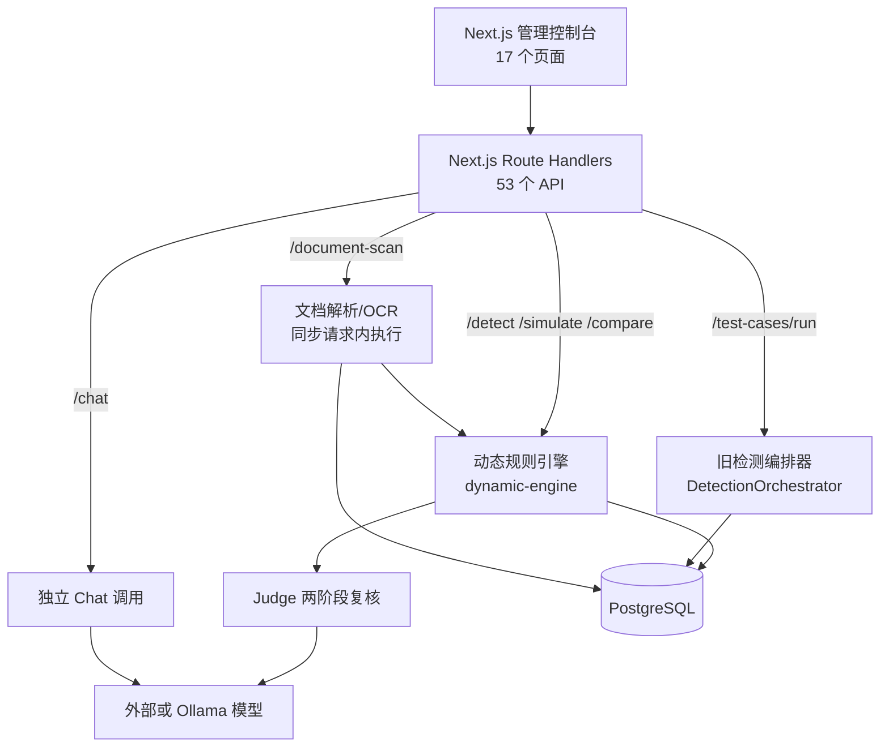

# GuardLLM 现状代码能力与质量分析报告

> 文档版本：V1.0  
> 分析基线：2026-09-01 工作区代码  
> 分析对象：`src/`、数据库定义与迁移、构建/部署文件、测试脚本及已有产品/技术报告  
> 结论口径：以可执行代码和静态检查结果为准，README、界面文案和设计文档只作为意图，不作为已实现证明

## 1. 执行摘要

当前代码是一套**功能型原型/产品演示版**，不是空壳：已经形成策略配置、关键词/正则检测、白名单、输入输出检测、Judge 模型复核、文档文本解析与 OCR、测试用例、历史记录、报表导出和模型供应商配置等完整界面闭环。在线文本规则链可以运行，策略与规则也能从数据库动态加载。

但它尚不具备保险企业生产安全围栏所需的可信边界。最关键的事实是：53 个 API 路由中没有任何路由使用 Zod 等结构化输入校验，没有任何路由接入现存限流器；仅 4 个路由出现令牌处理，其中 3 个是登录、退出、当前用户接口，绝大多数管理和数据接口实际上未受保护。用户管理接口可匿名创建管理员或修改角色，并把新密码以明文写入数据库。在线检测、评测、聊天和文档扫描又分别走不同执行链，因此测试结果不能证明生产链行为。

静态工程基线也未过门禁：TypeScript 严格检查存在 **68 个错误**，ESLint 基线为 **156 个错误**；`next.config.ts` 同时配置跳过类型和 lint 错误，导致构建成功不能代表代码合格。源代码共 173 个 TS/TSX 文件、约 37,948 行、53 个 API 路由和 17 个页面，但没有 `test` 脚本或 TS 单元/集成测试。

综合成熟度评估为 **M1.8/5（可演示、局部可运行）**。建议保留控制台、策略数据模型雏形和动态规则链，采用“先封堵安全边界并统一执行内核，再抽离在线数据面，最后扩展多模态/Agent/高可用”的绞杀式升级，而不是直接在现有 Next.js 单体上继续堆功能。

## 2. 分析方法与成熟度口径

### 2.1 方法

1. 对源文件、页面、API、数据库对象、构建和容器文件进行清点。
2. 从 `/api/detect` 追踪策略加载、白名单、规则匹配、Judge、处理动作和结果返回。
3. 分别追踪 `/api/chat`、文档扫描、评测、仿真和导出链，检查是否复用同一内核。
4. 运行本地 TypeScript 与 ESLint 静态检查；检查测试脚本和 CI 门禁。
5. 按安全性、正确性、性能、可靠性、可维护性、可测试性和可运维性评审。
6. 对照已有《大模型安全围栏产品详细需求分析报告 V1.0》的 101 项需求进行能力归类。

### 2.2 成熟度

| 等级 | 定义 | 验证要求 |
|---|---|---|
| M0 | 未实现 | 无可执行代码 |
| M1 | 展示/桩实现 | 有页面、常量、模拟或未闭环代码 |
| M2 | 功能可用 | 主路径可运行，有基本错误处理 |
| M3 | 生产可用 | 身份、隔离、测试、SLO、审计和故障策略完整 |
| M4 | 规模化运营 | 灰度、回滚、评测闭环、多租户、HA 成熟 |
| M5 | 持续优化 | 自动对抗、模型/策略生命周期和跨环境认证闭环 |

## 3. 仓库与技术路线现状

### 3.1 工程构成

| 范围 | 规模/技术 | 结论 |
|---|---|---|
| Web 与 API | Next.js 16.1.1、React 19.2.3、TypeScript 5、App Router | 控制台和服务端 API 同进程，开发快但安全域未分离 |
| UI | Tailwind CSS 4、Radix/shadcn、Recharts | 管理页面较完整，适合保留为控制面控制台 |
| 数据访问 | Drizzle + 自研 Supabase 风格封装 + Prisma 三套并存 | 类型、事务、迁移和命名规则易漂移 |
| 数据库 | PostgreSQL，存在多套 init/migrate/seed SQL | 结构较丰富，但缺少单一迁移真源 |
| 模型接入 | OpenAI-compatible、Ollama 等适配雏形 | 基础非流式调用可用；凭据、SSRF、取消与熔断不合格 |
| 文档 | `mammoth`、`pdf-parse`、大模型 OCR | 文本提取原型可用；不是完整图片/文档内容安全 |
| 部署 | 单个 Next.js 容器 + 单 PostgreSQL | 仅开发/演示级；无 Redis、消息、对象存储、GPU Worker、HA |
| 测试 | 根目录若干 Python 批量调用脚本 | 属于人工冒烟工具，不是自动单元/集成/回归测试 |

### 3.2 当前逻辑架构

此图暴露了当前最大架构问题：**策略评测、在线检测、模型聊天和文档检测并没有共享一个不可绕过的决策与提交门**。

## 4. 已有能力清单

| 能力域 | 现有实现 | 成熟度 | 判断 |
|---|---|---:|---|
| 策略管理 | 策略增删改查、克隆、启停、默认策略、版本列表、A/B 比较 | M2 | 页面与接口较全，但无签名、审批、原子发布和可信回滚 |
| 检测维度 | 维度、规则、规则组、关键词分类和批量导入导出 | M2 | 数据模型较完整；在线只执行 keyword/regex，semantic/llm 规则未执行 |
| 文本输入/输出 | `/api/detect` 支持方向、分数、Finding、allow/warn/block | M2 | 主规则链可运行，缺少统一协议、认证、限流、长度限制与完整标准化 |
| 白名单 | 全局/策略/维度绑定及测试 | M2 | 全局白名单可跳过全部检测，违反硬规则不可豁免原则 |
| PII 脱敏 | 手机、身份证、银行卡、邮箱、IP、API Key 等正则脱敏 | M1-M2 | 有独立模块，但主路由还有一套临时替换；缺校验、策略化与稳定偏移映射 |
| 安全改写 | 若干固定字符串替换 | M1 | 可能改变语义，无生成约束、无重检、无可证明保真 |
| Judge 复核 | 两阶段提示、Provider 选择、调用记录、策略配置界面 | M1-M2 | 关键超时/fallback/fail-close 配置未真正执行；解析和防注入不足 |
| 会话升级 | 连续告警/放行状态、升级目标策略 | M1-M2 | 状态以浏览器 session 为主，缺租户、服务端可信身份和并发一致性 |
| 仿真 | 展示输入检测、模拟 LLM、输出检测步骤 | M1 | Target LLM 是固定模拟响应，不是端到端验证 |
| 评测 | 测试集、运行、结果和准确率 | M1-M2 | 同步逐条执行且使用旧编排器；只有 accuracy，缺 Precision/Recall/FPR/FNR/鲁棒性 |
| 模型供应商 | 配置、连通性测试、默认模型 | M1-M2 | API Key 字段名虽为 encrypted，实际明文存储；自定义地址存在 SSRF |
| 文档扫描 | TXT/MD/JSON/CSV/XML/HTML/CSS/JS/TS、PDF、DOCX 和常见图片 OCR | M1-M2 | 只检测提取文字；无有害视觉模型、无扫描 PDF OCR、无文件沙箱/异步作业 |
| 图片安全 | 图片送 OCR 模型，再走文本检测 | M1 | 不能检测无文字涉黄、涉暴、视觉隐写或图像混淆 |
| 音频/视频 | 无 | M0 | 未实现 ASR、声学、关键帧、字幕和时间轴融合 |
| RAG/间接注入 | Judge 中留有 RAG 示例接口 | M0-M1 | 相似案例检索固定为空；无来源、ACL、污染传播和上下文提交门 |
| Agent/工具 | `agent_traces` 查询页面 | M1 | 是日志展示，不是 Tool Gateway/MCP 权限门和参数级审计 |
| 历史/统计/导出 | 会话、Finding、Dashboard、JSON/CSV/MD 导出 | M2 | 可用但可匿名读取，且导出原始敏感内容；无字段权限和水印审批 |
| 身份与权限 | 本地用户名密码、JWT Cookie、用户管理 | M1 | 仅登录链局部可用；业务 API 基本无鉴权/RBAC/CSRF/租户隔离 |
| 高可用/灾备 | Docker restart、数据库 healthcheck | M0-M1 | 单实例、单库，无负载均衡、缓存、队列、备份恢复和灾备演练 |
| 信创/多芯片 | 无实机适配代码或认证矩阵 | M0 | 仅设计层设想 |

## 5. 核心执行链分析

### 5.1 在线检测链

`src/app/api/detect/route.ts` 调用 `detectWithDynamicRules()`，其主要步骤是：按策略从数据库装载维度和规则、检查白名单、逐维度执行关键词/正则、计算最高分、可选调用 Judge、决定处理动作并返回结果。该链具备动态配置价值，但存在以下正确性问题：

1. 找不到策略时返回 `allow`，属于 fail-open。
2. `dimensionScope=all` 的白名单命中后立即跳过全部检测，可绕过不可豁免的监管/恶意文件/越权类硬规则。
3. 数据模型声明 `semantic`、`llm` 规则，执行循环却显式跳过非 keyword/regex 规则。
4. 正则由数据库直接进入 JavaScript `RegExp`，无 RE2、安全编译、长度/复杂度限制或单规则截止时间，存在 ReDoS 风险。
5. 策略缓存是进程内 Map、固定 30 秒 TTL；没有策略版本键、签名、原子切换和跨实例失效协议。
6. 加载策略存在按维度逐项查询的 N+1 行为；文档分片又串行调用检测，放大数据库时延。
7. Judge 可能把最终动作升级为 block，但 `effectiveAction` 优先返回先前的 mask/rewrite，可能产生“决策为拦截、执行为改写/脱敏”的矛盾。
8. 全局置信度被固定为 0.85，不能代表真实校准置信度。
9. 检测接口没有认证、请求 Schema、内容长度、幂等键、deadline、速率或并发限制，并回传原始文本。

### 5.2 Judge 链

当前 Judge 具备“快速筛查 + 深度 JSON 判断”的思路，但实现和配置不一致：

- `timeoutMs`、`fallbackAction`、`failClosedForHighRisk` 已进入 Schema 和 UI，服务调用却没有用它们构成硬截止时间和分风险失败决策。
- 第一阶段用字符串是否包含 `yes` 判定，无法严格解析枚举结果。
- 第二阶段用正则抓取首个 JSON 对象，未使用 JSON Schema/结构化输出验证。
- 未对被评文本做强边界封装，Judge 本身会遭受提示注入。
- “外部模型禁止发送秘密”只改变准备文本，仍会调用外部 Provider；Finding reason 仍可能包含原证据。
- 相似案例 RAG 固定为空，提示版本名称中的 `rag` 与实际能力不符。
- 调用记录中的 `usedInDecision` 固定为 false，决策追溯失真。
- Provider 私有/外部判定依赖类型或 URL 字符串，不能替代网络出口策略。

### 5.3 评测、仿真与聊天链

- `/api/test-cases/run` 使用旧 `DetectionOrchestrator`，在线使用动态规则引擎；二者检测器、聚合和策略语义不同。
- 评测在 HTTP 请求中串行执行并逐条写库，样本量稍大就会超时，失败后没有断点、幂等和状态恢复。
- `/api/simulate` 的 Target LLM 输出是固定模拟文本，只能演示步骤，不能验证真实输入护栏、模型生成和输出提交门。
- `/api/chat` 直接调用供应商，未强制经过输入/输出检测；掌握接口地址的调用方可绕开前端围栏。
- 模型网关的 Promise 超时不会中止底层 fetch；重试可能让已超时请求继续占资源或重复调用。
- 仅实现非流式生成，无法满足 token/chunk 级输出检测。

### 5.4 文档与图片链

文档上传通过 `request.formData()` 和 `File.arrayBuffer()` 把整个文件载入应用内存，在请求线程内完成解析、OCR、分片、检测和数据库写入。风险包括：

- 只按扩展名判断类型，无文件魔数/MIME 一致性、恶意文件、压缩炸弹、页数、像素和资源配额检查。
- PDF 只提取文本层；扫描 PDF 无文字时要求用户转图片，不满足文档统一检测。
- Office/PDF 解析器与 Web/API 同进程，无禁网沙箱、低权限用户、只读根文件系统和 CPU/内存/时间限制。
- 图片只做 OCR，无视觉有害内容分类和图文联合推断；OCR 提示也可能被图片文字注入。
- OCR 把整张图片 Base64 发送给配置模型，缺少数据出域策略和 Provider 级敏感信息门。
- 原文、抽取文本、预览 HTML、分片、OCR 和证据都以明文存 PostgreSQL；列表接口可能返回完整任务行。
- S3 SDK 虽已列入依赖，但源代码没有实际对象存储调用。

## 6. 代码质量与工程基线

### 6.1 可复核指标

| 指标 | 当前值 | 评价 |
|---|---:|---|
| TS/TSX 文件 | 173 | 中等规模单体 |
| TS/TSX 代码行 | 约 37,948 | 已到需要模块边界和自动测试的规模 |
| API 路由 | 53 | 攻击面较大 |
| 页面 | 17 | 控制面功能覆盖较广 |
| TypeScript 错误 | 68 | 不满足合并/发布门禁 |
| ESLint 错误 | 156 | 不满足质量基线 |
| `any` 文本命中 | 107 | 类型契约大量缺失，需逐项治理 |
| `console.*` 命中 | 264 | 缺统一结构化日志，存在敏感内容泄露可能 |
| API 结构化 Schema | 0/53 | P0 输入边界缺陷 |
| API 限流接入 | 0/53 | P0 资源滥用风险 |
| 出现令牌处理的路由 | 4/53 | 其中 3 个是认证自身接口；业务保护近乎空白 |
| 自动测试脚本 | 0 | `package.json` 无 `test` |

### 6.2 架构和可维护性问题

1. **三套数据访问方式并存。** Drizzle、自研 Supabase 风格 Query Builder 和 Prisma Schema 同时存在，造成字段 camelCase/snake_case、返回类型、事务和错误语义不一致，已经产生大量 TS 调用错误。
2. **检测内核重复。** 动态引擎、旧 Orchestrator、旧 Judge 和新 Judge 并存，调用方自行选择，缺唯一入口。
3. **路由承担业务编排。** 上传解析、检测、模型调用、改写和数据库初始化直接写在 Route Handler，难以测试、复用和做事务/超时治理。
4. **错误处理不统一。** 有的返回通用中文错误，有的把 `error.message` 返回客户端；缺错误码、trace ID、可重试属性和审计等级。
5. **日志不受控。** 大量 `console.log/error`，前端还可能记录原始/处理后消息；缺脱敏、采样、结构化字段和日志级别策略。
6. **迁移来源不唯一。** 多个 `init-database*.sql`、`migrate-*.sql`、Drizzle Schema、Prisma Schema 并存，运行时还有初始化表逻辑，环境间易漂移。

### 6.3 构建与供应链问题

- `package.json` 固定 `pnpm@9.0.0`，Dockerfile 却执行 `pnpm@latest`，构建不可复现。
- 本次依赖安装由 pnpm 11.19.0 执行，并因 Prisma、bcrypt、esbuild、sharp 等构建脚本未审批而报 `ERR_PNPM_IGNORED_BUILDS`，说明当前锁定和供应链策略不一致。
- `next.config.ts` 的 `eslint` 字段对 Next.js 16 已不是合法配置，同时类型错误被 `ignoreBuildErrors` 隐藏。
- Runner 镜像没有安装 `curl`，Compose 健康检查却调用 `curl`，容器可能被判定不健康。
- 默认数据库密码、JWT fallback、管理员 `admin/admin123` 和默认加密密钥出现在示例/部署代码，存在误用进入生产的风险。

## 7. 安全风险分级

### 7.1 P0：上线阻断项

| 编号 | 风险 | 影响 | 必须措施 |
|---|---|---|---|
| CUR-P0-01 | 业务和管理 API 基本无认证/RBAC | 匿名读取、修改策略、用户、供应商、检测证据 | 统一认证中间件、默认拒绝、路由权限矩阵、三员分权 |
| CUR-P0-02 | 用户接口明文写密码且可任意指定角色 | 账户接管、管理员注入、登录数据不一致 | Argon2id/bcrypt、管理员权限、禁止越权赋权、密码策略 |
| CUR-P0-03 | `/api/chat` 可绕过护栏直连模型 | 防护形同可选 | 网络和代码双重旁路封堵，模型仅接受数据面服务身份 |
| CUR-P0-04 | API Key 明文存储，自定义 base URL 可 SSRF | 密钥泄露、探测内网/云元数据 | KMS/Secret Manager 信封加密、目标 allowlist、DNS/IP 双校验、出口代理 |
| CUR-P0-05 | 无输入 Schema、大小和限流 | DoS、类型混淆、资源耗尽 | OpenAPI + Zod、统一 body/file 上限、租户限流和 deadline |
| CUR-P0-06 | 文件解析同进程、整文件入内存 | 解析器 RCE/DoS、3GB 需求不可实现 | 分片直传对象存储、异步沙箱 Worker、资源配额、病毒检测 |
| CUR-P0-07 | 失败放行和白名单全局跳过 | 高风险内容绕过 | 硬规则层、分风险 fail policy、白名单不可覆盖硬控制 |
| CUR-P0-08 | 决策动作与 effectiveAction 可冲突 | 应拦截请求可能被处理后放行 | 单一决策状态机、阻断最高优先级、提交门按 Decision 执行 |

### 7.2 P1：生产前必须完成

策略签名/审批/灰度/回滚；租户和应用隔离；原文最小化与加密；流式输出提交门；统一评测链；Judge 结构化输出和真实 fail-close；可观测指标、不可抵赖审计、备份恢复；自动测试与 CI 门禁；Regex 安全执行；缓存和数据库查询优化。

### 7.3 P2：规模化能力

图片视觉安全和图文融合、音视频异步管线、RAG 污染传播、Agent Tool Gateway、事件驱动分析、自动红队、模型注册与供应链、异地灾备、国产软硬件认证矩阵。

## 8. 性能、可靠性和运维判断

当前无法证明“快速检测不高于 200ms、主链 P99 不高于 300ms、单节点 20QPS、集群 200QPS、并发会话 3000、可用性 99.99%”。代码中缺少性能测试、请求 deadline、连接池容量模型、Redis、消息队列、断路器、背压和水平扩缩容配置。动态引擎请求期查库、文档分片串行检测、评测串行执行会显著放大尾延迟。

`docker-compose.yml` 只有应用和单 PostgreSQL，数据库端口默认暴露宿主机；没有 TLS/mTLS、集中密钥、备份任务、读写分离、集群状态和灾备切换。健康检查只验证进程 HTTP，且工具依赖不完整，不能代表策略、模型、数据库和消息链路处于可服务状态。

## 9. 可保留资产与升级原则

### 9.1 可保留

- Next.js 控制台页面、设计组件和用户工作流。
- 检测维度、策略、规则、关键词、Finding、会话和评测实体的业务概念。
- 动态规则引擎作为行为基线和迁移对照，但不直接作为最终生产内核。
- PII 脱敏模块中的类型和位置概念。
- Provider 抽象、文档块/证据定位模型的雏形。
- 已有测试样本和批量脚本，迁入统一评测数据集。

### 9.2 必须替换或收敛

- 用单一 `GuardEngine` 替代 DynamicEngine/Orchestrator/重复 Judge。
- 用单一 Drizzle 访问层和正式迁移链替代三套数据库访问。
- 用统一安全中间件封装认证、租户、Schema、限流、审计和错误。
- 用独立在线数据面替代从 Next Route 直接访问模型和执行高风险解析。
- 用对象存储 + 异步 Worker 替代数据库保存整份原文和请求内解析。
- 用不可变签名 Policy Bundle 替代在线请求实时拼装数据库策略。

## 10. 综合结论

当前代码最有价值的是已经把“策略配置—检测—结果展示—历史—评测”的产品流程做出来，适合作为升级的控制面基础和行为基线。其主要问题不是少几个检测模型，而是**可信执行边界尚未成立**：调用者可绕过、管理接口可越权、策略会失败放行、不同功能使用不同内核、敏感数据无系统性保护、构建和测试不守门。

因此升级顺序必须是：

1. P0 安全封堵、质量门禁、数据最小化和单一检测内核；
2. 数据面/控制面分离、签名策略包、流式提交门和 SLO；
3. 文件异步沙箱、图片视觉与图文联合；
4. RAG/Agent、音频、视频和持续红队；
5. HA/灾备、信创实机认证和规模化运营。

后续需求和设计以此顺序为约束，不允许以新增页面或模型数量替代 P0/P1 闭环。

## 附录 A：主要代码证据索引

| 证据 | 文件/位置 |
|---|---|
| 在线检测入口 | `src/app/api/detect/route.ts` |
| 动态规则、白名单、Judge 聚合 | `src/lib/detection/dynamic-engine.ts` |
| 旧评测执行链 | `src/app/api/test-cases/run/route.ts`、`src/lib/llm/orchestrator.ts` |
| 独立模型直连 | `src/app/api/chat/route.ts` |
| Judge 配置与执行 | `src/lib/judge/service.ts`、`src/lib/judge/engine.ts` |
| 文档上传和 OCR | `src/app/api/document-scan/route.ts` |
| 文档解析和分片 | `src/lib/document/parser.ts`、`src/lib/document/detector.ts` |
| 未保护的用户管理 | `src/app/api/users/route.ts` |
| JWT Cookie 登录 | `src/app/api/auth/login/route.ts` |
| Provider 明文密钥 | `src/app/api/providers/route.ts` |
| 数据模型 | `src/storage/database/shared/schema.ts` |
| 构建跳过错误 | `next.config.ts` |
| 单体部署和默认密钥 | `Dockerfile`、`docker-compose.yml`、`.env.example` |

## 附录 B：分析限制

本报告是静态代码、配置和本地静态检查分析。当前没有可复用的自动测试、标准压测结果、运行期拓扑、生产流量画像、漏洞扫描报告和真实 GPU/NPU 环境，因此不对准确率、吞吐、P99、可用性或多芯片兼容性作“已达标”结论；这些均被定义为升级验收项。
