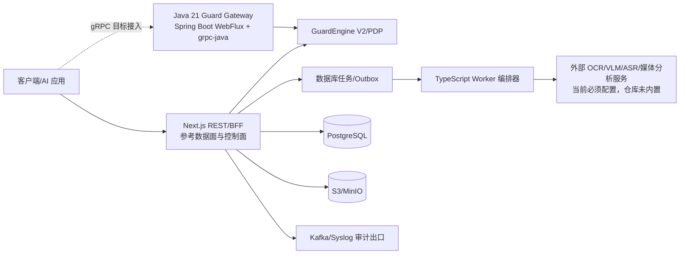
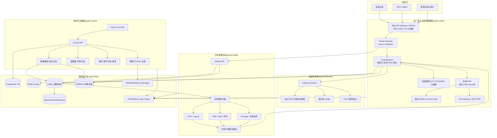
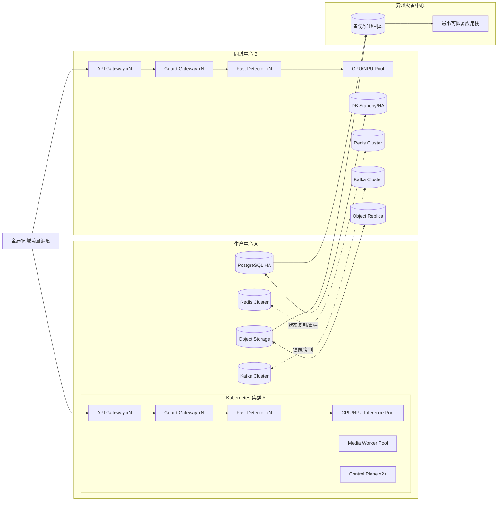
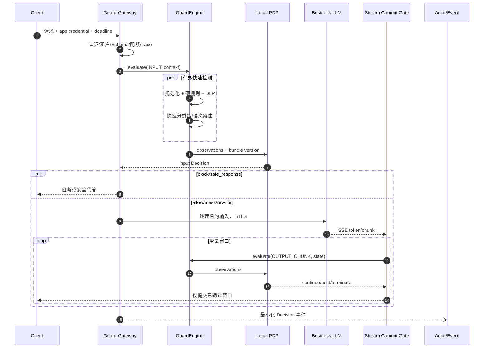
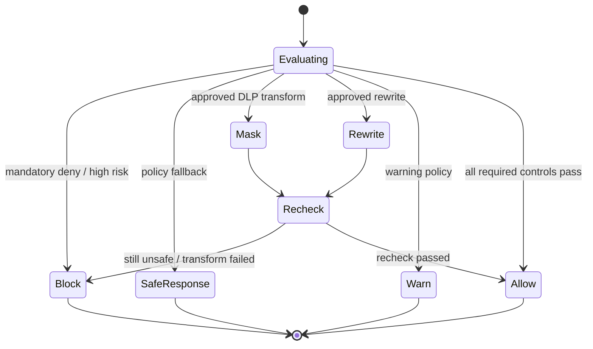
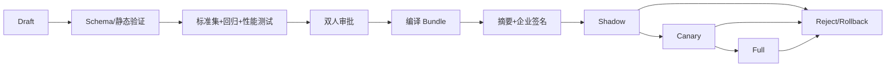
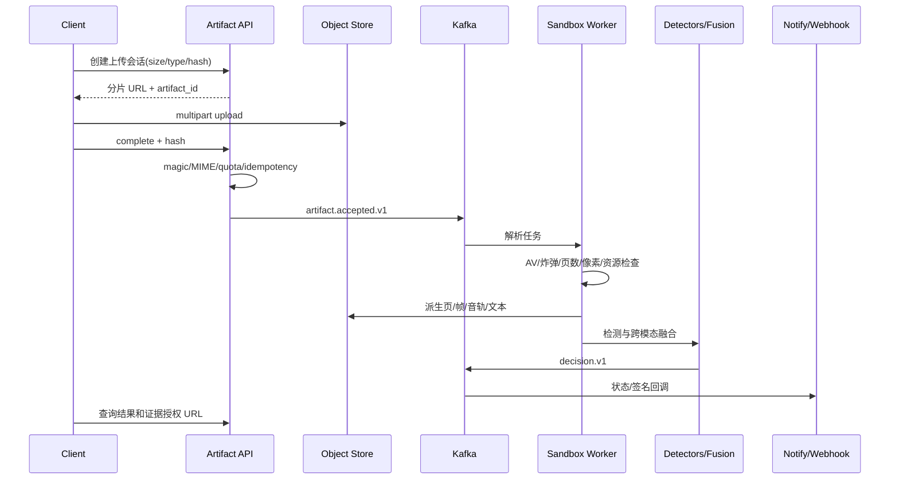
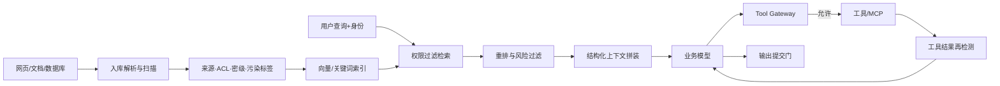

# 大模型安全护栏升级详细设计方案

> 实现校准日期：2026-09-02  
> 文档属性：本文件描述目标架构；“代码存在”不得替代目标环境验收。当前真实实现及偏差以 05、06 文档和 `acceptance/generated/requirements.json` 为准。

## 0. 当前实现校准

截至 2026-09-02，仓库已经形成 Next.js 控制/参考数据面、Java 21 gRPC 网关、PostgreSQL 持久化和 TypeScript 异步编排器，但尚未完全达到本设计的目标形态。



| 设计项 | 当前实现 | 判定 |
|---|---|---|
| Java 在线网关 | Maven 构建的 Java 21/Spring Boot 4.1.1 服务；REST 8080、gRPC 9090；镜像内 `mvn verify` 5/5 通过 | 代码完成，待目标网络、mTLS 和流量影子 POC |
| 协议真源 | `packages/contracts` 生成 JSON Schema、TypeScript 与 Protobuf，并执行向后兼容检查 | 已实现 |
| 多模态 Worker | `document-image-worker.ts`、`audio-video-worker.ts` 仅负责任务编排和时间线融合，调用 `MULTIMODAL_ANALYZER_BASE_URL` / `MEDIA_ANALYZER_BASE_URL` | 仅编排层完成，Python 沙箱、OCR/VLM/ASR/FFmpeg 和模型权重未交付 |
| 事件总线 | 审计出口已实现持久 Outbox 与 Kafka/Syslog 发送；其余业务任务仍以数据库队列为主 | 部分实现 |
| 策略生命周期 | draft -> testing -> approval -> shadow -> canary -> active -> retired -> archived，含异人审批、评测门槛、回滚和撤回 | 已实现，待目标库/灰度 POC |
| 内容标识 | 文本显式标识与签名元数据验证已实现 | 图片/音频/视频文件标识未实现 |
| 部署 gRPC 暴露 | 镜像暴露 9090；Helm 尚未选择 service-mesh TLS 终止+h2c 或应用直终止 mTLS/pass-through | 必须由目标基础设施决策后落 chart |

目标目录中的 Python Worker 仍是后续实现约束，不得把当前 TypeScript 编排器描述成已经具备 OCR、视觉、ASR 或视频解析能力。

> 文档版本：V1.1  
> 设计目标：覆盖《02_大模型安全护栏产品升级需求分析报告》及原 101 项需求  
> 说明：用户原文“关机技术”按“关键技术”理解  
> 设计原则：控制面/数据面分离、不可绕过、确定性权限优先、证据可追溯、默认最小数据、故障行为显式、渐进迁移

## 1. 设计摘要

目标平台由四个安全域组成：统一接入与在线数据面、异步多模态域、控制与治理面、数据与基础设施域。现有 Next.js 代码先收敛为具有统一 API 边界、可信身份、唯一判定内核和稳定契约的模块化单体，再逐步抽离服务端业务；在线文本链的目标实现仍可采用 Java 21 响应式服务承载低延迟代理和流式提交门，但只有在协议、characterization tests 和影子对比稳定后才拆出，不能把现有缺陷直接复制成分布式系统。算法、OCR/ASR/VLM 和文件处理由 Python/原生工具 Worker 承载；所有组件只通过版本化 Protobuf/OpenAPI/Event Schema 共享协议。

核心设计不是“让多个检测器投票”，而是：

- 入口认证和应用策略先决定调用者可以做什么；
- 规范化 DAG 产生有界多视图，硬规则和 DLP 先行；
- 快速分类、语义模型和 Judge 按风险与剩余预算触发；
- PDP 依据硬规则优先级、校准分数、上下文和失败策略生成唯一 Decision；
- 输入、输出、RAG 上下文和工具调用必须经过相应提交门；
- 策略、模型、数据集和代码版本与 Decision 一起记录，证据默认脱敏。

### 1.1 基于代码现状的实施校准

V1.0 的目标架构有效，但不代表可以从现状直接跳到多服务。代码复核和首轮研发将迁移路径校准如下：

1. **先可信、后拆分**：R0 在现有 Next.js 中完成统一 API 包装、认证授权、出域控制、判定正确性、数据最小化和质量清零；这一阶段不创建 Java/Python 业务服务。
2. **先协议、后实现语言**：R1 先冻结 GuardRequest/Observation/Decision/Error 等协议，并在 TypeScript 内通过 production/eval/replay 共用测试证明语义唯一；Java 网关按相同契约做影子实现。
3. **Java 是目标数据面实现，不是绕过门禁的前置条件**：若 Node/Next 数据面已满足基准，可先作为可回滚参考实现；Java 切流必须以 20/200QPS、流式取消、背压、差异率和运维成本数据为依据。
4. **多模态和大文件不进入 Web 同步链**：只有 Artifact、对象存储、任务幂等和沙箱边界就绪后，才接入 OCR/VLM/ASR/FFmpeg Worker。
5. **外部环境验收与代码完成分开记账**：信创实机、200QPS 集群、99.99% 可用性、RPO/RTO 和 2000 黑白样本结果必须在目标环境签名取证；本仓库先交付可执行适配、部署和验收编排，不伪造通过结论。

## 2. 架构决策

| ADR | 决策 | 理由 | 代价/控制 |
|---|---|---|---|
| DES-ADR-001 | 控制面与在线数据面分离 | 管理故障/升级不影响在线请求，缩小数据面攻击面 | 多服务运维；以契约、平台模板和统一观测控制 |
| DES-ADR-002 | 保留 Next.js 控制台；先形成模块化参考数据面，再以 Java 21 WebFlux 影子抽离 | 复用 UI；先固定安全语义和测试，再利用 Java 的连接复用、SSE 与背压能力 | 迁移期双实现；公共 Schema、差异报告和切流门禁防止语义漂移 |
| DES-ADR-003 | Python 只承载模型和多模态 Worker | 复用 ML 生态，并把不可信文件和 GPU 任务隔离 | Worker 必须无状态、沙箱、gRPC 契约化 |
| DES-ADR-004 | 单一 GuardEngine 与唯一 Decision 状态机 | 消除在线、评测、仿真多轨不一致 | 迁移期双跑，旧引擎只作对照不参与最终决策 |
| DES-ADR-005 | 策略发布为签名不可变 Bundle，数据面本地执行 | 满足低时延、断网可用、审计和回滚 | 引入编译/签名流水线和兼容性治理 |
| DES-ADR-006 | 文件/音视频对象化、异步化、沙箱化 | 支持 500MB/3GB，避免 Web 内存和解析器风险 | 增加对象存储、队列、任务状态和回调 |
| DES-ADR-007 | 硬权限不交给 LLM，Judge 只提供风险信号 | 防提示注入、幻觉和非确定性越权 | 需维护策略分类和确定性验证器 |
| DES-ADR-008 | 精确安全缓存，禁止直接复用语义“放行”结论 | 防跨租户、跨策略、上下文变化误放行 | 缓存收益较保守，但行为可证明 |
| DES-ADR-009 | 采用模块化单体到服务化的绞杀迁移 | 当前 53 个 API 无统一身份/Schema，直接拆分会扩大不一致和攻击面 | 抽离速度较慢；每个阶段均可运行、回滚和验收 |

## 3. 总体逻辑架构



### 3.1 信任边界

| 边界 | 允许流量 | 强制控制 |
|---|---|---|
| 外部/业务到 Gateway | HTTPS/API | WAF、OIDC/API Key、签名、时间戳、nonce、限流、Schema |
| Gateway 到业务模型 | mTLS 服务身份 | 模型网络策略只允许 Gateway，禁止应用直连 |
| 在线域到推理域 | gRPC/mTLS | 模型 allowlist、deadline、并发舱壁、数据出域策略 |
| 在线域到控制面 | 只拉取已签名 Bundle/元数据 | 在线请求不得同步依赖控制面数据库 |
| 多模态沙箱到外部 | 默认无网络 | 临时凭据、对象只读、结果只写、CPU/内存/时长/临时盘限额 |
| 管理员到控制面 | 企业 SSO | MFA、三员分立、ABAC、双人审批、全审计 |

## 4. 物理部署架构



Kubernetes 建议至少划分 `guard-edge`、`guard-online`、`guard-inference`、`guard-media`、`guard-control`、`guard-data-access`、`guard-observability` 命名空间，配合 NetworkPolicy、Pod Security、独立 ServiceAccount、资源配额、PDB、反亲和和拓扑分布约束。VM/物理机部署使用相同 OCI 镜像和外置中间件，不形成第二套产品逻辑。

## 5. 在线请求详细设计

### 5.1 同步/流式时序



### 5.2 延迟预算

主链 P99 300ms（不含业务大模型）按硬预算执行，不能靠无限等待或失败放行：

| 步骤 | P99 预算 | 设计 |
|---|---:|---|
| Gateway 认证、Schema、限流 | 10ms | 本地公钥/JWK 缓存、Redis Lua、预编译 Schema |
| Bundle 获取 | 1ms | 内存快照，无请求期数据库访问 |
| 规范化与硬规则/DLP | 35ms | 有界视图、Aho-Corasick、RE2/J、并行分支 |
| 快速分类器 | 120ms | ONNX Runtime/本地推理、动态批处理、舱壁 |
| 聚合与 PDP | 5ms | 编译/WASM 或预编译决策表 |
| 序列化、事件投递 | 15ms | 异步事件，本地缓冲；原文不入事件 |
| 网络抖动余量 | 114ms | 深检只能使用剩余预算 |

Judge/深模型若无法稳定落入剩余预算，按场景采用阻断后复核、异步复核或延迟响应，禁止超时默认允许。

### 5.3 统一 GuardEngine

```text
validate context and deadline
load immutable trusted bundle snapshot
build bounded normalized views
run hard controls and DLP in parallel
if any mandatory deny -> decision BLOCK
run fast classifiers selected by detector routing
if policy and remaining budget allow -> run semantic/deep/Judge
calibrate each detector score by detector/model/version/domain
aggregate observations using precedence matrix, not average voting
evaluate PDP with identity, app risk, direction, state and failures
apply exactly one intervention state machine
emit minimized event and return Decision
```

### 5.4 Decision 状态机



`Decision.action` 只能取 `ALLOW | WARN | BLOCK | MASK | REWRITE | SAFE_RESPONSE | REQUIRE_REVIEW`。动作是互斥终态，不再同时暴露会冲突的 `action`、`processingAction` 和 `effectiveAction`。硬阻断不能被白名单、Judge 或处理动作降级。

### 5.5 输出四种模式

| 模式 | 实现 | 适用 | 安全约束 |
|---|---|---|---|
| 完整后检 | 完整输出暂存，检测后一次提交 | 高敏短响应 | 检测前不向客户端发送 |
| Token/Chunk 检测 | 滑动窗口 + 语句边界 + 状态增量 | 对话流式输出 | hold-back 窗口、上游可取消、敏感跨块状态 |
| 并行检测 | 生成与检测并行，提交门追赶 | 高吞吐低延迟 | 检测落后阈值即暂停或终止提交 |
| 只审计不阻断 | 全量检测，只发事件 | 影子/灰度 | 不能作为高风险生产默认；最终以招标澄清为准 |

## 6. 策略控制面与 Bundle

### 6.1 生命周期



### 6.2 Bundle 结构

```text
bundle/
  manifest.json              # bundle_id、tenant、version、schema、created_at、min_runtime
  precedence.json            # 硬规则和冲突优先级
  detector-routing.json      # 触发条件、预算、fallback、模型版本
  dimensions.json            # 风险分类与阈值
  rules.bin                  # 编译关键词自动机/安全正则清单
  dlp.json                   # 数据类型、校验器、掩码模板
  policy.wasm                # OPA/Rego 或等价预编译 PDP
  labels.json                # 提示和安全代答资源
  checksums.json
  signature.sig
```

数据面只加载签名、摘要、Schema 和 runtime 兼容性全部通过的 Bundle，并通过原子引用切换。控制面不可用时继续使用最后可信版本；没有可信版本时按应用风险执行 fail-close 或受限代答。

### 6.3 白名单语义

白名单改为 Exception，必须包含适用租户、应用、维度、规则、上下文条件、原因、审批人、有效期和最大命中量。它只能降低指定可豁免规则，不能跳过监管硬禁止、恶意文件、密钥泄露、越权访问、工具权限和平台自身攻击。每次命中返回 `exception_id` 和实际跳过的 rule IDs。

## 7. 关键检测技术

### 7.1 多视图规范化和混淆检测

- Unicode NFKC、大小写/空白规范、零宽和双向控制字符显式标记。
- HTML entity、URL、Base64、Hex、转义和常见嵌套编码有界解码；记录变换图和源偏移。
- 中英文、拼音/谐音、形近字、Emoji、代码/自然语言分段视图。
- 每种变换设置最大深度、最大候选数、最大膨胀比和截止时间，超限本身作为风险 Observation。
- 原始视图始终保留；任何检测证据通过 span map 回到原输入。

### 7.2 高性能规则与 DLP

- 关键词使用 Aho-Corasick/Double Array Trie；策略发布期编译，不在请求期构造。
- 正则使用 RE2/J 或等价线性时间引擎；拒绝反向引用、灾难回溯和超长表达式。
- PII/保险敏感字段使用“候选模式 + 校验和/词典 + 上下文分类 + 数据目录”四段判定。
- 证据只保留类型、哈希、脱敏片段、源位置和规则 ID；原值进入受控证据库前需明确策略。
- 多 Finding 不简单求平均：硬命中直接决策；其他分数按模型版本和业务域校准，再由策略矩阵处理。

### 7.3 快速分类与深度模型

- 快速层采用可私有化的小型分类器，导出 ONNX，在 CPU/NPU 上运行，满足 200ms；模型必须有 Model Card、输入限制、标签映射和校准版本。
- 深度层通过 Inference Router 接入 vLLM、LMDeploy、MindIE 或目标芯片适配器；模型版本、Tokenizer、量化和提示模板作为不可分割发布单元。
- 使用连续批处理、前缀缓存、量化和长度分桶；批等待时间受请求 deadline 控制。
- 模型输出只产生 Observation，PDP 才产生动作；分类器不可直接调用工具或改变访问权限。

### 7.4 Judge 防护

- 被判内容使用不可执行的结构化字段传递，系统指令声明其为数据；不把文本拼入系统指令。
- 使用 Provider 的 JSON Schema/受约束解码；服务端再次用 Schema 校验枚举、范围和必填字段。
- `AbortController`/gRPC deadline 真正取消调用；全链共享绝对截止时间，不叠加独立超时。
- 调用前执行 `EgressPolicy`：外部模型遇到秘密时直接禁止调用，而不是只改提示。
- Judge 失败根据应用风险、现有硬信号和 Bundle fallback 得到确定结果；记录 `used_in_decision`。
- RAG 示例只从已审批、同租户/同策略分类、已脱敏案例中精确检索，提示注入内容不得进入指令段。

### 7.5 流式提交门

提交门维护 `pendingBuffer`、`committedOffset`、规范化状态、跨块敏感状态和 detector cursors。按语义句界、最大字节和最大等待时间切块；只有获得当前 Bundle 的 `CONTINUE` 决策后才提交。命中时取消上游、丢弃未提交区并发送标准安全结束事件。任何网络断连都传播取消，避免后台模型继续生成。

## 8. 多模态详细设计

### 8.1 统一对象模型

```text
Artifact(original object)
  -> Derivative(page/frame/audio segment/crop/normalized view)
    -> Observation(OCR token/visual label/ASR span/detector score)
      -> Finding(risk type + evidence refs)
        -> Decision(action + policy path + versions)
```

每个派生物具有 `artifact_id`、`parent_id`、内容哈希、变换类型/参数和源坐标映射。Finding 只引用证据对象，不复制整份原文。

### 8.2 异步作业时序



### 8.3 图片和文档

1. 校验真实类型、解码器安全、分辨率、像素总量、帧数、ICC/EXIF 和异常元数据。
2. 生成原图、缩放、灰度、对比度、旋转纠偏、局部裁剪等有界视图。
3. PaddleOCR PP-OCR/PP-Structure 类管线输出文字、坐标、方向、置信度、版面和阅读顺序。
4. 视觉分类/VLM 检测无文字涉黄、涉暴、仇恨标识、危险行为等内容。
5. 图像混淆检测网格/拼接边界、遮挡、马赛克、噪声和多视图不一致，触发深检。
6. 图文融合器联合用户文字、OCR token/区域、视觉标签、应用任务和指令层级，分别输出内容风险和指令风险。
7. PDF/DOCX/PPTX/XLSX 由隔离解析器提取结构；扫描页风险自适应 OCR，但必须有全页廉价扫描和异常回退，防止只抽首尾页形成确定性盲区。

### 8.4 音频

- FFmpeg/ffprobe 解封装和格式统一；VAD 切分有效语音，ASR 输出词级时间戳和置信度。
- 支持中文、英语、主要方言和噪声场景；高风险/低置信片段可双 ASR 复核。
- 文本转入统一 GuardEngine；声学分支检测非语音有害信号或异常扰动。
- Findings 映射回 `[start_ms,end_ms]`，播放器可定位；单文件上限 500MB，配额按时长和采样率计算。

### 8.5 视频

- 解封装画面、音轨、字幕；固定间隔 + 场景变化 + OCR 变化 + 风险触发加密采样。
- 关键帧走图片管线，音轨走音频管线，字幕走文本管线；按时间窗口融合。
- 对闪帧、长视频中部隐藏、画面无害但音频有害、画音组合和字幕注入建立专项检测。
- Findings 使用时间段、帧号、区域和音频证据；单文件上限 3GB，失败支持分片级重试。

## 9. RAG 与 Agent 安全设计



关键技术：

- Source/Chunk 的 ACL 必须在向量召回前或召回时强制过滤，不能只在提示中声明。
- 系统指令、用户问题、检索数据和工具结果用不同结构字段及不可混淆边界表示。
- 污染标签沿 Chunk -> Context -> Model output -> Tool argument 传播；高风险污染上下文禁止自动执行高权限工具。
- Tool Gateway 的决策输入包含主体、应用、工具、动作、资源、参数 Schema、风险状态和审批状态；执行前后都检测。
- MCP Server 注册包括所有者、版本、签名、工具清单、数据域、网络目的地和最小权限；未知 Server 默认拒绝。
- 记忆写入经过检测、来源标记和 TTL；读取按租户/用户/会话/目的隔离。

## 10. 数据与接口设计

### 10.1 核心实体

| 实体 | 必要字段 | 存储 |
|---|---|---|
| Tenant/Application | tenant_id、app_id、risk_level、quota、fail_policy、data_zone | PostgreSQL |
| Credential/ServiceIdentity | owner、scope、key_ref/cert、status、expires_at | PostgreSQL + KMS |
| Policy/PolicyVersion | immutable version、hash、signature、state、approvals、scope | PostgreSQL + Object Store |
| ModelVersion | source、license、weight hash、runtime、quantization、card、signature | PostgreSQL + Object Store |
| Request/Decision | trace、decision、tenant/app、direction、action、versions、latency | Event/Search；短期状态 Redis |
| Artifact/Derivative | object key、hash、type、size、parent、transform、retention | PostgreSQL + Object Store |
| Observation/Finding | detector/model/rule version、risk、score、evidence refs | Event/Search |
| Dataset/EvalRun | dataset hash、split、versions、metrics、environment | PostgreSQL + Object Store |
| Incident/Approval/Audit | state、owner、SLA、immutable events、signatures | PostgreSQL + WORM/Search |

所有业务实体必须包含 `tenant_id`；应用域实体必须包含 `application_id`。数据库约束、Repository 条件、自动跨租户测试三层防止漏加过滤。缓存键、对象前缀、Kafka key 和日志索引同步包含租户域。

### 10.2 同步检测 API

`POST /v1/guard/evaluate`

```json
{
  "request_id": "client-idempotency-key",
  "application_id": "app_x",
  "direction": "INPUT",
  "content": { "type": "TEXT", "text": "..." },
  "context": {
    "session_id": "s_...",
    "user_pseudonym": "hmac:...",
    "locale": "zh-CN",
    "deadline_ms": 280
  }
}
```

```json
{
  "trace_id": "tr_...",
  "decision_id": "dec_...",
  "action": "BLOCK",
  "risk_level": "HIGH",
  "policy": { "bundle_id": "pb_...", "version": 12 },
  "findings": [
    {
      "type": "PROMPT_INJECTION",
      "severity": "HIGH",
      "score": 0.97,
      "evidence": [{ "view": "nfkc", "start": 12, "end": 24, "masked": "忽略***指令" }],
      "detector": { "id": "prompt-fast", "version": "3.2.1" }
    }
  ],
  "intervention": { "message_key": "SAFE_BLOCK_GENERIC" },
  "latency_ms": 86
}
```

约束：服务端从认证上下文确定 tenant，不接受客户端传 tenant；`policy_id` 默认不可由普通调用者任意选择；响应不回传未授权原文或内部提示。

### 10.3 Artifact API

- `POST /v1/guard/artifacts/uploads`：创建分片上传。
- `POST /v1/guard/artifacts/{id}/complete`：校验哈希并封存。
- `POST /v1/guard/jobs`：按 artifact 和策略创建幂等检测作业。
- `GET /v1/guard/jobs/{id}`：查询进度、阶段和失败码。
- `GET /v1/guard/jobs/{id}/result`：按字段权限返回 Decision/Findings。
- `POST /v1/guard/jobs/{id}/cancel`：协作取消未运行/运行任务。

回调使用 mTLS 或 `timestamp + nonce + body hash` 企业签名，接收方重复事件必须幂等。

### 10.4 事件

主题采用 `guard.request.v1`、`guard.finding.v1`、`guard.decision.v1`、`guard.intervention.v1`、`guard.audit.v1`、`guard.incident.v1`、`guard.eval.v1`。每条事件含 `schema_version`、`event_id`、`trace_id`、`decision_id`、`tenant_id`、版本和事件时间；Schema Registry 执行向后兼容。原文禁止直接进入事件，证据通过授权引用访问。

### 10.5 错误码

| HTTP/Code | 含义 | 重试 |
|---|---|---|
| 400 `GRD_SCHEMA_INVALID` | 契约错误 | 否，修复请求 |
| 401/403 `GRD_AUTH_*` | 未认证/越权 | 否 |
| 409 `GRD_IDEMPOTENCY_CONFLICT` | 同一键不同内容 | 否 |
| 413 `GRD_CONTENT_TOO_LARGE` | 超限 | 否，改走 Artifact |
| 422 `GRD_BLOCKED` | 策略阻断 | 否，可申诉 |
| 429 `GRD_QUOTA_EXCEEDED` | 配额/并发超限 | 按 Retry-After |
| 503 `GRD_DEPENDENCY_UNAVAILABLE` | 依赖不可用且无安全降级 | 有界重试 |
| 504 `GRD_DEADLINE_EXCEEDED` | 截止时间耗尽 | 由幂等语义决定 |

## 11. 安全设计

### 11.1 身份和权限

- 人员使用企业 OIDC/SAML + MFA；服务使用短生命周期证书/mTLS；外部应用使用可轮换 API Credential。
- 权限采用 RBAC + ABAC：角色决定动作集合，属性决定 tenant/app/data classification/environment/ownership。
- 系统、安全、审计三员权限互斥；长期白名单、策略发布、模型上线、原文取证和数据导出双人审批。
- 应急账号离线封存、双人启用、短时有效、全程告警和事后复核。

### 11.2 密钥和数据

- Provider Key、JWT/签名密钥和数据库凭据只存 `secret_ref`，由 KMS/HSM/Secret Manager 信封加密和轮换。
- TLS 1.2+，目标环境按要求支持国密证书/套件；数据库、对象和备份静态加密。
- 原文默认只在内存/受控临时存储存在；需留存时按数据类型、用途、审批和 TTL 进入独立证据域。
- 日志脱敏器在 logger sink 前执行，禁止代码自行 `console.log` 原始内容。

### 11.3 SSRF 和出域

- Provider endpoint 只能从管理员审批的注册表选择；解析 DNS 后校验全部 IP，拒绝 loopback、link-local、RFC1918（除批准私有区）、云元数据和重绑定。
- 所有外联经出口代理/防火墙 allowlist；模型调用前执行 data egress policy。
- URL 重定向默认禁用，或每一跳重新校验；连接限制端口、协议、证书和最大响应。

### 11.4 供应链

- 固定 Node/pnpm/Java/Python/基础镜像版本；使用 lockfile 和内部制品库。
- 生成 CycloneDX/SPDX SBOM 与 AI BOM；执行 SAST、SCA、密钥、IaC、镜像、许可证扫描。
- 镜像、Policy Bundle、模型权重和离线包由企业 PKI 签名，Kubernetes 准入验证。
- 高危漏洞必须清零，不能修复项有到期风险接受和补偿控制。

## 12. 性能与容量设计

### 12.1 并发与背压

- Gateway 按 tenant/app/endpoint 维度实施令牌桶、并发上限和优先级；Redis Lua 保证集群一致。
- 规则、快速模型、Judge、业务模型、OCR、ASR、视频分别使用舱壁和队列，禁止一个 3GB 视频耗尽在线文本资源。
- 所有队列有最大长度、最大等待、死信、重试预算和积压告警；重试携带幂等键。
- WebFlux/gRPC 贯穿取消信号；不得用 `Promise.race` 伪超时而不取消底层调用。

### 12.2 缓存

精确 Decision 缓存键至少包含：tenant、application、direction、内容 HMAC、上下文安全摘要、Policy Bundle、detector/model/Tokenizer 版本和失败策略。策略/模型变化立即自然失效。PII 原文不作缓存键；禁止跨租户复用；语义相似只能辅助路由，最终放行仍执行当前硬控制。

### 12.3 推理优化

- 按模型、长度、SLA 分桶，连续批处理；短请求和长请求隔离。
- 前缀缓存包含租户与策略域，KV 缓存不可跨敏感域复用。
- INT8/FP8/AWQ/GPTQ 等量化必须同时比较安全指标、白样本误报、延迟、吞吐、显存和稳定性。
- NVIDIA 可选 vLLM/LMDeploy/TensorRT-LLM，昇腾可选 MindIE；最终以目标实机 POC 和抽象适配接口决定。

## 13. 可观测、审计与 SLO

OpenTelemetry SDK/Collector 统一采集：

- Metrics：QPS、P50/P95/P99、拒绝/告警/降级、检测器耗时、batch、GPU/NPU、队列、缓存、依赖、策略版本。
- Traces：Gateway、GuardEngine、detector、PDP、business model、RAG、tool、media stage；只记录内容哈希/长度/分类，不记录原文。
- Logs：结构化 `event_name`、trace/decision、tenant/app、error_code、version；进入 Sink 前脱敏。
- Audit：独立主题和存储，策略/模型/权限/取证/导出/审批不可抵赖。

SLO 采用窗口化错误预算。`99.99%` 统一定义入口、计划维护、依赖故障和降级状态；快速检测和主链延迟按全策略生产流量统计。错误预算耗尽时冻结非安全发布并自动收紧灰度。

## 14. 故障与降级矩阵

| 故障 | 低风险应用 | 高风险应用 | 审计 |
|---|---|---|---|
| 控制面/数据库不可用 | 使用最后可信 Bundle | 使用最后可信 Bundle | 记录 bundle age |
| 无可信 Bundle | 可配置受限代答 | fail-close | 高危告警 |
| 快速分类器超时 | 硬规则后受控降级 | block/安全代答 | detector failure |
| Judge 超时 | 按规则结果/受限代答 | 规则高风险即 block | fallback path |
| Redis 不可用 | 本地小配额、无状态模式 | 降低并发或 fail-close | degraded state |
| Kafka 不可用 | 本地加密 spool，限量继续 | spool 满后按策略拒绝 | 补写序号 |
| 对象存储不可用 | 拒绝新 Artifact | 拒绝 | 不丢任务元数据 |
| GPU/NPU OOM | 切副本/降级小模型 | block/排队复核 | model/runtime version |
| 策略坏包 | 拒绝并保留旧版 | 同左 | 签名/兼容失败证据 |

## 15. 现有代码迁移设计

### 15.1 目标仓库结构

```text
apps/
  console/                   # 现有 Next.js UI，保留 BFF 但不承载在线检测
services/
  control-api/               # 租户、策略、模型、评测、审批、运营
  guard-gateway/             # Java 21 WebFlux 在线数据面
  artifact-api/              # 上传/任务/结果 API
  eval-worker/               # 生产同内核回放与统计
workers/
  document-worker/
  image-worker/
  audio-worker/
  video-worker/
  inference-server/
packages/
  contracts/                 # OpenAPI/Protobuf/JSON Schema（唯一协议真源）
  policy-sdk/
  console-sdk/
deploy/
  helm/ kustomize/ compose-dev/ observability/
tests/
  contract/ integration/ security/ performance/ eval-datasets/
```

### 15.2 迁移映射

| 现有模块 | 处理 | 目标 |
|---|---|---|
| `src/app/*` 页面 | 保留并模块化 | `apps/console` |
| Next API 路由 | R0 加统一中间件，R1 后逐步改 BFF/Control API | `services/control-api` |
| `dynamic-engine.ts` | 冻结行为、补 characterization tests，再替换 | `guard-gateway/GuardEngine` |
| `llm/orchestrator.ts` | 废弃；只用于迁移对比 | 删除 |
| `judge/*` | 合并为 Judge Detector，修正协议/超时 | inference adapter + GuardEngine |
| `document/*` | 拆出 Web 进程，重用数据概念 | media workers |
| `lib/db.ts` 等 | 收敛到单一 Repository/Drizzle 迁移 | control-api data layer |
| PostgreSQL 原文列 | 停写、迁移加密证据引用、按批准清理 | event/evidence store |

### 15.3 双跑与切换

1. R0 给旧在线链补认证、Schema、限流、日志脱敏和测试，不改变业务规则结果。
2. 记录一批经过授权、脱敏的基准请求，生成旧引擎 characterization tests。
3. 新 GuardEngine 先以 shadow 接收同请求，只记录差异；不调用两次业务 LLM。
4. 对差异按硬规则、真实缺陷、策略语义和模型波动分类，冻结阈值。
5. 按 tenant/app 1% -> 5% -> 25% -> 100% 灰度；SLO、漏报/误报或依赖错误越限自动回旧版。
6. 所有调用方迁入统一 Gateway、网络旁路关闭后，删除旧 Orchestrator 和直连 Chat。

## 16. 测试与验收设计

| 层级 | 内容 | 门禁 |
|---|---|---|
| 单元/属性 | 规范化、偏移、规则、聚合、状态机、白名单、脱敏、错误码 | 关键模块覆盖不低于 90%，分支不低于 85% |
| 契约 | OpenAPI/Protobuf/Event Schema 兼容、Consumer-driven contracts | 所有消费者通过 |
| 集成 | PostgreSQL/Redis/Kafka/对象/KMS/Provider/SSO | Testcontainers/隔离环境自动执行 |
| 安全 | 越权、跨租户、CSRF、SSRF、ReDoS、文件炸弹、提示注入、工具越权 | P0/P1 为零 |
| 效果 | 黑/白样本、保险业务、多轮、编码、多模态、RAG、Agent | 原产品报告指标全部通过 |
| 性能 | 20/200QPS、3000 会话、P99、资源、长稳和扩缩容 | 全策略、目标信创实机 |
| 故障 | 超时/OOM/积压/切换/坏包/证书/灾备 | 行为符合故障矩阵和 RPO/RTO |
| 供应链 | SAST/SCA/SBOM/签名/许可证/镜像/IaC | 高危清零或批准闭环 |

15 项 POC 由统一验收编排器生成机器可读结果、版本清单、日志摘要和签名报告。失败重试保留原失败，不允许覆盖分数。

## 17. 关键交付物

- OpenAPI、Protobuf、事件 Schema、错误码和 SDK；
- 数据模型、迁移、数据字典、分类分级和保留删除策略；
- Policy Bundle Schema、签名、编译、发布、灰度和回滚工具；
- 模型卡、数据卡、阈值校准、推理适配和信创认证矩阵；
- Helm/Kustomize、离线镜像包、SBOM/AI BOM、签名和部署/回滚脚本；
- 单元、契约、集成、安全、效果、性能、HA、灾备、POC 报告；
- 运维、巡检、备份、故障、审计、取证、培训和运营手册。

## 18. 设计完成判定

目标架构只有在下列条件同时成立时才算落地：在线模型不可绕过，所有调用链使用唯一 GuardEngine 和可信 Bundle；所有终态由一个 Decision 状态机执行；原文和凭据不再默认明文保存；多模态不在 Web 请求内解析；RAG/Agent 的权限由确定性 PEP/PDP 控制；101 项需求均有版本化测试与证据；目标信创环境下效果、P99、吞吐、资源、99.99% 可用性和 RPO/RTO 全部通过。
