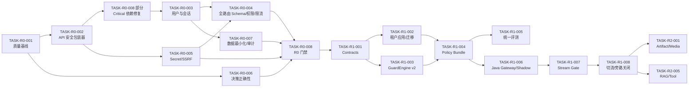

# GuardLLM 升级编码执行技术规范书

> 文档版本：V1.2  
> 目标读者：执行代码修改的大模型/开发人员、代码审查人员和 CI 维护人员  
> 使用方式：每次只选择一个 `TASK-*` 任务，先读取任务依赖和允许路径，再实现、测试、审查和提交证据  
> 上位文档：01 现状报告、02 升级需求、03 详细设计；发生冲突时依次以安全/合规强制要求、02、03、本规范为准

## 1. 总体执行契约

编码代理必须遵守以下规则：

1. 修改前读取根目录 `AGENTS.md`、`package.json`、相关源码和现有测试，不根据文件名猜实现。
2. 工作区可能有用户未提交修改；不得 reset、checkout、删除或格式化无关文件。
3. 每个任务只改“允许路径”，超出范围必须拆分任务或记录阻塞，不做顺手重构。
4. 先写/更新失败测试，再改实现；安全缺陷必须有负向测试。
5. 不得通过关闭 strict、`ignoreBuildErrors`、eslint 规则、测试、证书验证或安全控制来让构建通过。
6. 不得引入 `any`、`as any`、`@ts-ignore`、非空断言逃避边界验证；未知输入使用 `unknown` + Schema 缩窄。
7. 不得记录提示原文、模型输出原文、密码、API Key、Cookie、Authorization、证件/卡号或完整 Finding evidence。
8. 不得给无策略/超时/解析失败新增默认放行；失败行为必须来自应用风险配置。
9. 任何模型建议只能形成 Observation；权限和最终 Action 由确定性 PDP/Decision 状态机产生。
10. 完成后必须报告：修改文件、行为变化、需求 ID、测试命令/结果、未解决风险；不能只说“已实现”。

## 2. 单任务输入模板

给编码大模型的任务必须使用下列 YAML。字段不全时，代理应先从仓库和上位文档补齐；只有涉及产品取舍且无法推导时才询问。

```yaml
task_id: TASK-R0-001
objective: 一句话描述可验证结果
requirements: [UPG-ACC-004, SEC-003]
design_refs: [DES-ADR-001]
depends_on: []
allowed_paths:
  - package.json
  - next.config.ts
  - tests/**
forbidden_paths:
  - 输出/**
  - node_modules/**
behavior_before: 当前可复现问题
behavior_after: 目标行为
acceptance:
  - 机器可执行断言
commands:
  - pnpm ts-check
  - pnpm lint
  - pnpm test:unit --run
rollback: 如何关闭/回退且不丢数据
```

## 3. 代理输出模板

```text
TASK: <task_id>
STATUS: completed | blocked
REQUIREMENTS: <IDs>
FILES_CHANGED: <paths>
BEHAVIOR: <before -> after>
MIGRATIONS: <none or migration id/backfill/rollback>
SECURITY: <threats closed and residual risk>
VERIFICATION:
  - <command>: pass/fail, key counts
NOT_RUN: <command and exact reason>
FOLLOW_UP: <new task IDs only; no scope expansion>
```

## 4. Definition of Done

一个任务只有同时满足以下条件才可标记完成：

- 验收行为由自动测试证明，正向、负向和边界用例齐全；
- TypeScript 编译、lint、受影响测试和构建通过；若为 Java/Python，语言门禁也通过；
- 新增 API 有 OpenAPI/Schema、认证授权、限流、错误码、审计和契约测试；
- 新增数据字段有迁移、回填、约束、索引、保留/加密说明和回滚方案；
- 新增日志/指标不含敏感原文，并能关联 trace/decision；
- 新增依赖有版本锁、许可证检查、SCA/SBOM 记录，不使用 `latest`；
- 需求 ID 已写入测试名、变更说明或追踪清单；
- 没有扩大本任务外的 diff，没有遗留无编号 TODO。

## 5. 代码质量门禁

### 5.1 当前基线与递减策略

初始基线为 TypeScript 68 个错误、ESLint 156 个错误；当前机器可读基线已收紧为 TypeScript 0、ESLint 0。每个任务不得增加错误，触及文件必须保持清零，不得恢复构建跳过配置。

最终 CI 顺序：

```bash
pnpm install --frozen-lockfile
pnpm contracts:check
pnpm ts-check
pnpm lint
pnpm test:unit --run
pnpm test:contract --run
INTEGRATION_DATABASE_URL=<隔离测试库> INTEGRATION_APPLY_SCHEMA=true pnpm test:integration
docker build --pull=false -t guardllm-gateway:ci services/guard-gateway
pnpm build
```

上述命令必须串行执行；`ts-check` 与 `next build` 会共享 `.next/types`，并发运行会读取构建中间态。仓库当前未引入统一格式化器，因此不得声明不存在的 `format:check` 门禁；格式约束由 ESLint 执行，待选择并锁定格式化器后再增加独立命令。数据库集成命令只允许连接 localhost/127.0.0.1 且数据库名以 `guardllm_integration` 开头。

生产发布另加 SAST、SCA、secret scan、SBOM、镜像/IaC 扫描、签名验证和部署冒烟。

### 5.2 TypeScript/Next.js

- 包管理器只用 pnpm。R0 暂以 `packageManager` 的精确版本为准；更新 pnpm 时必须同时修改 package、Docker、CI 和开发文档。
- `strict=true`；API、数据库、Provider 和 JSON 边界全部使用明确类型。
- React Server Component 为默认；只有交互/浏览器 API 使用 `use client`。
- Route Handler 只做协议适配，业务放 service，数据放 repository，策略放 domain。
- 统一返回 RFC 9457 风格 Problem Details，不把内部异常文本直接返回客户端。
- 服务端生产业务代码使用结构化 logger，禁止记录原文和凭据；CLI/Worker 入口可将脱敏 JSON 结果写 stdout/stderr。遗留浏览器/服务端 `console.*` 属质量债，新增代码不得扩大，迁移时优先删除或改为脱敏遥测。
- 时间使用 UTC ISO-8601；金额/精确分数不得用浮点表示业务精度。

### 5.3 Java 在线数据面

- Java 21 LTS，Maven 3.9.12、Spring Boot 4.1.1、grpc-java 1.83.1 和 protobuf 4.35.1 固定版本；构建以 `services/guard-gateway/pom.xml` 和 Dockerfile 为真源。
- 禁止阻塞调用运行在 event loop；数据库/文件/模型客户端必须显式 deadline 和取消。
- 使用 record/sealed interface 表达协议和终态；禁止 nullable 安全字段。
- `mvn -B -ntp verify`、单元/集成/架构测试必须通过；标准验证路径为构建 `services/guard-gateway/Dockerfile`。
- 所有 detector 有 bulkhead、timeout、failure observation 和 Micrometer/OTel 指标。

### 5.4 Python Worker

本节是新增 Python 模型/媒体 Worker 的强制约束。当前仓库只有 TypeScript 任务编排器，不能据此声明 Python 沙箱、OCR/VLM/ASR/FFmpeg 或模型能力已经实现。

- Python 3.11+ 的批准固定版本，`pyproject.toml` + lockfile；使用 Ruff、mypy strict、pytest。
- 外部进程使用参数数组，不拼 shell；FFmpeg/Tika/Office 运行在独立沙箱，禁网、限权和限资源。
- 模型/解析任务幂等、可取消、分阶段 checkpoint；不得把大文件整体读取到 Web 内存。
- `uv run ruff check .`、`uv run mypy .`、`uv run pytest` 必须通过。

## 6. 统一领域协议

协议真源最终位于 `packages/contracts`。在 Java 服务建立前，TypeScript 参考类型如下，禁止各模块自行扩展同义字段：

```ts
export type Direction =
  | 'INPUT'
  | 'OUTPUT_COMPLETE'
  | 'OUTPUT_CHUNK'
  | 'RAG_INGEST'
  | 'RAG_CONTEXT'
  | 'TOOL_REQUEST'
  | 'TOOL_RESULT';

export type GuardAction =
  | 'ALLOW'
  | 'WARN'
  | 'BLOCK'
  | 'MASK'
  | 'REWRITE'
  | 'SAFE_RESPONSE'
  | 'REQUIRE_REVIEW';

export interface RequestContext {
  readonly traceId: string;
  readonly requestId: string;
  readonly tenantId: string;        // only from trusted authentication
  readonly applicationId: string;
  readonly sessionId?: string;
  readonly direction: Direction;
  readonly absoluteDeadlineEpochMs: number;
  readonly policyBundleId: string;
}

export interface EvidenceRef {
  readonly viewId: string;
  readonly start?: number;
  readonly end?: number;
  readonly artifactId?: string;
  readonly region?: readonly [number, number, number, number];
  readonly timeRangeMs?: readonly [number, number];
  readonly maskedPreview?: string;
  readonly contentHmac: string;
}

export interface Observation {
  readonly detectorId: string;
  readonly detectorVersion: string;
  readonly riskType: string;
  readonly score: number;           // validated [0,1]
  readonly severity: 'INFO' | 'LOW' | 'MEDIUM' | 'HIGH' | 'CRITICAL';
  readonly evidence: readonly EvidenceRef[];
  readonly status: 'MATCH' | 'NO_MATCH' | 'TIMEOUT' | 'ERROR' | 'SKIPPED';
}

export interface GuardDecision {
  readonly decisionId: string;
  readonly traceId: string;
  readonly action: GuardAction;     // exactly one terminal action
  readonly riskLevel: 'NONE' | 'LOW' | 'MEDIUM' | 'HIGH' | 'CRITICAL';
  readonly observations: readonly Observation[];
  readonly policyPath: readonly string[];
  readonly bundleId: string;
  readonly latencyMs: number;
  readonly degradationReasons: readonly string[];
}
```

不允许恢复旧的 `action + processingAction + effectiveAction` 三字段模型。兼容 API 在边缘做一次映射，领域内部只使用 `GuardDecision.action`。

## 7. API 安全规范

### 7.1 统一包装器

R0 在现有 Next.js 中实现一个且仅一个包装器：

```ts
type ApiSecurityOptions<TSchema> = {
  readonly public?: boolean;
  readonly permission?: Permission;
  readonly bodySchema?: TSchema;
  readonly querySchema?: TSchema;
  readonly rateLimitPolicy: RateLimitPolicy;
  readonly maxBodyBytes: number;
  readonly auditEvent: string;
};

export function withApiSecurity<T>(
  options: ApiSecurityOptions<unknown>,
  handler: (ctx: ApiContext<T>) => Promise<Response>,
): RouteHandler;
```

执行顺序固定：生成 trace -> 大小/媒体类型 -> Schema -> 认证 -> tenant/application -> 授权 -> CSRF（Cookie 变更请求）-> 限流/并发 -> handler -> 响应 Schema -> 审计。错误也必须带 trace，且不能暴露内部异常。

公开 allowlist 仅允许：登录、必要的 OIDC callback、`/api/health/live`；readiness 只对平台网络开放。`/api/init-database` 在生产构建中必须禁用。其他未声明路由默认拒绝。

### 7.2 身份与角色

角色最小集合：`SYSTEM_ADMIN`、`SECURITY_ADMIN`、`AUDIT_ADMIN`、`BUSINESS_OPERATOR`、`APP_DEVELOPER`、`READ_ONLY`。三员角色不得互相继承。普通用户不能选择策略外的 `policyId`，不能指定 tenant，不能读取 Provider Key 或原始证据。

### 7.3 请求边界

- JSON 默认上限 1MB，文本检测上限由应用策略给出且有全局硬上限。
- 文件不得通过普通 JSON/Base64；使用 Artifact 分片上传。
- 所有枚举拒绝未知值；分页有最大 pageSize；排序字段使用 allowlist。
- 所有出站 URL 通过 `ProviderEndpointPolicy`，禁止把用户 URL 直接交给 fetch。
- 所有出站调用使用真正取消、绝对 deadline、最大响应体和重定向策略。

## 8. 数据库与迁移规范

1. Drizzle Schema + 版本化迁移作为唯一真源；Prisma 和自研 Supabase wrapper 只在迁移期存在，不得新增调用。
2. 迁移只前向追加：先加 nullable/默认字段，回填，验证，再加约束；禁止同一发布直接 drop/rename 生产列。
3. 所有业务表有 `tenant_id`；应用数据有 `application_id`；查询 Repository 必须由 `TenantContext` 构造，禁止裸全表客户端。
4. Secret 表只存 `secret_ref`、密文封装元数据和轮换时间，不存可用明文。
5. 原文列停止新增写入；迁移到 `evidence_ref`，历史清理由审批任务执行并输出计数/hash 证明。
6. 审计表只追加；业务 API 无 update/delete 权限。数据库管理员操作进入独立审计。
7. 每个迁移包含 up、兼容期、回填脚本、验证 SQL、rollback/roll-forward 说明和大表锁评估。

## 9. 安全实现禁止项

- 禁止 JWT secret、数据库密码、管理员初始密码和加密 key 使用源码 fallback。
- 禁止 Cookie `secure:false` 在生产；必须 HttpOnly、Secure、合适 SameSite，并防 CSRF。
- 禁止密码明文/可逆加密；使用批准参数的 Argon2id 或 bcrypt，并支持参数升级。
- 禁止以 URL 字符串包含 `localhost` 判断 Provider 是否私有；必须用解析后网络策略。
- 禁止原生回溯正则执行管理员任意表达式；只接受安全正则子集并在发布期编译。
- 禁止全局白名单短路全部检测；Exception 只能影响明确可豁免规则。
- 禁止以 `includes('yes')`、正则抓 JSON 等宽松方式解析 Judge；使用结构化输出 Schema。
- 禁止 `Promise.race` 作为唯一超时；必须取消底层 fetch/gRPC/进程。
- 禁止在 Route Handler 中启动不可恢复的 fire-and-forget 后台任务。
- 禁止安全缓存跨 tenant/app/policy/model 复用，禁止语义相似直接返回 ALLOW。

## 10. 测试规范

### 10.1 测试命名

测试名包含需求或缺陷 ID：

```ts
describe('UPG-POL-002 hard-rule precedence', () => {
  it('CUR-P0-07 does not allow a global exception to bypass mandatory deny', () => {});
});
```

### 10.2 最低测试集

| 组件 | 必测 |
|---|---|
| API wrapper | public/default deny、token、role、tenant、CSRF、Schema、body 上限、429、Problem Details |
| 用户 | 密码哈希、重复用户、弱密码、角色越权、锁定/解锁、令牌吊销 |
| Provider | 密文不等于明文、mask 输出、轮换、SSRF IPv4/IPv6/DNS rebinding/redirect、超时取消 |
| 规则 | Unicode、零宽、编码、偏移、RE2 拒绝、硬规则、Exception 范围/过期/命中量 |
| Decision | 所有 Observation 组合的互斥终态、block 最高优先级、fallback 矩阵 |
| Judge | 注入、无效 JSON、范围、timeout、外部秘密阻断、usedInDecision |
| Stream | 跨 chunk 敏感词、hold-back、取消、检测落后、断连、不泄露未提交 buffer |
| 数据 | Repository 自动 tenant 条件、RLS/约束、跨租户 ID 枚举、审计不可改 |
| 文件 | 魔数/MIME、超限、炸弹、页数/像素、AV、幂等、取消、沙箱资源和证据坐标 |
| RAG/Tool | ACL 前置、间接注入、污染传播、参数越权、审批、工具结果再检测 |

### 10.3 安全回归语料

测试 fixture 中的敏感值全部为显式假数据。真实生产样本只能以审批后的脱敏/合成版本进入隔离数据集，不能提交 Git。每个线上 badcase 生成稳定 hash 和不可删除回归 ID。

## 11. 任务依赖图

实施校准：任务 ID 和验收目标不变，但执行顺序按现状风险调整。`TASK-R0-008` 中的 Critical 依赖修复提前到 R0-002 后执行，其余质量清零、Docker 和供应链总门禁仍在 R0 收尾；R1 必须先在现有运行时固定协议和 GuardEngine 语义，Java 数据面只做契约兼容的影子抽离。



## 12. 可直接执行的任务清单

### 12.1 R0 安全止血

| Task | 允许路径 | 实现结果 | 验收 |
|---|---|---|---|
| TASK-R0-001 | `package.json`、`next.config.ts`、eslint/测试/CI 配置、`tests/baseline/**` | 固定 pnpm；引入 Vitest；记录并递减 68/156 基线；构建不再新增隐藏错误 | touched files 0 error；CI 可运行；不得删除规则 |
| TASK-R0-002 | `src/lib/api-security/**`、`src/middleware.ts`、对应测试 | `withApiSecurity`、RequestContext、Problem Details、默认拒绝、CSRF、内存开发限流接口 | public/default deny/权限/Schema/429/trace 测试通过 |
| TASK-R0-003 | auth/users 路由、`src/lib/auth/**`、用户迁移和测试 | 密码哈希、强策略、登录锁定、Secure Cookie、令牌版本/吊销、角色授权 | 匿名/越权失败；数据库无新明文密码；旧用户迁移可回滚 |
| TASK-R0-004 | `src/app/api/**/route.ts`、`src/contracts/http/**`、契约测试 | 53 路由逐一添加 Zod、权限、body/page 上限、限流；关闭生产 init API | 路由清单 100% 有策略，公开 allowlist 之外匿名均 401/403 |
| TASK-R0-005 | providers/chat/gateway、`src/lib/secrets/**`、`src/lib/egress/**`、迁移/测试 | SecretProvider 信封加密、secret_ref、Provider allowlist、SSRF 防护、AbortController | DB 无新明文 Key；SSRF 套件拒绝；超时真正取消 |
| TASK-R0-006 | `src/lib/detection/**`、`src/lib/judge/**`、detect/compare/simulate 测试 | 无策略失败策略、硬规则/Exception、RE2 安全编译、Decision 互斥、Judge timeout/Schema | CUR-P0-07/08 回归通过；不再固定置信度；无全局短路 |
| TASK-R0-007 | history/export/document/agent logs、logger/audit、迁移/测试 | 停止默认回传/记录原文；字段权限；日志脱敏；导出审批钩子；审计事件 | 日志扫描无秘密；匿名导出失败；原文权限测试通过 |
| TASK-R0-008 | 全仓质量修复、测试、CI、Docker/Compose | TS/lint 全清零；Docker pnpm 固定；healthcheck 工具一致；R0 安全回归 | 全部门禁命令通过；镜像健康；0 P0/P1 SAST/SCA（按策略） |

R0 任务不可并行修改同一路由。校准后的顺序为 001 -> 002 -> 008/Critical 依赖子项 -> 003 -> 005 -> 006 -> 004 -> 007 -> 008/质量、容器和总门禁；每个任务完成后重新生成路由安全清单。包装器创建后、全路由迁移前，不得在全局 Proxy 中直接拒绝旧路由，否则会造成未评估的业务中断；默认拒绝先由包装器的 `public: false` 语义保证，路由覆盖达到 100% 后再启用全局未声明路由门禁。

### 12.2 R1 生产文本数据面

| Task | 允许路径 | 实现结果 | 验收 |
|---|---|---|---|
| TASK-R1-001 | `packages/contracts/**`、生成器、契约测试 | GuardRequest/Observation/Decision/Artifact/Event/Error 的 OpenAPI/Proto/JSON Schema 真源 | TS/Java/Python 生成物兼容，破坏性变更阻断 |
| TASK-R1-002 | Drizzle schema/migrations/repositories、tenant/app API/UI | Tenant/Application/Credential、全表 tenant/app 迁移和 Repository 约束 | 自动跨租户测试 100% 拒绝，迁移含回填/回滚 |
| TASK-R1-003 | `src/lib/guard-engine-v2/**` 或新 Java core、characterization tests | 规范化 DAG、detector interface、唯一聚合/状态机、绝对 deadline | 在线/回放同输入确定；偏移属性测试；无请求期 N+1 |
| TASK-R1-004 | policy schema/compiler/signer/runtime、控制台审批 | 不可变签名 Bundle、优先级、Exception、shadow/canary/rollback | 篡改拒绝、原子切换、断控制面继续、坏包保旧版 |
| TASK-R1-005 | eval API/worker/UI、datasets/metrics | 评测改用 GuardEngine v2，异步/幂等/断点，完整混淆矩阵指标 | 与生产版本一致；盲测哈希；失败不可覆盖 |
| TASK-R1-006 | `services/guard-gateway/**`、Helm、shadow adapter | Java WebFlux Gateway、认证上下文、GuardEngine/PDP、模型 mTLS、OTel | shadow 差异报告；20QPS 单节点初验；取消和舱壁测试 |
| TASK-R1-007 | stream proxy/commit gate、SSE 契约和测试 | 完整后检、chunk、并行、审计模式；hold-back、跨块状态、取消 | 敏感内容不越提交门；断连取消；性能预算通过 |
| TASK-R1-008 | Gateway 路由、NetworkPolicy、迁移开关、删除清单 | 按 app 灰度切流，业务模型拒绝旧直连，废弃旧 Orchestrator/Chat | 1/5/25/100% 门禁；旁路测试失败；可一键回滚 |

### 12.3 R2 多模态、RAG 与 Agent

| Task | 允许路径 | 实现结果 | 验收 |
|---|---|---|---|
| TASK-R2-001 | artifact contracts/API、对象/消息、任务库、测试 | 分片上传、魔数/MIME/hash、配额、幂等 Job、签名回调 | 大文件不进 Web 内存；重复/取消/失败恢复通过 |
| TASK-R2-002 | document/image worker、sandbox、OCR/VLM adapters | 文件沙箱、页面/图片派生、OCR/Layout、视觉安全、多视图混淆 | 恶意文件隔离；无文字有害图和扰动集通过 |
| TASK-R2-003 | fusion service/contracts/tests | 用户文本 + OCR 区域 + 视觉标签 + 上下文联合检测 | 图文协同 POC；证据可回原图区域 |
| TASK-R2-004 | audio/video workers、FFmpeg/ASR、timeline fusion | 500MB 音频、3GB 视频异步管线和时间轴证据 | 噪声/闪帧/中部隐藏/画音组合专项集通过 |
| TASK-R2-005 | RAG ingress/retrieval/context guards、provenance | 五段式围栏、来源/ACL/密级、污染传播 | 越权召回和间接注入被阻断，来源可追溯 |
| TASK-R2-006 | Tool Gateway/MCP registry/policy/audit | 工具注册、身份/动作/资源/参数 PEP、审批、结果再检测 | 参数越权、未知 MCP、污染上下文高权工具测试通过 |

### 12.4 R3 高可用、信创与交付

| Task | 实现结果 | 验收 |
|---|---|---|
| TASK-R3-001 | Helm/Kustomize、PDB/HPA/NetworkPolicy、离线包、签名/准入 | 节点/Pod 故障和滚动升级不中断核心业务 |
| TASK-R3-002 | PostgreSQL/Redis/Kafka/对象/检索 HA 与备份恢复 | RPO 不高于 15 分钟、RTO 不高于 30 分钟演练 |
| TASK-R3-003 | OTel 仪表盘、SLO、错误预算、告警和事件闭环 | Trace 贯通模型/RAG/工具，多故障告警可定位 |
| TASK-R3-004 | SBOM/AI BOM、SAST/SCA/DAST/渗透、国密/PKI | 高危清零或批准闭环，签名和密码配置通过检查 |
| TASK-R3-005 | 国产 CPU/OS/AI芯片/数据库/中间件适配器和认证 | 每组合有版本化功能/效果/性能/稳定报告，无虚假“兼容” |
| TASK-R3-006 | 15 项 POC、2000 黑/白样本、性能/HA/灾备总验收 | 原 101 项全部有通过证据和签名报告 |

## 13. 单任务审查清单

审查人或审查模型逐项回答 Yes/No，任一关键项为 No 则不得合并：

- 任务只修改允许路径，且 diff 没有无关格式化？
- 所有未知输入在边界被 Schema 验证？
- 认证身份而不是请求字段决定 tenant/user/application？
- 所有查询、缓存、对象和事件包含正确隔离域？
- 没有新明文秘密/原文/证据日志或响应？
- 超时会取消底层工作，重试幂等且有总预算？
- 无策略、错误和依赖失败按显式失败矩阵执行？
- 安全 Action 是互斥终态，硬 block 无法被降级？
- 新规则/模型/策略包含版本并进入 Decision/Audit？
- 正向、负向、边界、并发和故障测试覆盖行为？
- 依赖已固定、扫描、记录许可证并进入 SBOM？
- 文档和追踪 ID 已更新，验收命令真实执行并报告？

## 14. 大模型执行时的停止条件

出现以下情况，编码代理不得自行猜测并扩大修改：

- 需要删除/不可逆迁移真实数据；
- 需要确定业务高风险场景的 fail-open/fail-close 取舍但配置未给出；
- 需要使用真实 Provider Key、生产数据、生产网络或外部通知；
- 发现用户未提交修改与任务目标实质冲突；
- 需要改变公开 API 的兼容性或原 101 项强制指标；
- 目标硬件/国密组件许可证和版本未确定，无法做真实认证。

代理应完成所有仍可安全完成的只读分析和局部实现，然后以 `STATUS: blocked` 报告精确阻塞、已完成内容、可选决策和影响，不得用临时绕过隐藏问题。

## 15. 首个建议执行包

首轮不要直接创建 Java/Python 服务。按以下三个独立任务开始：

1. `TASK-R0-001`：建立测试框架、错误 ratchet 和可复现工具链，不改变运行行为。
2. `TASK-R0-002`：实现统一 API 安全包装器和默认拒绝，并只迁移一个低风险只读路由作样板。
3. `TASK-R0-003`：修复用户密码、登录锁定、Secure Cookie 和角色越权，以攻击测试证明关闭。

三项通过后再批量迁移 53 个路由。这样每一步都有可回滚、可审查的安全增量，也为后续 GuardEngine 和数据面抽离建立可信基线。
