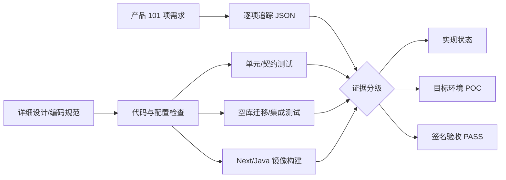

# 大模型安全护栏需求、设计、规范与代码完成度核对报告

> 版本：V1.0  
> 核对日期：2026-09-02  
> 核对范围：产品需求报告、技术实现设计、01～05 升级文档、101 项追踪矩阵、源码、迁移、测试、部署资产和本地运行证据  
> 结论口径：实现、验证、POC、目标环境验收和第三方认证分别判定

## 1. 执行摘要

本轮核对否定了“文档任务表全部完成即产品开发全部完成”的推断。原 V2.1 进度把多模态编排器写成完整 Worker、把静态部署资产写成 HA 已完成、把 Java 结构测试写成 gRPC 运行实现，完成度存在偏高。

经代码补强和真实验证后，仓库已经达到“可继续集成和目标环境 POC 的工程基线”，但尚未达到招标项目最终交付状态。主要原因不是单一代码缺陷，而是以下四类条件仍未闭环：

1. 真实多模态分析器、模型权重、许可证和专项数据集未提供；
2. 客户 IdP、PKI、SOC、信创硬件和网络拓扑未接入；
3. 性能、可用性、灾备、国密、等保/密评必须在目标环境执行；
4. 101 项均缺少不可覆盖的目标环境签名证据。

## 2. 核对方法

核对遵循以下规则：

- 路由、类型或任务表存在，只证明“有代码映射”；
- Mock/单元测试通过，只证明受控输入下的行为；
- 空库迁移、镜像构建和本地集成属于工程验证；
- 外部模型、硬件、IdP、SOC 和 PKI 必须真实联调；
- 性能、效果、HA、灾备和合规结论必须附目标环境签名证据。

## 3. 文档与代码偏差

| 编号 | 文档陈述/隐含结论 | 代码事实 | 修正 |
|---|---|---|---|
| GAP-001 | R2 文图/音视频 Worker 代码完成 | Worker 是 TypeScript 编排器，实际请求外部分析器；仓库无 Python 服务、OCR/VLM/ASR/FFmpeg 沙箱和权重 | MM-001～007 改为 `ORCHESTRATION_ONLY_EXTERNAL_ANALYZER_REQUIRED` |
| GAP-002 | Java 网关只有结构/影子描述 | 已实现 grpc-java 服务、拦截器、映射、启动生命周期和 TLS 配置 | 补齐 Protobuf 服务并完成镜像内 5/5 测试 |
| GAP-003 | Java 使用 Gradle | 仓库真实构建为 Maven | 04 文档改为 Maven 3.9.12 + `mvn verify` |
| GAP-004 | 最终 CI 包含 `format:check`、契约、集成命令 | 原仓库无 format/contract/integration 脚本 | 增加 contract、真实 PostgreSQL integration；删除虚假 format 命令 |
| GAP-005 | TS/lint/build 可并行 | `ts-check` 与 `next build` 共享 `.next/types`，并行读取中间态会偶发失败 | 规范要求串行 |
| GAP-006 | 内容标识覆盖所有模态 | 当前只实现文本标签及签名元数据 | OUT-008、DAT-007 改为文本完成、媒体待实现 |
| GAP-007 | 审计“代码完成” | 原实现缺防篡改链、可靠外发和报告 | 已补哈希链、Outbox、Kafka/Syslog、报告；可信时间仍待接入 |
| GAP-008 | 策略生命周期完成 | 原状态缺测试证据门槛、异人审批和不可变迁移记录 | 已补严格状态机；目标数据库和真实灰度仍待 POC |
| GAP-009 | Provider 支持 Coze | 代码没有可用 Coze 适配器 | 删除虚假类型；`custom` 限定 OpenAI-compatible |
| GAP-010 | 禁止生产 console 已满足 | ESLint 未配置 no-console，遗留代码仍有多处调用 | 删除记录用户原文的高危日志；其余纳入递减治理 |
| GAP-011 | 关键模块覆盖率 90%/85% | 当前没有 coverage provider 和阈值报告 | 保持 P1，未伪造达标 |
| GAP-012 | Helm 已完成 gRPC/mTLS 接入 | 镜像暴露 9090，但 chart 未决定 TLS 终止位置 | 等待 mesh h2c 或应用 pass-through 方案决策 |

## 4. 已实现能力

### 4.1 接入与判定

- REST 接口统一认证、授权、Schema、限流、CSRF、Problem Details、审计；
- Guard v1 JSON Schema/TypeScript/Protobuf 由同一真源生成并做兼容性检查；
- Java 21 网关具备 REST、gRPC、认证上下文拦截、Decision 映射、bulkhead 和 TLS 配置；
- GuardEngine V2、确定性 Decision、无策略失败、RE2 安全正则、流式提交门和路由状态机已经具备测试。

### 4.2 身份、数据与审计

- bcrypt cost 12、失败锁定、90 天过期、密码历史、token version、强制改密和会话撤销；
- 三员分立权限、本地租户/应用作用域、服务凭据白名单；
- 数据最小化、AES-256-GCM Secret、出域 allowlist、数据库 TLS 验证；
- 审计 HMAC 哈希链、追加写数据库触发器、校验、留存、双人导出审批；
- 审计报告、Syslog/Kafka TLS 外发、事务 Outbox、抢占锁、重试和终态告警。

### 4.3 治理工作流

- 策略包签名、评测门槛、异人审批、影子、灰度、激活、回滚、紧急撤回和归档；
- 事件待研判、处理中、误报、已阻断、已整改、已关闭状态与 SLA/责任人；
- GB/T 43697、JR/T 0197 数据分类分级目录及版本历史；
- 文本生成内容显式标识、签名元数据、校验和豁免期限；
- RAG 五阶段编排、Tool/MCP 参数 PEP、双人审批和结果再围栏的确定性框架。

## 5. 真实验证证据

| 证据 | 结果 | 能证明 | 不能证明 |
|---|---|---|---|
| `pnpm validate` | 51 文件、175/175 | 契约、类型、lint、单元/边界行为 | 真实外部依赖、效果和容量 |
| `pnpm build` | 75 路由生成 | Next.js 生产编译 | 生产长期稳定性 |
| Java Docker build | Maven verify 5/5 | gRPC/映射/舱壁代码可编译打包 | 目标网络/mTLS/200QPS |
| PostgreSQL 空库集成 | 2 基础脚本+23 迁移，7 关系及 2 类断言 PASS | 迁移顺序、租户 FK、append-only | 生产存量回填、备份恢复 |
| `acceptance:trace` | 101/101 | 需求唯一映射、状态可审计 | 验收 PASS |
| k6/POC/DR 脚本 | Harness ready | 可执行框架 | 未执行的指标结果 |

## 6. 剩余研发与验收计划

### 6.1 P0：上线阻断项

| 工作包 | 输入前提 | 研发内容 | 完成证据 |
|---|---|---|---|
| WP-P0-01 多模态分析域 | 选定 OCR/VLM/ASR、模型权重、许可证、GPU/NPU | Python/原生沙箱、文件解码、OCR/视觉/ASR、扰动多视图、时间线结果契约、资源隔离 | 恶意文件、无文字图、图文协同、噪声音频、闪帧视频专项集签名结果 |
| WP-P0-02 gRPC 生产入口 | TLS 终止方案、域名、证书、mesh/ingress | Helm Service/Route、mTLS、证书轮换、deadline、健康和 NetworkPolicy | 客户网段调用、证书失败负向、取消、20QPS 影子报告 |
| WP-P0-03 统一身份 | IdP 元数据、Claims、组织树、MFA/离职事件 | OIDC/SAML、Claims 映射、会话/远程策略、应急账号流程 | 登录/MFA/禁用/跨组织越权测试 |
| WP-P0-04 效果验收 | 2000 黑样本+2000 白样本、保险数据、授权和 hash | 冻结数据集、校准阈值、盲测、误漏报分析 | 指标达到招标门槛、结果不可覆盖并签名 |
| WP-P0-05 容量与可用性 | 目标集群/模型/流量画像、故障注入授权 | 20/200QPS、3000 会话、长稳、扩缩、单点/跨区、RPO/RTO | Prometheus/trace/资源/故障时间线和签名报告 |

### 6.2 P1：完整产品项

| 工作包 | 内容 | 验收 |
|---|---|---|
| WP-P1-01 媒体内容标识 | 图片可见水印+元数据、音视频声明/容器元数据、转码传播验证 | 覆盖支持格式与去标识攻击 |
| WP-P1-02 研判控制台 | 四模块展示、责任人/SLA、状态流转、证据导出、权限 | 三员权限和端到端 UI 测试 |
| WP-P1-03 误报学习 | 白样本向量库、租户隔离、审批、泛化、撤销和回归 | 不得产生跨租户/强规则放行 |
| WP-P1-04 审计可信时间 | TSA/可信时间、时间源健康、校验和密钥托管 | 篡改/断时/换钥演练 |
| WP-P1-05 SDK | Java/Python/Go SDK、重试/幂等/流式/错误码、版本退役 | Consumer contract 和示例应用 |
| WP-P1-06 质量治理 | coverage 90%/85%、遗留 console 递减、SAST/SCA/许可证闭环 | CI 强制且不可跳过 |

## 7. 必须由项目方确认的决策

1. gRPC TLS 在 service mesh/Ingress 终止后以 h2c 转发，还是直接 pass-through 到 Java 应用终止 mTLS；
2. OCR、VLM、ASR、视频解码的产品/开源模型、版本、许可和信创推理后端；
3. 企业 IdP 协议、MFA 方式、组织/角色 Claims 和应急账号审批平台；
4. 审计“内容检索”与“默认不留原文”的合规边界，包括审批、加密域和保留期；
5. 可信时间源/TSA、KMS/HSM、SOC Kafka/Syslog 端点；
6. 目标信创硬件、OS、数据库、中间件和版本；
7. 盲测样本、性能流量画像、可用性和灾备故障注入窗口。

在这些输入提供前，相关状态保持待外部集成/POC/验收，不以 Mock 或静态配置代替。

## 8. 最终完成判定

只有以下条件同时满足，项目才可从“工程基线”升级为“全部开发和验收完成”：

- 101 项需求全部具有唯一版本、测试、环境、数据摘要和签名证据；
- 所有 AI 应用流量不可绕过统一围栏，REST/gRPC/流式路径行为一致；
- 文本、图片、音频、视频、RAG 和 Tool 场景均使用真实模型/服务完成盲测；
- 客户 SSO/MFA、PKI/KMS、SOC、组织权限和审计取证端到端通过；
- 目标信创环境下效果、P99、吞吐、资源、99.99%、RPO/RTO 达标；
- 国密、等保/密评、安全评估和供应链证据形成批准闭环。
