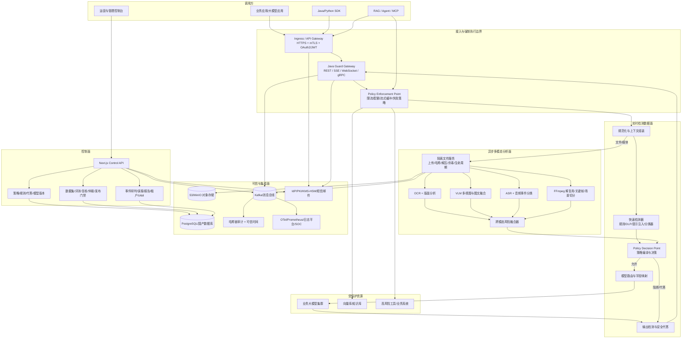
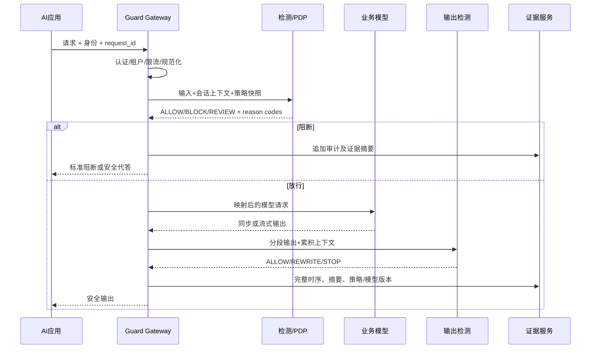

# 未实现功能与问题修复详细设计方案

> **执行更新（V1.1，2026-09-02）：** 本文保留为设计基线；已实施项、剩余缺口和
> 验证结果以 `10_研发执行与验收状态报告_V1.1.md` 为准。

> 版本：V1.0  
> 编制日期：2026-09-02  
> 需求基线：`输出/大模型安全围栏产品详细需求分析报告_V1.0.md`  
> 设计基线：`输出/大模型安全围栏平台详细技术实现设计_V1.0.md`  
> 核对依据：`输出/代码分析与升级/07_附件功能性能逐条核对与全面自动化测试报告.md`  
> 逐项依据：`acceptance/generated/coverage-audit.json`

## 1. 设计结论

当前系统不是从零开始：REST/SSE/gRPC 契约、策略执行、审计链、异步任务、基础控制台、Kubernetes、数据库迁移及自动化测试已经形成工程基线。但附件要求的是可在保险生产环境落地、不可绕过、支持多模态和信创部署，并可用签名证据证明性能与合规指标的完整产品。

修复不能只继续增加页面或规则。必须同时完成以下四条主线：

1. 把 Java 安全网关建设为唯一生产数据面，并从网络上消除业务应用直连模型的路径；
2. 把当前“调用外部 Analyzer 的编排 Worker”升级为可交付的 OCR/VLM/ASR/视频分析服务；
3. 把策略、样本、模型、误报、审计、报告和发布门禁串成运营闭环；
4. 在目标信创环境用冻结数据集和不可覆盖证据执行效果、性能、可用性和安全验收。

所有 `PARTIAL`、`HARNESS_ONLY`、`NOT_IMPLEMENTED` 项均按本方案修复。`CODE_IMPLEMENTED_ACCEPTANCE_PENDING` 项不重复造轮子，只补真实集成和验收证据。

## 2. 根因分析

| 根因 | 现状表现 | 设计纠正 |
|---|---|---|
| 工程骨架与产品能力混用 | 有接口、表和测试路径即被早期文档描述为“完成” | 四级状态模型：代码实现、集成通过、目标 POC、签名验收 |
| 外部 Analyzer 被当作内置能力 | Worker 负责编排，却没有 OCR/VLM/ASR/FFmpeg 推理服务 | 新增独立 media-analyzer，交付模型、沙箱、格式处理和效果测试 |
| 控制面与数据面边界不严格 | TypeScript 和 Java 均存在 Guard 路径，gRPC TLS 终止未冻结 | Java 网关为唯一生产入口；TypeScript 仅做控制面和兼容适配 |
| 依赖声明替代真实集成 | SSO、PKI、KMS、SOC、短信邮件仅有配置或接口 | 每种依赖定义适配器、契约测试、联调 POC 和降级策略 |
| 没有真实验收输入 | 4000 盲测样本、目标模型、硬件和监控数据缺失 | 输入清单前置；缺输入只能标记 `BLOCKED_EXTERNAL` |
| 运营闭环不完整 | 误报、复核、仲裁、A/B、报告、回归之间未闭环 | 引入版本化样本集、复核任务、发布门禁、回滚与证据包 |
| 兼容抽象代替信创适配 | 容器可运行不等于国产软硬件兼容 | 以同一镜像/制品在实机矩阵执行功能、性能、故障和升级测试 |

## 3. 目标总体架构



### 3.1 不可绕过原则

- 业务应用所在网络域不得直接访问业务模型、向量库或高风险工具，只允许访问 Guard Gateway；
- 模型服务 NetworkPolicy/安全组只接受 Guard Gateway 的服务身份；
- RAG 检索结果和 Tool/MCP 返回值必须以 `untrusted_external_content` 标记重新进入检测链；
- 控制台只配置策略，不承载高吞吐推理；生产数据面不依赖控制台可用性；
- 每个请求使用同一 `trace_id` 串联输入、媒体、检索、工具调用、模型输出和最终处置；
- 流式响应在判定窗口内先缓冲后放行，命中高危后立即截断并记录已发送字节数。

### 3.2 gRPC TLS 决策

生产采用“入口透传、网关终止”的双向 TLS：

1. Ingress 以 TCP/HTTP2 透传 9090，不在入口解密；
2. Java Gateway 持有由企业 PKI 签发的服务端证书，校验调用方客户端证书；
3. SPIFFE ID 或证书 SAN 映射 `tenant_id/application_id`，并与 JWT Claims 交叉校验；
4. Gateway 到模型、Analyzer、Kafka 和数据库继续使用独立 mTLS/TLS；
5. 证书从 KMS/Secret CSI 挂载，支持双证书重叠轮换；私钥不得进入镜像或 Git。

若目标 Ingress 不支持 TCP 透传，允许入口终止后到 Gateway 二次 mTLS，但必须保留原始客户端身份并通过防篡改头传递，且该头只能由 Ingress 写入。

## 4. 实时请求处理设计



### 4.1 统一决策对象

所有模态和检测器返回同一结构，避免各模块自行解释风险：

```json
{
  "trace_id": "uuid",
  "tenant_id": "tenant-a",
  "stage": "INPUT|RETRIEVAL|TOOL|OUTPUT",
  "action": "ALLOW|BLOCK|REVIEW|REWRITE|DEFER",
  "risk_level": "LOW|MEDIUM|HIGH|CRITICAL",
  "risk_codes": ["PROMPT_INJECTION.INDIRECT"],
  "detector_results": [
    {
      "detector": "text-injection-v3",
      "model_version": "sha256:...",
      "score": 0.996,
      "spans": [{"start": 12, "end": 30}],
      "evidence_refs": ["ev_..."]
    }
  ],
  "policy_version": "pol_17",
  "latency_ms": 43,
  "degraded": false
}
```

### 4.2 失败安全矩阵

| 失败点 | 低风险查询 | 中风险/含文件 | 高风险工具/写操作 | 审计要求 |
|---|---|---|---|---|
| 快速检测器超时 | 按租户策略 fail-open，可限长 | fail-close 或转人工 | fail-close | 记录超时、策略和降级原因 |
| Analyzer 不可用 | 不涉及媒体时继续 | 文件隔离，返回待处理 | 阻断 | 记录任务、重试和死信 |
| PDP/策略缓存异常 | 使用最后签名快照 | 使用最后签名快照 | 无快照则阻断 | 记录快照版本 |
| 审计主存储异常 | 写本地加密 WAL/Outbox | 同左 | 缓冲耗尽后阻断 | 恢复后按序补写 |
| Kafka/SOC 异常 | Durable Outbox 重试 | 同左 | 同左 | 不丢事件，告警积压 |
| 业务模型超时 | 返回标准错误 | 同左 | 同左 | 不伪造成安全阻断 |
| KMS/密钥不可用 | 已缓存短期 DEK 可继续 | 不生成新 DEK 时阻断上传 | 阻断 | 禁止明文回退 |

## 5. 分域修复设计

### 5.1 接入、协议与网关

覆盖：ACC-001～007、INT-001～005。

- 在 Java Gateway 完成 OpenAI 兼容 REST、SSE、WebSocket 和 gRPC 的等价语义；四种协议共用同一 Guard 核心，不复制策略逻辑；
- 引入版本化 `ProviderAdapter`，支持路由前缀、目标节点、权重、请求/响应 JSONPath 映射、thinking 字段和错误码映射；
- 提供 Java/Python SDK，内置重试幂等、流式中断、Trace 传播、证书轮换和批量检测；SDK 与 OpenAPI/Proto 从同一契约生成；
- 限流键至少包含租户、应用、用户、API、Token、并发、输入长度和文件容量；使用 Redis/兼容中间件实现集群一致配额；
- 接入模式包含强制代理、API 直检、异步批量和旁路审计。旁路模式不得标记为“阻断已生效”；
- 统一适配 AI 中台、短信邮件、监控/SOC、RAG、Agent 和两种目标大模型，真实端点通过 Secret 引用。

### 5.2 文本、推理攻击与输出安全

覆盖：IN-001～007、OUT-001～008。

- 检测流水线由规范化、精确规则、DLP、轻量分类器、语义分类器、跨轮状态机和策略融合组成；
- 规范化覆盖 Unicode、同形字、零宽字符、Base64/URL/HTML、重复压缩和可配置特殊编码；递归解码必须设置层数和膨胀比上限；
- 提示注入覆盖直接注入、角色扮演、系统提示窃取、越权指令、编码逃逸、多轮累积和有害推理链；
- 为会话维护风险状态，只存最小必要摘要和风险特征，检测“每轮无害、组合有害”；
- DLP 使用类型化实体、上下文置信度、校验位和租户词典，支持身份证、手机号、银行卡、保单号、客户号、健康/财务信息和商业秘密；
- 有害内容按附件 31 类标签和保险专项题库训练/评测，阈值必须由冻结盲测集确定，不能硬编码宣称准确率；
- 输出增加事实依据核验：引用存在性、来源授权、时效、数值一致性和知识库命中；无法证明时降级为“不确定”或安全代答；
- 生成内容标识覆盖文本水印/声明、图片元数据与可见标识、音视频片头/元数据。标识策略、算法版本和校验结果进入审计。

### 5.3 多模态 Analyzer

覆盖：MM-001～007，是本轮最重要的新增产品能力。

#### 5.3.1 服务边界

新增 `services/media-analyzer`，独立于控制台和网关部署。它不直接决定放行，只返回结构化观察，由 PDP 统一决策。

```protobuf
service MediaAnalyzer {
  rpc AnalyzeArtifact(AnalyzeArtifactRequest) returns (AnalyzeArtifactResponse);
  rpc GetAnalysis(GetAnalysisRequest) returns (AnalyzeArtifactResponse);
  rpc StreamAnalysis(StreamAnalysisRequest) returns (stream AnalysisEvent);
}

message AnalyzeArtifactRequest {
  string tenant_id = 1;
  string trace_id = 2;
  string artifact_uri = 3;
  bytes sha256 = 4;
  string media_type = 5;
  string policy_version = 6;
  repeated string requested_detectors = 7;
}
```

响应必须包含：任务状态、解析出的页/帧/时间段、OCR/ASR 文本及坐标、视觉标签、各变换视图结果、融合风险、模型/词表版本、耗时、资源、错误和证据引用。

#### 5.3.2 文件生命周期与沙箱

1. 网关只接受白名单 MIME 与扩展名组合，流式计算 SHA-256，不信任客户端 MIME；
2. 文件进入隔离桶，执行杀毒、压缩炸弹、嵌套层数、页数、分辨率、时长和容量校验；
3. 解析在无网络、只读根文件系统、非 root、CPU/内存/时限受控的 Sandbox Job 中进行；
4. 原文件、派生帧和文本按租户密钥加密，并按保留策略删除；失败中间件同样清理；
5. 每个派生物记录 `parent_hash`、`transform` 和 `tool_version`，形成可复现证据链。

#### 5.3.3 图片

- OCR：文本检测、方向校正、版面分析、字符识别和语言识别，保留 bounding box；
- 视觉：裸露、暴恐、违法物品、标识及附件规定类别的多标签分类；
- 混淆：对拆分重排、遮挡、旋转、马赛克、缩放、噪点和低对比度生成受控多视图，比较预测稳定性；
- 图文融合：将用户文本、OCR 区块、版面关系、视觉 embedding 和会话上下文送入融合器，检测跨模态补全指令；
- 容量：同步小图走低延迟路径，大文件/多页走异步任务；容量上限由策略配置并严格执行。

#### 5.3.4 音频

- 使用 FFmpeg 解码 MP3/WAV/AAC/FLAC/WMA，统一采样率，执行 VAD、分段、ASR 和说话人分离；
- ASR 文本进入文本检测，原始频谱进入音频事件/有害声音分类；
- 对音量、变速、倒放、噪声和超声/隐藏载荷做规范化及异常检测；
- 记录每段时间戳和置信度；最大 500MB，超限在上传阶段拒绝。

#### 5.3.5 视频

- 支持 MP4/AVI/MOV/WMV；最大 3GB；
- 解复用音轨并复用音频检测；按场景切分、固定间隔和风险自适应三种方式抽帧；
- OCR/VLM 对关键帧分析，时序融合检测短闪帧、遮挡和逐帧拼接；
- 任务必须支持断点、取消、幂等重试和进度回调，避免大文件重跑；
- 结果按 `start_ms/end_ms/frame_hash` 定位，支持审核人员回看证据片段。

### 5.4 RAG、Agent 与间接注入

覆盖：AGT-001～007。

- 为网页、邮件、Office/OFD/WPS/PDF、知识库片段建立统一 `ContentEnvelope`，包含来源、所有者、授权、检索分数、内容哈希和“不可信”标签；
- 在入库、检索后、上下文拼装后分别检测，避免恶意指令通过切块边界隐藏；
- 将“数据内容”和“系统指令”放入不同结构字段，不允许检索文本覆盖 system/developer 指令；
- Tool/MCP 调用执行参数级鉴权、JSON Schema 校验、目标白名单、最小权限凭证和结果再检测；
- 删除、转账、外发、修改客户资料等高风险动作要求二次确认或双人审批；
- 用真实网页、邮件、向量库、MCP 服务和业务沙箱执行端到端 POC；仅 Mock 不得通过。

### 5.5 策略、评测与运营闭环

覆盖：POL-001～008、EVAL-001～008、OPS-001～004。

- 策略对象显式包含作用域、父版本、优先级、条件、动作、阈值、例外、有效期、审批和回滚点；
- 语义规则生成只能生成草稿，必须经结构校验、冲突分析、样本回放和双人审批后发布；
- 建立代答资产库，按风险、渠道、用户类型、语言和监管场景选择，支持版本和灰度；
- A/B 使用确定性分桶，禁止同一会话跨版本；展示命中率、误报率、延迟和业务影响；
- 样本集支持来源、许可、标签、专家、仲裁、版本、哈希、冻结和月度更新；
- 4000 盲测样本在首次检测前冻结；检测后才能解封标签并计算混淆矩阵；
- 误报处理形成“事件 -> 复核 -> 建议 -> 回放 -> 审批 -> 灰度 -> 监控 -> 回滚”闭环；
- 向量泛化只用于发现相似样本，不能自动放白；任何放白需作用域、过期时间和回归门禁；
- 发布门禁同时检查准确率、召回率、精确率、误报率、延迟、资源、回归和安全扫描。

### 5.6 IAM、租户和组织

覆盖：IAM-001～007。

- 对接企业 OIDC/SAML，Claims 映射租户、机构、岗位、角色和数据范围；
- 控制台高权限角色强制 MFA；API 服务身份使用 mTLS/OAuth2 client credentials；
- 组织树支持总部/分支/部门继承与显式覆盖，查询使用数据库 RLS 和应用层授权双检查；
- 三权分立：系统管理员、策略管理员、安全审计员互斥；高风险操作双人审批；
- 离职/停用从 IdP 事件触发即时撤权，缓存令牌通过短 TTL 和撤销列表失效；
- 应急账号离线保管、双人启用、限时、强审计、使用后轮换；不得作为日常后门；
- 所有身份事件写入追加式审计，并验证跨租户对象 ID 无法越权访问。

### 5.7 数据、审计、可信时间与报告

覆盖：AUD-001～007、DAT-001～007、OBS-001～002。

- 延续现有 hash chain 和 append-only 约束，新增 RFC 3161 可信时间戳或企业时间戳服务适配器；
- 业务内容与索引分离：默认只存摘要和脱敏片段；需要 180 天内容检索时按合法依据、租户策略和密钥域保存；
- 检索索引必须随原文删除，备份使用 crypto-shredding 和到期副本清除证明；
- 密钥由 KMS/HSM 管理，支持 SM4/AES 数据加密、SM2/RSA 签名和 TLS/国密 TLS 适配；算法选择由部署配置决定；
- 数据谱系记录来源、处理器、模型、策略、派生物、去向和删除状态；
- 报告任务固化统计口径与时区，导出物带哈希、签名、数据区间和生成者；
- Kafka/Syslog Outbox 对接真实 SOC，至少一次投递，消费侧使用事件 ID 去重；
- OTel 采集入口、检测器、Analyzer、模型和存储跨度；Prometheus 采集 QPS/P99/错误/队列/CPU/内存/GPU/NPU。

建议新增或扩展以下数据对象：

| 对象 | 关键字段 |
|---|---|
| `analyzer_profiles` | tenant、detector set、model versions、resource class、timeout |
| `model_versions` | artifact digest、training/eval dataset digest、signature、status |
| `dataset_manifests` | source、license、frozen_at、content digest、blind label ref |
| `review_tasks` | event、assignee、decision、reason、arbitration、SLA |
| `false_positive_samples` | canonical hash、embedding ref、scope、expiry、approval |
| `evidence_timestamps` | audit head hash、TSA token、certificate chain、verified_at |
| `data_lineage_edges` | source object、derived object、processor version、operation |
| `integration_endpoints` | type、secret ref、TLS profile、health、last POC evidence |

### 5.8 信创、密码与供应链

覆盖：XIN-001～002、SEC-001～004。

- 同一版本至少验证两类国产 CPU、两种国产 OS、昇腾、三类国产数据库和招标指定中间件；
- 数据访问层禁止依赖 PostgreSQL 专属语法而无方言实现；迁移需在每种数据库执行；
- 推理运行时抽象 CUDA、CANN 和 CPU，模型制品记录算子兼容矩阵；
- 构建多架构镜像并使用 digest 部署；生成 SBOM/AI BOM、签名、漏洞报告和来源证明；
- 国密实现使用经批准的密码产品/模块，不自行实现密码算法；
- 等保、密评、渗透和代码审计问题进入统一整改台账，复测前不得关闭。

## 6. 接口、事件和证据契约

### 6.1 关键事件

所有事件使用 CloudEvents 风格封装，公共字段包括 `event_id`、`trace_id`、`tenant_id`、`occurred_at`、`producer`、`schema_version`、`payload_digest`、`classification`。

| 事件 | 生产者 | 消费者 | 关键语义 |
|---|---|---|---|
| `guard.decision.v1` | Gateway/PDP | 审计、SOC、指标 | 每阶段决策，不含非必要明文 |
| `artifact.accepted.v1` | 文件服务 | Analyzer | URI 为短期受限地址，绑定哈希 |
| `artifact.analysis.completed.v1` | Analyzer | PDP/控制台 | 结构化观察和模型版本 |
| `review.completed.v1` | 研判服务 | 评测/策略 | 人工结论、理由、仲裁 |
| `policy.published.v1` | 策略服务 | Gateway | 签名策略快照和生效时间 |
| `evidence.sealed.v1` | 证据服务 | 合规报告 | 审计头哈希和可信时间 |

### 6.2 幂等与重试

- 同一 `tenant_id + request_id` 产生同一逻辑结果，重复写不重复计费或创建事件；
- Analyzer 以 `artifact_sha256 + profile_version` 去重；
- Outbox 在数据库事务内写入，发送成功后仅更新投递状态；
- 重试使用指数退避和抖动；确定性格式错误直接进入死信；
- 死信重放保留原 event ID、失败原因和操作人，禁止覆盖原失败。

### 6.3 验收证据包

每个需求目录必须包含机器可读 `evidence.json`，至少绑定：

- requirement ID、执行命令、开始/结束时间；
- Git commit、工作区状态、镜像 digest、Helm/Kustomize 配置 digest；
- 数据集 manifest digest、模型/策略版本；
- 目标 CPU/OS/NPU/GPU/数据库/中间件版本；
- 原始结果路径、判分器版本、签名者和签名；
- 失败结果及复测链路。

缺任一关键绑定信息只能标记 `PENDING_EVIDENCE`，不得标记 PASS。

## 7. 性能、高可用与灾备设计

### 7.1 性能路径

- 快速路径只执行有界规范化、缓存策略、规则/DLP 和轻量分类器；重模型异步或按风险升级；
- 策略编译为不可变快照，本地热缓存，发布通过事件原子切换；
- SSE/WebSocket 使用背压和固定缓冲上限；禁止整段无限缓存；
- Analyzer 按 CPU/OCR、GPU/VLM、NPU/VLM、视频四类队列隔离，防止大视频拖垮文本路径；
- PostgreSQL 按租户/时间分区审计数据，对象内容不写数据库大字段；
- 关键 SLO：分类器 P99≤200ms、主链 P99≤300ms、单节点≥20QPS、集群≥200QPS、3000 会话、300 控制台用户、CPU≤80%、内存≤75%。

### 7.2 高可用

- Gateway/PDP/Control API 无状态多副本，跨故障域反亲和；
- PostgreSQL/国产数据库采用经厂商验证的高可用方案；Kafka/对象存储按生产级副本配置；
- PDB、readiness、startup probe、优雅下线和会话排空必须实测；
- 依赖熔断按租户/端点隔离，避免单一模型或 Analyzer 故障扩散；
- 用故障注入验证 Pod、节点、AZ、数据库主备、Kafka、KMS 和网络分区；
- 99.99%、RPO/RTO 只能依据观测窗口和演练报告认定。

### 7.3 性能报告判定

仓库已有统一性能要求和报告校验器。目标环境执行时必须同时提供：

- 黑白样本首次检测原始结果；
- k6/等价负载原始时间序列；
- Prometheus CPU/内存/GPU/NPU 查询结果；
- HPA/扩容事件、错误日志、会话隔离结果；
- 拓扑、全量策略、目标模型和配置 digest。

任何缩短时长、降低并发、关闭策略或更换轻量模型的结果不得用于正式验收。

## 8. 安全迁移与回滚

| 阶段 | 动作 | 退出条件 | 回滚 |
|---|---|---|---|
| M0 基线冻结 | 冻结契约、需求、数据集、拓扑和失败策略 | 关键决策签字，证据模板可校验 | 仅文档回退 |
| M1 影子接入 | Gateway 旁路观察真实流量 | 无敏感数据泄露，结果可追踪 | 移除镜像流量 |
| M2 小流量强制 | 低风险应用 1%～5% 强制 | 错误率、延迟、误报在门限内 | 路由切回旁路 |
| M3 分域扩展 | 文本、RAG、Agent、多模态依次启用 | 每域回归和 POC 通过 | 单域 feature flag |
| M4 全量生产 | 网络阻断模型直连 | 业务模型仅接受 Gateway 身份 | 恢复上一个签名策略/镜像 |
| M5 信创切换 | 同制品迁移目标软硬件 | 功能/性能/HA/数据一致性通过 | 数据库/流量双轨回退 |

数据库迁移遵循 expand-contract：先加字段/表和双写，再回填校验，最后停止旧读；禁止在同一版本直接删除旧列。策略、模型、数据集和 Analyzer Profile 均可按版本原子回滚。

## 9. 自动化测试与质量门禁

| 层级 | 必测内容 | 门禁 |
|---|---|---|
| 单元 | 规范化、规则、策略编译、映射、DLP、媒体采样 | 关键模块行覆盖≥90%、分支≥85% |
| 属性/模糊 | 编码、压缩、JSON、Proto、媒体解析、策略表达式 | 无崩溃、越界、无限循环 |
| 契约 | REST/SSE/WS/gRPC、SDK、事件 Schema、Provider | 向后兼容；破坏性变更需新版本 |
| 集成 | 数据库、Kafka、对象存储、KMS、IdP、Analyzer | 使用真实依赖容器或目标沙箱 |
| 安全 | 越权、租户隔离、SSRF、Zip Bomb、上传、Secret、供应链 | P0/P1 为零 |
| 效果 | 4000 盲测、31 类、保险题库、多语种、多模态 | 达到附件召回/精确/误报指标 |
| 性能 | P99、QPS、并发、资源、长稳、扩缩容 | 达到全部硬指标且无策略裁剪 |
| 韧性 | Pod/节点/AZ/依赖/KMS/数据库故障 | SLO、RPO、RTO 达标 |
| 验收 | 101 项证据校验 | 101/101 签名 PASS |

`console.log`、未处理 Promise、测试专用旁路和占位 Secret 均为发布门禁项。默认 Helm values 被生产校验器拒绝是正确行为，正式环境必须提供不可变镜像 digest 和真实 Secret 引用。

## 10. 实施前必须冻结的外部决策

以下输入不由仓库代码单方面决定，但都是完成验收的前置条件：

1. 目标 CPU、OS、昇腾型号、数据库、中间件、Ingress 和国密产品清单；
2. 企业 IdP、PKI、KMS/HSM、SOC、短信邮件和监控接口；
3. 两类业务大模型、RAG/向量库、Agent/MCP 和高风险工具测试沙箱；
4. 4000 盲测样本、31 类标签口径、保险专项题库和专家仲裁规则；
5. 内容留存合法依据、180 天检索边界、跨境/敏感数据规则；
6. 99.99% 统计口径、BIA、RPO/RTO、故障注入授权和两地三中心拓扑；
7. mTLS 终止、fail-open/fail-close、双人审批和应急账号策略。

输入缺失不阻止仓库内开发，但相应任务必须保持 `BLOCKED_EXTERNAL` 或 `PENDING_TARGET_POC`，不能通过模拟值关闭。

## 11. 完成定义

本修复方案只有在以下条件全部满足时才算完成：

- 101 项逐条证据均通过机器校验并由授权人员签名；
- `NOT_IMPLEMENTED=0`、`HARNESS_ONLY=0`、`PARTIAL=0`；
- 真实多模态 Analyzer、SSO/MFA、PKI/KMS/SOC、RAG/Agent 和信创适配完成；
- 4000 盲测、性能、长稳、故障注入、灾备、等保、密评和渗透测试达标；
- 生产网络证明业务应用不能绕过围栏直连模型/工具；
- 发布制品、配置、模型、策略、数据集和报告之间可追溯、可复现、可回滚。
