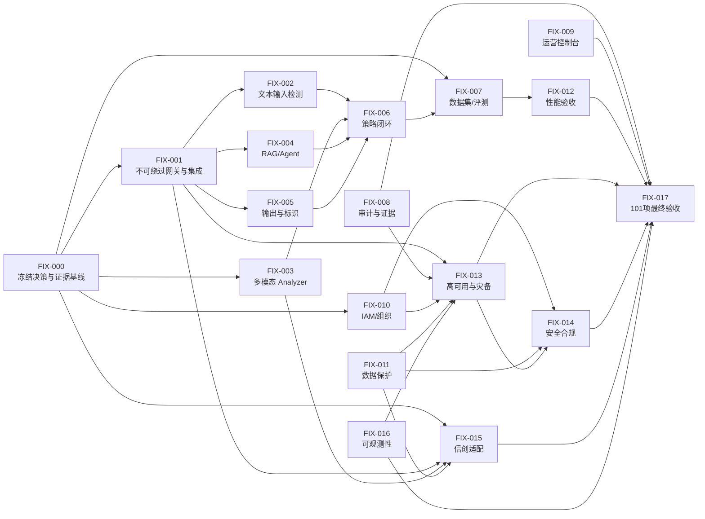

# 必须完成任务规划与验收清单

> **状态更新（V1.1，2026-09-02）：** 本文保留原始任务分解，初始数量已过期。
> 当前机器状态以 `acceptance/generated/coverage-audit.json` 为唯一事实源，
> 执行摘要见 `10_研发执行与验收状态报告_V1.1.md`。

> 版本：V1.0  
> 编制日期：2026-09-02  
> 适用范围：附件 101 项功能、性能、可用性、安全与信创需求  
> 修复设计：`输出/代码分析与升级/08_未实现功能与问题修复详细设计方案.md`  
> 动态状态源：`acceptance/generated/coverage-audit.json`

## 1. 计划原则

本计划覆盖附件全部 101 项，不把“代码路径存在”“测试脚本存在”或“外部接口已定义”当作任务完成。任务只有同时具备实现、自动化测试、真实集成、目标环境结果和签名证据时才可关闭。

状态定义：

| 状态 | 含义 |
|---|---|
| `READY` | 输入已具备，可直接研发 |
| `IN_PROGRESS` | 已开始但完成定义未满足 |
| `BLOCKED_EXTERNAL` | 缺客户数据、真实依赖、硬件、账号或授权 |
| `PENDING_TARGET_POC` | 代码/测试基本具备，等待目标环境验证 |
| `DONE_SIGNED` | 所有门禁通过且证据签名，唯一完成状态 |

截至本计划编制时，101 项最终验收均为 `NOT_ACCEPTED`；不得把下表任务状态理解为已经验收。

## 2. 总体依赖与关键路径



关键路径是：决策/数据冻结 -> 不可绕过接入 -> 检测能力 -> 策略与评测 -> 目标性能/可用性/安全/信创 -> 101 项签名验收。控制台页面可以并行建设，但不能替代该关键路径。

## 3. 101 项覆盖矩阵

| 任务包 | 覆盖需求 | 数量 | 当前起点 |
|---|---|---:|---|
| FIX-001 | ACC-001～007、INT-001～005 | 12 | 1 代码待 POC、11 部分 |
| FIX-002 | IN-001～007 | 7 | 7 部分 |
| FIX-003 | MM-001～007 | 7 | 7 未实现 |
| FIX-004 | AGT-001～007 | 7 | 7 代码待 POC |
| FIX-005 | OUT-001～008 | 8 | 8 部分 |
| FIX-006 | POL-001～008 | 8 | 1 代码待 POC、7 部分 |
| FIX-007 | EVAL-001～008 | 8 | 8 部分 |
| FIX-008 | AUD-001～007 | 7 | 2 代码待 POC、5 部分 |
| FIX-009 | OPS-001～004 | 4 | 4 部分 |
| FIX-010 | IAM-001～007 | 7 | 1 代码待 POC、6 部分 |
| FIX-011 | DAT-001～007 | 7 | 1 代码待 POC、6 部分 |
| FIX-012 | PER-001～006 | 6 | 6 Harness |
| FIX-013 | AVA-001～005 | 5 | 5 Harness |
| FIX-014 | SEC-001～004 | 4 | 4 Harness |
| FIX-015 | XIN-001～002 | 2 | 2 未实现 |
| FIX-016 | OBS-001～002 | 2 | 2 代码待 POC |
| **合计** | **ACC～OBS 全部需求** | **101** | **0 项最终验收** |

FIX-000 是前置治理任务，FIX-017 是统一验收任务，不重复计算需求数量。

## 4. 任务包详细计划

### FIX-000 冻结决策、环境与证据基线

| 属性 | 内容 |
|---|---|
| 优先级/状态 | P0 / `BLOCKED_EXTERNAL` |
| 依赖 | 无 |
| 内部责任 | 产品负责人、架构、安全、测试、运维 |
| 外部责任 | 客户业务、安全、基础设施、采购/厂商 |
| 必需输入 | 目标软硬件矩阵、4000 盲测、31 类口径、保险题库、IdP/PKI/KMS/SOC、目标模型/RAG/Agent、BIA 和注入授权 |
| 交付物 | 冻结的需求 manifest、目标拓扑、数据集 digest、接口清单、责任矩阵、失败策略、签名与证据规则 |
| 自动化 | `pnpm acceptance:trace`、`pnpm acceptance:audit`、数据集 manifest/hash 校验 |
| DoD | 所有外部输入有责任人和可用地址；盲测标签在首次检测前密封；变更需走基线审批 |

未完成 FIX-000 时可以开发接口和本地实现，但不得执行或宣称正式效果、性能与信创验收。

### FIX-001 不可绕过网关、协议和企业集成

| 属性 | 内容 |
|---|---|
| 覆盖 | ACC-001～007、INT-001～005 |
| 优先级/状态 | P0 / `IN_PROGRESS` |
| 依赖 | FIX-000 的 gRPC TLS、身份、目标模型和集成清单 |
| 内部责任 | Gateway、平台、集成、DevOps |
| 外部输入 | DNS/证书、IdP、AI 中台、短信邮件、监控/SOC、两类模型端点 |
| 交付物 | REST/SSE/WS/gRPC 等价实现、Provider 映射、Java/Python SDK、配额、批量/旁路、网络隔离、真实集成适配器 |
| 自动化 | `pnpm test:contract --run`、Gateway Maven verify、SDK 契约、NetworkPolicy 负向测试、端到端 Trace 测试 |
| DoD | 四协议同一 Trace 和决策；未授权/越权/过期拒绝；两类模型无需改业务代码接入；业务 Pod 直连模型失败；真实集成 POC 证据签名 |

细分任务：

1. FIX-001-A：WebSocket 与流式中断语义；
2. FIX-001-B：请求/响应/thinking 字段映射与加权路由；
3. FIX-001-C：mTLS、OAuth2/JWT、API Key 和服务身份；
4. FIX-001-D：租户/应用/用户/API/Token/并发/容量集群限流；
5. FIX-001-E：代理、直检、批量、旁路和 Java/Python SDK；
6. FIX-001-F：AI 中台、消息、监控/SOC、RAG/Agent/模型适配；
7. FIX-001-G：NetworkPolicy、安全组和模型服务身份白名单。

### FIX-002 文本、编码、DLP 与推理攻击检测

| 属性 | 内容 |
|---|---|
| 覆盖 | IN-001～007 |
| 优先级/状态 | P0 / `IN_PROGRESS` |
| 依赖 | FIX-000 数据口径，FIX-001 实时入口 |
| 内部责任 | 算法、安全研究、平台 |
| 外部输入 | 多语种/方言样本、保险敏感实体词典、攻击题库 |
| 交付物 | 规范化/解码器、提示注入分类器、跨轮状态机、DLP 检测器、文档提取器、效果报告 |
| 自动化 | 单元/属性/模糊测试、恶意编码回归、会话组合测试、盲测判分 |
| DoD | 覆盖全部附件手法；递归解码有资源上限；DLP 可定位/脱敏；跨轮攻击可阻断；效果指标达到附件门槛 |

细分任务：

1. FIX-002-A：中文、英文和指定方言/混写规范化；
2. FIX-002-B：Base64/URL/HTML/Unicode/同形字/零宽/特殊编码；
3. FIX-002-C：直接注入、角色扮演、越权和系统提示窃取；
4. FIX-002-D：多步骤有害推理和跨轮累积；
5. FIX-002-E：PII/保险/财务/健康/商业秘密 DLP；
6. FIX-002-F：Office/PDF/OFD/WPS/压缩包文本提取；
7. FIX-002-G：模型/规则融合、阈值校准和解释证据。

### FIX-003 多模态 Analyzer 产品化

| 属性 | 内容 |
|---|---|
| 覆盖 | MM-001～007 |
| 优先级/状态 | P0 / `READY`（实机效果阶段 `BLOCKED_EXTERNAL`） |
| 依赖 | FIX-000 模型/硬件/格式输入，FIX-011 对象存储与密钥 |
| 内部责任 | 多模态算法、后端、推理平台、安全 |
| 外部输入 | OCR/VLM/ASR 模型许可与权重、GPU/NPU、真实图片/音视频数据 |
| 交付物 | `media-analyzer` 服务、Sandbox、OCR/VLM/ASR/FFmpeg、跨模态融合、格式/容量处理、模型卡 |
| 自动化 | gRPC 契约、媒体语料回归、变换鲁棒性、Zip Bomb/畸形媒体模糊测试、大文件断点与清理测试 |
| DoD | 图片文字+视觉、图文协同、音频、视频、混淆和间接指令全部真实推理；500MB/3GB 边界有效；无网络沙箱；目标模型效果签名 |

细分任务：

1. FIX-003-A：Artifact API、隔离桶、杀毒、哈希与生命周期；
2. FIX-003-B：OCR/方向/版面/多语言与坐标；
3. FIX-003-C：视觉有害内容分类；
4. FIX-003-D：旋转/遮挡/马赛克/噪声/重排多视图；
5. FIX-003-E：文本+OCR+视觉+会话跨模态融合；
6. FIX-003-F：音频解码、VAD、ASR、说话人和事件分类；
7. FIX-003-G：视频解复用、场景切分、关键帧、时序融合和断点。

### FIX-004 RAG、Agent、MCP 间接注入与高风险工具

| 属性 | 内容 |
|---|---|
| 覆盖 | AGT-001～007 |
| 优先级/状态 | P0 / `PENDING_TARGET_POC` |
| 依赖 | FIX-000 真实端点，FIX-001 PEP，FIX-002 检测器 |
| 内部责任 | Agent/RAG、平台、安全测试 |
| 外部输入 | 网页/邮件/知识库、向量库、MCP、高风险业务沙箱 |
| 交付物 | ContentEnvelope、三阶段 RAG 检测、Tool 参数鉴权、二次确认/双人审批、端到端 POC |
| 自动化 | 恶意网页/邮件/切块、检索污染、Tool 参数越权、SSRF、结果注入、撤销测试 |
| DoD | 入库/检索/拼装均检测；外部内容不能改变系统指令；高风险动作未经授权不能执行；7 项真实 POC 签名 |

### FIX-005 输出检测、事实核验、安全代答和内容标识

| 属性 | 内容 |
|---|---|
| 覆盖 | OUT-001～008 |
| 优先级/状态 | P0 / `IN_PROGRESS` |
| 依赖 | FIX-002、FIX-003、FIX-006、目标知识库 |
| 内部责任 | 算法、知识工程、平台、前端 |
| 外部输入 | 31 类与保险题库、授权知识源、媒体标识标准 |
| 交付物 | 31 类输出分类、保险专项策略、事实依据核验、流式截断、代答库、文本/图像/音视频标识 |
| 自动化 | 输出题库、引用/数值一致性、流式跨块、代答快照、标识可验证性与去除鲁棒性 |
| DoD | 有害输出不泄漏；截断无残留；依据不足按策略降级；各模态标识可查验；误报/漏报达到附件要求 |

### FIX-006 策略全生命周期与安全发布

| 属性 | 内容 |
|---|---|
| 覆盖 | POL-001～008 |
| 优先级/状态 | P0 / `IN_PROGRESS` |
| 依赖 | FIX-001～005 的统一决策和检测器 |
| 内部责任 | 策略平台、前端、安全运营 |
| 外部输入 | 组织继承规则、审批人、默认/例外/应急策略 |
| 交付物 | 作用域/继承/冲突、语义草稿、代答资产、A/B、影响分析、审批、灰度、回滚 |
| 自动化 | 状态机、越权发布、冲突检测、确定性分桶、历史回放、回滚一致性 |
| DoD | 未审批版本不可生效；语义生成不得自动发布；同会话版本稳定；旧版本一键恢复；策略快照签名且数据面可验证 |

### FIX-007 数据集、评测、复核、仲裁与门禁

| 属性 | 内容 |
|---|---|
| 覆盖 | EVAL-001～008 |
| 优先级/状态 | P0 / `BLOCKED_EXTERNAL` |
| 依赖 | FIX-000 冻结样本，FIX-002～006 候选版本 |
| 内部责任 | 测试、算法评测、安全运营 |
| 外部输入 | 2000 黑+2000 白盲测、专家、仲裁规则、月更样本 |
| 交付物 | 数据集注册/版本/密封、评测作业、混淆矩阵、复核/仲裁、报告、月更和发布门禁 |
| 自动化 | manifest/hash、盲标签密封、重复/泄漏检测、指标复算、报告签名、失败不可覆盖 |
| DoD | 首次检测前标签不可见；黑样本阻断≥99%、召回/精确≥95%；白样本误报≤1%；报告可从原始结果复算 |

必须保留低置信度、分歧样本和历史失败。任何调参使用过的样本不得继续作为盲测集。

### FIX-008 全链路审计、可信时间、检索与 SOC

| 属性 | 内容 |
|---|---|
| 覆盖 | AUD-001～007 |
| 优先级/状态 | P0 / `IN_PROGRESS` |
| 依赖 | FIX-000 TSA/SOC，FIX-001 Trace |
| 内部责任 | 后端、安全、数据、集成 |
| 外部输入 | 企业可信时间服务、SOC/SIEM、内容留存审批 |
| 交付物 | 全阶段事件、hash chain、TSA、内容/摘要检索、定时报表、Kafka/Syslog Outbox |
| 自动化 | append-only、断链检测、TSA 验签、180 天边界、Outbox 重试/去重、SOC 真实接收 POC |
| DoD | 输入至输出/工具完整时序；篡改可检出；报告可签名复算；SOC 故障不丢事件；真实联调证据完成 |

### FIX-009 事件研判、误报治理和运营大屏

| 属性 | 内容 |
|---|---|
| 覆盖 | OPS-001～004 |
| 优先级/状态 | P1 / `IN_PROGRESS` |
| 依赖 | FIX-006、FIX-007、FIX-008 |
| 内部责任 | 前端、后端、安全运营、UX |
| 外部输入 | 运营流程、SLA、字段脱敏和数据范围 |
| 交付物 | 事件队列/详情/证据、复核仲裁、误报向量相似搜索、回放/发布/撤销、大屏时间范围 |
| 自动化 | RBAC/E2E、跨租户负向、键盘/可访问性、回放一致性、相似样本不得自动放白 |
| DoD | 研判到策略回归闭环；全过程审计；数据范围正确；撤销后效果可验证；统计口径和时区明确 |

### FIX-010 企业 IAM、组织树、三权分立和应急账号

| 属性 | 内容 |
|---|---|
| 覆盖 | IAM-001～007 |
| 优先级/状态 | P0 / `BLOCKED_EXTERNAL` |
| 依赖 | FIX-000 IdP/组织/角色决策 |
| 内部责任 | IAM、后端、前端、安全 |
| 外部输入 | OIDC/SAML、MFA、组织 Claims、离职事件、应急审批人 |
| 交付物 | SSO/MFA、组织同步、RBAC+数据范围、三权分立、即时撤权、双人应急账号、租户隔离 |
| 自动化 | 登录/Claims/撤销、角色互斥、IDOR、RLS、缓存失效、应急超时和审计 |
| DoD | 真实 IdP POC；高权 MFA；跨租户/跨机构不可访问；离职即时失效；应急账号双人限时且使用后轮换 |

### FIX-011 数据安全、密钥、删除、谱系和媒体标识

| 属性 | 内容 |
|---|---|
| 覆盖 | DAT-001～007 |
| 优先级/状态 | P0 / `IN_PROGRESS` |
| 依赖 | FIX-000 KMS/HSM 与留存决策 |
| 内部责任 | 数据、安全、平台、DBA |
| 外部输入 | KMS/HSM、密码产品、备份平台、数据分类分级 |
| 交付物 | TLS/国密 TLS、信封加密、字段脱敏、租户密钥域、删除/备份清理、谱系、全模态标识 |
| 自动化 | 密钥轮换、禁止明文回退、删除/索引/备份证明、脱敏不可逆、谱系完整性、标识验证 |
| DoD | Secret 不落库/镜像；KMS 故障按矩阵 fail-safe；删除覆盖派生物和到期副本；敏感字段全链加密/脱敏 |

### FIX-012 效果与性能正式验收

| 属性 | 内容 |
|---|---|
| 覆盖 | PER-001～006 |
| 优先级/状态 | P0 / `BLOCKED_EXTERNAL` |
| 依赖 | FIX-001～007、FIX-015、FIX-016 |
| 内部责任 | 性能测试、SRE、算法评测 |
| 外部输入 | 目标信创集群、4000 盲测、300 控制台账号、Prometheus、测试授权 |
| 交付物 | 黑白样本报告、分类器/主链 P99、单机/集群 QPS、30 分钟稳态、3000 会话、300 用户、资源报告 |
| 自动化 | `pnpm performance:validate-report <report> --mode release`、k6 脚本、Prometheus 导出、会话隔离校验 |
| DoD | 六项附件指标同时达标；全量策略开启；错误率≤0.1%；无扩容中断/会话串扰；报告绑定制品/配置/数据集/时间范围并签名 |

正式测试参数不得低于：分类器准确率 98% 且 P99≤200ms；主链 P99≤300ms；单机 20QPS、集群 200QPS、持续 1800 秒；3000 会话、300 控制台用户；CPU≤80%、内存≤75%。

### FIX-013 高可用、长稳、容灾与 RPO/RTO

| 属性 | 内容 |
|---|---|
| 覆盖 | AVA-001～005 |
| 优先级/状态 | P0 / `BLOCKED_EXTERNAL` |
| 依赖 | FIX-001、FIX-008、FIX-010、FIX-011、FIX-016、目标拓扑 |
| 内部责任 | SRE、DBA、平台、安全 |
| 外部输入 | 两地三中心/多 AZ、故障注入授权、备份集、BIA |
| 交付物 | HA 配置、长稳报告、故障注入、备份恢复、跨区演练、SLO/RPO/RTO 证据 |
| 自动化 | Pod/节点/AZ/数据库/Kafka/KMS/网络故障、数据一致性、恢复计时和审计连续性 |
| DoD | 99.99% 按冻结口径达标；单点故障不造成未授权放行；备份可恢复；RPO/RTO 达到附件；演练问题完成复测 |

### FIX-014 等保、密评、渗透和供应链整改

| 属性 | 内容 |
|---|---|
| 覆盖 | SEC-001～004 |
| 优先级/状态 | P0 / `BLOCKED_EXTERNAL` |
| 依赖 | FIX-010、FIX-011、FIX-013、正式部署 |
| 内部责任 | 安全、研发、运维、合规 |
| 外部输入 | 测评机构、批准范围、国密设备、渗透窗口 |
| 交付物 | 等保差距/测评、密评、渗透、SAST/SCA/SBOM/AI BOM、整改和复测报告 |
| 自动化 | `pnpm audit --prod --audit-level high`、Secret/IaC/镜像扫描、签名验证、攻击回归 |
| DoD | P0/P1 问题为零；其他问题有批准的处置；复测关闭；制品有 SBOM/AI BOM/签名/来源证明 |

### FIX-015 信创软硬件与数据库实机适配

| 属性 | 内容 |
|---|---|
| 覆盖 | XIN-001～002 |
| 优先级/状态 | P0 / `BLOCKED_EXTERNAL` |
| 依赖 | FIX-000 目标矩阵，FIX-001/003/011 可移植实现 |
| 内部责任 | 平台、DBA、推理、测试 |
| 外部输入 | 国产 CPU/OS/昇腾/数据库/中间件实机与厂商支持 |
| 交付物 | 多架构镜像、数据库方言/迁移、CANN 推理适配、20 项矩阵结果、问题补丁 |
| 自动化 | `pnpm compatibility:check`、每目标安装/迁移/功能/性能/升级/回滚流水线 |
| DoD | 招标 15 个必选目标均实机通过；至少两 CPU、两 OS、昇腾、三数据库使用同版制品；无硬编码硬件绑定；报告签名 |

### FIX-016 全链路可观测性与告警

| 属性 | 内容 |
|---|---|
| 覆盖 | OBS-001～002 |
| 优先级/状态 | P1 / `PENDING_TARGET_POC` |
| 依赖 | FIX-000 监控平台，全部数据面服务 |
| 内部责任 | SRE、平台、数据 |
| 外部输入 | Prometheus/OTel/日志平台/GPU-NPU 指标端点 |
| 交付物 | 跨 REST/SSE/WS/gRPC/Analyzer/模型 Trace、黄金指标、GPU/NPU/队列、SLO 和告警 |
| 自动化 | Trace 连通性、标签基数/PII 扫描、告警触发/恢复、仪表板和查询回归 |
| DoD | 每次决策可按 Trace 定位；指标不泄露敏感内容；目标 GPU/NPU 和依赖可观测；告警经过真实演练 |

### FIX-017 101 项最终自动验收与签署

| 属性 | 内容 |
|---|---|
| 覆盖 | 101 项统一收口 |
| 优先级/状态 | P0 / `BLOCKED_EXTERNAL` |
| 依赖 | FIX-001～016 全部达到候选完成 |
| 内部责任 | 测试负责人、产品负责人、架构、安全、交付 |
| 外部责任 | 客户验收组、测评机构、相关厂商 |
| 交付物 | 101 个证据目录、总报告、缺陷清零清单、发布制品和回滚包 |
| 自动化 | `pnpm validate`、`pnpm build`、数据库集成、镜像构建、`pnpm acceptance:audit`、POC、性能报告校验、证据签名校验 |
| DoD | `coverage-audit.json` 显示 101/101 `DONE_SIGNED`；0 pending；所有失败和复测链可查；客户授权人签署 |

## 5. 可立即执行与外部阻塞分组

### 5.1 仓库内可立即执行

- FIX-001-A/B/D/E：WS、映射、配额、SDK 与协议统一；
- FIX-002：文本检测增强和测试；
- FIX-003-A～G：Analyzer 服务、Sandbox 和模型适配框架，使用获批模型后完成本地基准；
- FIX-005：输出核验、流式截断、代答和媒体标识；
- FIX-006：策略继承、冲突、A/B、影响分析和 UI；
- FIX-008 的事件/报告/TSA 适配器主体；
- FIX-009：研判和误报闭环；
- FIX-011 的密钥抽象、删除/谱系和测试；
- 覆盖率、console、契约和安全质量门禁。

### 5.2 必须等待外部输入才能关闭

- FIX-000：全部正式验收输入；
- FIX-001-C/F/G：真实 PKI/IdP/集成端点和网络控制；
- FIX-003：模型权重、真实语料和 GPU/NPU 效果；
- FIX-004：真实 RAG/Agent/MCP/业务沙箱；
- FIX-007：4000 冻结盲测及专家仲裁；
- FIX-010：企业 IdP、组织、MFA；
- FIX-012～015：目标环境、故障授权、测评机构、信创实机；
- FIX-016：企业监控、GPU/NPU 和依赖指标；
- FIX-017：客户签署。

外部阻塞项必须在项目看板标明责任方、缺失输入和证据目录。不得用 Mock 截图、开发机结果或自签结论关闭。

## 6. 统一验收门禁

每个任务包依次通过以下门禁，失败即停止向下流转：

| Gate | 要求 |
|---|---|
| G0 需求 | ID、验收标准、责任、依赖、风险已冻结 |
| G1 设计 | 威胁模型、接口、数据、失败策略、回滚评审通过 |
| G2 代码 | 类型/lint/单测/覆盖率/契约通过，无占位和测试旁路 |
| G3 集成 | 使用真实依赖或获批等价沙箱，异常和降级已测试 |
| G4 效果 | 冻结盲测达标，原始输出可复算 |
| G5 性能/韧性 | 全量策略、目标拓扑、规定时长和并发达标 |
| G6 安全/合规 | 越权、租户、密钥、供应链、渗透/密评问题关闭 |
| G7 证据 | 绑定 commit、镜像、配置、模型、策略、数据集、环境和时间 |
| G8 签署 | 自动判分通过，授权人签名，失败历史不可覆盖 |

## 7. 缺陷优先级与停止发布规则

| 级别 | 示例 | 处置 |
|---|---|---|
| P0 | 可绕过围栏、跨租户、密钥泄露、恶意内容高概率放行、审计可删 | 立即停止发布/回滚 |
| P1 | 性能硬指标失败、媒体解析逃逸、SSO/MFA 缺失、RPO/RTO 失败 | 不得进入生产验收 |
| P2 | 非核心操作缺失、低风险兼容问题、报告展示偏差 | 进入版本前必须有批准计划 |
| P3 | 文案/轻微交互问题 | 不影响安全边界时可排期 |

以下情况无论缺陷数量均停止发布：默认生产配置含占位 digest/Secret；盲测标签泄漏；测试关闭检测器；网络仍可直连模型；审计失败被覆盖；目标环境与报告声明不一致。

## 8. 最终自动化执行清单

```powershell
pnpm acceptance:trace
pnpm acceptance:audit
pnpm validate
pnpm test:contract --run
pnpm build
pnpm acceptance:code
pnpm compatibility:check
pnpm performance:validate-report <目标环境报告> --mode release
```

还必须在 CI/目标环境执行：

1. 空数据库应用全部 schema/migration，并验证租户隔离、append-only、升级和回滚；
2. Java Gateway Maven verify 和 app/worker/gateway 多架构镜像构建；
3. Kustomize/Helm 生产值校验、签名/digest/Secret/NetworkPolicy；
4. 4000 盲测、31 类与保险题库、多模态/RAG/Agent 真实 POC；
5. 30 分钟性能、3000 会话、300 控制台用户、资源和扩缩容；
6. 长稳、故障注入、备份恢复、跨区和 RPO/RTO；
7. SAST/SCA/IaC/镜像/Secret、渗透、等保和密评；
8. 101 个证据包的 Schema、哈希、签名和需求映射复核。

## 9. 计划完成判据

“必须完成的任务规划完成”指本文件已将全部 101 项分配到可执行任务包、明确依赖、责任输入、交付物、自动化命令和 DoD。它不代表这些研发与外部验收任务已经完成。

产品研发真正完成的唯一判据是：

- FIX-001～016 全部达到 `DONE_SIGNED`；
- FIX-017 输出 101/101 签名 PASS；
- 任何代码、模型、策略、配置、数据集或环境变更都会使受影响证据自动失效并重新验收。
