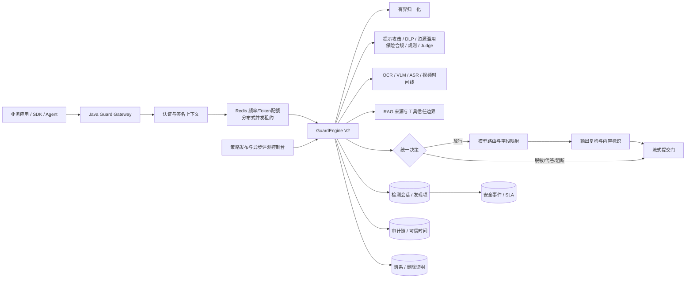

# 大模型安全护栏研发执行与验收状态报告

> 版本：V1.1  
> 冻结日期：2026-09-02  
> 需求基线：`输出/大模型安全围栏产品详细需求分析报告_V1.0.md`  
> 设计基线：`输出/大模型安全围栏平台详细技术实现设计_V1.0.md`  
> 动态逐条结论：`acceptance/generated/coverage-audit.md`

## 1. 执行结论

本轮已经完成代码库内可独立验证的一批 P0/P1 建设，并将原审计中的
`NOT_IMPLEMENTED=9` 降为 `NOT_IMPLEMENTED=0`。这不等于附件 101 项已经最终验收：
客户盲测数据、企业 IdP/PKI/KMS/TSA/SOC、真实模型与 RAG/Agent、目标信创软硬件、
故障注入和第三方测评报告均不在当前工作区内，不能用模拟结果代替。

最终机器审计状态如下：

| 结论 | 数量 | 当前含义 |
|---|---:|---|
| `CODE_IMPLEMENTED_ACCEPTANCE_PENDING` | 22 | 代码及本地自动化具备，等待真实依赖或目标环境 POC |
| `PARTIAL` | 64 | 已有部分代码，但仍缺实现、数据、模型校准或外部集成 |
| `HARNESS_ONLY` | 15 | 性能、可用性、安全测评框架具备，尚无目标环境结果 |
| `NOT_IMPLEMENTED` | 0 | 不再存在完全没有代码/框架映射的需求 |
| 正式验收通过 | 0 | 101 项均缺客户签名验收证据 |

所有 101 项实现与测试路径有效；“路径有效”只证明可追溯，不代表指标通过。

## 2. 已落地的关键能力

### 2.1 生产数据面

- Java 安全网关支持 OpenAI 兼容 REST、SSE、WebSocket 和 gRPC。
- 请求上下文签名绑定租户、应用、主体、凭证、请求、Trace、会话和绝对截止时间。
- 支持 mTLS、API Key/JWT 边界、请求大小、字符、Token、频率与文件容量控制。
- 支持模型权重路由、请求/响应 JSON Pointer 字段映射和流式提交门。
- Java、Python、Go、TypeScript SDK 使用同一签名上下文契约。
- 新增租户、应用、主体、凭证、API 五级本地并发舱壁。
- 新增 Redis Lua 原子分布式并发租约，完成/异常/取消释放，进程故障由 TTL 回收，
  后端异常默认 fail-closed。

### 2.2 文本、多模态与 Agent 安全

- GuardEngine V2 实现 Unicode NFKC、零宽字符、URL、HTML 实体、Base64、Base32、
  Hex、转义码点、Quoted-Printable、ROT13、同形字符等有界归一化。
- 内置提示攻击检测覆盖直接覆盖、角色升级、提示词窃取、目标劫持、拒答抑制、
  对立响应、胁迫诱导、结构化策略伪装、间接注入和有害推理链。
- 内置结构化 DLP 覆盖身份证、银行卡、手机号、邮箱、保单号、客户号、健康、
  财务、商业秘密和凭证。
- 新增递归、组合穷举、超长输出等资源消耗攻击基线。
- 新增保险收益保证、虚假理赔承诺、健康告知规避、条款弱化和高压营销检测基线。
- 文档转换器不使用 Shell，限制工作目录、命令、超时和输出大小。
- Media Analyzer 具备 OCR、视觉分类、ASR、音频分类、视频抽帧/时间线、图像扰动视图
  和图文融合接口；目标模型效果仍待 POC。
- RAG 来源、切片、ACL、污染标记和检索审计，以及工具白名单、Schema、资源范围、
  高风险审批和返回结果复检已经形成闭环。

### 2.3 策略、评测与安全运营

- 策略包采用确定性编译、内容哈希和签名校验。
- 生命周期覆盖草稿、测试、审批、影子、灰度、激活、回滚、撤回和归档。
- 发布控制台强制创建者与审批者分离，并使用乐观锁。
- 异步评测控制台支持幂等提交、队列进度、重试历史、准确率/召回率/FPR/FNR/F1
  和 badcase 查看。
- 检测会话、发现项和自动安全事件在同一数据库事务内提交。
- 事件控制台支持 SLA、责任人、状态机、证据详情和完整流转时间线。

### 2.4 数据、审计与部署

- 审计链具备前序哈希、签名校验、追加写约束和独立验证脚本。
- 企业可信时间适配器校验 HTTPS、Nonce、摘要、签名、时间和证书指纹。
- 内容标识覆盖文本、图片、音频、视频的显式/隐式标识和一致性验证。
- 数据谱系覆盖模型输出、标识、媒体衍生物、文档图像、RAG 来源与切片。
- 数据库清理在事务内生成 HMAC 删除证明，明确区分数据库完成与外部存储待处理。
- Helm 已拆分数据面、控制面、媒体、推理、数据访问和可观测域，启用最小权限、
  不可变镜像、mTLS、NetworkPolicy、PDB、HPA 和可观测性资源。
- 新增 amd64/arm64 多架构镜像构建门禁，以及 RuntimeClass、节点选择、容忍度和亲和性
  调度抽象；昇腾覆盖文件仅为环境模板，不是互认证证明。

## 3. 更新后架构



关键安全边界：

1. 业务调用必须经网关，模型网络只允许网关身份访问。
2. 任何模型调用前必须同时通过配额、并发租约和输入检测。
3. SSE/WebSocket 内容在提交给客户端前经过输出分片检测。
4. 检测器失败按策略降级，必需检测器默认 fail-closed。
5. 原文不复制到安全事件；事件只保存必要摘要、哈希和关联标识。

## 4. 自动化验证结果

| 验证项 | 冻结结果 |
|---|---|
| 契约生成物 | 源哈希一致，Guard v1 对已接受基线向后兼容 |
| TypeScript / ESLint | 通过，零错误 |
| Vitest | 66 个测试文件、227 个用例全部通过 |
| Next.js 生产构建 | 通过，78 个页面完成生成/路由检查 |
| Java Guard Gateway | 61 个源码编译；25 个测试通过，0 失败 |
| Python SDK | 3 个测试通过 |
| Java SDK | 3 个测试通过 |
| Go SDK | Go 1.24 容器中通过 |
| Media Analyzer | 独立构建通过 |
| PostgreSQL 集成 | 29 个迁移；12 个关键关系；租户隔离、谱系约束、追加审计通过 |
| Helm | 基础清单、可信时间出口和昇腾调度覆盖均可渲染 |
| 兼容矩阵 | 20 个目标条目 Schema 有效；15 个仍为目标 POC |
| 需求审计 | 101/101 映射有效；0 项取得正式签名验收 |

数据库集成结果：

```json
{
  "status": "PASS",
  "migrations": 29,
  "requiredRelations": 12,
  "tenancyIsolation": "PASS",
  "dataLineageConstraints": "PASS",
  "appendOnlyAudit": "PASS"
}
```

## 5. 分域状态

| 域 | 总数 | 代码完成待验收 | 部分实现 | 仅 Harness |
|---|---:|---:|---:|---:|
| 接入 ACC | 7 | 3 | 4 | 0 |
| 输入 IN | 7 | 0 | 7 | 0 |
| 多模态 MM | 7 | 0 | 7 | 0 |
| Agent/RAG AGT | 7 | 7 | 0 | 0 |
| 输出 OUT | 8 | 1 | 7 | 0 |
| 策略 POL | 8 | 1 | 7 | 0 |
| 评测 EVAL | 8 | 0 | 8 | 0 |
| 审计 AUD | 7 | 3 | 4 | 0 |
| 运营 OPS | 4 | 2 | 2 | 0 |
| IAM | 7 | 1 | 6 | 0 |
| 数据 DAT | 7 | 2 | 5 | 0 |
| 集成 INT | 5 | 0 | 5 | 0 |
| 性能/可用性/安全 PER+AVA+SEC | 15 | 0 | 0 | 15 |
| 信创 XIN | 2 | 0 | 2 | 0 |
| 可观测 OBS | 2 | 2 | 0 | 0 |

逐条原因、路径和验收标准以机器生成的
`acceptance/generated/coverage-audit.md` 为准。

## 6. 尚未关闭的研发缺口

以下项目仍需要仓库内研发，不能归因于外部环境：

| 优先级 | 需求 | 剩余实现 |
|---|---|---|
| P0 | ACC-002 | 模型路由配置控制台、配置签名、网关热加载和失败回滚 |
| P0 | IN-003 | 语言识别、原语种审计、多语种/方言/文言文模型与校准 |
| P0 | IN-006 | ZIP/7z/RAR/TAR 有界递归解析、加密包隔离、Zip Bomb 防护 |
| P0 | OUT-001 | 31 类完整分类器/规则包及逐类可解释证据 |
| P0 | OUT-004 | 金融事实来源核验、冲突检测、置信度和转人工闭环 |
| P0 | POL-003/004/006/007 | 自然语言语义规则生成、上下文白名单、组织继承、图文代答库 |
| P0 | EVAL-004/005/008 | 文件/图文多轮样本、盲测复核仲裁、标准化报告导出 |
| P1 | OPS-001/003 | 跨域告警聚合、误报反馈到样本/规则/发布闭环 |
| P1 | AUD-001/002/005 | 全链路字段完整性、归档恢复、审计授权工作流 |
| P1 | DAT-006 | 数据集许可、标注版本和模型使用关系谱系 |

## 7. 必须由外部输入关闭的项目

| 输入 | 阻塞的验收 |
|---|---|
| 2000+ 黑样本、2000+ 白样本、31 类/保险专项标注和授权证明 | IN、OUT、MM、EVAL 的召回、误报和合格率 |
| 企业 IdP、MFA、组织树、三权角色和应急账号流程 | ACC-003、IAM-001～007 |
| 企业 PKI/KMS/国密/TSA/SOC/工单系统 | AUD、SEC、INT |
| 真实模型、OCR/VLM/ASR、RAG、MCP/Agent 服务地址和凭证 | MM、AGT、OUT-004、INT |
| 鲲鹏/飞腾/海光/兆芯、昇腾 910B/910C、麒麟/UOS | XIN、PER、AVA |
| 达梦/金仓/神通/GaussDB 版本、驱动、许可和测试实例 | XIN-001、数据迁移与性能 |
| 生产同构 Kubernetes、Redis、Kafka、对象存储、搜索和备份平台 | PER、AVA、DAT-005 |
| 故障注入窗口、压测窗口、第三方等保/密评/渗透机构 | PER、AVA、SEC |
| 客户验收人、证据签名密钥和批准流程 | 101 项最终关闭 |

## 8. 后续强制执行顺序

1. 冻结上述外部输入、数据哈希、目标版本和签名责任人。
2. 完成第 6 节剩余研发项，每项同时增加单元、契约、集成和回归测试。
3. 在目标环境执行 `acceptance/poc-manifest.json` 定义的 15 个 POC。
4. 执行效果、性能、72 小时长稳、故障注入、RPO/RTO、安全和信创互换测试。
5. 将原始结果、日志、Trace、配置摘要、镜像/模型/策略摘要写入对应证据目录。
6. 运行 `pnpm acceptance:trace` 和 `pnpm acceptance:audit`。
7. 只有客户验收签名完成后，才将单项状态改为 `DONE_SIGNED`。

当前可以进入“目标联调与剩余产品功能继续研发”阶段，不能进入“全部需求已完成验收”阶段。
