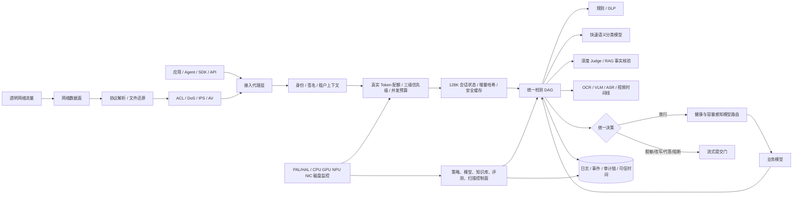

# 与 NSF AI 安全一体机 V3.0 白皮书的功能、性能差距及优化计划

> 版本：V1.0
> 核对日期：2026-09-03
> 对标文件：`C:\Users\ROG\Desktop\NSF-PROD-AI安全一体机-V3.0-产品白皮书.docx`
> 当前代码基线：`main@96f75b6`
> 结论口径：代码存在不等于产品可用，本地测试通过不等于目标环境验收通过。

## 1. 执行结论

当前项目已经不是简单演示原型。它具备较完整的 AI 护栏软件平台骨架，包括输入/输出检测、SSE/WebSocket/gRPC 接入、租户与应用隔离、API Key、配额与并发舱壁、模型路由、RAG/工具安全、策略包生命周期、审计链、事件处置、多语言 SDK、容器部署和验收证据框架。

但附件白皮书描述的是一台同时包含 AI 内容安全、算力调度、传统网络安全、硬件资源管理和模型安全评估的“安全一体机”。当前仓库更接近“AI 安全软件网关 + 管理控制台”，还不是与白皮书同形态、同能力边界的一体机。

最关键的差距不是页面数量，而是以下五条产品主链尚未闭合：

1. 生产网关实际调用的 GuardEngine V2 主要是正则、规则和启发式检测，没有接入白皮书所述的 BERT/Qwen 语义判别模型产品链。
2. 会话状态仅保存 4,096 字符尾部，流式检测窗口为 8,192 字符，不能支撑白皮书宣称的 128K tokens 对话记忆。
3. 差分隐私、加密计算、三级业务优先级、资源复杂度预测和面向用户组的差异化 TPM/RPM 没有完整实现。
4. IPS、AV、DoS/DDoS、ACL、透明代理、流量解析和会话加速等传统网络安全数据面基本缺失。
5. 目前没有目标环境效果和性能报告。白皮书的“敏感信息识别准确率超过 99%”和“毫秒级响应”均不能由现有单元测试或判分器证明。

建议采用双版本路线：

- **版本 A：AI 安全软件网关版**。用 12 至 16 周完成生产检测主链、128K 上下文、真实语义模型、配额/优先级、路由控制面和效果性能验收。该版本与当前代码形态一致，风险可控。
- **版本 B：AI 安全一体机版**。在版本 A 上增加透明代理、协议与流量解析、IPS/AV/DoS 数据面、硬件抽象、GPU/NPU 调度和设备级运维。完整对标预计需要 24 至 28 周，峰值 17 至 25 名研发与测试人员。

在版本 B 完成前，产品资料不应把“传统网络安全一体化、128K、差分隐私、加密计算、敏感信息准确率超过 99%、毫秒级、透明代理”标记为已交付能力。

## 2. 核对范围与证据

### 2.1 白皮书证据

附件共 17 页，主要承诺如下：

| 白皮书位置 | 承诺 |
|---|---|
| 第 3 页 | 内容安全、算力资源管理、数据泄露防护、模型安全评估四类核心能力；128K tokens 对话记忆；三级优先级与资源预测；差分隐私与加密计算；敏感信息识别准确率超过 99% |
| 第 4 至 5 页 | 输入、推理过程、输出全流程流式监测；阻断、代答；毫秒级响应；提问攻击防御 |
| 第 7 至 9 页 | PAL/HAL、知识库、协议解析、文件还原、IPS/AV、BERT/Qwen 检测模型、智能断句、提示工程、分支/循环/回溯编排、RAG |
| 第 10 至 11 页 | API Key 生命周期；RPM/TPM；用户、用户组分级；模型路由、负载均衡；DoS、API、IPS、AV、ACL、会话加速 |
| 第 12 页 | AI 内容、主机、Web 扫描；模型供应链漏洞检测；知识库、任务、结果、仪表盘 |
| 第 13 至 14 页 | HTTP/HTTPS、gRPC、WebSocket、MQTT、MCP、OpenAI 接入与协议标准化；TLS 卸载；消息哈希缓存 |
| 第 15 至 16 页 | 审计、运行、网络安全、模型安全四类日志；按时间分区；反向代理和透明代理部署 |

白皮书没有给出硬件型号、单节点/集群 QPS、P95/P99、CPU/内存上限、可用性、RPO/RTO 或测试数据集规模。因此这些项目只能作为本项目提出的验收基线，不能表述为白皮书原始指标。

### 2.2 当前代码与验证证据

本次实际执行结果：

| 检查 | 结果 | 能证明什么 | 不能证明什么 |
|---|---:|---|---|
| TypeScript 检查 | 通过 | TS 类型基线可编译 | 不证明运行时集成 |
| Vitest | 76 个文件、300 个用例全部通过 | 本地规则、契约、服务边界和负向逻辑通过 | 不证明真实模型效果、目标硬件和吞吐 |
| Next.js 生产构建 | 通过，生成/检查 80 个路由 | 前后端生产构建成立 | 不证明外部依赖可用 |
| 需求审计 | 101/101 路径有效 | 现有扩展需求全部有代码或验收路径 | 0/101 获得正式签名验收 |
| 当前审计分类 | 22 代码完成待验收、64 部分、15 仅 Harness | 工程建设已有较好基础 | Harness 不等于性能通过 |

现有 101 项需求基线比附件白皮书更宽，包含多租户、内容标识、可信时间、RAG/Agent、信创和灾备等内容。本报告只把它作为工程成熟度证据，不把其中的自设门槛冒充白皮书指标。

## 3. 功能差距矩阵

状态定义：

- `BASIC_READY`：核心代码路径存在，本地测试通过，但仍需目标环境验收。
- `PARTIAL`：只有部分协议、部分流程、部分控制面或外部适配壳。
- `MISSING`：白皮书的核心产品能力在仓库中没有可运行实现。
- `HARNESS_ONLY`：只有压测、部署或判分框架，没有真实结果。

### 3.1 AI 内容安全与数据安全

| 能力 | 当前证据 | 状态 | 主要差距 |
|---|---|---|---|
| 输入与完整输出检测 | Java 网关在模型调用前后调用 `/api/v1/guard/evaluate`；支持阻断和安全代答 | `BASIC_READY` | 未用客户盲测证明内容类别覆盖、召回率和误报率 |
| SSE/WebSocket 流式输出检测 | `ChatProxyController`、`ChatWebSocketHandler` 和 `StreamingCommitGate` 已进入代理主链 | `PARTIAL` | 当前逐事件串行检测并保留 8,192 字符窗口；没有智能断句、CoT 专用识别、泄漏字节上限证明和背压压测 |
| Prompt 注入、越狱和多轮攻击 | GuardEngine V2 包含直接覆盖、角色升级、提示词窃取、目标劫持、拒答抑制、间接注入和推理链规则 | `PARTIAL` | 以规则和启发式为主；多语种、变体、长期多轮和未知攻击效果未验证 |
| 政治敏感、暴力、色情、虚假错误信息 | 旧 `DetectionOrchestrator` 有非法内容、暴力仇恨等五类规则检测器；策略维度可扩展 | `PARTIAL` | Java 生产网关调用的 GuardEngine V2 默认只装载 Prompt、推理攻击、DLP、资源滥用、保险合规和策略规则；旧检测器不是当前生产主链，色情、虚假事实等没有完整语义分类器 |
| BERT/Qwen 检测模型、训练、微调和蒸馏 | 有外部 Judge 模型和推理 Provider 适配 | `MISSING` | 没有内置文本分类模型权重、模型服务、训练/微调/蒸馏流水线、模型注册、校准和回滚证据 |
| 多引擎并行和结果聚合 | GuardEngine V2 使用 `Promise.all` 并聚合观察结果；必需检测器失败可 fail-closed | `PARTIAL` | 没有可配置 DAG、条件分支、深检循环、状态回溯、节点级重试与成本预算 |
| 结构化 DLP 与处置 | 身份证、银行卡、手机号、邮箱、保单、客户号、健康、财务、商业秘密和凭证规则；支持 Mask/Rewrite | `PARTIAL` | 没有 NER/文档版面/跨分片 DLP 模型，没有按类型统计的独立盲测，不能证明超过 99% |
| 差分隐私 | 代码搜索无隐私预算、噪声机制或训练流水线实现 | `MISSING` | 需明确保护对象、威胁模型、epsilon/delta、会计器和模型效用损失 |
| 加密计算 | 有传输加密、AES-256-GCM 会话状态、密钥封装和审计签名 | `MISSING` | 这些属于静态/传输加密，不等于加密计算；缺 TEE、MPC、同态或等价受保护计算路径及证明 |
| RAG 和上下文信任边界 | RAG ingest/context、来源 ACL、污染标记、Tool request/result 复检已实现 | `BASIC_READY` | 缺白皮书所述提示模板管理、动态提示增强和模型级效果 POC |
| 多模态 | Media Analyzer 有图片、OCR、ASR、音频异常、视频时间线和内容标识接口 | `PARTIAL` | 核心视觉、ASR、音频分类和 TTS 依赖环境变量指定的外部命令；未交付模型权重、目标格式效果和容量报告 |

关键代码证据：

- `services/guard-gateway/.../GuardClient.java:22-44` 证明生产网关调用 GuardEngine V2。
- `src/lib/guard-engine-v2/from-policy-bundle.ts:30-40` 证明生产默认检测器集合。
- `src/lib/llm/orchestrator.ts:20-37` 证明旧五类检测器与生产 V2 是两条实现路径。
- `services/media-analyzer/src/model-adapters.ts:41-120` 证明媒体模型当前是外部命令适配器。

### 3.2 上下文、算力保护与模型路由

| 能力 | 当前证据 | 状态 | 主要差距 |
|---|---|---|---|
| 128K tokens 会话记忆 | 请求文本上限约 1 MiB；会话尾部加密保存 | `MISSING` | `MAX_SESSION_TAIL_CHARS=4,096`，流式窗口 8,192 字符；没有 tokenizer、128K 持久状态、摘要记忆或首中尾风险回归 |
| 对话哈希检测缓存 | 有策略配置缓存和会话状态 | `MISSING` | 没有白皮书描述的历史消息哈希、策略/模型版本绑定的检测结果缓存、失效与防缓存投毒机制 |
| API Key 生命周期 | 凭证具有权限、过期、吊销、最后使用时间和创建人；网关支持签名上下文 | `BASIC_READY` | 企业 IdP、MFA、组织 Claims 和完整控制台联调仍待外部与产品化验收 |
| RPM/TPM 限流 | Java 网关按租户、应用、主体、凭证、会话、API 使用 Redis 原子计数 | `PARTIAL` | TPM 由字符数除以 4 估算；配额为全局属性而非每身份策略；没有用户组维度、计费账本和真实 tokenizer |
| Token 耗尽与资源滥用 | 有请求大小、RPM/TPM、并发舱壁和递归/超长/穷举提示规则 | `PARTIAL` | 只能识别部分显式攻击；没有输出 token 硬预算、成本预测、取消传播、租户预算和资源账单闭环 |
| 三级优先级与资源预测 | 有多层并发舱壁和超载拒绝 | `MISSING` | 没有三级队列、加权公平调度、抢占/保留容量、请求复杂度预测和优先级 SLA |
| 模型路由和负载均衡 | 最多 32 条静态路由，支持模型匹配、权重、字段映射和 HTTPS 校验 | `PARTIAL` | 配置来自启动环境 JSON；缺控制台、签名发布、热加载、健康/延迟/容量感知、熔断、失败回滚和权限化路由 |

关键代码证据：

- `src/lib/guard-engine-v2/session-context.ts:8-11, 33-55` 显示 4,096 字符会话尾部限制。
- `services/guard-gateway/.../StreamingCommitGate.java:15-36, 87-91` 显示 8,192 字符滑动窗口。
- `services/guard-gateway/.../GatewayRateLimiter.java:23-69` 显示配额维度和字符估算 token 的方式。
- `services/guard-gateway/.../ModelRouteRegistry.java:58-143` 显示静态加权路由机制。

### 3.3 接入层与传统网络安全

| 能力 | 当前证据 | 状态 | 主要差距 |
|---|---|---|---|
| OpenAI REST 反向代理 | Java WebFlux 网关代理聊天请求并在前后执行检测 | `BASIC_READY` | 需完成目标模型、TLS 终止、不可绕过网络策略和长稳验收 |
| HTTP/HTTPS、SSE、WebSocket、gRPC | 代码和测试存在；支持 mTLS 配置与请求上下文签名 | `PARTIAL` | MQTT 未实现；MCP 目前是工具授权 API，不是通用 MCP 协议转换网关；协议标准化覆盖面需逐适配器验收 |
| 透明代理 | 无 TPROXY/NAT/旁路回注、证书管理和流量识别数据面 | `MISSING` | 只能按应用层显式反向代理部署 |
| TLS 卸载与重加密 | 支持服务端 TLS/mTLS 和 HTTPS 上游 | `PARTIAL` | 缺设备级证书生命周期、透明 TLS 代理、国密套件和解密审计 |
| 协议识别、协议解析、文件还原 | 有 API 字段映射、文档解析和安全上传 | `PARTIAL` | 不等于流量解析引擎；缺报文重组、协议状态机、网络文件还原和逃逸样本测试 |
| DoS/DDoS、IPS、AV、ACL | 仅有 API 频控、NetworkPolicy 和应用层恶意文本识别 | `MISSING` | 无 eBPF/XDP/DPDK/内核或专用流量面，无 IPS/AV 引擎、签名库、ACL 执行和会话加速 |

这里必须避免概念替换：应用 API 限流不是网络层 DoS 防护，文本中命中“DDoS”不是 IPS，文件上传校验也不是 AV。

### 3.4 模型评估、日志、运营与基础设施

| 能力 | 当前证据 | 状态 | 主要差距 |
|---|---|---|---|
| AI 内容安全评测 | 有测试用例、异步评测、准确率/召回率/FPR/FNR/F1 和结果控制台 | `PARTIAL` | 主要评测当前策略引擎；缺标准攻击库、真实模型靶场、盲测、专家复核/仲裁和正式报告模板 |
| 主机扫描、Web 扫描 | 无对应可运行扫描引擎 | `MISSING` | 需新增目标发现、认证扫描、漏洞证据、误报确认与资产关联 |
| 模型供应链漏洞检测 | 有 AI BOM、镜像/SBOM 和依赖门禁框架 | `PARTIAL` | 缺模型文件恶意载荷、pickle/权重格式、推理服务、开发工具和部署环境的一体化扫描任务 |
| 知识库和扫描任务管理 | 有策略、规则、测试用例、文档扫描和评测任务 UI | `PARTIAL` | 缺统一安全知识库版本、来源、授权、发布和回滚闭环 |
| 四类日志 | 有安全审计、检测会话、Judge 调用、事件、指标和导出 | `PARTIAL` | 没有统一的运行/网络/模型/审计四域模型；缺网卡、MAC、源/目的端口等网络字段，数据库也未按日志类型建立真实时间分区 |
| 防篡改与可信时间 | 哈希链、追加约束、独立校验和可信时间适配已存在 | `BASIC_READY` | TSA、SOC 和目标数据库均需真实联调；归档与恢复仍需验证 |
| 安全态势与事件闭环 | Dashboard、History、Incidents、SLA、责任人和审计导出已存在 | `BASIC_READY` | 缺网络安全、硬件、GPU/NPU、模型扫描和依赖状态统一视图 |
| PAL/HAL 和硬件资源管理 | 有 Helm、systemd、多架构构建、RuntimeClass、GPU 指标和信创矩阵 | `PARTIAL` | Chart 明确不安装数据库、Redis、Kafka、对象存储、GPU 驱动和观测 Operator；缺设备清单、驱动管理、温度/功耗/NIC/磁盘健康和硬件调度服务 |
| 信创适配 | Kubernetes、VM、PostgreSQL、S3 实现；兼容矩阵结构完整 | `PARTIAL` | 鲲鹏、飞腾、海光、兆芯、昇腾 910B/910C、麒麟、UOS、达梦、金仓、神通、GaussDB 等 15 项仍待目标实机 POC |
| TONE 或外部安全平台联动 | 有 Kafka/Syslog/Webhook 类审计导出能力 | `MISSING` | 无 TONE 专用连接器、字段映射、双向处置和联动验收 |

## 4. 性能差距

### 4.1 白皮书硬承诺

| 指标 | 白皮书承诺 | 当前状态 | 判定 |
|---|---:|---|---|
| 长上下文 | 128K tokens | 会话历史仅保留 4,096 字符尾部；流式检测窗口 8,192 字符 | **不满足** |
| 敏感信息识别 | 准确率超过 99% | 无冻结盲测集和真实报告；规则中的 `score=0.99` 是风险分数，不是准确率 | **未证明，不能宣称满足** |
| 风险响应 | 毫秒级 | 有毫秒计时字段和超时机制，无目标环境 P50/P95/P99 | **未证明** |
| 算力稳定性 | 防 Token 耗尽、弹性限流、三级优先级 | 有限流和舱壁，无三级调度与复杂度预测 | **部分满足** |

### 4.2 项目已有但尚未执行的内部验收门槛

以下数字来自 `acceptance/performance-requirements.json`，不是白皮书原文：

- 攻击拦截率不低于 99%，召回率与精准率不低于 95%，白样本误拦不高于 1%。
- 快速分类器准确率不低于 98%、P99 不高于 200 ms；主链路 P99 不高于 300 ms，不含业务大模型推理。
- 单节点不低于 20 QPS，集群不低于 200 QPS，持续 30 分钟，错误率不高于 0.1%。
- 3,000 并发会话、300 控制台用户，CPU 峰值不高于 80%，内存峰值不高于 75%。
- 整体可用性目标 99.99%，暂定 RPO 不高于 15 分钟、平台 RTO 不高于 30 分钟。

仓库已有 k6 脚本和统一判分器，但最新证据报告状态为 `PENDING_EXTERNAL_EVIDENCE`。攻击/白样本没有输入，性能、资源、故障注入和目标信创环境报告也不存在。因此当前性能成熟度应判为 `HARNESS_ONLY`。

### 4.3 性能架构风险

1. SSE 当前对每个有文本的事件执行一次完整检测，使用 `concatMap` 串行等待，模型检测接入后可能放大首 token 和尾部延迟。
2. 多轮请求同时执行当前内容和历史内容两次检测，128K 扩容后若不做增量状态，会产生线性或二次成本。
3. TPM 由字符数除以 4 估算，对中文和不同 tokenizer 偏差较大，可能造成配额绕过或误限流。
4. 路由只按静态权重散列，不感知实例健康、队列、GPU 内存、延迟和熔断状态。
5. 媒体分析默认最大并发仅 4，且每类模型以外部进程命令执行；冷启动、显存复用和批处理策略尚未形成。
6. 当前数据库表以索引为主，没有完成白皮书所述按日物理分区；日志增长后查询和清理成本不可控。

## 5. 当前项目相对白皮书的可保留优势

优化不应推倒重来。以下能力已经具有较高复用价值，部分甚至比白皮书描述更具体：

- 策略包确定性编译、哈希、签名、审批、影子、灰度、激活、回滚、撤回和归档。
- 租户、应用、主体、凭证、会话、API 多层安全边界与分布式并发租约。
- RAG 来源 ACL、污染标记、工具 Schema、资源范围、高风险审批和返回结果复检。
- 检测会话、发现项、事件、SLA、审计链、可信时间和外部导出 Outbox。
- 文本、图片、音频、视频的显式/隐式内容标识及谱系。
- Java、Python、Go、TypeScript SDK 与统一 Guard v1 契约。
- Helm/systemd、NetworkPolicy、PDB、HPA、mTLS 和离线制品校验框架。
- 101 项需求到代码、测试、POC 和签名证据的追溯机制。

## 6. 目标架构

架构原则：

1. 生产请求只能有一条权威检测主链，旧引擎不能与 V2 各自维护规则和分类口径。
2. 传统网络安全能力优先集成成熟引擎，不在本项目内从零实现 IPS、AV 和 DDoS 检测核心。
3. 缓存键必须绑定租户、应用、方向、规范化内容哈希、策略包、检测器/模型版本和配置摘要。
4. 缓存只优化计算，不能成为放行旁路；策略或模型版本变化必须强制失效。
5. 原始内容、风险证据和运营日志分层保存，默认最小化，敏感原文必须加密并受审批检索控制。
6. 所有效果和性能数字必须绑定代码提交、镜像摘要、模型摘要、策略摘要、数据集摘要和目标环境。

## 7. 分期优化路线

### 阶段 0：产品边界与验收冻结，第 1 至 2 周

目标：先解决“做软件网关还是做完整一体机”的范围问题，否则网络数据面和 AI 控制面会互相拖延。

任务：

1. 输出两个 SKU 的产品边界、许可清单、部署拓扑和不支持项。
2. 将白皮书逐段、逐图转成可验收需求，新增 `WP-CTX`、`WP-COMPUTE`、`WP-PRIV`、`WP-NET`、`WP-SCAN` 五个白皮书专项工作包。
3. 明确定义“敏感信息准确率”：至少拆为逐类型 Recall、Precision、FPR、FNR，禁止只报一个 Accuracy。
4. 明确定义“毫秒级”：建议采用安全链路增加时延，快速分类器 P99 不高于 200 ms、完整安全主链 P99 不高于 300 ms，不含业务模型推理。
5. 冻结 128K 的含义：以目标模型 tokenizer 计数，覆盖首部、中部、尾部风险和多轮跨段攻击。
6. 冻结目标硬件、OS、数据库、模型、协议、流量规模、日志保留和故障注入窗口。

阶段门禁：每项需求具备负责人、依赖、验收标准、证据格式和是否属于外部 POC 的标记；营销、研发、测试使用同一基线。

### 阶段 1：统一 AI 安全生产主链，第 3 至 6 周

目标：把现有两套文本检测实现收敛为唯一生产路径。

任务：

1. 将政治敏感、暴力仇恨、色情、违法、虚假信息、Prompt 攻击、DLP、资源滥用等能力全部实现为 GuardEngine V2 `GuardDetector` 插件。
2. 禁止 Java 网关、`/api/detect`、`/api/v1/guard/evaluate` 使用不同分类定义；旧接口只做兼容适配。
3. 建立可配置检测 DAG：并行、条件分支、深检升级、节点超时、有限重试、成本预算、fail-open/fail-closed 策略和全链路 Trace。
4. 引入快速语义分类服务，支持 BERT/Qwen 类模型的版本、量化、批处理、校准、健康检查、灰度和回滚；规则分数与模型置信度分开建模。
5. 重写流式提交门：按句界/最大等待时间/最大字符数形成检测片段，保留未提交缓冲区，检测失败时不泄漏已判定风险内容。
6. 为每个检测节点增加延迟、队列、超时、错误、降级、输入长度和批大小指标。

阶段门禁：所有生产入口调用同一个签名策略包和同一个检测器注册表；不存在旧引擎直通；规则、模型和 Judge 失败矩阵有自动化覆盖。

### 阶段 2：128K 上下文、算力保护和动态路由，第 4 至 9 周

目标：关闭白皮书中上下文和算力管理最明显的硬差距。

任务：

1. 建立模型感知 tokenizer 服务，所有输入、输出、缓存和 TPM 使用同一模型 tokenizer 口径。
2. 将会话状态改为分段加密事件流，支持 128K tokens；对历史内容维护增量摘要、风险状态机和 Merkle/滚动哈希，不重复全量检测。
3. 设计安全检测缓存。缓存命中阻断可直接阻断；缓存命中放行仍需检查当前增量内容、策略版本和模型版本。
4. 配额下沉到租户、应用、用户、用户组、凭证、模型和 API；支持独立 RPM、TPM、并发、输入 token、输出 token、日/月预算。
5. 增加三级优先级队列，使用加权公平队列与保留容量；禁止低优先级流量饿死高优先级流量，也要限制高优先级滥用。
6. 建立请求复杂度预测：输入 token、期望输出 token、模态、模型成本、检测路径、历史长度、工具/RAG 次数共同形成预算。
7. 将模型路由配置迁移到签名控制面，支持审批、热加载、乐观锁、回滚；路由评分纳入健康、P95 延迟、队列深度、GPU/NPU 可用量、错误率和地域。

阶段门禁：在至少两种 tokenizer 上完成 128K 首中尾风险回归；策略/模型升级后旧放行缓存全部失效；配额与优先级在多租户压测中无串扰。

### 阶段 3：内容效果、隐私计算与模型评估产品化，第 5 至 12 周

目标：把“接口存在”变成可度量、可复现的检测产品。

任务：

1. 冻结风险分类法、逐类定义、正负边界、豁免和处置动作；为每类建立可解释证据格式。
2. 建立版本化数据集：来源许可、去重、标注、双人复核、仲裁、难例、对抗增强、多语种和数据漂移监测。
3. DLP 采用规则、校验算法、词典、NER、上下文分类和跨分片聚合；对身份证、银行卡、健康、财务、商业秘密和凭证分别出指标。
4. 差分隐私只用于明确的数据处理或训练场景。交付隐私预算会计器、epsilon/delta、裁剪/加噪配置、效用对比和重识别攻击评估。
5. 将“加密计算”拆成可验收技术：优先评估 TEE/机密计算和企业 KMS/HSM；如不能交付 MPC/同态，不得使用泛化措辞。
6. 扩展评测平台为模型靶场：越狱、注入、隐私、伦理、事实性、Agent/RAG、多模态、模型供应链、主机和 Web 扫描任务统一管理。
7. 增加专家复核、仲裁、badcase 回流、规则/模型修复、影子回归、审批发布和标准化报告导出。

阶段门禁：总体和逐类指标均来自独立盲测；每个结果可追溯到数据集、模型、策略和代码版本；失败报告不可覆盖。

### 阶段 4：一体机网络数据面与协议接入，第 7 至 18 周

目标：只有选择“完整一体机版”时执行。本阶段是成本和交付风险最高的部分。

任务：

1. 选定网络数据面方案：内核转发/eBPF/XDP、用户态高性能转发或商业 OEM。先做架构与许可证决策，不自行从零编写完整 IPS/AV 引擎。
2. 实现反向代理和透明代理两种部署，支持旁路检测失败策略、健康检查、流量回注、证书生命周期和不可绕过网络策略。
3. 建立协议识别与状态机，至少覆盖 HTTP/1.1、HTTP/2、HTTPS、SSE、WebSocket、gRPC、OpenAI、MQTT 和 MCP；对压缩、分片、乱序和畸形报文做逃逸测试。
4. 集成 IPS、AV、DoS/DDoS 和 ACL 引擎，提供规则库更新、签名验证、版本回滚、命中证据、会话加速和性能隔离。
5. 文件还原进入隔离沙箱，支持类型识别、压缩包有界递归、加密包隔离、Zip Bomb、防病毒和内容检测。
6. 建立 TLS 卸载和重加密策略，包括企业 CA、证书轮换、协议/密码套件、国密适配和隐私审计。

阶段门禁：网络与 AI 检测串联时不能绕过；PCAP/畸形协议/恶意文件/洪泛测试通过；关闭任一引擎时有明确失败安全行为；性能损耗在阶段 0 冻结的设备流量预算内。

### 阶段 5：PAL/HAL、日志与运营集成，第 10 至 20 周

目标：让软件成为可运维、可审计、可现场交付的设备产品。

任务：

1. 建立硬件清单与适配层：CPU、GPU/NPU、内存、磁盘、RAID、NIC、温度、功耗、驱动和固件版本统一采集。
2. 将 GPU/NPU 可用量、模型实例、队列和优先级调度打通，支持故障隔离、重调度和容量告警。
3. 重构四域日志模型：审计、运行、网络安全、模型安全；按日/月物理分区，冷热分层、保留、归档、恢复和审批检索。
4. 增加源/目的 IP、端口、接口、协议、会话、证书、模型、策略、检测器、延迟和动作等统一字段。MAC 等字段只在实际可采集的链路层模式下记录。
5. 统一态势大屏，展示设备、网络、GPU/NPU、模型、吞吐、延迟、错误、队列、检测器、扫描、事件和依赖状态。
6. 实现 TONE/SOC/SIEM/工单的正式连接器、字段映射、重试、签名、双向状态和联动处置。
7. 在目标信创 CPU、OS、AI 芯片、数据库和中间件上运行同一制品与同一验收套件。

阶段门禁：设备安装、升级、回滚、规则库更新、证书轮换、日志归档恢复和故障替换均有 runbook 和现场演练证据。

### 阶段 6：效果、性能、高可用与安全验收，第 19 至 28 周

目标：把所有宣传数字转换为不可变、可签名的目标环境证据。

任务：

1. 效果测试：至少 10,000 条敏感正样本和 10,000 条白样本，总体及逐类型统计；每个主要类型不少于 500 条，保留 95% 置信区间。
2. 128K 测试：覆盖首部、中部、尾部、跨轮、跨语言、编码逃逸和缓存失效；记录 token、内存、存储、延迟和命中率。
3. 性能测试：规则快路径、语义分类、Judge、SSE、RAG、文档和媒体分别测试，再测试全量策略组合。
4. 容量测试：单节点、集群、3,000 会话、300 控制台用户；采集 CPU、内存、GPU/NPU、磁盘、网络和队列时序。
5. 长稳与故障注入：至少 72 小时，随机停止网关、检测器、模型、Redis、数据库、Kafka、对象存储、节点和网络链路。
6. 灾备演练：全量/增量备份、异地副本、恢复、一致性校验，验证 RPO/RTO。
7. 安全测试：等保/密评适配、渗透、供应链、模型文件、容器逃逸、SSRF、租户隔离、密钥轮换和日志不可抵赖。
8. 每份报告绑定提交、镜像、模型、策略、配置、数据集、环境、时间范围和签名人，再运行统一验收审计。

阶段门禁：没有签名目标证据的条目保持 `NOT_ACCEPTED`；任何代码、模型、策略、数据集或环境变更使相关证据自动失效并触发复测。

## 8. 工作包、依赖与人员建议

| 工作包 | 主要交付 | 依赖 | 建议负责人 | 工作量估算 |
|---|---|---|---|---:|
| WP-00 基线冻结 | SKU、需求、指标、数据、环境、证据契约 | 无 | 产品架构 + QA | 4 至 6 人周 |
| WP-01 统一检测引擎 | 单一 V2 主链、DAG、失败矩阵、Trace | WP-00 | 后端/安全引擎 | 12 至 16 人周 |
| WP-02 语义模型 | 分类模型服务、模型注册、灰度、校准 | WP-00、WP-01 | 算法/推理平台 | 20 至 30 人周 |
| WP-CTX 128K 与缓存 | tokenizer、会话事件流、增量状态、安全缓存 | WP-00、WP-01 | 后端/数据平台 | 12 至 18 人周 |
| WP-COMPUTE 算力保护 | 多级配额、优先级、预算、复杂度预测 | WP-CTX | 网关/调度 | 14 至 20 人周 |
| WP-03 路由控制面 | 签名配置、热加载、健康和容量感知路由 | WP-01 | 网关/控制面 | 10 至 14 人周 |
| WP-PRIV DLP 与隐私 | 混合 DLP、差分隐私、受保护计算 | WP-00、WP-02 | 算法/密码/数据 | 18 至 28 人周 |
| WP-SCAN 评测与扫描 | 模型靶场、主机/Web/供应链扫描、专家闭环 | WP-01、WP-02 | 安全评测 | 18 至 26 人周 |
| WP-NET 网络数据面 | 透明代理、解析、IPS/AV/DoS/ACL | WP-00 | 网络安全/系统 | 40 至 60 人周 |
| WP-04 硬件与信创 | PAL/HAL、设备监控、GPU/NPU、目标适配 | WP-00、WP-NET | 平台/SRE | 24 至 36 人周 |
| WP-05 日志与联动 | 四域日志、分区、TONE/SOC/SIEM、统一大屏 | WP-01、WP-NET | 数据/前端/SRE | 18 至 26 人周 |
| WP-06 验收 | 效果、性能、长稳、故障、灾备、安全、签名 | 所有工作包 | QA/SRE/第三方 | 24 至 36 人周 |

峰值人员建议：

- 网关与后端 3 至 4 人。
- 检测算法与推理平台 3 至 5 人。
- 数据、DLP 与隐私计算 2 至 3 人。
- 网络数据面与设备系统 4 至 6 人。
- 平台/SRE/信创 2 至 3 人。
- 前端与运营 1 至 2 人。
- QA、安全测试与性能 3 至 4 人。

版本 A 可不启动完整 WP-NET，只保留反向代理与应用协议接入，峰值 10 至 14 人。版本 B 需要上述完整团队，并应尽早确定 IPS/AV/DoS 的 OEM 或成熟引擎路线。

## 9. 建议验收指标

### 9.1 白皮书承诺的落地口径

| 承诺 | 建议可验收定义 |
|---|---|
| 128K tokens | 指定 tokenizer 下可保存和检测 131,072 tokens；首/中/尾风险召回一致；跨轮状态不串租户；策略变更缓存失效 |
| 敏感信息准确率超过 99% | 不使用单一 Accuracy；总体及逐类型 Recall 和 Precision 均不低于 99%，白样本 FPR 不高于 1%，给出样本数和 95% 置信区间 |
| 毫秒级响应 | 安全链路增加时延 P50/P95/P99 全部报告；建议快速分类 P99 不高于 200 ms、完整主链 P99 不高于 300 ms，不含业务模型推理 |
| 三级优先级 | 高优先级在低优先级满载下仍满足冻结 SLO；无租户饥饿；超预算可拒绝、降级或排队且行为可审计 |
| 弹性限流 | RPM、TPM、输入/输出 token、并发和预算同时生效；分布式一致；Redis 故障行为符合 fail-closed 策略 |
| 模型路由 | 健康、容量、延迟和权限感知；实例故障自动摘除；配置热更新失败自动回滚；无请求绕过检测 |

### 9.2 发布停止条件

以下任一情况应停止对外发布：

1. 存在可绕过网关直连业务模型的网络路径。
2. 流式内容在检测前已提交给客户端。
3. 必需检测器故障时默认放行，且没有经批准的降级策略。
4. 128K、99%、毫秒级等宣称没有目标环境原始证据。
5. 高风险样本跨租户、跨会话或跨缓存键污染。
6. IPS/AV/DoS 仅有界面或配置项，没有真实数据面。
7. 日志、事件或验收失败可被覆盖删除。
8. 目标信创硬件只存在 YAML 模板，没有实机结果。

## 10. 前 30 天执行清单

### 第 1 周

- 决定版本 A/版本 B 边界与发布日期。
- 将白皮书承诺映射到现有 `FIX-001` 至 `FIX-017`，补充五个专项工作包。
- 冻结 128K、99%、毫秒级、三级优先级的验收定义。
- 指定目标模型、tokenizer、硬件、网络拓扑、数据集负责人和验收签名人。

### 第 2 周

- 画出 Java 网关到全部检测入口的运行时调用图，标记旧引擎和旁路。
- 提交统一 GuardDetector 插件规范、DAG 状态机和失败安全矩阵。
- 提交 128K 会话事件流、增量哈希和缓存键设计。
- 完成网络数据面自研/OEM/集成方案评审与许可证评估。

### 第 3 周

- 将至少一个内容语义分类器接入 GuardEngine V2 影子路径。
- 将模型路由配置从环境变量迁移到签名控制面原型。
- 接入真实 tokenizer，替换字符除以 4 的 TPM 估算原型。
- 建立第一版盲测数据清单、许可和标注规范。

### 第 4 周

- 完成 SSE 句界缓冲与未提交窗口原型，验证阻断时无风险片段泄漏。
- 完成 128K 首中尾风险回归原型和内存/延迟基线。
- 在目标同构环境跑第一次 k6 快路径、并发会话和资源曲线，允许失败但必须保留原始结果。
- 输出版本 A 的 R1 范围和版本 B 的网络数据面详细里程碑。

30 天退出标准：生产主链收敛方案、128K 设计、真实 tokenizer、语义模型影子接入、首份真实性能基线和网络数据面路线均完成评审；任何未完成项都有明确责任人与日期。

## 11. 与现有研发计划的关系

现有 `08_未实现功能与问题修复详细设计方案.md`、`09_必须完成任务规划与验收清单.md` 和 `10_研发执行与验收状态报告_V1.1.md` 已覆盖大部分软件护栏、RAG/Agent、IAM、审计、信创与验收工作。本报告不替代它们，而是补上白皮书直接要求但现有 101 项矩阵覆盖不足或不够突出的五类差距：

1. 128K tokens 上下文与消息哈希检测缓存。
2. 三级优先级、复杂度预测和真实 tokenizer 配额。
3. 差分隐私和可证明的加密计算。
4. IPS/AV/DoS/ACL/透明代理/流量解析的一体机网络数据面。
5. 主机、Web 和模型供应链的一体化扫描产品。

建议把这五类工作包纳入原 `FIX-001` 至 `FIX-017` 的依赖图和验收审计，否则即使现有 101 项全部关闭，仍不能据此宣称与附件白皮书完全等价。

## 12. 最终完成定义

只有同时满足以下条件，才可判定“达到白皮书能力并完成优化”：

1. 本报告差距矩阵中的 `MISSING` 全部转为至少 `BASIC_READY`，且版本边界内不存在未披露缺口。
2. 128K、敏感信息超过 99%、毫秒级响应在目标环境通过冻结口径测试。
3. 生产网关只有一条权威检测主链，语义模型、规则、DLP、RAG/Agent 和多模态使用同一决策与审计契约。
4. 选择版本 B 时，透明代理、IPS、AV、DoS、ACL、协议解析和文件还原具备真实数据面与性能报告。
5. 模型评估覆盖内容、越狱、隐私、主机、Web 和供应链，具备复核、仲裁、修复和发布闭环。
6. 目标信创硬件、OS、数据库、中间件、GPU/NPU 和部署形态完成实机 POC。
7. 效果、性能、长稳、故障、灾备和安全报告全部绑定不可变版本摘要并由责任人签名。
8. `acceptance/generated/coverage-audit.json` 及新增白皮书专项审计中，版本范围内条目全部取得正式验收证据。

在此之前，准确表述应为：“已具备 AI 安全软件网关工程基线，正在补齐语义模型、长上下文、算力调度、传统网络数据面和目标环境验收”，而不是“已完整达到 AI 安全一体机 V3.0 白皮书全部能力与性能”。

## 13. 分段执行记录（2026-09-03）

本节记录按本计划执行后的实际状态。执行边界以
`acceptance/integrated-plan/scope-manifest.json` 为准：版本 A 已批准实施；
版本 B 因产品、硬件、网络拓扑和数据面选型缺失保持外部阻塞。代码完成
不替代目标环境验收。

### 13.1 阶段 0：范围和门禁

仓库内交付已完成：双 SKU 边界、五项禁止宣传声明、指标定义、目标环境
必填字段、第三方制品登记、13 个统一工作包和机器校验器均已落地。
目标模型/tokenizer、硬件、数据集、供应商许可和具名签字人尚未冻结，
因此 UWP-00 保持 `IN_PROGRESS_EXTERNAL`。

### 13.2 阶段 1：统一生产检测主链

已实现签名策略包驱动的 GuardEngine V2 DAG，支持并行、条件执行、节点
超时、有限重试、成本预算、失败关闭/降级和节点指标。旧 `/api/detect`
已通过兼容层进入同一 V2 决策语义。

新增语义分类器适配器，配置固定 detector/model/version/sha256/量化、
批量、温度校准、阈值、超时和失败策略；响应必须与模型身份和所有输入
视图一一对应。SHADOW 命中不影响最终决策，ENFORCE 必须失败关闭。
真实 BERT/Qwen 权重、训练/蒸馏、服务容量及 Java 网关目标环境验证仍需
外部制品与环境，不能标记为模型产品验收完成。

### 13.3 阶段 2：上下文、算力和路由

已有分段加密会话事件、风险账本、模型 tokenizer 注册与全覆盖证明、
策略/模型/tokenizer 绑定缓存键、三级公平队列、复杂度估算和签名健康
容量路由。

本轮新增生产资源准入：精确 tokenizer 服务返回的 tokenizer/model/
digest/content hash 必须全部匹配签名策略；Guard V2 随后对租户、应用、
用户、显式认证用户组、凭证、模型和 API 原子预占 RPM、输入/输出 TPM、并发及
日/月成本；平台角色不会冒充用户组。PostgreSQL 账本按策略包隔离，请求 charge 幂等，并发租约
在请求结束释放且可超时回收。

128K 宣称仍为 `NOT_APPROVED`：尚缺指定目标 tokenizer 和 131,072-token
首/中/尾、跨轮、跨语言、缓存失效的目标环境原始报告。Java 网关原有
字符估算限流也需在切流后由新准入口径取代并完成压测。

### 13.4 阶段 3：效果、隐私和扫描

已交付规则/校验/实体融合 DLP、逐类 Precision/Recall/FPR/FNR/F1、
不可变评测尝试与证据指纹。差分隐私和受保护计算采用准入门禁，未在
威胁模型、epsilon/delta、TEE/KMS/HSM 和效用证据缺失时伪装启用。

新增统一扫描控制面和 Worker：扫描器定义须有固定版本、摘要、许可、
NOTICE、权限、网络边界、隔离分析和双人批准，并通过 Ed25519 校验；
扫描目标必须先登记为当前租户的激活资产。任务支持幂等提交、抢占、
心跳、有限重试、不可变 attempt、证据去重、提交者回避的独立复核和
双人前置仲裁。主机、Web 与模型供应链的真实扫描引擎和客户资产仍是
外部依赖，当前状态是“扫描产品适配与编排基线”，不是扫描效果验收。

### 13.5 阶段 4：网络数据面

仓库已有 PAL 合同、协议解码后检测前转发约束、签名限时旁路 Permit、
HAL 健康与摘除决策，以及反向代理应用层能力。默认版本 A 明确排除
透明 L2-L7 转发、通用 IPS/AV 和容量型 DDoS。

本阶段没有也不能仅靠仓库代码完整关闭：仍需批准版本 B、选定 OEM 或
eBPF/XDP/DPDK 路线、获得目标硬件和实网、集成真实规则/病毒库，并完成
PCAP、畸形协议、恶意文件、洪泛、回注、故障和线速验收。UWP-12 保持
`BLOCKED_EXTERNAL`。

### 13.6 阶段 5：日志、TONE 与部署

新增审计、运行、网络安全、模型安全四域事件模型，统一网络、模型、
策略、检测器、Trace、动作和证据摘要字段；MAC 只允许在 L2 透明采集
模式记录。数据库使用月分区和不可变触发器，并预建当月/次月分区。

新增 TONE 出站连接器：HTTPS、SSRF allowlist、HMAC-SHA256、事件幂等键、
审计链映射、回执 eventId 校验以及 Outbox 重试/终态失败。Helm 已启用
audit-export 与 security-scan Worker。TONE 双向处置仍需客户提供正式
回调契约、签名与状态机；目标 SOC/SIEM 联调未完成。

### 13.7 阶段 6：最终验收

仓库已具备效果、性能、容量、证据绑定、自动回滚、HA、备份恢复和兼容
性验证框架。本轮最终校验结果：`pnpm plan:check`、`contracts:check`、
`ts-check`、`lint:build`、`quality:ratchet` 和 `build` 全部通过；
Vitest 100 个测试文件、396 项测试全部通过；Next.js 16.3.3 生产构建
生成 80 个页面/路由；Python SDK 3 项测试通过；`git diff --check`
无补丁错误。

以下工作必须由目标环境或责任方执行，当前不能宣称完成：

1. 客户盲测、99% 指标、95% 置信区间和独立复核签字。
2. 两种目标 tokenizer 的 128K 全覆盖及内存/延迟/缓存报告。
3. 单节点/集群吞吐、3,000 会话、300 控制台用户和 72 小时长稳。
4. PostgreSQL 0028 至 0035 迁移、配额一致性和故障恢复实测。
5. Java 21/Maven 网关编译、SSE 泄漏字节、WebSocket/gRPC 联调。
6. 真实扫描器、TONE、KMS/HSM、OCR/ASR/VLM/AV 和信创实机 POC。
7. 版本 B 网络数据面、透明代理、IPS/AV/DoS/ACL 和现场演练。

本机未安装 Go、Java 和 Maven，且未提供 `INTEGRATION_DATABASE_URL`，
所以 Go SDK、Java StreamingCommitGate 和 PostgreSQL 迁移/并发集成测试
未执行，不计为通过。

### 13.8 新增运行入口

- `POST/GET /api/security-scan-assets`：登记和查询租户扫描资产。
- `POST/GET /api/security-scans`：提交和查询扫描任务。
- `GET /api/security-scans/{id}`：读取任务、attempt、finding 和复核。
- `POST /api/security-scan-findings/{id}/reviews`：独立复核与仲裁。
- `pnpm security-scan:worker`：执行签名扫描器任务。
- `pnpm audit:export-worker`：发送 Syslog、Kafka 或 TONE Outbox。
- `docs/runbooks/nsf-plan-runtime-integration.md`：配置、发布与回滚步骤。
