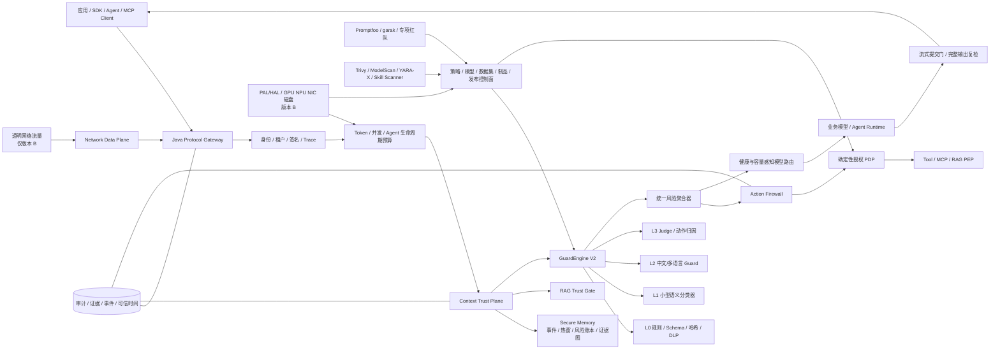
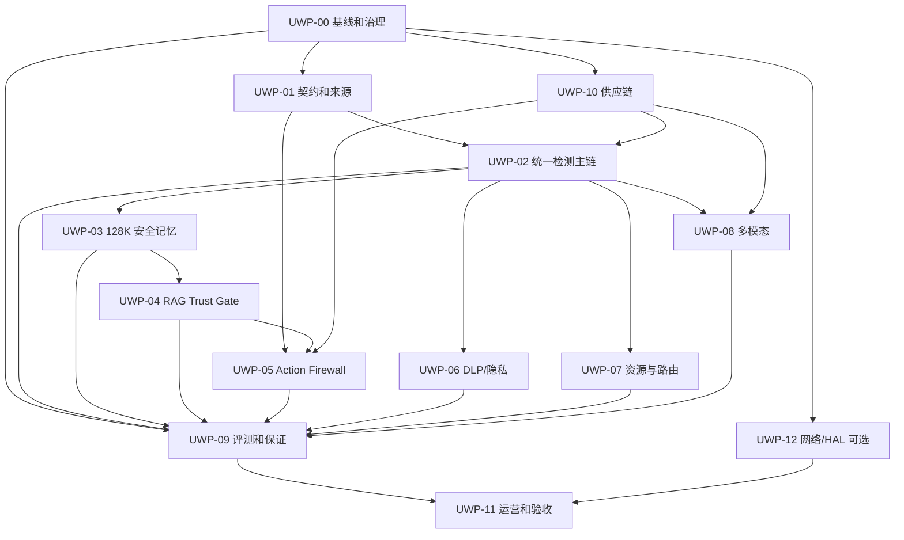

# AI 安全一体机与 Agent Runtime Security 三份优化计划整合实施方案

> 版本：V1.0
> 编制日期：2026-09-03
> 当前代码基线：`main@96f75b6`
> 整合输入：
> 1. `11_与NSF_AI安全一体机白皮书功能性能差距及优化计划_V1.0.md`
> 2. `12_2026大模型与Agent安全前沿研究及产品升级路线_V1.0.md`
> 3. `13_2026论文开源实现成熟度与产品集成选型_V1.0.md`
> 执行原则：代码存在不等于产品可用，开源可见不等于允许商用，本地测试通过不等于目标环境验收通过。

## 1. 执行结论

三份计划不应作为三个项目依次开发，也不应各自建设一套契约、检测引擎、RAG、Agent、评测或供应链平台。正确的整合方式是：

1. 以第 11 份计划定义产品边界、生产主链、工程质量、目标性能和一体机交付要求。
2. 以第 12 份计划定义下一代核心能力，即上下文信任平面、分层安全记忆、RAG Trust Gate、Agent Action Firewall 和持续攻击验证。
3. 以第 13 份计划约束 Build / Borrow / Integrate 决策，把成熟组件作为可替换适配器，把论文方法转化为测试，不让研究代码成为生产依赖。
4. 复用现有 GuardEngine V2、Guard v1 契约、RAG 来源校验、工具授权与 Permit、策略包、审计链、评测任务、Java 网关和多模态服务，不另起炉灶。
5. 默认先交付“版本 A：AI 安全软件网关与 Agent Runtime Security 平台”。只有在客户合同明确要求透明代理、IPS、AV、DoS、ACL、设备 HAL 时，才启动“版本 B：完整 AI 安全一体机”的网络与硬件分支。

推荐总顺序为：

```text
产品与验收冻结
  -> 统一契约和唯一生产检测主链
  -> 精确 tokenizer、流式提交门和级联检测影子链
  -> 上下文信任平面、128K 分层记忆、RAG Trust Gate
  -> Agent Action Firewall、MCP/Skill 准入
  -> DLP、算力保护、动态路由和多模态产品化
  -> 持续红队、供应链、量化保证和目标环境验收

可选并行分支：网络数据面 -> PAL/HAL -> 完整一体机验收
```

首个开发阶段应执行第 11 份计划的阶段 0 和阶段 1，但实现时必须吸收第 12 份的统一上下文/证据契约，并使用第 13 份的影子接入与供应链门禁。不能先集成一批开源组件，再反向拼接产品架构。

## 2. 当前基线与主要判断

### 2.1 已有可复用资产

当前仓库已经具备以下基础，不纳入重复建设：

- Java Guard Gateway：OpenAI REST、SSE、WebSocket、gRPC、mTLS、请求上下文签名、限流、并发舱壁、模型路由和流式提交门。
- GuardEngine V2：归一化、规则、Prompt 攻击、推理攻击、结构化 DLP、资源滥用、行业规则、并行 Detector 和统一聚合。
- RAG：来源签名、内容哈希、租户/应用隔离、ACL、隔离状态、检索后复检和引用校验。
- Tool/MCP：注册、角色、动作、资源、参数约束、污染上下文阻断、高风险审批、一次性 Permit 和结果复检。
- 策略：确定性编译、哈希、签名、审批、影子、灰度、激活、回滚、撤回和归档。
- 数据与运营：检测会话、事件、SLA、审计哈希链、可信时间适配、Outbox、内容标识和数据谱系。
- 评测与交付：异步评测、指标计算、验收追溯、性能 Harness、多语言 SDK、Helm/systemd 和多架构制品框架。

### 2.2 必须优先消除的结构性问题

1. Java 生产网关调用 GuardEngine V2，但旧 `DetectionOrchestrator` 仍存在，风险分类和结果口径可能分裂。
2. GuardEngine V2 当前把 Detector 一次性并行执行，缺少条件分支、逐节点预算、深检升级、有限重试和风险路由。
3. 会话只保留 4,096 字符尾部，流式窗口为 8,192 字符，不能证明 128K Token 全覆盖。
4. Guard v1 已有统一 `GuardDecision`，但请求上下文缺少来源类型、信任级别、指令权限、父级来源和敏感标签。
5. RAG 已具备 chunk 签名和 ACL，但缺少摄取前扫描、索引隔离、跨 chunk 组合检测、来源信誉和 Groundedness 闭环。
6. Tool 授权已具备静态权限和审批，但只有 `contextTainted` 布尔值，缺少用户意图、来源证据、数据流向、风险预算和可安全重规划的修复建议。
7. 当前没有 Qwen3Guard、Presidio、Cedar、Promptfoo、garak、ModelScan、YARA-X 等运行时或评测组件；历史 NeMo SQL 规则不等于集成 NeMo Guardrails。
8. 最新验收报告为 `PENDING_EXTERNAL_EVIDENCE`，101 项正式签名通过为 0；性能、效果、真实模型和目标硬件结论均不能对外宣传为已完成。

### 2.3 产品优先级判断

| 方向 | 客户价值 | 当前复用度 | 交付风险 | 决策 |
|---|---:|---:|---:|---|
| 统一主链与真实语义检测 | 极高 | 高 | 中 | 立即执行 |
| 上下文信任 + RAG Trust Gate | 极高 | 高 | 中 | 第一批核心能力 |
| 128K 分层安全记忆 | 高 | 中 | 中高 | 第一批核心能力 |
| Agent Action Firewall | 极高 | 高 | 高 | 第二个核心纵向切片 |
| 量化保证与持续红队 | 高 | 中 | 中 | 从第 1 天建设证据，后期完善攻击生成 |
| DLP 与 Presidio | 高 | 高 | 中 | 与语义检测并行 |
| MCP/Skill/模型供应链 | 高 | 中 | 中高 | 先静态门禁，后动态沙箱 |
| 多模态时序安全 | 中高 | 中 | 高 | 由客户场景和硬件决定深度 |
| 差分隐私/机密计算 | 场景相关 | 低 | 高 | 先冻结威胁模型，再做专项 POC |
| 透明代理/IPS/AV/DoS/HAL | 一体机合同相关 | 低 | 极高 | 仅版本 B 启动 |

## 3. 三份计划的合并、替代和保留关系

### 3.1 应合并为一个模块的工作

| 统一模块 | 第 11 份计划 | 第 12 份计划 | 第 13 份计划 | 统一结论 |
|---|---|---|---|---|
| 统一契约与证据 | WP-00、WP-01、WP-06 | ContextEnvelope、RiskEvidence、GuardVerdict | SecurityDecision | 以现有 Guard v1 为唯一基线，版本化扩展，不新增平行决策对象 |
| 检测编排 | WP-01、WP-02 | 自保护多级级联 | Qwen3Guard、Presidio、NeMo | GuardEngine V2 为权威编排器，第三方只以 Detector/sidecar 接入 |
| 长上下文 | WP-CTX | 128K 四层安全记忆 | Prompt Overflow/RST 方法 | 第 12 份设计替代简单尾窗扩容；第 11 份提供验收指标；第 13 份提供测试方法 |
| RAG | RAG 与模型评估补齐 | RAG Trust Gate | Confundo、NeMo retrieval rail | 建设单一 RAG Trust Gate；研究组件只做攻击/对照 |
| Agent 工具安全 | 原 FIX-004/工具安全基础 | Action Firewall | Cedar、TS-Guard、ACE 方法 | 现有工具服务演进为权威 Action 服务；Cedar只承担确定性策略判断 |
| DLP | WP-PRIV 混合 DLP | 敏感度传播和数据流 | Presidio | 保留确定性规则，Presidio补充 NER/上下文，不替代隐私计算 |
| 评测与证据 | WP-SCAN、WP-06 | 持续红队、量化保证 | Promptfoo、garak、MUZZLE | 现有评测/证据平台为控制面，外部工具作为执行器 |
| 供应链 | 模型供应链扫描 | MCP/Skill/模型准入 | Trivy、ModelScan、YARA-X、MalSkills | 建立统一制品准入，不建设多个扫描产品 |
| 多模态 | Media Analyzer 产品化 | 多模态时序安全 | SafeEditBench/SafeGuard-VL | 复用现有 Media Analyzer，benchmark优先，模型按收益接入 |

### 3.2 可以部分替代的内容

1. Qwen3Guard 可以替代“从零训练一个通用中文 Guard 分类器”的近期工作，但不能替代规则、DLP、Judge、策略聚合和最终决策。
2. Presidio 可以替代“从零建设通用多语言 PII NER 服务”，但不能替代中国证件校验、企业词典、跨分片 DLP、可逆令牌化、差分隐私或机密计算。
3. Cedar 可以替代工具授权中的硬编码角色/动作/资源判断，但不能替代自然语言风险理解、审批状态机、Permit、审计和数据流分析。
4. Promptfoo 可以替代部分自研测试用例编排，garak 可以替代部分通用模型探针开发，但两者不能替代内部数据集治理、盲测、人工复核和签名证据中心。
5. ModelScan 可以替代危险模型序列化格式的部分自研扫描，Trivy 可以承担镜像/依赖/IaC/SBOM 扫描，YARA-X 可以承担静态规则预筛；三者不能相互替代。
6. 第 12 份的四层安全记忆应替代第 11 份中“保存 128K 原文尾窗”的潜在实现方式，但必须继承第 11 份的 tokenizer、缓存失效、租户隔离和性能约束。

### 3.3 明确不能互相替代的能力

- 内容安全模型不能替代确定性授权 PDP。
- Cedar/OPA 不能替代 GuardEngine 或语义模型。
- Agent Action Firewall 不能替代 API 网关、网络层 ACL、IPS、AV 或 DoS 数据面。
- API 限流不能替代网络层 DDoS 防护。
- Presidio/DLP 不能替代差分隐私、TEE、MPC 或同态加密。
- Promptfoo、garak、MUZZLE、Confundo 不能进入在线请求热路径。
- NeMo Guardrails 和 DeepSeek Harness 不能替代现有 GuardEngine V2、Java StreamingCommitGate、策略数据库、审计链或安全会话状态。
- RAG chunk 签名不能替代内容安全检测；内容安全检测也不能替代来源签名和 ACL。
- 策略 DAG、Cedar 授权策略和自动推理验证属于三个层次，不能合并为一种策略语言。

## 4. 统一目标架构



### 4.1 权威状态边界

| 状态 | 唯一权威方 | 禁止事项 |
|---|---|---|
| Guard 请求/观察/决策契约 | `packages/contracts` | 第三方标签直接成为产品 API |
| 在线检测编排 | GuardEngine V2 | NeMo/Qwen/Presidio自行返回最终放行结论 |
| 上下文来源和风险传播 | Context Trust Plane | Agent Runtime 或 Harness 直接写安全状态 |
| 工具授权 | Action Authorization Service | Java 与 TypeScript 各自维护一套授权口径 |
| 策略版本 | Policy Bundle Service | 运行节点加载未签名环境变量策略 |
| 模型版本 | Model Registry | 通过 `latest` 或未校验权重启动 |
| 安全记忆 | Secure Memory Service | 使用普通聊天历史代替安全风险账本 |
| 验收结果 | Evidence/Assurance Center | 失败结果被覆盖或手工改成 PASS |

### 4.2 在线执行顺序

```text
认证和租户绑定
  -> 请求/文件/Token/并发/成本预算
  -> ContextEnvelope 构造与来源验证
  -> 当前输入、召回内容、历史风险组合检测
  -> GuardEngine 分级检测与统一聚合
  -> 输入允许后调用模型/Agent
  -> 每个工具动作执行前 Action Firewall 授权
  -> 工具结果重新标记为 untrusted/data-only 并复检
  -> 流式未提交缓冲检测
  -> 完整输出、引用一致性和 DLP 复核
  -> 决策、证据、版本和降级路径追加审计
```

## 5. 统一工作包

新的统一计划使用 `UWP-00` 至 `UWP-12`。这些编号是跨文档协调编号，不替代原 `FIX-000` 至 `FIX-017`；每个提交和验收证据必须同时标记 UWP 与 FIX。

### UWP-00 产品边界、基线与第三方治理

| 属性 | 内容 |
|---|---|
| 映射 | FIX-000、11/WP-00、12/阶段 0、13/P0 治理 |
| 优先级 | P0，所有工作前置 |
| 负责人 | 产品负责人 + 总体架构师 + QA 负责人 + 法务/供应链 |
| 工期 | 第 1-2 周 |

任务：

1. 冻结版本 A/版本 B 的功能边界、部署拓扑、许可证清单、不支持项和宣传口径。
2. 冻结目标业务模型、tokenizer、硬件、OS、数据库、中间件、网络拓扑和模型/RAG/Agent 真实端点。
3. 冻结黑样本、白样本、行业数据、RAG/Tool 攻击集、盲标签、复核和仲裁流程。
4. 建立第三方制品台账：代码、模型、数据分别记录许可证、版本、commit、SHA-256、来源、NOTICE、CVE、维护人和替换方案。
5. 记录当前代码、效果、性能、资源和验收状态，禁止用后续测试覆盖初始基线。
6. 对 128K、99%、毫秒级、三级优先级、Agent 高风险动作和 RAG Groundedness 建立可测试定义。

交付物：SKU 边界、产品声明矩阵、ADR 集、第三方台账、数据集 manifest、目标环境 manifest、基线报告和责任矩阵。

退出条件：每项需求具备负责人、依赖、验收标准、证据格式和回滚责任人；所有第三方制品在进入任何环境前可唯一定位和校验。

### UWP-01 统一契约、来源信封与事件模型

| 属性 | 内容 |
|---|---|
| 映射 | FIX-001/004/008、11/WP-01、12/P0-1、13/SecurityDecision |
| 依赖 | UWP-00 |
| 负责人 | 架构 + 契约/SDK + 数据平台 |
| 工期 | 第 1-4 周 |

任务：

1. 保留现有 `GuardRequest`、`Observation`、`GuardDecision`，采用兼容版本策略扩展，不另建语义重复的 `SecurityDecision`。
2. 增加 `ContextEnvelope`：`sourceType`、`sourceId`、`trustLevel`、`instructionCapability`、`sensitivityLabels`、`contentHash`、`parentEnvelopeIds`、`policyVersion`、`eventSeq`。
3. 增加 `RiskEvidence`：来源引用、规范化视图、字符/Token 范围、模型/规则版本、置信度、失败状态和证据 HMAC。
4. 增加 `ActionIntent`：用户目标、工具、参数摘要、目标资源、副作用、权限、支持来源、数据流向和风险预算。
5. 统一 REST、SSE、WebSocket、gRPC、RAG、Tool、媒体和离线评测使用的阶段枚举和错误码。
6. 对新增字段生成 TypeScript、Java、Python、Go 契约，并执行兼容性检查。
7. 所有外部 Agent/Harness 事件执行 schema 校验、租户绑定、序列号、过期、签名和重放保护。

退出条件：任一决策可定位租户、应用、主体、会话、来源、策略、检测器/模型、Trace 和失败模式；旧客户端仍按已批准兼容策略工作。

### UWP-02 唯一生产主链与自保护级联检测

| 属性 | 内容 |
|---|---|
| 映射 | FIX-002/005/006、11/WP-01/WP-02、12/P0-5、13/Qwen3Guard/NeMo |
| 依赖 | UWP-00、UWP-01 |
| 负责人 | 安全引擎 + 推理平台 + Java 网关 |
| 工期 | 第 3-8 周 |

任务：

1. 将旧检测入口改为 GuardEngine V2 兼容适配器，禁止维护第二套风险分类、阈值和最终决策。
2. 将 V2 的无条件 `Promise.all` 升级为签名 DAG：并行、条件分支、深检升级、节点超时、有限重试、成本预算和失败策略。
3. 定义 L0 规则/Schema/哈希、L1 轻量分类、L2 中文语义 Guard、L3 Judge/动作归因、L4 形式化验证接口。
4. 每个 Detector 必须返回内部 Observation；任何第三方标签先经过 adapter 映射，不允许直接决定 allow/deny。
5. Qwen3Guard Gen 0.6B/4B 首先影子接入，记录一致、互补、冲突、延迟、显存、吞吐和按类别误报。
6. NeMo 仅以隔离 sidecar 验证 retrieval/tool rail，不进入权威主链。
7. 建立每节点延迟、队列、Token、内存、超时、错误、降级、输入长度和批大小指标。
8. 失败策略按风险等级配置；涉及高风险动作、外发、执行、敏感资源时，检测器/PDP 不可用必须拒绝或转人工。

退出条件：所有生产入口使用同一策略包、Detector Registry 和风险分类；旧引擎不存在独立放行路径；Qwen3Guard仍处于可一键移除的影子/灰度适配器状态。

### UWP-03 精确 Token、128K 分层安全记忆与缓存

| 属性 | 内容 |
|---|---|
| 映射 | FIX-001/002/004/011、11/WP-CTX、12/P0-3、13/长上下文修复 |
| 依赖 | UWP-01、UWP-02 |
| 负责人 | 后端 + 数据平台 + 安全算法 |
| 工期 | 第 4-10 周 |

任务：

1. 建立模型感知 tokenizer adapter，TPM、输入/输出预算、分块和 128K 验收使用同一模型口径。
2. 将会话尾部文本迁移为四层结构：不可变加密事件、热窗口、结构化风险账本、篇章/来源证据图。
3. 事件至少覆盖消息、RAG、工具请求/响应、记忆写入/召回、模型输出、策略切换和人工审批。
4. 记忆写入前检测、召回后复检；派生摘要继承父内容最高敏感度和风险标签。
5. 对 128K 输入执行重叠分段、句段聚合、头/中/尾覆盖、跨段证据关联和 Token 覆盖证明。
6. 建立增量摘要和风险状态机，禁止每轮对全部 128K 原文重复全量检测。
7. 缓存键绑定租户、应用、方向、规范化内容哈希、策略包、检测器/模型版本、tokenizer 和配置摘要。
8. 放行缓存只减少重复计算，不允许成为旁路；策略、模型、tokenizer 或配置变化时强制失效。
9. 提供迁移双写、历史状态回放、按租户删除和加密密钥轮换方案。

退出条件：不存在送入业务模型但未被 Guard 覆盖的 Token；FragFuse、Context Stitching、Prompt Overflow 和跨轮组合攻击具有稳定回归；无跨租户/跨会话状态污染。

### UWP-04 RAG Trust Gate

| 属性 | 内容 |
|---|---|
| 映射 | FIX-004/005/011、11/RAG 和 WP-SCAN、12/P0-4、13/Confundo/NeMo |
| 依赖 | UWP-01、UWP-02、UWP-03 |
| 负责人 | RAG/Agent + 数据平台 + 安全测试 |
| 工期 | 第 5-11 周 |

任务：

1. 摄取链：文件/URL/恶意载荷检查、规范化、注入/DLP 扫描、来源信誉、签名、隔离、安全切块和索引准入。
2. 检索链：查询异常、ACL/clearance、chunk 签名、内容哈希、每片复扫、相似度异常和跨来源多样性。
3. 拼装链：每个 chunk 使用独立 `ContextEnvelope`，明确 `data-only + untrusted`，禁止字符串提示词改变其指令权限。
4. 组合链：检测单片无害但多片组合有害、跨文档隐藏指令、日志/邮件污染和片段顺序变化。
5. 输出链：引用存在性、来源授权、版本、时效、数值一致性、Groundedness 和敏感信息泄漏检查。
6. 建立知识库版本、隔离区、撤回、重扫、索引删除、谱系和回滚流程。
7. Confundo、ObliInjection、Retrieval Barrier 等方法只在隔离红队环境生成攻击，不连接生产知识库。

退出条件：入库、检索、拼装、生成全链路均有决策和证据；被撤回/隔离内容不可继续检索；外部数据不能提升为系统指令。

### UWP-05 Agent Action Firewall 与 MCP/Skill 安全

| 属性 | 内容 |
|---|---|
| 映射 | FIX-004/010/014、12/P0-2/P1-2、13/Cedar/TS-Guard/MalSkills |
| 依赖 | UWP-01、UWP-02；高质量归因依赖 UWP-03/04 |
| 负责人 | Agent 平台 + 授权平台 + 安全架构 |
| 工期 | 第 7-14 周 |

任务：

1. 在现有工具注册、参数策略、审批和 Permit 之上增加完整 `ActionIntent`。
2. 将副作用标准化为 `none/read/write/execute/external-send/privilege-change`，建立默认拒绝策略。
3. 检查用户目标一致性、ABAC/能力权限、敏感数据流向、目标资源、来源证据、风险预算和累计 Agent 生命周期预算。
4. 首批纳管外发消息、文件上传下载、代码执行、支付/工单/数据库、敏感知识库读取、权限和 Agent/MCP/Skill 配置修改。
5. 保留一次性 Permit，并绑定具体参数哈希、策略、工具版本、主体、租户、过期时间和审批结论。
6. 工具定义、Schema、说明、示例、输入、输出和凭据引用全部扫描；Tool Result 固定为不可信数据并重新进入 Guard。
7. 输出 ALLOW、REWRITE、APPROVAL、BLOCK 及机器可读修复建议，支持 Agent 安全重规划。
8. 定义唯一 Action Authorization Service。短期由现有 TypeScript 服务保持权威；Cedar 通过 adapter/隔离服务影子评估，验证一致性后再决定生产落点，禁止 Java/TS 双 PDP。
9. TS-Guard只做工具序列 A/B；MalSkills只在隔离环境评估跨文件数据流；无许可证 ToolSafe 框架代码不复制。
10. MCP/Skill Registry 记录来源、签名、版本、权限清单、网络域名、文件路径、命令、凭据和版本差异。

退出条件：所有有副作用动作在执行前取得带证据的授权决定；未授权参数替换和 Permit 重放失败；工具结果不能获得指令权限；Action PDP 故障时高风险动作不放行。

### UWP-06 混合 DLP、数据保护与隐私计算

| 属性 | 内容 |
|---|---|
| 映射 | FIX-002/011/014、11/WP-PRIV、12/敏感度传播、13/Presidio |
| 依赖 | UWP-00、UWP-01、UWP-02 |
| 负责人 | 数据安全 + 算法 + 密码/平台 |
| 工期 | 第 3-14 周；隐私计算 POC 可延后 |

任务：

1. 保留身份证、银行卡、手机号、邮箱、保单、客户号、健康、财务、商业秘密和凭证确定性规则。
2. Presidio作为内网 sidecar 影子接入，补充 NER、上下文和 OCR 后实体识别，不直接暴露到不可信网络。
3. 开发中国身份证、统一社会信用代码、保单号、客户号、车架号和企业词典 recognizer。
4. 统一实体类型、区间、置信度、识别器来源、处置动作和证据，建立规则/NER 冲突策略。
5. 支持跨 chunk、跨流式片段、跨模态和工具数据流的敏感信息聚合。
6. 分类型报告 Recall、Precision、FPR、FNR 和置信区间，不以模型输出的 0.99 分数冒充准确率。
7. 差分隐私必须先定义保护对象、威胁模型、epsilon/delta、会计器和效用门槛；没有明确场景不进入生产主链。
8. 加密计算优先评估企业 KMS/HSM、TEE/机密计算；MPC/同态未交付时不得使用泛化“加密计算”宣传。

退出条件：逐类型独立盲测达标；所有脱敏/阻断可回溯；Presidio不可用时按策略回退到确定性规则且产生降级证据。

### UWP-07 Guard 自保护、三级调度与动态模型路由

| 属性 | 内容 |
|---|---|
| 映射 | FIX-001/012/016、11/WP-COMPUTE/WP-03、12/Guard 自保护、13/Guardrail DoS 方法 |
| 依赖 | UWP-01、UWP-02、UWP-03 |
| 负责人 | Java 网关 + 调度/推理平台 + SRE |
| 工期 | 第 5-13 周 |

任务：

1. 配额下沉到租户、应用、用户、用户组、凭证、模型和 API，覆盖 RPM、TPM、并发、输入/输出 Token、日/月预算。
2. 建立 Agent 生命周期预算：工具步数、递归深度、浏览器页签、进程、连接、文件、OCR 页数、音视频时长和 Guard 推理 Token。
3. 增加三级优先级、加权公平队列、保留容量、租户防饥饿和高优先级滥用限制。
4. 请求复杂度预测纳入输入/输出 Token、模型、模态、检测路径、历史长度、RAG chunk、工具次数和成本。
5. 将路由配置从环境变量迁移到签名控制面，支持审批、热加载、乐观锁、灰度和回滚。
6. 路由评分纳入健康、P95/P99、队列、错误率、GPU/NPU、地域、权限和数据驻留要求。
7. 实现取消传播、背压、超时、熔断、实例摘除和预算超限的明确结果；禁止静默放行。

退出条件：多租户压测无配额串扰或优先级反转；实例故障自动摘除；路由发布失败自动回滚；Guard DoS 测试不会拖垮正常租户。

### UWP-08 多模态与文件时序安全

| 属性 | 内容 |
|---|---|
| 映射 | FIX-003/005/011、11/多模态产品化、12/P1-4、13/SafeGuard-VL |
| 依赖 | UWP-01、UWP-02、UWP-06；目标效果依赖真实模型/硬件 |
| 负责人 | Media Analyzer + 算法 + 安全测试 |
| 工期 | 第 8-18 周 |

任务：

1. 文件进入隔离桶，执行真实 MIME、哈希、AV、压缩包有界递归、加密包隔离、Zip Bomb 和生命周期控制。
2. 图片覆盖 OCR、版面、隐藏文字、二维码/URL、视觉语义、元数据和多视图扰动。
3. 音频覆盖 VAD、ASR、说话人、时间段、音频事件和不可听/异常频段检测。
4. 视频采用镜头切分、关键帧、连续帧窗口、OCR/ASR 对齐和时序风险融合，不只抽固定帧。
5. PDF/Office/Markdown 分别处理可见文本、隐藏层、链接、嵌入对象、宏和派生物谱系。
6. 优先引入 SafeEditBench/UnsafeBench 等可许可 benchmark；SafeGuard-VL 7B 只有在新增覆盖显著且资源可接受时进入灰度。
7. 文本、OCR、图像、音频和会话结果进入统一 Observation，由 GuardEngine 聚合，不由 Media Analyzer 单独决定放行。

退出条件：目标格式、容量、对抗变换和时序攻击通过冻结测试；任务取消、重试、断点和清理可验证；模型不可用时没有文件直通。

### UWP-09 评测、持续红队与量化保证中心

| 属性 | 内容 |
|---|---|
| 映射 | FIX-007/012/017、11/WP-SCAN/WP-06、12/P1-1/P1-5、13/Promptfoo/garak/MUZZLE |
| 依赖 | UWP-00；持续吸收所有功能工作包 |
| 负责人 | QA/评测 + 红队 + 数据平台 + 安全运营 |
| 工期 | 第 1-24 周持续建设 |

任务：

1. 现有评测平台继续管理数据集、任务、复核、仲裁、报告、签名和发布状态。
2. Promptfoo作为版本化用例和发布门禁执行器；通过 pnpm 或固定镜像运行，不进入在线链路。
3. garak作为独立模型扫描器，夜间和发版前运行；攻击生成模型与最终判定模型分离。
4. 把 ACE、FragFuse、ObliInjection、ToolHijacker、MEval、Prompt Overflow、Guardrail DoS 等论文方法独立重写为内部测试，不复制无许可证源码。
5. MUZZLE、Confundo和必要时的 PyRIT只在可重置隔离环境执行，不连接生产模型凭证或知识库。
6. 每次模型、策略、解析器、工具、知识库和 tokenizer 变化触发受影响用例集；建立影响映射避免无意义全量消耗。
7. 指标覆盖 ASR、任务成功率、误拒率、分类型混淆矩阵、最短成功轨迹、Token 成本、P50/P95/P99、吞吐、资源和降级率。
8. 每份结果绑定提交、镜像、模型、策略、tokenizer、数据集、环境、配置、原始输出和签名。

退出条件：失败不可覆盖；盲测标签在首次评测前不可见；生产候选版本具有完整可复算证据包；第三方工具移除后仍可回放核心测试。

### UWP-10 模型、MCP、Skill 与制品供应链

| 属性 | 内容 |
|---|---|
| 映射 | FIX-014/015、11/WP-SCAN、12/P1-2、13/供应链组件 |
| 依赖 | UWP-00；与其他工作并行 |
| 负责人 | DevSecOps + 模型平台 + 安全研究 |
| 工期 | 第 1-16 周 |

任务：

1. 构建、导入、升级和部署均禁止 `latest`，仅允许内部镜像仓、版本 allowlist、SHA-256/签名和双人审批。
2. Trivy扫描镜像、文件系统、依赖、IaC、Secret、License和SBOM；不得使用已知受影响制品或未验证数据库快照。
3. ModelScan在模型入库前检查 Pickle/H5/SavedModel 等危险序列化内容；不得把“扫描通过”解释为无模型后门。
4. YARA-X 扫描 Skill、插件、模型配套脚本、安装器和压缩包；规则需去重、评测和版本签名。
5. 引入可许可的 MaliciousAgentSkillsBench 样本/规则；动态执行迁移到一次性 VM 或 microVM，无生产凭证、无宿主写权限。
6. MalSkills验证中文 `SKILL.md`、PowerShell、Shell、TypeScript、Python、Java和跨文件数据流后，再决定吸收规则或 sidecar。
7. MCP/Skill 版本变化生成权限差异、依赖差异、网络差异和风险差异，未经审批不得上线。
8. 建立组件替换开关、离线升级包、漏洞数据库快照、回滚和季度重新评估流程。

退出条件：所有上线代码、模型、数据、规则库和漏洞库均具备许可证、SBOM/AI BOM、来源、摘要、签名和回滚记录；危险动态分析与生产网络物理隔离。

### UWP-11 日志、运营、发布与目标环境验收

| 属性 | 内容 |
|---|---|
| 映射 | FIX-008/009/012/013/016/017、11/WP-05/WP-06、12/证据中心 |
| 依赖 | 所有版本范围内功能工作包 |
| 负责人 | 数据/SRE + QA + 安全运营 + 交付 |
| 工期 | 第 8-24 周；版本 B 可至第 28 周 |

任务：

1. 统一审计、运行、模型安全和网络安全四域日志，按可用字段记录主体、端点、协议、会话、模型、策略、检测器、延迟和动作。
2. 按日/月物理分区，实施冷热分层、保留、审批检索、归档、恢复和删除证明。
3. 统一设备、网关、模型、队列、RAG、Agent、检测器、扫描、事件和依赖态势。
4. 完成 SOC/SIEM/工单连接器的字段映射、签名、重试、去重、双向状态和联动演练。
5. 执行效果、性能、容量、72 小时长稳、故障注入、灾备、安全、信创和不可绕过测试。
6. 每次候选发布按 Detect -> Shadow -> Canary -> Enforce 推进；阈值、模型和策略异常触发自动/人工回滚。

退出条件：版本范围内条目全部拥有签名证据；任何代码、模型、策略、数据集、配置或环境变化使相关证据自动失效并触发复测。

### UWP-12 完整一体机网络数据面与 PAL/HAL

| 属性 | 内容 |
|---|---|
| 映射 | FIX-001/012/015/016、11/WP-NET/WP-04，属于第 11 份独有范围 |
| 依赖 | UWP-00 的版本 B 决策 |
| 负责人 | 网络安全 + 系统平台 + SRE + OEM/厂商 |
| 工期 | 第 2-28 周并行分支 |

任务：

1. 在内核/eBPF/XDP、用户态转发和商业 OEM 中完成架构、性能、许可证、国产化和维护评审，不从零实现完整 IPS/AV 核心。
2. 支持反向代理和透明代理、旁路失败策略、流量回注、不可绕过网络策略和证书生命周期。
3. 覆盖 HTTP/1.1、HTTP/2、HTTPS、SSE、WebSocket、gRPC、OpenAI、MQTT、MCP 的协议状态机与逃逸测试。
4. 集成 IPS、AV、DoS/DDoS、ACL、会话加速、规则库签名更新和性能隔离。
5. 建立 CPU、GPU/NPU、内存、磁盘、RAID、NIC、温度、功耗、驱动、固件的硬件抽象与监控。
6. 打通 GPU/NPU、模型实例、队列、优先级、故障隔离、重调度和容量告警。

退出条件：PCAP、畸形协议、恶意文件和洪泛测试通过；网络与 AI 检测串联不可绕过；设备安装、升级、回滚、规则更新、证书轮换和硬件替换均有现场演练证据。

## 6. 依赖关系与关键路径



版本 A 的关键路径：`UWP-00 -> UWP-01 -> UWP-02 -> UWP-03 -> UWP-04 -> UWP-05 -> UWP-09 -> UWP-11`。

版本 B 的附加关键路径：`UWP-00 -> UWP-12 -> UWP-11`。

任何团队资源冲突优先保障版本 A 关键路径。UWP-12 可以提前完成选型和许可证评审，但不得占用统一主链、Context Trust Plane、RAG 和 Action Firewall 的核心人员。

## 7. 六个月分阶段执行路线

### 阶段 A：0-2 周，冻结和可控起点

必须完成：

- UWP-00 全部决策和基线。
- UWP-01 契约 ADR、字段草案和兼容策略。
- UWP-09 建立当前版本的不可变基线报告。
- UWP-10 建立第三方制品台账和禁止 `latest` 门禁。
- 版本 B 如立项，完成网络数据面候选 shortlist，不进入大规模编码。

阶段门禁：范围、数据、环境、证据和第三方许可证均有责任人；未冻结项明确标记为阻塞，不能用默认值假装已决策。

### 阶段 B：3-6 周，唯一主链和首批真实信号

必须完成：

- Guard vNext/扩展契约生成与兼容检查。
- GuardEngine V2 唯一入口和首版签名 DAG。
- SSE 句界/最大等待/最大字符未提交缓冲，验证阻断不泄漏风险片段。
- 真实 tokenizer 替换字符除以 4 的安全边界。
- Qwen3Guard Gen、Presidio影子服务及统一 adapter。
- Promptfoo首版回归、garak独立扫描、Trivy/ModelScan/YARA-X构建门禁。

阶段门禁：旧引擎无独立放行路径；第三方组件可一键关闭；影子结果和失败模式完整进入审计；首份中文基线和目标同构性能曲线生成。

### 阶段 C：5-10 周，上下文信任、128K 和 RAG

必须完成：

- 四层 Secure Memory、事件序列、风险账本和证据图。
- 128K 重叠分段、增量风险状态、缓存失效和 Token 覆盖报告。
- RAG 摄取、检索、拼装、输出四阶段 Trust Gate。
- 长上下文、RAG 投毒、跨 chunk、跨轮和位置偏置回归集。

阶段门禁：送入模型的内容都有来源和指令能力；128K 无静默截断；跨会话/租户隔离通过；被隔离内容不能进入索引或召回。

### 阶段 D：7-14 周，Action Firewall 和在线纵深

必须完成：

- `ActionIntent`、副作用、风险预算和修复建议。
- 高风险动作 PEP、审批、Permit、重放防护和工具结果复检。
- Cedar影子评估与现有授权一致性报告；确定唯一生产 PDP 落点。
- MCP/Skill Registry、工具定义签名和权限差异。
- Presidio中文/行业实体、Qwen3Guard小流量灰度。

阶段门禁：所有副作用动作授权覆盖率 100%；高风险动作的上下文来源可解释；PDP/模型不可用时行为确定且可审计。

### 阶段 E：11-18 周，规模化、算力保护和多模态

必须完成：

- L0-L3 风险路由、模型校准、批处理、熔断和灰度。
- 多层配额、三级优先级、复杂度预测、Agent 生命周期预算和动态路由。
- 多模态文件/图像/音频/视频时序管线及 benchmark。
- 模型/MCP/Skill供应链静态门禁和隔离动态 POC。
- Detect -> Shadow -> Canary -> Enforce 发布流程。

阶段门禁：目标硬件单组件和全链性能达到冻结门槛；任一组件不可用不产生静默放行；多租户不存在资源串扰。

### 阶段 F：15-24 周，持续对抗和版本 A 正式验收

必须完成：

- 轨迹反馈、自适应、多轮、RAG、工具链和跨模态红队。
- 模型、策略、知识库、工具或 tokenizer 变化自动触发影响回归。
- 目标环境效果、性能、72 小时长稳、故障、灾备和安全测试。
- 版本级签名安全保证报告、发布包和回滚包。

阶段门禁：版本 A 范围内无未披露缺口；所有正式声明有目标环境原始证据；失败与复测链可追溯。

### 阶段 G：19-28 周，版本 B 一体机收口

仅版本 B 执行：

- 透明代理、协议解析、IPS/AV/DoS/ACL 和文件还原联调。
- PAL/HAL、GPU/NPU 调度、设备监控、四域日志和态势集成。
- PCAP、畸形协议、洪泛、规则更新、证书轮换、设备故障和目标信创实机验收。

阶段门禁：没有真实数据面和性能报告的网络能力不得出现在交付清单中。

## 8. 前 30/60/90 天执行清单

### 0-30 天

| 周 | 必做事项 | 输出 |
|---|---|---|
| 第 1 周 | SKU 决策；冻结目标模型/tokenizer/硬件；建立第三方台账；冻结指标定义 | 范围和环境 manifest、许可证台账、ADR |
| 第 2 周 | Guard vNext、ContextEnvelope、ActionIntent、RiskEvidence 设计；运行时调用图；失败安全矩阵 | 契约草案、依赖图、失败矩阵 |
| 第 3 周 | 旧引擎收敛；DAG 原型；真实 tokenizer；Qwen3Guard/Presidio影子 adapter；Promptfoo首版 | 可运行影子链、基线数据 |
| 第 4 周 | SSE 未提交缓冲；128K 原型；RAG摄取/检索差距补齐；首轮目标同构性能测试 | 无泄漏回归、128K覆盖报告、性能原始数据 |

30 天退出标准：唯一主链方案、统一契约、真实 tokenizer、Qwen/Presidio影子链、供应链门禁、首版中文金标集和首份性能基线均完成；版本 B 的网络方案完成 Build/OEM 决策。

### 31-60 天

1. 完成 Secure Memory 事件流、热窗口、风险账本和证据图的最小可用版本。
2. 完成 RAG 摄取、检索、拼装的来源和投毒治理。
3. 完成 ActionIntent API、高风险动作目录和 Permit 扩展。
4. 完成 Presidio中文识别器与确定性规则冲突策略。
5. Qwen3Guard根据影子结果选择规格，在内部低风险应用 1%-5% Canary。
6. Cedar完成离线/影子一致性评测，不急于切换生产权威。

60 天退出标准：至少一个真实 RAG 场景和一个真实高风险工具场景端到端通过；任何阶段均能回放来源、策略、模型、授权和结果。

### 61-90 天

1. 完成 128K 首/中/尾、跨轮、跨语言、编码和缓存失效回归。
2. Action Firewall覆盖首批全部高风险动作，并支持安全参数改写/重规划建议。
3. 完成 Agent 生命周期预算、三级队列和动态路由原型。
4. 完成 Skill/MCP 静态扫描、权限差异和一次性沙箱 POC。
5. 完成图像/音频/视频现有链路基线；以 benchmark 决定是否引入 SafeGuard-VL。
6. 完成第一次跨 RAG、记忆、工具和多模态组合攻击演练。

90 天退出标准：核心安全平台从“输入输出过滤器”升级为可演示、可回放的 Context + RAG + Action Runtime Security 闭环；所有结论仍按影子/灰度/正式验收状态准确标注。

## 9. Build / Borrow / Integrate 最终决策

### 9.1 必须自研并掌握权威状态

- Guard 契约、内部风险分类和统一聚合器。
- Context Trust Plane、来源协议、taint 和敏感度传播。
- Secure Memory 风险账本、事件序列、跨轮/跨段聚合和安全缓存。
- RAG Trust Gate 的准入、来源、ACL、组合检测、引用和谱系控制面。
- Action Firewall 的意图、数据流、风险预算、审批、Permit和审计。
- 策略/模型/数据集版本、发布、回滚、证据和验收体系。
- 第三方 adapter、失败策略、熔断、降级和一键移除能力。

### 9.2 允许进入产品路线的组件

| 组件 | 定位 | 首次接入 | 生产条件 |
|---|---|---|---|
| Cedar-Java | 确定性授权候选 | 影子 PDP | 唯一权威边界、JDK/原生库兼容、策略一致性和故障测试通过 |
| Qwen3Guard Gen 0.6B/4B | 中文/多语言语义 Detector | 影子 | 代码/权重/数据许可归档，中文金标、P99、显存、误报达标 |
| Presidio | PII/DLP sidecar | 影子 | 无外网暴露，中文识别器、规则冲突、降级和性能通过 |
| Promptfoo | 版本化安全回归 | 离线 | 固定版本/镜像，数据不外发，报告可导入证据中心 |
| garak | 独立模型扫描 | 离线 | 独立环境、成本限额、攻击与判定分离 |
| Trivy | 镜像/依赖/IaC/SBOM | 构建与导入门禁 | 内部镜像、摘要固定、排除受影响版本、数据库快照签名 |
| ModelScan | 模型危险序列化扫描 | 模型导入门禁 | 版本固定，明确不覆盖后门/语义/许可证风险 |
| YARA-X | Skill/插件/脚本静态预筛 | 制品导入门禁 | 规则签名、误报评测、人工复核 |

### 9.3 仅隔离 POC 后决定

- MalSkills：验证跨指令、manifest、代码和安装脚本的数据流。
- NeMo Guardrails：只验证 retrieval/tool rail 和编排思想。
- ToolSafe 的 TS-Guard：仅模型权重 A/B，不复制无许可证框架代码。
- SafeGuard-VL：benchmark优先，7B模型取决于新增覆盖和资源成本。
- DeepSeek Harness：Agent兼容和事件来源，不写权威安全状态。
- Snyk Agent Scan：仅用于覆盖对照，一次性 VM，无生产数据和凭证。

### 9.4 只用于测试或暂不采用

- MUZZLE、Confundo、FragFuse、ObliInjection、ConjunctiveAgents、DTR、MEval 等只进入隔离测试/红队。
- ACE、AttriGuard、RST-Guarder、Prompt Overflow 等优先吸收思想并独立实现，不等待或复制不成熟仓库。
- CHILLGuard、FIPI、ShieldMCP、AIOpsShield、MASLeak 等在代码、模型、许可证和 release 完整前只做季度观察。

## 10. 验收指标与发布门禁

### 10.1 安全效果

| 指标 | 目标 |
|---|---:|
| 已知直接注入 ASR | `<= 1%` |
| 未见语义变体 ASR | `<= 5%` |
| RAG/Tool 间接注入 ASR | `<= 5%` |
| 高风险工具动作攻击成功率 | `<= 1%` |
| 跨轮记忆重组攻击 ASR | `<= 5%` |
| 正常业务任务完成率下降 | `<= 3` 个百分点 |
| 中文关键场景误拒率 | `<= 1%`，按行业/租户分别统计 |
| 长上下文 Token 检查覆盖率 | `100%`，不得静默截断 |
| 高风险动作授权覆盖率 | `100%` |
| 审计事件完整率 | `100%` |

敏感信息“超过 99%”必须拆为总体和逐类型 Recall、Precision、FPR、FNR，并给出样本数、分布和 95% 置信区间，不能只报 Accuracy。

### 10.2 性能和容量

| 路径 | 工程/验收目标 |
|---|---|
| L0 规则、Schema、缓存和授权 | 目标硬件 P99 建议 `<= 30 ms` |
| 快速分类器 | P99 `<= 200 ms` |
| 完整在线安全主链 | P99 `<= 300 ms`，不含业务模型推理 |
| 单节点吞吐 | `>= 20 QPS` |
| 集群吞吐 | `>= 200 QPS`，持续 30 分钟 |
| 错误率 | `<= 0.1%` |
| 会话/控制台 | 3,000 并发会话、300 控制台用户 |
| 资源 | CPU 峰值 `<= 80%`，内存峰值 `<= 75%` |

Qwen、Presidio、Judge、RAG、Tool、媒体和全量策略必须分别测试，再测试组合链路。不能通过关闭高成本 Detector 得到正式性能结果。

### 10.3 可靠性和安全

- 目标可用性 99.99%，必须绑定观测窗口和故障演练。
- 暂定 RPO `<= 15 分钟`、平台 RTO `<= 30 分钟`，以目标拓扑实测为准。
- 至少 72 小时长稳；随机停止网关、Detector、模型、Redis、数据库、Kafka、对象存储、节点和网络。
- 在线组件超时不得无限等待；高风险动作失败关闭或转人工。
- 流式风险内容在判定前不得提交；对跨 SSE chunk 风险提供字节级测试证据。
- 所有模型、容器、规则库和漏洞数据库固定版本、摘要、签名并可回滚。

### 10.4 发布停止条件

以下任一情况立即停止 Enforce 发布：

1. 存在绕过网关或 Action PEP 直连模型/工具的路径。
2. Guard v1/vNext、旧引擎和第三方组件出现不一致最终决策且无统一聚合。
3. 流式内容在检测前提交，或固定尾窗导致已知跨片攻击绕过。
4. 必需 Detector、PDP、审计或 KMS 故障时，高风险路径静默放行。
5. 128K、99%、毫秒级、三级优先级等声明没有目标环境原始证据。
6. 高风险状态跨租户、会话、缓存键或知识库污染。
7. 使用 `latest`、未签名制品、许可不明代码/模型/数据或已知恶意版本。
8. 测试失败、红队成功轨迹或验收证据可被覆盖删除。
9. 版本 B 的 IPS/AV/DoS/透明代理只有配置或页面，没有真实数据面。

## 11. 测试体系

| 层级 | 必测内容 | 自动化位置 |
|---|---|---|
| 单元 | 规范化、规则、tokenizer、缓存键、状态机、授权、参数改写 | Vitest/JUnit/各 SDK 测试 |
| 契约 | Guard、ContextEnvelope、ActionIntent、事件、错误和兼容 | `packages/contracts` 生成与兼容检查 |
| 集成 | PostgreSQL/Redis、RAG、Tool、模型 sidecar、审计 Outbox | 独立集成环境 |
| E2E | REST/SSE/WS/gRPC、RAG/Agent/MCP、审批和回滚 | Playwright/API/Java 网关测试 |
| 对抗 | 注入、越狱、RAG投毒、长上下文、工具劫持、Skill供应链、多模态 | Promptfoo、garak、内部攻击集 |
| 性能 | 单组件、快路径、级联、并发、长上下文、媒体 | k6 + Prometheus + GPU/NPU 指标 |
| 可靠性 | 超时、熔断、依赖停止、节点故障、数据恢复 | 故障注入与灾备演练 |
| 供应链 | SBOM、模型格式、静态规则、签名、许可证 | Trivy/ModelScan/YARA-X/内部门禁 |

数据集必须至少分为训练/规则开发集、阈值校准集、回归集和严格隔离盲测集。任何用于调参的样本永久退出盲测集；第三方 benchmark 的提升不能替代内部中文和行业数据结果。

## 12. 灰度、迁移与回滚

| 阶段 | 流量 | 决策效力 | 进入条件 | 回滚 |
|---|---:|---|---|---|
| Observe | 0% | 离线回放 | 契约和许可证通过 | 删除离线任务 |
| Shadow | 镜像流量 | 不阻断 | 隐私审查、容量和故障测试通过 | 关闭 adapter/镜像 |
| Canary | 1%-5% | 低风险租户 Enforce | 影子效果和延迟达标 | 路由切回 Shadow |
| Limited | 10%-30% | 指定租户/策略 | 无 P0 缺陷、回滚演练通过 | 恢复旧签名策略/模型 |
| General | 100% 范围内 | 正式 Enforce | 目标环境证据和审批完成 | 一键回滚模型、策略和路由 |

回滚必须同时覆盖：策略包、Detector Registry、模型版本、tokenizer、缓存命名空间、路由配置、数据库迁移兼容和第三方 sidecar。不能只回滚前端配置。

## 13. 团队与责任

### 13.1 版本 A 建议配置

| 角色 | 建议投入 | 主要责任 |
|---|---:|---|
| 总体架构/产品技术负责人 | 1-2 | SKU、ADR、依赖、门禁和跨域决策 |
| Java 网关/后端 | 3-4 | 协议、DAG、配额、路由、Action PEP |
| Agent/RAG/数据平台 | 2-3 | Context、Memory、RAG Trust Gate、谱系 |
| 算法/推理平台 | 3-4 | Qwen、DLP、Judge、多模态、模型服务 |
| QA/红队/性能 | 3-4 | 数据集、对抗、性能、故障和证据 |
| SRE/DevSecOps/供应链 | 2-3 | 制品、部署、监控、HA、扫描和离线交付 |
| 前端/安全运营 | 1-2 | 策略、证据、评测、事件和资产视图 |

峰值建议 14-18 人。人员不足时，优先保障 UWP-00/01/02/03/04/05/09，降低多模态和自动推理深度，不能削弱契约、证据或失败安全。

版本 B 另需网络数据面/系统/OEM 4-6 人以及硬件/信创 2-3 人。

### 13.2 决策责任

- 产品负责人对 SKU 范围和对外声明负责。
- 总体架构师对权威状态、契约、依赖和技术例外负责。
- 安全负责人对威胁模型、失败策略、红队和发布停止负责。
- 算法负责人对数据、模型、阈值和效果报告负责。
- QA 负责人对盲测、证据完整性和最终验收状态负责。
- SRE 负责人对性能、可用性、回滚、灾备和目标环境负责。
- 法务/供应链负责人对代码、模型、数据许可证和再分发范围负责。

任何角色不得单独完成“开发、审批、验收、改写结果”全链路。

## 14. 主要风险与缓解措施

| 风险 | 触发信号 | 缓解措施 |
|---|---|---|
| 三套契约/决策并存 | Java、TS、第三方返回不同动作 | 现有 Guard 契约为唯一外部合同，adapter只返回 Observation |
| 开源组件绑架架构 | 核心字段跟随第三方标签变化 | Anti-corruption adapter、一键移除、内部 schema 固定 |
| 128K 线性/二次成本 | 延迟随轮次或长度失控 | 增量事件、风险账本、重叠分段、分级升级和缓存 |
| 流式先泄漏后阻断 | 客户端收到风险片段 | 未提交缓冲、句界/时限策略和字节级泄漏测试 |
| Guard 自身 DoS | Detector队列、Token或显存持续上升 | 节点预算、三级队列、取消传播、熔断和租户隔离 |
| Action 双 PDP | Java与TS授权不一致 | 先定义唯一服务边界，Cedar影子验证后再迁移 |
| RAG来源标签失效 | 摘要/翻译后风险丢失 | 父级关系、最高敏感度继承、写入/召回复检 |
| 模型效果被总体指标掩盖 | Accuracy高但关键类别漏报 | 逐类指标、行业切片、置信区间和独立盲测 |
| 第三方供应链污染 | `latest`、标签漂移、异常出网 | 内部镜像、digest、签名、SBOM、双人审批和出网审计 |
| 研究代码进入生产 | 无License仓库被复制 | 论文方法独立实现为测试，法律门禁阻止打包 |
| 网络分支拖慢软件主线 | UWP-12持续占用核心后端/算法 | 独立团队、独立预算、共同契约但独立里程碑 |
| 外部输入长期缺失 | POC和正式验收无法关闭 | 第 1 周锁定责任人和日期，保持 PENDING，不用 Mock 冒充 |

## 15. 管理与执行机制

### 15.1 研发任务模板

每个任务必须包含：

```text
task_id: UWP-xx-yyy
maps_to: [FIX-xxx, requirement ids]
owner:
reviewers:
dependencies:
threat_model:
contract_changes:
implementation_paths:
tests:
target_metrics:
evidence_paths:
third_party_artifacts:
failure_mode:
rollout:
rollback:
external_blockers:
done_definition:
```

缺少测试、证据或回滚的任务不能进入 `DONE`。

### 15.2 状态定义

| 状态 | 含义 |
|---|---|
| `DESIGN_READY` | 契约、威胁模型、依赖和验收已评审 |
| `CODE_COMPLETE` | 实现和仓库内自动化通过 |
| `SHADOW_VALIDATED` | 真实或同构流量影子结果达到门槛 |
| `CANDIDATE_ACCEPTED` | Canary/目标环境技术验收通过 |
| `DONE_SIGNED` | 客户/责任人签名证据完成 |
| `BLOCKED_EXTERNAL` | 明确外部输入缺失，代码不能消除 |

禁止把 `CODE_COMPLETE`、`SHADOW_VALIDATED` 或 `Harness PASS` 表述为正式验收完成。

### 15.3 评审节奏

- 每日：关键路径阻塞、失败安全和生产缺陷。
- 每周：UWP/FIX 状态、性能趋势、模型冲突、开源制品变化和风险台账。
- 每两周：架构、契约、模型/策略灰度和回滚演练评审。
- 每月：红队结果、数据漂移、依赖漏洞、许可证和宣传口径审计。
- 每季度：研究仓库成熟度和 Build/Borrow/Integrate 决策复核。

## 16. 最终完成定义

版本 A 完成必须同时满足：

1. GuardEngine V2 是唯一生产检测主链，第三方组件均通过统一 adapter 返回 Observation。
2. 所有输入、RAG、工具、记忆和输出内容具备可验证来源、信任级别、敏感度和策略版本。
3. 128K 在指定 tokenizer 下达到 100% Token 覆盖，首/中/尾、跨轮和缓存失效测试通过。
4. RAG 入库、检索、拼装、输出和撤回形成完整 Trust Gate。
5. 所有副作用动作执行前经过 Action Firewall，授权和结果可回放，未授权重放失败。
6. Qwen/Presidio等模型的中文、行业、性能和故障指标在目标硬件通过；不能通过时可移除且产品仍保持失败安全。
7. 模型、MCP、Skill、容器、规则和漏洞库具备许可证、摘要、签名、SBOM/AI BOM、扫描和回滚。
8. 效果、性能、72 小时长稳、故障、灾备和安全报告绑定不可变制品和签名。
9. 版本范围内验收项达到 `DONE_SIGNED`，未纳入版本的能力在产品资料中明确披露。

版本 B 还必须满足：

1. 透明代理、协议解析、IPS、AV、DoS/DDoS、ACL 和文件还原具备真实数据面。
2. PAL/HAL、GPU/NPU、NIC、磁盘、温度、功耗和驱动管理具备可运维能力。
3. 网络与 AI 检测串联不可绕过，并具有目标设备吞吐、延迟、故障和安全测试报告。
4. 目标信创 CPU、OS、数据库、中间件和 AI 芯片完成同一制品实机 POC。

在上述条件完成前，准确产品表述应为：

> 已具备 AI 安全软件网关和 Agent/RAG 安全工程基线，正在通过统一上下文信任、分层安全记忆、Action Firewall、真实语义模型和目标环境证据完成产品化；完整网络安全一体机能力以独立 SKU 和验收范围为准。

## 17. 外部组件核验来源

正式引入前必须重新核查 release、许可证、模型卡、安全公告和依赖树。当前用于选型复核的主要官方来源包括：

- [Cedar-Java](https://github.com/cedar-policy/cedar-java)
- [Qwen3Guard](https://github.com/QwenLM/Qwen3Guard)
- [Presidio](https://github.com/data-privacy-stack/presidio)
- [Promptfoo](https://github.com/promptfoo/promptfoo)
- [garak](https://github.com/NVIDIA/garak)
- [ModelScan](https://github.com/protectai/modelscan)
- [YARA-X](https://github.com/VirusTotal/yara-x)
- [Trivy 2026 供应链事件公告](https://github.com/aquasecurity/trivy/security/advisories/GHSA-69fq-xp46-6x23)

本节链接只证明当前选型依据，不自动构成商业许可批准或产品安全证明。

## 18. 分段执行记录

### 18.1 批次 1：UWP-00/UWP-01（2026-09-03）

状态：仓库内代码和治理门禁已完成首批实现；目标环境、盲测集、实名责任人、生产密钥注册表、共享防重放存储和跨语言消费方验收仍为外部阻塞，不得标记 DONE_SIGNED。

已交付：

1. 建立 acceptance/integrated-plan/，固化版本 A/版本 B 边界、产品声明状态、开发/目标环境区分、第三方准入、指标定义及 UWP-00 至 UWP-12 状态。
2. 新增 pnpm plan:check，自动检查 13 个工作包、责任/回滚角色、证据路径、源文件摘要、禁止 latest、外部阻塞和虚假完成状态。
3. 在 Guard v1 上兼容增加 ContextEnvelope、ActionIntent、处理阶段、失败模式、模型版本、Token 范围和事件签名字段；未建立平行最终决策对象。
4. 契约生成覆盖 TypeScript、Java、Python、Go、OpenAPI 和 protobuf；兼容检查允许 oneOf 扩展但拒绝删除既有分支。
5. GuardEngine V2 在检测前校验 ContextEnvelope 的租户/应用/会话、范围、哈希、过期、重复和指令权限；旧客户端获得确定性的保守兼容信封。
6. 文本证据自动绑定 sourceEnvelopeIds，决策返回 failMode 和 evidenceComplete。
7. 高风险 ActionIntent 必须引用已验证来源，并具备认证主体和用户/系统指令权限。
8. 外部 GuardEvent 按 schema、作用域、嵌套载荷、时效、密钥、常量时间签名和原子防重放顺序校验。

自动化结果：

- UWP-00/UWP-01 聚焦测试：5 个测试文件、23 项测试通过。
- pnpm ts-check：通过。
- pnpm contracts:check：生成制品无漂移，Guard v1 对已接受基线向后兼容。
- pnpm plan:check：13 个工作包有效；5 项产品声明保持未批准；目标环境保持 BLOCKED_EXTERNAL。

ADR：

- docs/architecture/adr-001-context-envelope-and-contract-compatibility.md
- docs/architecture/adr-002-product-sku-boundary.md

下一批：UWP-02，完成唯一生产主链、签名 Detector DAG、容量/超时预算和流式提交门验证。

### 18.2 批次 2：UWP-02/UWP-03（2026-09-03）

状态：代码实现完成，目标 tokenizer、128K 目标环境、Java 21/Maven 验证和全策略流式压测待完成。

已交付：

1. 将 detect、simulate、policy compare 和文档检测收敛到 GuardEngine V2，旧动态引擎不再进入生产调用路径。
2. 签名策略生成 Detector DAG，落实节点依赖、成本、超时、重试、失败策略和可观测指标。
3. Java StreamingCommitGate 增加未提交缓冲、边界提交、阻断取消和泄漏上界测试源码。
4. 建立 tokenizer 注册表、精确 tokenizer 准入条件、131072 Token 重叠覆盖证明和全维度缓存键。
5. 建立加密不可变记忆事件、热窗口、风险账本、来源图、乐观锁和风险状态机；派生内容继承最严格信任与能力。

仓库验证：Guard 契约/上下文/策略/引擎 57 项测试通过；tokenizer/覆盖/缓存 14 项通过；安全记忆/派生信任 31 项通过。Java 因本机缺少 JDK/Maven 未执行，不计为通过。

### 18.3 批次 3：UWP-04/UWP-05（2026-09-03）

状态：代码实现完成，客户领域语料、groundedness 门槛、目标 Tool/MCP、人工审批系统和权威来源回查待验收。

已交付：

1. RAG 摄取、候选、组合上下文和输出分别通过 Guard；来源签名、版本、有效期、ACL、信誉、分类、容量、重复与来源集中度进入准入。
2. RAG/Tool/Memory 明确使用 `UNTRUSTED + FORBIDDEN` 信封；跨 chunk 组合攻击、引用和词法/数字 groundedness 独立检查。
3. Action Firewall 绑定完整 ActionIntent、主体权限、工具版本、副作用、资源、参数、目的地、风险预算和来源证据。
4. 高风险动作要求人工审批；一次性 Permit 绑定批准决定并原子消费；工具结果重新检查且不能获得指令权限。
5. Agent run 的风险预算与工具步数在数据库事务中原子预留。

仓库验证：RAG 7 项定向测试通过；Action Firewall/Tool 15 项定向测试通过；TypeScript 与 lint 通过。

### 18.4 批次 4：UWP-06/UWP-07（2026-09-03）

状态：DLP 代码实现完成；资源与路由形成可验证基线，但 Java 网关控制面接线和目标多租户压测未完成。

已交付：

1. 在原有身份证、银行卡等规则上增加 GB 32100 统一社会信用代码校验和 VIN 校验位识别。
2. 建立规则、企业词典、Presidio 影子和 OCR 的统一实体候选/冲突归并；校验型规则优先，最终动作只由内部策略生成。
3. 逐实体输出 Recall、Precision、FPR、FNR 及 Wilson 95% 置信区间；零分母不产生虚假准确率。
4. 明确 DP、TEE、MPC、同态加密的生产准入条件和禁止宣传边界。
5. 增加租户、应用、用户、组、凭证、模型、API 的并发/RPM/输入输出 TPM/日月成本声明，以及 Agent 全生命周期资源向量。
6. 增加三级加权公平调度、关键流量保留容量、单租户关键队列上限、请求复杂度估算和签名动态模型路由。

仓库验证：DLP/指标 16 项定向测试通过；资源控制 5 项定向测试通过；TypeScript 与 lint 通过。

### 18.5 批次 5：UWP-08/UWP-09（2026-09-03）

状态：多模态与评测核心代码完成；真实 AV/Office 解析器、模型制品、冻结格式攻击集和客户盲测集待完成。

已交付：

1. 新增文件安全准入决策，对 AV 未运行/失败、恶意文件、压缩层级/数量/展开体积/压缩比、加密包、宏、嵌入对象和外部引用失败关闭。
2. 视频执行器实际生成边界、中点、固定间隔、镜头变化和短闪高帧率采样任务，不再只声明多策略。
3. 保留 OCR/视觉/ASR/音频异常、变换视图、跨模态与时间窗证据进入统一 GuardEngine 的既有路径。
4. 评测结果由覆盖写改为 `run + case + attempt` 不可变追加，数据库拒绝 UPDATE；执行前复核冻结数据集摘要。
5. 外部 PASS 报告强制绑定提交、镜像、模型、策略、tokenizer、数据集、配置、原始输出摘要和首轮尝试策略。

仓库验证：多模态/文件 14 项定向测试通过；评测/证据 9 项定向测试通过；TypeScript 与 lint 通过。

### 18.6 批次 6：UWP-10/UWP-11/UWP-12（2026-09-03）

状态：软件供应链、运营发布和 PAL/HAL 契约形成代码基线；第三方 POC/法务、目标监控、72 小时长稳及版本 B 数据面全部保持待验收或外部阻塞。

已交付：

1. Tool/MCP 注册强制精确版本、来源/NOTICE/扫描规则摘要、许可证、网络/文件/命令/凭证清单、隔离动态分析和双人审批，并在写库前验证 Ed25519 签名。
2. 版本差异明确列出新增权限、网络、文件、命令和凭证；旧记录迁移为 `pending_admission` 且 Action Firewall 拒绝执行。
3. 发布证据指纹绑定提交、镜像、模型、策略、tokenizer、数据集、配置和环境；任何变化生成复测原因。
4. P99、漏检、必需 Detector 或审计终态失败生成回滚动作；补齐依赖、路由、RAG、Tool 和审计投递指标及告警。
5. 版本 B PAL 对 9 类协议强制“解码 -> 检测 -> 转发”，检测故障默认阻断；仅未保护流量可凭限定范围、限时、双人批准的签名 Permit 旁路。
6. HAL 绑定驱动/固件摘要并对 CPU、加速器、内存、磁盘、RAID、NIC、温度、电源、模型实例和队列生成健康/降级/摘除决定。

仓库验证：供应链 7 项、运营发布 17 项、PAL/HAL 3 项定向测试通过；TypeScript 与 lint 通过。版本 B 仍为 `BLOCKED_EXTERNAL`，不得作为已交付完整网络一体机宣传。

### 18.7 当前未关闭项

以下事项不能通过继续编写仓库代码真实关闭，必须由对应责任方提供签名外部证据：目标模型/tokenizer/硬件清单，4000 条客户盲测数据，第三方许可证和固定制品，Java 网关与数据库迁移环境，真实 OCR/ASR/视觉/AV/Office 解析器，SOC/SIEM 与 KMS/HSM，72 小时长稳/故障/灾备/信创验收，以及版本 B OEM/eBPF 数据面、PCAP/洪泛/线速/现场演练。

### 18.8 最终仓库验证（2026-09-03）

本轮按照“治理与契约 -> Guard 主链与上下文 -> RAG/Tool/Memory -> DLP/资源/多模态 -> 评测/供应链/运营 -> PAL/HAL”的依赖顺序完成 UWP-00 至 UWP-12 的仓库内实现。最终验证结果如下：

1. `pnpm plan:check`：通过；13 个工作包清单有效，5 项产品声明保持未批准，目标环境保持 `BLOCKED_EXTERNAL`。
2. `pnpm contracts:check`：通过；TypeScript、Java、Python、Go、OpenAPI 和 protobuf 生成制品无漂移，Guard v1 对已接受基线向后兼容。
3. `pnpm ts-check` 与 `pnpm lint:build`：通过；TypeScript 和 ESLint 违规均为 0。
4. `pnpm test:unit --run`：通过；100 个测试文件、396 项测试全部通过。
5. `pnpm quality:ratchet`：通过；当前 TypeScript/ESLint 质量基线均为 0，未引入质量债务。
6. `pnpm build`：通过；Next.js 16.3.3 生产构建、类型校验和 80 个页面/路由生成完成，动态 API 路由进入可部署制品。
7. `pnpm test:sdk-python`：通过；3 项 Python SDK 测试通过。
8. `pnpm test:sdk-go`：未执行成功；本机未安装 Go 工具链，不计为通过。
9. `pnpm test:integration`：未执行成功；未提供隔离的 `INTEGRATION_DATABASE_URL`，迁移 0028 至 0035 尚需在专用 PostgreSQL 验收环境执行，不计为通过。
10. Java StreamingCommitGate：本机缺少 JDK/Maven，Java 编译和测试尚未执行，不计为通过。

因此，本轮可准确标记为“UWP-00 至 UWP-12 仓库代码基线已分段实现并通过现有 TypeScript/Node/Python 自动化验证”；不得标记为 `DONE_SIGNED`、目标性能达标或完整网络安全一体机交付。进入 `SHADOW_VALIDATED`、`CANDIDATE_ACCEPTED` 和 `DONE_SIGNED` 仍须依次关闭 18.7 所列外部事项，并提交与不可变制品指纹绑定的签名证据。

### 18.9 计划 11 专项闭环增量（2026-09-03）

在 UWP-00 至 UWP-12 初始代码基线后，继续关闭计划 11 中仍可由仓库实现的
差距：

1. 语义分类服务进入签名策略包和 GuardEngine V2 DAG，绑定模型摘要、
   量化、校准、批量、灰度模式与失败策略。
2. 精确 tokenizer 和 PostgreSQL 多维配额账本进入
   `/api/v1/guard/evaluate`，覆盖请求幂等、重放拒绝、复杂度计价及可回收
   并发租约。
3. 新增租户扫描资产、签名扫描器目录、异步任务/Worker、不可变 attempt、
   finding 去重、独立复核与争议仲裁。
4. 新增四域安全事件表、月分区、不可变约束和 TONE HTTPS/HMAC/回执
   连接器；Helm 默认启动 audit-export 与 security-scan Worker。
5. 新增 `docs/runbooks/nsf-plan-runtime-integration.md`，固定迁移、配置、
   灰度、回滚和外部验收步骤。

UWP-07 已从 `PARTIAL_BASELINE` 更新为
`CODE_IMPLEMENTED_ACCEPTANCE_PENDING`；UWP-09/UWP-11 补充扫描和 TONE
证据。UWP-12 以及 128K、99%、毫秒级、信创和完整一体机五项声明仍保持
外部阻塞或未批准。
