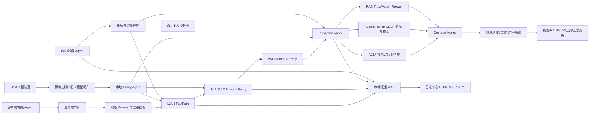
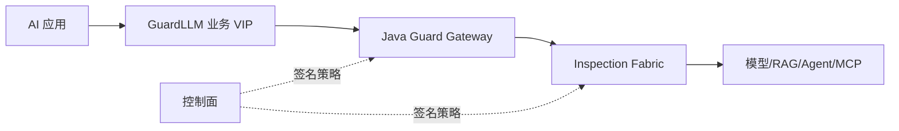
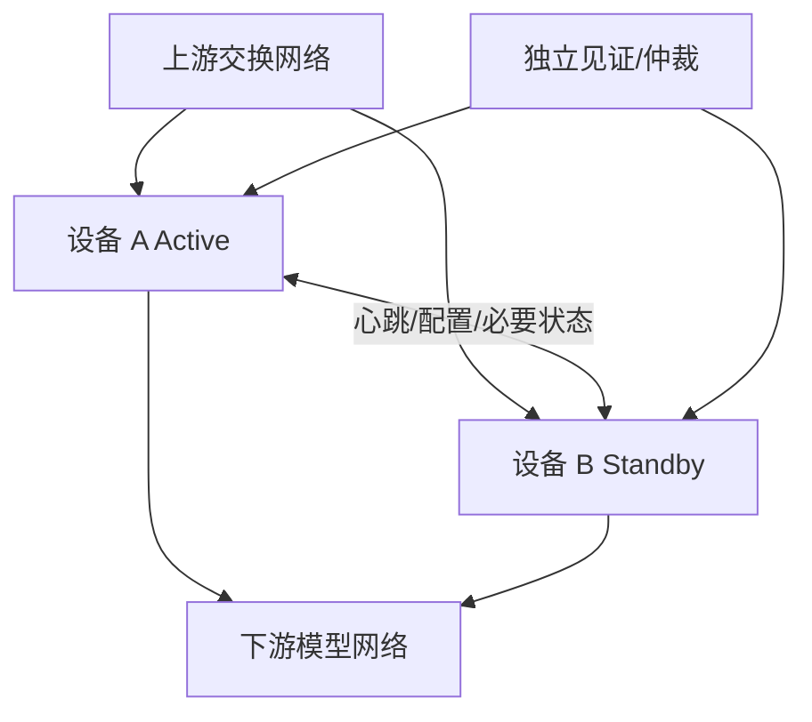
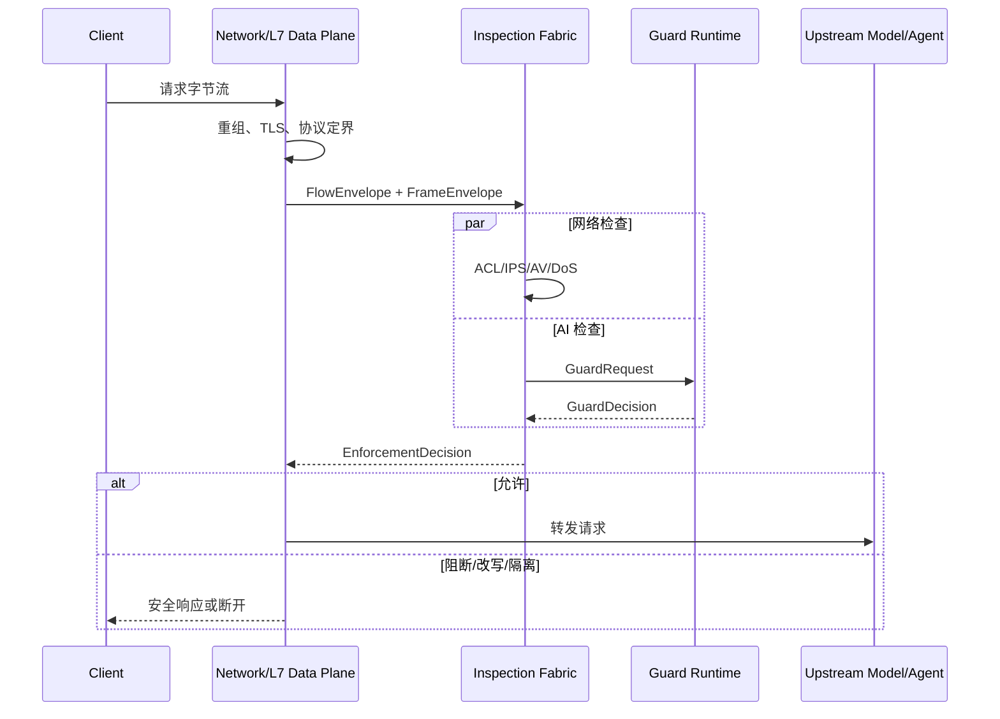
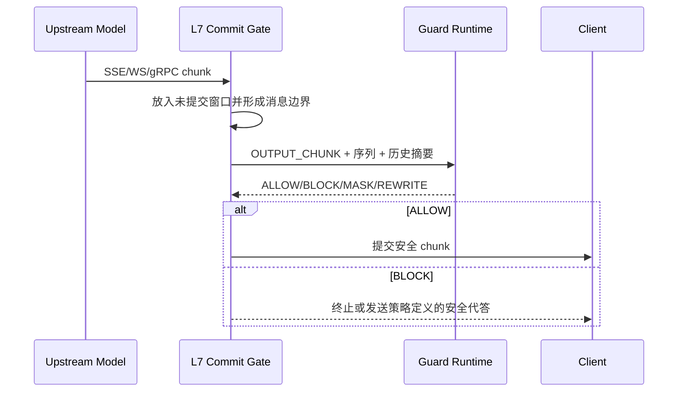
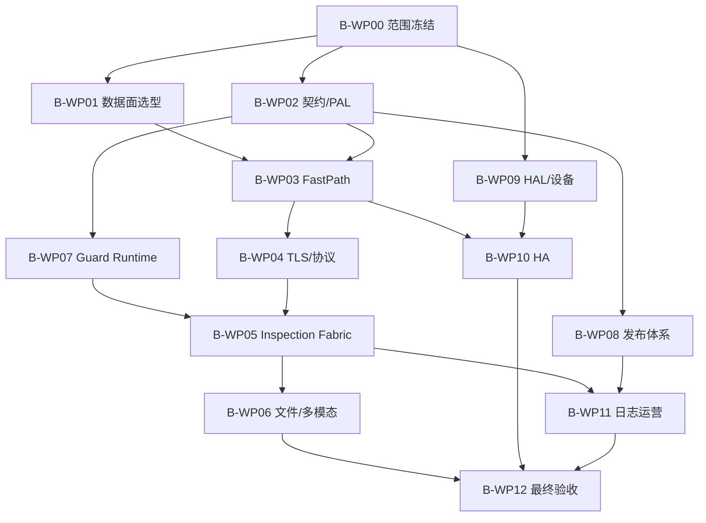

# GuardLLM B 版本升级详细设计方案与执行计划

> 文档版本：V1.0
> 编制日期：2026-09-04
> 文档状态：设计基线，待产品、网络、硬件、合规和验收负责人联合评审
> 适用产品：GuardLLM Version B 全功能 AI 安全一体机
> 当前代码基线：`main@28cc709`
> 上游计划：`11_与NSF_AI安全一体机白皮书功能性能差距及优化计划_V1.0.md`、`14_三份优化计划整合实施方案_V1.0.md`
> 重要口径：本文件是目标设计与执行基线，不是功能完成、性能达标、硬件兼容或产品认证证明。

## 1. 文档目的

本方案用于把 GuardLLM Version B 从当前的“Version A 软件护栏能力 + PAL/HAL 前置契约”升级为可安装、可串联、可管理、可升级、可审计、可验收的 AI 安全一体机软件系统。

本方案重点回答以下问题：

1. B 版当前真实具备什么，哪些能力仍然缺失。
2. Version A 哪些模块可以直接复用，哪些需要设备化改造。
3. 网络数据面、AI 检测面、控制面、证据面和硬件面如何解耦。
4. 如何实现透明代理、协议解析、TLS、IPS、AV、DoS、ACL、文件还原和 AI 安全串联。
5. 如何实现整机高可用、失败安全、升级回滚、规则更新和硬件监控。
6. 如何在 28 周内分阶段交付，并用不可变证据判定是否完成。

## 2. 执行结论

### 2.1 当前状态

Version B 当前不能作为完整 AI 安全一体机交付。仓库中的正式状态为：

- `VERSION_B_FULL_APPLIANCE = BLOCKED_EXTERNAL`。
- `UWP-12 = BLOCKED_EXTERNAL`。
- 已有 `network-pal.ts`、`hardware-hal.ts` 和 3 个 PAL/HAL 单元测试。
- 尚无真实收包、转发、TCP 重组、透明 TLS、协议状态机、IPS、AV、网络 DoS、ACL、文件还原、流量回注和设备双机切换实现。
- 目标硬件、端口规格、目标网络、数据面技术、商业许可、监管范围和验收指标尚未冻结。

因此，当前 PAL/HAL 只能认定为“一体机集成边界基线”，不能认定为“网络数据面已完成”。

### 2.2 推荐建设路线

Version B 应采用“自研产品权威状态，集成成熟网络安全核心”的混合路线：

- 自研并掌握：统一 Guard 契约、策略编译与签名、AI 检测主链、上下文信任、RAG、Agent、DLP、决策仲裁、设备控制、证据链、验收门禁和第三方适配层。
- 集成而非从零开发：高速收发包、TCP/IP 栈、通用 IPS、通用 AV、硬件 Bypass 驱动和大流量清洗核心。
- 独立部署：Next.js 管理控制面不得进入在线逐请求关键路径；在线数据面必须在控制面故障时使用最后一个已验证策略继续工作。
- 分级检测：网络 L2/L4 快路径处理所有流量，L7 代理处理可解析会话，AI 检测只处理具有完整语义边界的消息、文件、RAG 上下文和工具事件。
- 失败可证明：受保护流量在必需检测器、协议解析或策略校验失败时默认阻断；任何降级或 Bypass 必须显式、签名、限时、限范围且可审计。

### 2.3 工期与资源判断

在 Version A 基础能力可持续复用、网络引擎采用成熟 OEM/开源商业支持方案、目标硬件在第 4 周前到位的前提下，Version B 建议采用 28 周并行建设计划，峰值配置 17 至 25 人。

如果目标硬件、数据面选型、许可证或客户网络无法在第 4 周冻结，则只能完成虚拟环境软件基线，不能完成整机性能、故障和现场验收。

## 3. 产品边界

### 3.1 Version B 必须交付的能力

| 能力域 | 必须交付内容 |
|---|---|
| 接入模式 | 反向代理、透明串联、TAP/镜像检测、API/SDK；明确各模式能否阻断 |
| 网络数据面 | L2 Bridge、VLAN、IPv4/IPv6、五元组、连接表、ACL、流量转发与回注 |
| 传输与协议 | TCP 重组、TLS 卸载/重加密、HTTP/1.1、HTTP/2、SSE、WebSocket、gRPC、OpenAI API、MQTT、网络型 MCP |
| 网络安全 | IPS、AV、DoS/DDoS 检测与限速、IP/域名/证书信誉、规则签名更新 |
| 文件安全 | 文件识别、还原、隔离、解压限额、Zip Bomb 防护、加密包处置、AV 和内容检测 |
| AI 内容安全 | GuardEngine、DLP、语义分类、流式输入输出检测、代答、掩码、改写和阻断 |
| RAG 与 Agent | RAG Trust Gate、来源/ACL/投毒控制、Action Firewall、工具授权、Permit 和结果复检 |
| 多模态安全 | 图片、文档、音频、视频的有界接入、隔离分析、跨模态和时序证据融合 |
| 算力保护 | RPM/TPM、并发、上下文、工具、RAG、多模态成本预算，三级优先级和公平调度 |
| 设备管理 | 安装、初始化、许可证、配置、证书、规则、模型、升级、回滚、备份、恢复和出厂重置 |
| 硬件管理 | CPU、GPU/NPU、内存、磁盘、RAID、NIC、BMC、温度、风扇、电源、驱动和固件 |
| 高可用 | 双机心跳、配置同步、状态同步、流量切换、故障摘除、恢复和演练 |
| 运营与审计 | 审计、运行、网络安全、模型安全四域日志，事件闭环、报表、态势和外部联动 |
| 验收与证据 | PCAP、畸形协议、恶意文件、洪泛、长稳、故障、灾备、性能和安全测试的签名证据 |

### 3.2 不得模糊的能力边界

1. API 限流不等于网络层 DoS/DDoS 防护。
2. 文本中识别攻击词不等于 IPS。
3. 文件扩展名和大小校验不等于 AV。
4. 服务端 HTTPS 不等于透明 TLS 代理。
5. TAP/镜像模式只能发现和告警，不能宣称形成在线阻断。
6. 未掌握企业 CA 或遇到证书固定时，设备不能宣称已经检查加密内容。
7. 单台设备不能吸收超过物理链路和设备容量的体积型 DDoS；超容量攻击必须联动上游清洗、RTBH 或 FlowSpec。
8. MCP 本地 `stdio` 传输不属于透明网络设备可拦截范围；B 版只覆盖 HTTP/SSE 等网络型 MCP 传输。
9. 兼容性 YAML、驱动接口和单元测试不等于目标硬件认证。

### 3.3 产品形态

建议把 B 版的交付形态分为三个可验收里程碑，而不是三个相互分裂的代码分支：

| 里程碑 | 形态 | 价值 | 限制 |
|---|---|---|---|
| B0 | 设备化反向代理 | 最早形成可安装、可运维的一体机软件形态 | 业务必须显式接入 |
| B1 | 透明 AI 安全网关 | 支持 L2 透明串联、TLS/L7 解析和 AI 检测 | 不包含完整传统网络安全前不得称全功能 |
| B2 | 全功能 AI 安全一体机 | 增加 IPS、AV、DoS、ACL、文件还原、双机和实机验收 | 依赖 OEM、目标硬件和现场网络 |

B0、B1、B2 共享同一契约、策略、证据和发布体系，禁止复制出三套不可兼容的实现。

## 4. 当前能力与复用策略

### 4.1 成熟度定义

| 等级 | 定义 |
|---|---|
| M0 | 无设计、无代码 |
| M1 | 有 ADR、契约、状态机或测试桩 |
| M2 | 组件代码可运行，尚未形成端到端产品链 |
| M3 | 目标环境集成完成，功能测试通过 |
| M4 | 性能、长稳、故障、安全和现场验收全部通过 |

### 4.2 当前成熟度

| 模块 | 当前等级 | 处理方式 | 主要动作 |
|---|---:|---|---|
| Guard v1 跨语言契约 | M2 | 直接复用并扩展 | 新增独立 `appliance-v1` 网络上下文，不破坏 v1 兼容 |
| GuardEngine V2 与检测 DAG | M2 | 直接复用 | 抽离为独立 Guard Runtime，完成性能和真实模型验收 |
| 策略包与 Ed25519 签名 | M2 | 直接复用并增强 | 增加网络、TLS、引擎、设备能力和过期约束 |
| Java WebFlux 网关 | M2 | 改造复用 | 继续承担显式 L7 代理，不承担底层收发包和通用 TCP 栈 |
| Stream Commit Gate | M2 | 改造复用 | 对 SSE、WebSocket、gRPC 建立消息级未提交窗口 |
| RAG、Agent、DLP、多模态 | M1-M2 | 改造复用 | 统一进入 Inspection Fabric 和 GuardDecision |
| 配额、并发、优先级、路由 | M2 | 改造复用 | 与设备 CPU/GPU/NPU、队列和硬件健康联动 |
| 审计链、事件、导出 | M2 | 改造复用 | 增加网络和设备字段、本地 WAL、四域日志 |
| Helm、systemd、兼容矩阵 | M1-M2 | 改造复用 | 增加整机安装器、离线仓库、A/B 系统升级和驱动包 |
| PAL 状态机 | M1 | 重构扩展 | 从纯函数升级为版本化 RPC、流生命周期和回压协议 |
| HAL 健康判定 | M1 | 重构扩展 | 增加真实采集器、能力发现、设备身份、故障和替换流程 |
| 透明数据面、IPS、AV、DoS | M0 | 全新建设/集成 | 建立独立数据面工程并接入成熟引擎 |
| 双机和硬件 Bypass | M0 | 全新建设 | 与目标 NIC、BMC、交换网络联合设计和验收 |

## 5. 架构原则

1. **控制面和在线数据面分离。** 控制台、数据库和评测平台不得成为逐请求依赖。
2. **只保留一条权威 AI 决策主链。** 网络模式、反向代理、API 和 SDK 最终都调用同一 Guard Runtime 和 GuardDecision。
3. **先形成消息边界，再做 AI 检测。** AI 引擎不直接消费任意 TCP 字节流。
4. **快速路径和深度路径分离。** 所有流量经过有界 L2/L4 检查，只有必要内容进入 L7 和 AI 深度检测。
5. **本地策略不可变。** 在线组件只读取签名、已验证、原子切换的策略和规则包。
6. **受保护流量失败关闭。** 降级只允许发生在签名策略明确允许的检测器和业务范围内。
7. **第三方核心可替换。** IPS、AV、转发引擎、OCR、ASR、VLM 等必须通过适配器接入。
8. **证据先于声明。** 每个产品声明必须绑定代码、镜像、模型、规则、策略、数据集、硬件和环境摘要。
9. **资源始终有界。** 连接数、重组缓存、解压深度、文件大小、AI 队列、并发和超时必须可配置且有上限。
10. **设备默认最小暴露。** 管理面、业务面、同步面和 BMC 面使用独立网络域和最小权限访问控制。

## 6. 总体目标架构



### 6.1 四个平面

| 平面 | 在线关键路径 | 责任 |
|---|---:|---|
| 网络与检测数据面 | 是 | 收发包、连接、协议、内容检测、决策和执行 |
| 管理控制面 | 否 | 租户、应用、策略、规则、证书、模型、发布、审批和运营 |
| 证据与观测面 | 不应同步阻塞 | 四域日志、指标、追踪、事件、证据链和外部导出 |
| 硬件与设备面 | 健康信号影响在线决策 | HAL、BMC、NIC、GPU/NPU、磁盘、电源、升级和 HA |

### 6.2 进程与服务边界

| 建议服务 | 技术边界 | 主要责任 |
|---|---|---|
| `appliance-netdp` | 独立系统级服务 | NIC、桥接、五元组、ACL、连接表、镜像、回注和快速 DoS 控制 |
| `appliance-l7-proxy` | 独立代理服务 | TCP 重组、TLS、L7 协议状态机和内容边界 |
| `appliance-pal-agent` | 本机 RPC 服务 | Flow/Frame 转换、回压、超时、序列、决策映射和执行确认 |
| `guard-gateway` | 现有 Java 服务改造 | 显式反向代理、OpenAI 兼容、SSE/WebSocket/gRPC 入口 |
| `guard-runtime` | 从管理应用抽离 | GuardEngine、DLP、语义模型、RAG、Agent 和统一决策 |
| `inspection-orchestrator` | 独立在线服务 | IPS/AV/AI 并行编排、优先级、熔断、降级和仲裁 |
| `policy-agent` | 每节点部署 | 签名包拉取/接收、校验、原子发布、回滚和能力检查 |
| `device-agent` | 每设备部署 | HAL 采集、设备身份、告警、驱动/固件清单和维护动作 |
| `ha-controller` | 双机部署 | 心跳、角色、配置同步、流量切换、脑裂防护和恢复 |
| `evidence-agent` | 每设备部署 | 本地 WAL、批量压缩、加密、签名、重试和外部导出 |
| `control-plane` | 现有 Next.js/后台服务 | 产品配置、审批、发布、运营、报表和证据查询 |

`appliance-netdp` 不建议使用 TypeScript/Java 实现高速收发包。可以采用成熟 OEM、内核/eBPF/XDP 或用户态转发方案；产品通过 PAL 和能力清单保持上层稳定。Java 和 TypeScript 继续用于现有 L7 网关、Guard Runtime、控制面与业务编排。

## 7. 部署拓扑设计

### 7.1 B0 反向代理模式



- 最适合首个设备化版本和低风险导入。
- 可以执行输入、输出、RAG 和工具动作阻断。
- 网络必须封闭应用直连模型的路径，否则存在旁路。

### 7.2 B1/B2 透明串联模式


- 支持无需修改业务地址的透明接入。
- 受保护流量必须在完成所需检测后才能回注。
- 必须明确 TLS 解密范围、企业 CA、隐私审计和证书固定处置。

### 7.3 TAP/镜像模式


- 用于资产发现、上线前基线、影子测试和取证。
- 只能检测和告警；除非与交换机、SDN 或上游网关联动，否则不能实时阻断。

### 7.4 双机高可用模式



- 管理心跳、数据同步、见证和业务流量必须逻辑隔离。
- 首期允许故障时重置少量存量长连接，但必须保护新建连接并形成证据。
- 如果合同要求存量会话无损切换，则必须增加连接状态和 TLS 会话同步，并单独评估性能与密钥风险。

## 8. 详细模块设计

### 8.1 B-DP-01 网络快速数据面

**职责**

- 管理物理端口对、链路、VLAN、MTU、IPv4/IPv6、桥接和路由模式。
- 维护有界连接表和五元组状态。
- 执行 L2/L3/L4 ACL、连接速率、SYN 防护、黑白名单和基础信誉策略。
- 将需要 L7 检查的会话导入代理，将允许流量回注到正确出口。
- 输出丢包、吞吐、连接、队列、回压、端口错误和原因码。

**关键要求**

1. 不允许未知策略版本直接放行受保护流量。
2. 连接表必须按租户、应用、区域和优先级设置上限。
3. 快速路径和深度路径采用明确的流量分类规则，禁止运行时隐式漂移。
4. 所有回注包必须绑定原始 `flowId`、方向和已验证决策。
5. 数据面重启后不得把未完成检查的旧流自动标记为允许。

**交付物**

- 数据面适配器、端口配置模型、连接状态机、ACL 执行器、流量回注器。
- 虚拟网桥和目标 NIC 两套运行配置。
- PCAP 回放、包丢失、乱序、重复和 MTU 测试。

### 8.2 B-DP-02 TLS 与协议代理

**职责**

- TCP 流重组和应用消息定界。
- TLS 透传、显式终止、透明解密和重加密。
- HTTP/1.1、HTTP/2、SSE、WebSocket、gRPC、OpenAI、MQTT、MCP 网络传输解析。
- 处理分块、压缩、流式响应、长连接、多路复用和协议升级。

**TLS 策略**

| 模式 | 内容可见性 | 处理方式 |
|---|---|---|
| TLS 透传 | 不可见 | 只执行元数据、证书、SNI、IP 和流量行为策略 |
| 受管终止 | 可见 | 使用设备证书或业务证书终止，再 mTLS 连接上游 |
| 透明解密 | 可见 | 使用客户批准企业 CA 动态签发，记录证书和审批证据 |
| 证书固定 | 通常不可见 | 阻断、显式代理改造或经批准透传，不得静默降级 |

**协议逃逸测试**

- HTTP 请求走私、重复 Content-Length、TE/CL 冲突、异常头和超长字段。
- HTTP/2 流、多路复用、CONTINUATION、流复位和降级差异。
- SSE 跨 chunk 拼接、未结束事件和缓慢发送。
- WebSocket 分片、控制帧、压缩扩展和掩码异常。
- gRPC 多消息、压缩、超长消息、取消和 deadline。
- MQTT QoS、保留消息、分片载荷、主题通配符和重放。
- MCP 工具定义、调用、结果和资源内容跨消息组合攻击。

### 8.3 B-PAL-01 PAL v2

当前 PAL 纯函数状态机应升级为版本化、可回压、可观测的本地协议。建议使用本机 Unix Domain Socket 或等价低开销 IPC，并提供 gRPC/Protobuf 契约用于多语言实现。

**建议服务方法**

```proto
service ApplianceInspectionService {
  rpc OpenFlow(FlowEnvelope) returns (FlowAdmission);
  rpc InspectFrame(stream FrameEnvelope) returns (stream EnforcementDecision);
  rpc CompleteArtifact(ArtifactEnvelope) returns (EnforcementDecision);
  rpc CloseFlow(FlowClose) returns (FlowReceipt);
  rpc ReportCapability(CapabilityManifest) returns (CapabilityAck);
  rpc AckBundle(BundleActivationReceipt) returns (BundleAck);
}
```

**协议约束**

- 每条流使用单调递增 `flowSeq`，每个消息使用单调递增 `frameSeq`。
- 决策必须绑定 `flowId`、`frameId`、内容摘要、策略包、检测器版本和截止时间。
- 超时后迟到的 ALLOW 决策不得恢复已阻断或已终止的流。
- 重试必须幂等；同一内容摘要和序列不能产生相互矛盾的最终动作。
- 检测服务发生回压时，数据面只能按签名策略限流、排队或失败关闭。
- 每次执行动作必须回传 `EnforcementReceipt`，防止“决策已阻断但数据面未执行”。

### 8.4 B-INS-01 Inspection Fabric

Inspection Fabric 是网络引擎与 AI 引擎之间的统一编排层，负责：

1. 根据签名策略构造每类流量的检测 DAG。
2. 并行执行彼此独立的 ACL、IPS、AV、DLP、规则和 AI 检测器。
3. 对大文件、长上下文和多模态任务执行成本预估与准入。
4. 汇总所有 Observation，输出唯一权威决策。
5. 对必需节点执行 fail-closed，对明确允许的节点执行有证据降级。
6. 控制重试、熔断、舱壁、队列、公平性和三级优先级。
7. 为影子检测器记录差异，但不得让影子结果改变生产动作。

建议检测层级：

| 层级 | 典型检测 | 延迟特征 | 执行范围 |
|---|---|---|---|
| L0 | 端口、ACL、连接、固定拒绝 | 微秒至低毫秒 | 全量 |
| L1 | 协议合法性、信誉、IPS 快速签名 | 低毫秒 | 全量可解析流量 |
| L2 | DLP、规则、哈希、AV 快速扫描 | 低至中毫秒 | 有内容流量 |
| L3 | 语义分类、RAG/Agent 安全 | 中等 | 策略要求或风险升级 |
| L4 | 多模态、复杂模型、沙箱 | 高延迟/异步 | 文件、媒体或高风险任务 |

### 8.5 B-NET-01 IPS、AV、DoS 与 ACL 集成

**选型原则**

- 不在本仓库从零实现通用 IPS、AV、TCP 栈和 DDoS 引擎。
- 所有引擎必须提供确定版本、许可证、规则来源、CVE 状态、更新与回滚能力。
- 必须能够输出结构化命中证据，不能只返回字符串日志。
- 引擎故障、规则加载失败和许可证失效必须向 Inspection Fabric 显式上报。

**统一适配器接口**

```text
initialize(capability, signedConfig) -> EngineIdentity
inspect(flow, frame/artifact, deadline) -> Observation[]
health() -> EngineHealth
activateRules(signedRuleBundle) -> ActivationReceipt
rollbackRules(version) -> ActivationReceipt
drain(reason) -> DrainReceipt
shutdown(deadline) -> ShutdownReceipt
```

**DoS/DDoS 分层**

- 设备本地：SYN/连接/请求/字节速率控制、异常协议、慢速请求、单租户和单应用资源隔离。
- 网络联动：向交换机、路由器、SDN、上游清洗平台发送经过审批和签名的处置请求。
- 超容量攻击：通过 RTBH、FlowSpec 或清洗中心处理；设备只负责检测、联动和证据。

### 8.6 B-FILE-01 文件还原与隔离分析

1. 文件只在完成协议边界识别后进入还原流程。
2. 使用 Magic、MIME、扩展名和容器结构交叉验证类型。
3. 解压必须限制层数、文件数、总展开大小、CPU、内存和时间。
4. 加密压缩包按策略阻断、隔离或进入人工复核，不得当作安全文件放行。
5. 解析 Worker 默认禁网、非 root、只读根文件系统、独立临时盘和资源上限。
6. AV、YARA/特征、文档结构和 AI 内容检测输出统一 Observation。
7. 原始文件、派生文件、哈希、解析器版本和每个证据区域建立谱系。
8. 解析崩溃、超时或格式不支持时，受保护流量按策略失败关闭。

### 8.7 B-AI-01 Guard Runtime 设备化

**改造目标**

- 将 GuardEngine V2、DLP、语义分类器、RAG Trust Gate、Action Firewall 和多模态融合从管理应用中抽离为独立在线服务。
- 统一使用 Guard v1 请求/决策模型；网络信息通过可选的 `ApplianceContext` 外层契约传递。
- 生产请求不得在每次检测时查询可变策略数据库。
- 支持 CPU 快速规则实例和 GPU/NPU 语义模型实例独立扩缩容。

**流式安全**

- 输入方向在完整请求或策略允许的安全边界形成后转发。
- 输出方向使用未提交缓冲；SSE/WS/gRPC 消息在完成检测前不得向客户端提交危险字节。
- 对跨 chunk、跨消息和跨轮攻击维护有界风险账本，而不是只检查当前片段。
- 达到缓冲上限时不能静默放行；应终止、降级到签名允许的快速路径或切换为非流式响应。

### 8.8 B-POL-01 策略与制品发布

策略包应扩展为复合 Appliance Bundle：

```text
ApplianceBundle
├── identity: bundleId/version/generation/issuedAt/expiresAt
├── scope: tenant/application/zone/deviceGroup
├── network: ports/VLAN/ACL/DoS/flow-routing
├── tls: mode/CA/cipher/certificate/pinning-policy
├── protocol: parser limits and allowed methods
├── inspection: detector DAG/failure policy/deadlines/budgets
├── ai: rules/models/tokenizer/RAG/Agent/multimodal
├── engines: IPS/AV rule bundle identities and minimum versions
├── hardware: required capabilities and minimum resources
├── observability: log levels/retention/export targets
├── rollback: previous compatible bundle and rollback owner
└── integrity: SHA-256/Ed25519/signingKeyId/component digests
```

**发布流程**


- 设备先校验签名、摘要、过期时间、版本单调性、依赖和 CapabilityManifest。
- 所有组件完成准备后再原子切换，禁止网络规则、AI 策略和 TLS 配置处于不一致版本。
- Canary 必须以 flow/session 稳定哈希路由，同一会话不得中途切换策略。
- 每台设备回传准备、激活、拒绝和回滚回执。
- 控制面保留最近两个已验证版本；设备离线时仍可安全回滚。

### 8.9 B-HAL-01 硬件与设备管理

当前 HAL 遥测应扩展为“身份、能力、健康、动作”四类接口。

**身份与能力**

- 设备序列号、主板、CPU 架构、NUMA、内存、磁盘、RAID、NIC 型号和端口能力。
- GPU/NPU 型号、显存、驱动、固件、运行时和支持的模型格式。
- BMC、TPM/HSM、Secure Boot、硬件 Bypass 和国密能力。
- 每项驱动、固件和模型运行时必须记录不可变摘要。

**健康状态**

| 状态 | 含义 | 动作 |
|---|---|---|
| HEALTHY | 所有必需能力正常 | 接收新流量 |
| DEGRADE | 非关键能力下降 | 按签名降级策略运行并告警 |
| DRAIN | 资源、链路或必需能力异常 | 停止接收新流，排空后维护 |
| ISOLATE | 身份漂移、完整性失败或疑似攻击 | 从集群隔离并保留证据 |
| FAILOVER | 本机不能维持服务 | 触发对端接管或安全断链 |

### 8.10 B-HA-01 双机高可用

**状态分类**

- 必须同步：策略代次、证书版本、规则版本、设备角色、健康、审批和关键事件游标。
- 建议同步：连接元数据、限流计数、会话风险摘要、幂等键和流量归属。
- 谨慎同步：TLS 会话密钥、完整内容和模型中间状态；只有在合同要求无损切换且完成密钥风险评审后启用。

**脑裂防护**

- 使用独立见证、链路状态和设备身份共同决定 Active。
- 网络隔离时不得出现两台设备同时对同一端口对主动回注。
- 角色提升必须满足策略、证书和规则代次一致性。
- 降级设备恢复后先进入 DRAIN/同步状态，通过一致性校验后再接收流量。

### 8.11 B-EVI-01 四域日志与证据

| 日志域 | 核心字段 |
|---|---|
| 审计 | 操作者、角色、审批、对象、前后摘要、时间、来源和结果 |
| 运行 | 设备、服务、版本、资源、队列、延迟、错误、依赖和健康 |
| 网络安全 | 流、五元组、接口、VLAN、协议、证书、IPS/AV/DoS、动作和证据 |
| 模型安全 | 请求、会话、模型、tokenizer、策略、检测器、风险、RAG/Agent、动作和延迟 |

证据链必须满足：

- 本地先写 WAL，再异步导出；外部平台不可用不丢失证据。
- 日志分区、压缩、加密、保留、归档、恢复和删除审批可配置。
- 原始敏感内容默认不进入普通日志，只记录 HMAC、掩码预览和受控证据引用。
- 设备时间使用 NTP/PTP 与可信时间适配；时间漂移必须告警并进入证据。
- 关键配置、规则、模型、策略、固件和验收报告形成哈希链或签名清单。

### 8.12 B-LCM-01 安装、升级与回滚

1. 提供签名离线安装包、镜像清单、SBOM、AI-BOM、许可证和 NOTICE。
2. 设备采用 A/B 系统分区或等价原子升级机制。
3. 升级前检查磁盘、温度、电源、对端 HA、配置备份和回滚包。
4. 双机采用 Standby 先升级、切换验证、原 Active 再升级的滚动流程。
5. 应用、数据面、驱动、固件、规则、模型和策略分别管理版本及兼容矩阵。
6. 任一健康门禁失败自动回滚，禁止继续批量升级。
7. 升级、回滚、恢复和失败过程全部写入不可篡改审计。

## 9. 核心数据契约

### 9.1 FlowEnvelope

```json
{
  "contractVersion": "1.0",
  "deviceId": "device-01",
  "flowId": "01J...",
  "flowSeq": 1,
  "tenantId": "tenant-01",
  "applicationId": "app-01",
  "ingressInterface": "port-1",
  "egressInterface": "port-2",
  "vlanId": 100,
  "sourceIp": "192.0.2.10",
  "sourcePort": 53000,
  "destinationIp": "198.51.100.20",
  "destinationPort": 443,
  "transport": "TCP",
  "applicationProtocol": "HTTPS",
  "direction": "CLIENT_TO_SERVER",
  "protectedTraffic": true,
  "openedAtEpochMs": 1788480000000,
  "policyBundleId": "bundle-2026-09-04-001"
}
```

### 9.2 FrameEnvelope

必须包括 `flowId`、`frameId`、`frameSeq`、方向、协议阶段、内容类型、编码、长度、SHA-256、原始流偏移、截止时间和可选 Artifact/ContextEnvelope 引用。正文可以内联，也可以通过受控共享内存或对象引用传递；引用必须绑定摘要和一次性授权。

### 9.3 EnforcementDecision

```text
action = ALLOW | BLOCK | RESET | MASK | REWRITE | QUARANTINE | MIRROR_ONLY
terminal = true | false
decisionId / flowId / frameId / contentHash
bundleId / policyPath / observations / modelVersions
deadline / expiresAt / failMode / evidenceComplete
networkAction: drop/reset/rate-limit/redirect/tag
enforcementToken: signed single-use token
```

`MIRROR_ONLY` 只能用于 TAP/影子模式。受保护串联流量不得把 `MIRROR_ONLY` 解释为 ALLOW。

### 9.4 Signed Bypass Permit

当前 HMAC 旁路凭证应迁移为非对称签名，并绑定：

- permitId、设备组、租户、应用、端口对、网络区域和协议。
- 允许的动作和最大流量/连接范围。
- 起止时间、原因、工单、两个不同审批人和签名密钥标识。
- 策略包代次和是否允许在 HA 切换后继续生效。

设备必须支持撤销列表和紧急终止。Permit 过期、范围不匹配、签名无效或时钟异常时一律拒绝旁路。

### 9.5 兼容策略

- 保持现有 Guard v1 不破坏性兼容。
- 网络上下文使用独立 `appliance-v1` 外层协议或新可选字段，并由生成脚本同步生成 TypeScript、Java、Go 和 Python 类型。
- 删除字段或改变含义必须升级主版本。
- 新增可选字段升级次版本；所有消费者必须测试未知字段和旧版本回放。
- 数据面、Guard Runtime、控制面和证据系统分别声明支持的最小/最大契约版本。

## 10. 在线处理流程

### 10.1 客户端请求



### 10.2 流式模型输出



### 10.3 大文件和多模态

- 快路径只完成类型、大小、摘要和基础 AV 准入。
- 需要深度分析的文件写入隔离对象存储，返回有界等待或异步任务。
- 串联模式不得在深度检查完成前把受保护文件交给上游。
- 超过同步时限的业务必须使用异步协议，不允许通过提高无限超时解决。

## 11. 失败安全矩阵

| 故障 | 受保护流量 | 非受保护/经批准流量 | 运维动作 |
|---|---|---|---|
| 控制面或数据库不可用 | 使用最后一个已验证 Bundle | 同左 | 告警，禁止新发布 |
| Bundle 签名/摘要失败 | 阻断新流，保留旧有效版本 | 不自动旁路 | 隔离异常制品 |
| 协议无法解析 | 阻断或按明确透传策略处理 | 可使用有效 Permit | 保存最小逃逸证据 |
| 必需 IPS/AV 不可用 | 失败关闭 | 仅有效 Permit 可旁路 | 摘除引擎并告警 |
| 必需 AI 检测器不可用 | 失败关闭 | 可按签名策略降级 | 记录降级原因和范围 |
| GPU/NPU 故障 | 转入允许的 CPU/规则路径，否则阻断 | 同策略 | DRAIN 模型实例 |
| Evidence 外部导出失败 | 本地 WAL 持续服务 | 同左 | 达高水位后限流/阻断 |
| 本地证据盘满 | 按合规策略限流或阻断 | 不得静默删日志 | 进入紧急运维状态 |
| 单 NIC/链路故障 | 切换冗余链路或安全断链 | 取决于已批准物理 Bypass | 触发 HA 和现场告警 |
| Active 设备故障 | Standby 接管新流 | 同左 | 留存角色切换证据 |
| 双机脑裂 | 只有持有见证租约的一侧可 Active | 不允许双 Active 回注 | 隔离无租约节点 |
| 时钟超限 | 拒绝新 Permit 和高风险发布 | 现有流按冻结策略 | 修复时间同步并补证据 |

## 12. 安全设计

### 12.1 网络分区

建议至少划分：

- 业务数据口：只处理受保护流量，不开放管理服务。
- 管理口：控制台、API、SSH/运维堡垒访问，强认证和来源限制。
- HA 同步口：双机心跳和状态同步，独立密钥和网络。
- BMC 口：带外管理，不与业务和普通管理网络复用。
- 模型/服务口：访问模型、RAG、Agent、MCP 和外部分析器。
- 日志口：发送 SOC/SIEM/TONE、指标和备份数据。

### 12.2 身份与权限

- 延续系统管理员、安全管理员、审计管理员、业务运营、应用开发和只读角色分离。
- 策略、证书、Bypass、升级、日志删除和出厂重置实行双人审批。
- 服务间采用 mTLS、短期身份和设备证书，不使用共享默认口令。
- 设备首次启动必须完成唯一身份注册和密钥注入，出厂镜像不得包含生产密钥。

### 12.3 密钥与证书

- 策略签名私钥仅存在于 KMS/HSM 或受控签名服务，不下发到数据面。
- 设备只持有验证公钥和必要的 TLS 私钥。
- 企业 CA、设备证书、服务证书、审计签名密钥和数据加密密钥用途分离。
- 支持密钥轮换、交叉验证窗口、撤销和历史证据验证。
- TLS 解密策略必须记录业务所有者、合法性依据、数据范围、保留和审计要求。

### 12.4 供应链

- 代码、镜像、OS 包、驱动、固件、规则、模型、数据集和策略均视为一等制品。
- 禁止 `latest`；发布必须绑定版本和摘要。
- 每个第三方组件需要许可证、NOTICE、CVE、维护人、替换方案和回滚适配器。
- 设备启动和升级时验证镜像、内核模块、驱动、模型和规则完整性。
- 发现身份漂移或摘要不匹配时进入 `ISOLATE`，不能只显示告警后继续运行。

## 13. 性能与容量设计

### 13.1 必须冻结的输入

1. 端口数量、速率、双向或单向、包长分布和总吞吐。
2. 并发连接、新建连接率、长连接比例和 HTTP/2 多路复用规模。
3. TLS 比例、握手率、证书算法、是否启用国密和解密比例。
4. 文本、文件、多模态比例，P50/P95/P99 大小和最大值。
5. AI 模型、tokenizer、上下文长度、GPU/NPU 型号和并发。
6. IPS/AV 规则规模、更新频率、日志量和保留周期。
7. HA RTO、RPO、是否要求存量连接无损切换。

### 13.2 推荐工程预算

以下指标是阶段 0 的默认建议值，不是当前产品声明；合同有更严格要求时以冻结指标为准。

| 指标 | 建议工程门槛 |
|---|---|
| 网络 FastPath | 在冻结包长和吞吐模型下无非预期丢包，CPU/队列保留不少于 30% 安全余量 |
| 非 AI L7 检查附加时延 | 报告 P50/P95/P99，建议 P99 不高于 20 ms |
| AI 快速分类附加时延 | 建议 P99 不高于 200 ms，不含业务模型推理 |
| 完整 AI 主链附加时延 | 建议 P99 不高于 300 ms，不含业务模型推理 |
| 流式泄漏 | 阻断样本在决策前向客户端提交的危险字节数必须为 0 |
| 长稳 | 目标负载连续运行不少于 72 小时，无持续资源泄漏和静默降级 |
| HA | 分别报告新流恢复、管理面恢复和存量会话影响，不用单一平均值掩盖 |
| 资源隔离 | 单租户洪泛不得耗尽其他租户保留容量 |

### 13.3 容量控制

- 为连接表、TLS 会话、重组缓存、未提交窗口、文件隔离、检测队列和模型实例分别设预算。
- 所有预算按设备、租户、应用、用户组和优先级形成层级限制。
- Critical、Standard、Batch 三类业务使用独立保留容量和公平队列。
- 每次准入前估算上下文、RAG、工具、多模态和模型成本；禁止先接收无限工作再排队。
- CPU、内存、磁盘、NIC 和 GPU/NPU 达到高水位时逐级限流、降级、DRAIN 和切换。

## 14. 可观测性与运维

### 14.1 核心 SLI

- 端口链路、吞吐、包速率、丢包、重传、新建连接和活跃连接。
- TLS 握手、解密比例、证书失败、协议解析失败和逃逸原因。
- PAL 队列、回压、消息大小、超时、迟到决策和执行回执缺失。
- 各检测器调用量、命中、错误、超时、降级、P50/P95/P99 和成本。
- Guard 决策、风险类型、动作、流式缓冲和危险字节泄漏计数。
- GPU/NPU 利用率、显存、温度、队列、模型实例和重启。
- Bundle/规则/模型发布、拒绝、Canary、回滚和设备一致性。
- HA 角色、心跳、见证租约、同步落后和切换。
- WAL 使用量、导出延迟、失败重试和证据链验证。

### 14.2 运维状态页

统一态势页面至少包括：

1. 设备、集群、端口、链路和 HA 拓扑。
2. 网络吞吐、会话、IPS/AV/DoS 和阻断趋势。
3. AI 风险、RAG、Agent、多模态和数据泄露态势。
4. CPU、内存、磁盘、NIC、GPU/NPU、温度和电源。
5. 策略、规则、模型、证书、固件和软件版本一致性。
6. 外部依赖、日志导出、备份和许可证状态。
7. 当前降级、Bypass、Permit、故障和处置责任人。

## 15. 数据面技术选型

### 15.1 候选路线

| 路线 | 优点 | 风险 | 适用判断 |
|---|---|---|---|
| 内核 + eBPF/XDP | 与 Linux 结合紧密，适合 L2/L4 前置过滤 | 完整 L7、TCP 和跨平台维护成本高 | 适合作为快速预过滤和 DoS 层 |
| 用户态高性能转发 | 吞吐和时延可控，适合高端设备 | NUMA、HugePage、驱动和运维复杂 | 适合高吞吐主数据面 |
| 商业 OEM 数据面 | IPS/AV/协议和硬件经验成熟，交付快 | 许可证、黑盒、国产化和供应商锁定 | 适合 28 周全功能目标 |
| 纯应用反向代理 | 与现有 Java 网关衔接最快 | 不满足透明和传统网络能力 | 适合 B0，不可替代 B2 |

### 15.2 推荐方案

推荐采用混合模式：

- L2/L4：OEM 或成熟用户态转发作为主数据面，eBPF/XDP 作为可选前置保护与遥测。
- L7：成熟代理/协议框架负责 TCP、TLS 和协议生命周期；现有 Java Gateway 继续承担 OpenAI 等显式代理入口。
- IPS/AV：成熟引擎通过统一适配器接入。
- AI：现有 Guard Runtime 作为唯一权威 AI 决策面。
- 产品权威状态：策略、签名、证据、能力清单、审批、升级和验收由 GuardLLM 自研控制。

### 15.3 POC 评分模型

| 维度 | 权重 | 核心问题 |
|---|---:|---|
| 功能覆盖 | 25% | 透明、协议、TLS、IPS、AV、回注、HA 是否满足 |
| 性能与稳定 | 20% | 目标包长、连接、TLS、72 小时和故障表现 |
| 硬件/信创 | 15% | x86、ARM64、国产 CPU/NIC/OS/加速器支持 |
| 集成与可替换 | 15% | API、结构化证据、回压、热更新、故障语义 |
| 许可证与供应链 | 10% | 商用许可、再分发、NOTICE、CVE、补丁 SLA |
| 运维与升级 | 10% | 诊断、规则更新、升级、回滚和现场工具 |
| 总成本 | 5% | 采购、订阅、适配、维护和扩容成本 |

第 4 周必须完成选型 ADR。未达到必选项的候选，即使性能评分高，也不得进入生产路线。

## 16. 建议代码与仓库结构

网络高速数据面可以采用独立仓库或独立构建工作区，但契约和验收必须与当前仓库统一。当前仓库建议新增：

```text
packages/
  contracts-appliance/
    model/appliance-v1.schema.json
    proto/appliance/v1/appliance.proto
    generated/
services/
  appliance-pal-agent/
  inspection-orchestrator/
  policy-agent/
  device-agent/
  ha-controller/
  evidence-agent/
src/lib/appliance/
  contracts/
  decision-mapping/
  capability/
  bundle/
  bypass/
  health/
deploy/appliance/
  installer/
  images/
  systemd/
  kubernetes/
  upgrade/
  recovery/
  factory-reset/
tests/appliance/
  unit/
  contract/
  pcap/
  malformed/
  engine/
  tls/
  ha/
  performance/
  longrun/
acceptance/appliance/
  environment.json
  bom.json
  topology.json
  metrics.json
  evidence/
```

高速数据面仓库必须通过固定版本的 `appliance-v1` 契约和签名构建清单与本仓库关联，禁止以不可追溯的二进制方式交付。

## 17. 测试与验收设计

### 17.1 测试层级

| 层级 | 目标 | 主要内容 |
|---|---|---|
| T0 静态与供应链 | 阻止不可信制品 | 类型、Lint、SAST、依赖、SBOM、AI-BOM、许可证、签名 |
| T1 单元 | 验证状态和边界 | PAL/HAL、状态机、策略、超时、重试、原因码、幂等 |
| T2 契约 | 多语言和多进程一致 | Protobuf/JSON、兼容、未知字段、旧版本回放 |
| T3 组件 | 验证独立服务 | 数据面、协议、TLS、IPS、AV、Guard Runtime、Policy Agent |
| T4 集成 | 验证完整路径 | 收包到回注、输入输出、文件、RAG、Agent、日志和动作回执 |
| T5 对抗 | 验证不可绕过 | PCAP、分片、乱序、压缩、畸形协议、逃逸、加密和组合攻击 |
| T6 性能 | 验证容量与余量 | 包速、吞吐、连接、TLS、AI、文件、多租户和资源隔离 |
| T7 可靠性 | 验证设备交付 | 72 小时、故障注入、HA、断电、磁盘满、升级、回滚和恢复 |
| T8 现场验收 | 形成产品证据 | 目标硬件、目标网络、客户流量模型、签名报告和移交 |

### 17.2 必测协议与攻击集

- 正常与异常 PCAP：分片、乱序、重传、重叠、截断、校验错误和 MTU 边界。
- HTTP 请求走私、HTTP/2 状态差异、SSE 跨片段、WebSocket 分片、gRPC 压缩和 MQTT 重放。
- TLS 版本、密码套件、双向认证、证书过期、轮换、中间证书、固定证书和国密场景。
- IPS 规则命中、误报、规则冲突、热更新、回滚和引擎故障。
- 恶意文件、嵌套压缩、Zip Bomb、加密包、畸形 Office/PDF、宏、脚本和伪造 MIME。
- Prompt Injection、越狱、编码混淆、跨 chunk、跨轮、RAG 投毒、工具越权和跨模态组合。
- SYN/连接/慢速/请求洪泛、单租户资源耗尽、AI 长上下文和工具扇出攻击。

### 17.3 必须达到的完成门禁

1. 受保护流量不存在未经检查直达上游的网络路径。
2. 所有协议在转发前形成可验证消息边界；异常状态没有默认放行分支。
3. 阻断测试中危险字节提前提交数量为 0。
4. IPS、AV、DoS、ACL 由真实数据面执行，并有命中和动作回执。
5. 规则、模型、策略、证书和软件升级均完成签名、Canary、回滚演练。
6. 控制面、数据库和外部日志平台故障不导致静默放行或证据丢失。
7. 单服务、单引擎、NIC、GPU/NPU、磁盘、Active 节点故障均有演练结果。
8. 目标负载 72 小时长稳通过，资源曲线无持续泄漏。
9. 目标硬件和信创组合逐项形成独立报告，不使用一个平台结果代表其他平台。
10. 报告绑定 commit、镜像、数据面、固件、驱动、模型、规则、策略、数据集、拓扑和环境摘要。

## 18. 28 周执行计划

### 18.1 阶段总览

| 阶段 | 周期 | 目标 | 退出门禁 |
|---|---:|---|---|
| B-P0 范围与选型 | 1-4 周 | 冻结产品、硬件、网络、指标、许可证和数据面路线 | UWP-00/12 阻塞输入具名、选型 ADR 批准 |
| B-P1 契约与实验室 | 2-6 周 | PAL v2、appliance-v1、模拟数据面和 PCAP Harness | 契约兼容、回放、失败矩阵和供应商桩通过 |
| B-P2 B0 设备化代理 | 4-9 周 | 形成可安装反向代理一体机软件形态 | 安装、代理、AI、策略、日志、升级端到端通过 |
| B-P3 透明与协议面 | 5-14 周 | FastPath、透明代理、TLS 和九类协议 | PCAP、畸形协议、回注和零旁路门禁通过 |
| B-P4 网络引擎与文件 | 8-18 周 | IPS、AV、DoS、ACL、文件还原和隔离 | 真实引擎、规则更新、恶意文件和洪泛测试通过 |
| B-P5 HAL、HA 与设备运维 | 10-20 周 | 硬件监控、GPU/NPU、双机、A/B 升级和恢复 | 设备故障、切换、升级回滚和替换演练通过 |
| B-P6 全链优化与运营 | 16-24 周 | 四域日志、态势、容量、性能和外部联动 | 目标同构性能、资源隔离、SOC/TONE 联调通过 |
| B-P7 实机收口 | 19-28 周 | 目标硬件、长稳、灾备、安全和最终签名验收 | Version B 全部声明有不可变目标证据 |

阶段可以并行，但门禁不可跳过。没有 B-P0 的范围和选型决策，不得把实验代码作为正式数据面路线。

### 18.2 详细工作包

#### B-WP00 产品与验收冻结

| 属性 | 内容 |
|---|---|
| 周期 | 第 1-4 周 |
| 负责人 | 产品负责人、总体架构、验收负责人 |
| 输入 | 合同、白皮书、客户拓扑、合规要求 |
| 输出 | SKU、BOM、拓扑、指标、RACI、风险和声明清单 |

任务：

1. 冻结 B0/B1/B2 里程碑的支持项和不支持项。
2. 冻结端口、吞吐、连接、TLS、文件、AI、日志、HA、RTO/RPO 和保留要求。
3. 填完整 `target-environment.json` 中的模型、tokenizer、CPU、加速器、OS、网络和端点。
4. 具名产品、架构、网络、硬件、安全、QA、发布、回滚和客户验收负责人。
5. 冻结产品声明，未通过的 99%、毫秒级、128K、信创和完整一体机声明继续禁用。

#### B-WP01 数据面/OEM 选型

| 属性 | 内容 |
|---|---|
| 周期 | 第 1-4 周 |
| 负责人 | 网络架构、采购法务、供应链安全 |
| 输出 | POC 报告、评分矩阵、许可证意见、选型 ADR、退出方案 |

至少评估三类路线；对入选方案执行目标同构小型 POC。任何不能输出结构化证据、不能显式失败、不能回滚规则或许可证不可接受的方案直接淘汰。

#### B-WP02 appliance-v1 与 PAL v2

| 属性 | 内容 |
|---|---|
| 周期 | 第 2-6 周 |
| 负责人 | 契约架构、数据面、Guard Runtime |
| 输出 | Schema、Proto、生成代码、兼容基线、模拟器和契约测试 |

完成 Flow、Frame、Decision、Capability、Health、Bundle Ack、Enforcement Receipt 和 Bypass Permit 契约。

#### B-WP03 网络 FastPath

| 属性 | 内容 |
|---|---|
| 周期 | 第 4-10 周 |
| 负责人 | 网络数据面团队 |
| 输出 | 端口、桥接、ACL、连接、回注、快速 DoS、遥测和 PCAP 报告 |

首先在虚拟网桥完成自动化，然后进入目标 NIC。禁止直接在目标现场以人工抓包代替可重复测试。

#### B-WP04 TLS 与协议代理

| 属性 | 内容 |
|---|---|
| 周期 | 第 5-14 周 |
| 负责人 | 协议网关、密码与 PKI |
| 输出 | TLS 模式、证书服务、九类协议适配器、逃逸语料和报告 |

每个协议必须分别定义消息边界、最大长度、超时、流式提交、异常关闭和证据字段。

#### B-WP05 Inspection Fabric 与网络引擎

| 属性 | 内容 |
|---|---|
| 周期 | 第 7-18 周 |
| 负责人 | 网络安全、Guard Runtime、OEM |
| 输出 | 引擎适配器、DAG、仲裁、规则包、故障与性能隔离 |

完成 ACL、IPS、AV、DoS、信誉、DLP 和 AI 的统一 Observation 与最终决策；任一引擎不得绕过权威仲裁器直接放行。

#### B-WP06 文件与多模态

| 属性 | 内容 |
|---|---|
| 周期 | 第 8-17 周 |
| 负责人 | 文件安全、多模态、平台安全 |
| 输出 | 文件还原、隔离沙箱、AV、解压防护、内容谱系和异步任务 |

#### B-WP07 Guard Runtime 设备化

| 属性 | 内容 |
|---|---|
| 周期 | 第 4-14 周 |
| 负责人 | Guard Runtime、Java 网关、算法平台 |
| 输出 | 独立服务、唯一生产主链、流式门、模型路由和容量控制 |

迁移期间必须保留 v1 契约兼容和回滚入口，不允许新旧检测引擎同时成为权威决策源。

#### B-WP08 策略、规则、模型和证书发布

| 属性 | 内容 |
|---|---|
| 周期 | 第 5-16 周 |
| 负责人 | 控制面、发布、安全与 PKI |
| 输出 | Appliance Bundle、Policy Agent、原子激活、Canary 和回滚 |

#### B-WP09 HAL 与设备生命周期

| 属性 | 内容 |
|---|---|
| 周期 | 第 7-18 周 |
| 负责人 | 系统平台、硬件、SRE |
| 输出 | Device Agent、BMC/NIC/GPU 采集、安装器、A/B 升级和恢复 |

#### B-WP10 双机 HA

| 属性 | 内容 |
|---|---|
| 周期 | 第 10-20 周 |
| 负责人 | SRE、网络、数据面、硬件厂商 |
| 输出 | 心跳、见证、角色、同步、切换、脑裂防护和演练报告 |

#### B-WP11 四域日志与运营

| 属性 | 内容 |
|---|---|
| 周期 | 第 12-22 周 |
| 负责人 | 数据平台、前端、SOC 集成、SRE |
| 输出 | 四域模型、本地 WAL、统一态势、事件和外部连接器 |

#### B-WP12 性能、安全与最终验收

| 属性 | 内容 |
|---|---|
| 周期 | 第 16-28 周 |
| 负责人 | 独立 QA、安全测试、SRE、客户验收方 |
| 输出 | 功能、PCAP、性能、72 小时、故障、灾备和签名交付报告 |

### 18.3 关键依赖



## 19. 30/60/90 天执行清单

### 19.1 0-30 天

| 周 | 必做事项 | 产出 |
|---|---|---|
| 第 1 周 | 冻结 B0/B1/B2、负责人、客户拓扑、端口和 HA 目标 | Scope、RACI、Topology、风险台账 |
| 第 2 周 | 冻结流量模型、TLS、协议、指标、证据和失败策略 | Metrics、Failure Matrix、验收用例草案 |
| 第 3 周 | 完成三类数据面 POC、许可证和信创评审 | 评分矩阵、原始结果、法律意见 |
| 第 4 周 | 批准选型 ADR；完成 appliance-v1/PAL v2 草案和 PCAP Harness | ADR、Schema、Proto、模拟器、基线报告 |

30 天退出标准：商业范围、BOM、目标网络、数据面技术和验收口径全部具名批准；未完成项必须继续保持 `BLOCKED_EXTERNAL`。

### 19.2 31-60 天

1. 完成 appliance-v1 多语言生成和兼容测试。
2. 完成虚拟 L2 Bridge、连接表、ACL、流量回注和 PCAP 回放闭环。
3. 完成 B0 反向代理设备镜像、离线安装和基础升级回滚。
4. 抽离 Guard Runtime，验证输入、输出、RAG、Agent 和流式 Commit Gate。
5. 实现 Policy Agent 的签名验证、能力检查、原子切换和回执。
6. 完成第一个 OEM/IPS/AV 适配器桩及故障注入。

60 天退出标准：在虚拟实验室中能够从客户端发起请求，经网络/PAL/Guard 检测后执行允许或阻断；控制面断开时使用最后一个有效 Bundle。

### 19.3 61-90 天

1. 目标 NIC 上完成透明转发与基础性能基线。
2. 完成 HTTP/1.1、HTTP/2、SSE、WebSocket 和 gRPC 第一批协议适配。
3. 完成受管 TLS 终止、证书轮换和证书异常测试。
4. 集成真实 IPS/AV 引擎，完成规则签名更新和回滚。
5. 完成 Device Agent 第一版和 CPU、内存、磁盘、NIC、GPU/NPU 遥测。
6. 完成跨 chunk、跨轮、文件和资源耗尽联合攻击演练。
7. 提交第一份目标同构吞吐、连接、时延和资源曲线报告。

90 天退出标准：B1 核心链在目标同构环境可运行；任何检测故障均产生明确阻断、降级或 Permit 证据，不存在静默放行。

## 20. 人员配置与职责

| 团队 | 建议人数 | 主要责任 |
|---|---:|---|
| 总体架构与产品 | 2 | 产品边界、架构、依赖、决策和跨团队验收 |
| 网络数据面与协议 | 4-6 | FastPath、透明代理、TLS、协议、IPS/AV/OEM |
| Guard Runtime 与后端 | 3-4 | AI 主链、PAL、策略、资源、RAG/Agent |
| 算法与多模态 | 2-4 | 语义模型、DLP、OCR/ASR/VLM、评测 |
| 系统平台与 SRE | 2-3 | HAL、安装、升级、HA、监控、灾备 |
| 前端与安全运营 | 1-2 | 设备、网络、模型、事件和证据运营界面 |
| QA 与安全测试 | 3-4 | PCAP、协议、性能、长稳、故障、对抗和验收 |
| 采购/法务/硬件/OEM | 共享角色 | 许可、供应链、BOM、驱动、固件和现场支持 |

### 20.1 必须具名的责任人

- Product Owner：批准 SKU 和声明。
- Chief Architect：批准总架构和重大 ADR。
- Network Data Plane Owner：对转发、协议和网络引擎负责。
- Guard Runtime Owner：对唯一 AI 决策主链负责。
- Appliance Platform Owner：对 OS、HAL、升级和 HA 负责。
- Security/PKI Owner：对密钥、证书、Bypass 和供应链负责。
- Independent QA Owner：独立管理盲测、性能和失败证据。
- Release Manager：执行发布和停止发布。
- Rollback Owner：在门禁失败时拥有回滚决定权。
- Customer Acceptance Owner：签署目标环境和现场结果。

## 21. 发布门禁

### 21.1 B0 发布门禁

- 一键离线安装、初始化、备份、升级和回滚通过。
- 反向代理的输入、输出、流式、RAG 和 Agent 路径不可绕过。
- 控制面断开、策略加载失败、检测器异常和日志导出失败行为符合矩阵。
- 设备、软件、策略、模型和规则身份完整可追溯。

### 21.2 B1 发布门禁

- 透明 L2 数据面和 TLS/L7 代理端到端通过。
- 九类目标协议按冻结范围完成，未支持项在界面和交付资料中明确显示。
- PCAP、分片、乱序、压缩和畸形协议逃逸测试通过。
- 网络流量与 GuardDecision 一一绑定并有执行回执。
- 不允许使用 TAP 模式结果替代串联阻断结果。

### 21.3 B2 发布门禁

- 真实 IPS、AV、DoS、ACL、文件还原和规则更新完成目标环境验证。
- HAL、GPU/NPU、设备监控、双机、升级、回滚和硬件替换完成现场演练。
- 72 小时长稳、性能、资源隔离、故障和灾备全部通过。
- 五类未批准产品声明仅在相应签名证据生成后逐项解锁。
- 没有真实数据面和性能报告的能力不得出现在交付清单或营销材料中。

## 22. 风险与缓解

| 风险 | 影响 | 缓解措施 | 升级条件 |
|---|---|---|---|
| 数据面选型延误 | 全部网络工作无法收口 | 第 4 周设置硬门禁，保留 B0 路线 | 第 3 周仍无候选进入 POC |
| OEM 黑盒或证据不足 | 无法统一审计和故障判断 | 强制结构化适配器和执行回执 | 不能输出原因码/版本/证据 |
| TLS 解密合规争议 | 无法检查主要业务流量 | 明确合法性、CA、范围和透传策略 | 客户未批准 CA 或数据范围 |
| AI 时延拖垮线速 | 业务不可用 | 分级检测、缓存、并行、舱壁和准入 | P99 或队列超过冻结预算 |
| IPS/AV 规则更新回归 | 误报或性能下降 | 影子、Canary、签名、自动回滚 | 误报/延迟/错误越限 |
| 物理 Bypass 与安全策略冲突 | 故障时保护失效 | 每端口对冻结 fail-close/fail-open 策略 | 合同未明确故障目标 |
| 双机脑裂 | 重复回注或网络环路 | 独立见证、租约和链路互锁 | 两侧同时宣称 Active |
| 证据盘耗尽 | 丢证据或服务中断 | 配额、压缩、分层和高水位策略 | 使用率达到预警阈值 |
| 国产平台驱动不稳定 | 性能和长期维护风险 | 每组合独立 POC、固定摘要和回滚 | 驱动/固件身份变化 |
| 团队被 A 版工作打断 | B 版长期不收口 | 独立网络/设备分支团队和里程碑 | 核心角色跨项目超配 |

## 23. 决策清单

以下事项必须在进入 B-P2 前形成 ADR 或签字决策：

1. B 版商业 SKU、交付边界和许可证方式。
2. 数据面采用 OEM、用户态转发还是内核/eBPF/XDP 组合。
3. 目标硬件 BOM、端口对、NIC、CPU、GPU/NPU、RAID、BMC 和物理 Bypass。
4. 透明桥接、路由、反向代理、TAP 和 HA 拓扑范围。
5. TLS 解密、企业 CA、国密、证书固定和隐私审计策略。
6. IPS、AV、信誉、规则源和更新服务供应商。
7. DoS/DDoS 本地能力边界及上游联动方式。
8. HA 是否要求存量连接无损，以及允许的 RTO/RPO。
9. 目标信创 CPU、OS、数据库、加速器和认证范围。
10. 目标效果、性能、稳定、故障和现场验收签名人。

## 24. Definition of Done

Version B 只有同时满足以下条件才能标记完成：

1. `scope-manifest.json` 中 Version B 从 `BLOCKED_EXTERNAL` 转为经批准状态，且所有阻塞输入有不可变附件。
2. UWP-12 的透明转发、IPS、AV、DoS、Bypass 和故障转移验收全部通过。
3. B0、B1、B2 范围内的功能均存在可运行实现、自动化测试和目标环境证据。
4. 网络、AI、RAG、Agent、多模态、文件和硬件使用统一策略代次、决策标识和证据模型。
5. 任何受保护路径不存在未声明旁路，任何降级均有签名策略和审计记录。
6. 控制面故障、检测器故障、外部依赖故障、磁盘满、NIC 故障和 Active 节点故障均完成演练。
7. 软件、数据面、驱动、固件、规则、模型、策略、证书和配置均可升级且可回滚。
8. 目标流量下的吞吐、连接、P50/P95/P99、资源余量和 72 小时长稳达到冻结门槛。
9. 安全、性能、兼容、灾备和现场报告由独立 QA 与客户验收负责人签署。
10. 产品白皮书、PPT、操作手册、测试手册和销售口径与最终证据完全一致。

在上述条件全部满足前，最准确的产品表述仍然是：

> GuardLLM 已具备 Version A AI 安全软件平台和 Version B 的 PAL/HAL 前置契约；Version B 完整网络数据面、目标硬件和整机验收正在按本方案建设，尚未形成完整一体机交付声明。

## 25. 首个迭代的立即执行项

建议下一研发迭代按以下顺序开始：

1. 建立 `acceptance/appliance/`，冻结 B 版环境、BOM、拓扑、指标和证据 Schema。
2. 输出数据面 Build/OEM 选型 ADR 和许可证评审结果。
3. 新建 `packages/contracts-appliance/`，完成 Flow、Frame、Decision、Capability 和 Receipt 契约。
4. 把当前 HMAC Bypass Permit 升级为非对称签名、撤销和设备范围绑定设计。
5. 建立双网络命名空间/虚拟网桥/PCAP 回放测试台，先验证失败关闭和零旁路。
6. 抽离独立 Guard Runtime，消除在线请求对管理控制面和可变数据库策略的依赖。
7. 完成 B0 设备化反向代理镜像、安装器、Policy Agent 和 Evidence Agent 最小闭环。
8. 在第 4 周选型门禁通过后，再进入目标 NIC、透明代理和 IPS/AV 的正式实现。

## 26. 参考基线

- `docs/architecture/adr-002-product-sku-boundary.md`
- `docs/architecture/adr-003-appliance-pal-hal-boundary.md`
- `src/lib/appliance/network-pal.ts`
- `src/lib/appliance/hardware-hal.ts`
- `tests/appliance/pal-hal.test.ts`
- `packages/contracts/model/guard-v1.schema.json`
- `src/lib/policy-bundle/types.ts`
- `src/lib/policy-bundle/runtime.ts`
- `acceptance/integrated-plan/scope-manifest.json`
- `acceptance/integrated-plan/target-environment.json`
- `acceptance/integrated-plan/execution-manifest.json`
- `输出/代码分析与升级/11_与NSF_AI安全一体机白皮书功能性能差距及优化计划_V1.0.md`
- `输出/代码分析与升级/14_三份优化计划整合实施方案_V1.0.md`
- `输出/代码分析与升级/15_NSF_AI安全一体机整合计划实施更新总结_V1.0_2026-09-03.md`
