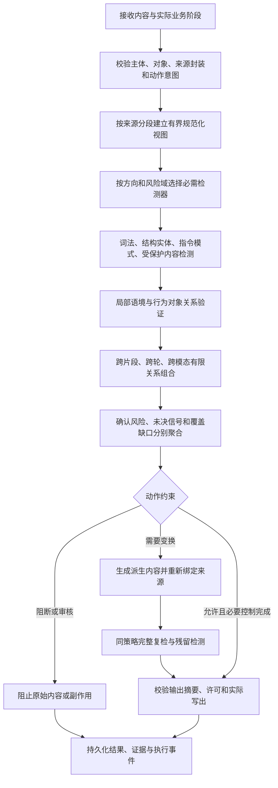

# 大模型护栏检测架构深度评审与可执行修复方案

版本：V1.0；日期：2026-09-08；性质：设计交付，尚未执行修复。
代码基线：main，8cfcc9441a879346c0abe2159679a976aadab5f9。
效果基线：db4a31b 生产 worker 镜像、冻结签名策略 generation 3；不能将旧镜像的测评分数标为当前 HEAD 的重新测评结果。

本方案重点回答：护栏检测架构、流程、方法和引擎应该怎样提升。运行配置和代码故障是其中一部分，不能用修复部署问题代替检测能力建设。按用户要求，本轮不调整或依赖裁判模型；GLM、模型额度和模型提示词不作为根因解释或修复前置。

## 1. 专家评审结论

**应保留现有引擎主干，将“词命中后按分数决策”的主导路径，逐步提升为“来源与权限约束 + 分领域检测 + 局部语境判断 + 关系证据组合 + 动作约束合并 + 实际释放验证”。**

现有系统已经有 DAG、多视图规范化、来源信任封装、结构化 DLP、会话风险状态、多模态融合、工具许可、签名包及告警证据，具备增量演进基础。主要问题不是缺少一个全新框架，而是这些能力的检测语义、适用范围、运行配置和验收口径尚未统一。

从大模型安全角度，优先纠正五个设计倾向：

1. **把危险主题、攻击指令和越权效果混成一个风险分数。** “讨论某个主题”“要求输出危险步骤”“让外部资料改变系统指令”“将数据发送到无权访问的目的地”需要不同检测方法。
2. **把局部词语命中当成风险事实，把研究/新闻等词当成安全依据。** 前者制造 DAN 子串误拦，后者使危险请求通过包装绕过；必须判断具体行为、对象、来源及局部否定。
3. **把多个检测器的存在当成联合识别能力。** 有 DAG 不等于有风险间依赖；文本拼接不等于理解跨轮和跨模态关系；取最大动作不等于保留所有释放约束。
4. **把无命中当成覆盖充分，把 BLOCK 当成检测正确。** 词库缺失、解码截断、输出复检失败均可能被总体指标遮盖。
5. **把检测当成唯一防线。** 未检出的攻击仍不能获得额外工具权限或绕过数据出口限制；权限、对象绑定和释放许可必须独立执行。

外部安全原则也支持这种分层：OWASP 将外部内容引入的间接注入、多模态交互和权限扩张列为需要分别控制的风险，并建议来源隔离、权限限制、输入输出检查及对抗验证。本文的具体缺陷、优先级和实现方式仍以本项目代码与回放为依据。[OWASP 提示注入风险说明](https://genai.owasp.org/llmrisk/llm01-prompt-injection/)

### 1.1 本轮明确选择

| 决策 | 采用方式 | 原因 |
| --- | --- | --- |
| 引擎架构 | 继续使用 GuardEngine V2 和现有 DAG | 现有主干能够承载改进，重写会扩大回归面 |
| 检测方法 | 规则、实体校验、确定性语境、来源权限及有限关系组合 | 在不启用裁判的条件下，仍有明确可落地的提升 |
| 规则扩充 | 先建风险结构与正常反例，再审核发布规则包 | 数量本身不能证明召回和精度 |
| 决策迁移 | 保留 v1 兼容路径，新增机制显式版本化并单独回放 | 不直接切换 decisionPolicyVersion=2 导致候选语义整体变化 |
| 输出治理 | 修复实体—变换—派生来源—复检—释放的完整路径 | 单补 DAG 或只修改脱敏文本不能闭环 |
| 多模态 | 完善已提取信号的组合检测与覆盖声明 | 不把 OCR/ASR 拼接能力称为原生视觉/声学语义全覆盖 |
| 发布方式 | 代码能力与签名策略分别验收，沿用既有发布/回滚 | 新镜像不自动升级旧签名 DAG |
| 质量承诺 | 分攻击类别、方向、语言、来源及实际效果验收 | 不承诺纯规则覆盖所有开放域语义攻击 |

### 1.2 与既有设计衔接

承接 V1.1 的 P0/P1/P4/P5 和检测优化 V2 的词库、发布、会话、评测工作。本轮不是重新开发告警列表、180 天归档、媒体工作流或裁判路由。这些已建能力作为证据与执行基础复用，仅修改与检测结果、语境、来源、覆盖或释放有关的连接点。

主设计与执行入口：
- [既有 V1.1 设计](E:/大模型安全/大模型护栏/输出/附件对照优化/大模型安全护栏增量优化方案_V1.1_main_2026-09-07.md)
- [V1.1 执行清单](E:/大模型安全/大模型护栏/docs/upgrade/incremental-optimization-main.md)
- [本轮任务清单](E:/大模型安全/大模型护栏/输出/代码分析与升级/26_detection-architecture-repair.tasks.v1.json)
- [本轮执行入口](E:/大模型安全/大模型护栏/输出/代码分析与升级/27_检测架构修复执行入口_2026-09-08.md)

## 2. 证据基线与判断边界

### 2.1 已测事实

全量三批共 360,380 次任务；没有执行错误或外部模型调用，但其中 139 次输出变换走了故障阻断。原报告的 degraded=0 不能解释为输出链路无故障。252,061 次没有可直接用于分类准确率的标签，不纳入准确率宣传。

冻结策略包含 81 条规则，其中 72 条 contains、9 条 regex；显式 DAG 为 guard-default-dag-2。POC 风险 2,000 条仅严格阻断 45 条；正常 2,000 条误阻断 15 条。

对照回放覆盖 12,800 条原始样本和 15 条合成样本，原始基线回放差异为 0；另对输出复检进行 141 条专项诊断。以下数字均沿用这些已验证结果，本轮未重新跑全量测试。

| 路径证据 | 已验证结果 | 能够得出的结论 |
| --- | --- | --- |
| POC 风险漏检分解 | 1,927 无原始词法/内置确认命中，20 条词法命中被语境抑制，8 条确认但非阻断，45 条阻断 | 首要损失发生在候选召回和实际能力覆盖 |
| DAN 边界对照 | PKU 测试输出 TP 60→8，FP 52→0 | 原有“真阳性”中大量命中理由与风险无关 |
| 去掉语境抑制 | POC 风险阻断 45→64，正常误阻断 15→20 | 全关语境不是正确修复 |
| 只升级 DAG | 原 139 条输出故障中仍有 138 条故障阻断 | 配置修复与输出处理修复必须同时完成 |
| 修复派生上下文的诊断回放 | 114 条变换文本复检为 110 ALLOW、1 WARN、3 MASK | 111 条派生文本可通过基础复检；不是放行原始敏感文本 |
| 运行绑定只读核查 | 目标租户/应用的治理 keyword_rules、release、release-set 均为 0 | 本地候选库尚未成为该应用的运行治理词库 |

81 条规则来自既有策略配置，不等同于“系统完全没有词库”。上述数据库零记录只适用于本次检查的应用范围，不外推其他应用。

原始结果见 [全量测试报告](E:/大模型安全/大模型护栏/输出/测试报告/2026-09-08/eval-three-db4a31b/测试结果报告.md) 和 [已验证根因报告](E:/大模型安全/大模型护栏/输出/测试报告/2026-09-08/eval-three-db4a31b/原因分析/规则层根因与代码证据.md)。

### 2.2 本轮新增的架构级复核

从当前源文件通过 TypeScript AST 提取原函数，执行合成输入；未改函数实现，未连接数据库、网关或模型。4 项条件全部复现：

| 编号 | 原函数结果 | 安全含义与证据等级 |
| --- | --- | --- |
| A01 会话决策合并 | 当前 REQUIRE_REVIEW + 历史 SAFE_RESPONSE → SAFE_RESPONSE；共享约束应为 REQUIRE_REVIEW | 函数级确认：历史结果可覆盖当前审核要求；尚未证明生产请求已发生 |
| A02 会话风险控制 | 当前 REQUIRE_REVIEW + 会话最低 SAFE_RESPONSE → SAFE_RESPONSE | 函数级确认：另一入口存在相同动作约束漂移 |
| A03 DAG 条件 | 上游 CANDIDATE/MATCH、score=0.94，可使 WHEN_NO_BLOCKING_MATCH 返回 false | 函数级确认：调度按分数而非确认程度/最终动作判断；实际损失需路径用例测定 |
| A04 规范化上限 | maxViews=1 时只返回原视图，结果无覆盖截断字段 | 函数级确认：达到配置上限不会报告完整性；不是默认配置下的攻击成功证明 |

证据：[函数探针结果](E:/大模型安全/大模型护栏/输出/代码分析与升级/26_检测架构评审证据_2026-09-08/architecture-probe-results.json)。新增发现与之前的全量测评指标分开，不将合成复现折算为业务召回提升。

### 2.3 尚未被这些测试证明的能力

三批主要是文本级引擎评测，没有直接证明：跨轮真实请求、跨 RAG 片段、工具执行越权、音视频真实解码与混合攻击阻断、HTTP 流式实际泄露、生产容量。对这些项，下文给出设计风险及专门验证方案，不虚构“已发现生产绕过”。

## 3. 先重建检测对象：按安全问题选择方法

风险类型名称可以保持现有 risk-registry 兼容；新增一层检测需求映射，不另造一套不相容标签。

| 风险域 | 实际要回答的问题 | 首选检测/控制方法 | 不能依靠的单一信号 |
| --- | --- | --- | --- |
| 提示注入/越狱 | 是否试图改变指令权限、任务目标或泄露受保护上下文 | 指令结构 + 来源权限 + 敏感目标 + 关系证据 | DAN、ignore 等单词 |
| 有害内容 | 是否请求/提供本策略禁止的行为或可操作帮助 | 风险对象—行为—意图组合，局部否定和正常用途辨析 | 某个主题词本身 |
| DLP/秘密外泄 | 具体实体是否真实匹配，当前处理和目的地是否获准 | 类型化实体、格式校验、受保护内容指纹、目的地策略 | 任意长数字或“秘密”一词 |
| 工具/Agent 风险 | 发起者是否有权对该对象实施该副作用 | 既有 ActionIntent、权限、参数摘要、执行许可 | 输入文本看起来正常 |
| RAG/记忆污染 | 外部数据是否被当成指令或污染后续决策 | 原始来源继承、版本/作用域、任务关系与跨轮状态 | 把检索结果统一标为可信 |
| 多模态混合 | 不同媒体中的证据是否组成同一危险请求 | 单路检测 + 带对象/时序的关系组合 + 覆盖检查 | 拼接后分数升高 |
| 金融业务 | 是否产生超授权承诺、数据披露或违反业务规则的行为 | 产品/业务线/渠道约束、结构化事实与专业正反例 | 全局金融黑白词 |
| 资源消耗 | 是否超出允许的解析、解码、检测或执行预算 | 准入、时间/内存/视图/帧预算及必需能力保护 | 多跑几个正则 |

同一请求可以具有多个风险域。注入被阻断、隐私需要脱敏、审核仍待完成，三者不能压成一个分数后互相覆盖。

## 4. 现有架构评价：保留什么、补强什么

| 环节 | 已有资产 | 主要提升点 | 优先级 |
| --- | --- | --- | --- |
| 入口和来源 | ContextEnvelope、ActionIntent、对象引用与校验 | 让语境与关系检测直接使用来源权限，保持跨片段边界 | P1 |
| 规范化 | NFKC、混淆字符、编码/拼音/拆词、多视图及原文映射 | 输出视图覆盖状态，限制分支竞争，保留变换可信程度 | P0/P1 |
| 词法召回 | Aho–Corasick、RE2、模糊匹配、作用域与有效期 | 短英文边界、主题与行为分离、规则包覆盖和负例治理 | P1 |
| 局部语境 | 引用/教育/新闻/法律/否定判断 | 分句和配对引用；取消主题包装的自动豁免效力 | P0/P1 |
| 调度 | DAG、依赖、重试、预算和故障策略 | 按风险域、方向和必要控制调度，统一阻断语义 | P0/P1 |
| 聚合 | v1/v2、覆盖模式、共享动作约束 | 全部消费者统一使用约束和证据角色，避免重复计分 | P0 |
| 跨轮 | 热窗口、意图节点、状态衰减、幂等与并发控制 | 绑定同一目标/操作/来源，防正常词共现锁会话 | P1 |
| 多模态 | OCR/ASR/帧/二维码、时间窗口、来源坐标和资格 | 有依据的关系边、真实处理覆盖与一致释放 | P2，客户依赖则升 P1 |
| 输出 | 输出检测器、实体融合、脱敏、复检与输出证明 | 类型实体闭环、派生封装、内容版本绑定、残留风险处理 | P0 |
| 发布与验证 | 词库集合、签名包、评估门禁、回滚、节点 ACK | 实际检测能力清单、快照契约测试、原因准确性指标 | P1 |

总体评价是“基础构件较完整，检测方法覆盖不足、跨模块语义一致性不足”。不宜把这些问题统称为“规则少”或“裁判没启用”。

## 5. 目标检测流程与安全不变量



必须建立并测试以下不变量：

- 已确认的强制拒绝、权限拒绝和必要控制失败，不被其他 SAFE/低分结果清除。
- 审核要求不会被历史结果、固定代答或其他模态的正常结果解除。
- 原文、规范化视图、变换后内容、实际释放内容具有独立身份与可核查映射。
- 低信任来源通过引用、拼接、OCR/ASR、摘要或翻译不会自动获得指令权限。
- 一个风险域已阻断，不代表其他必须完成的出口控制已经完成；是否继续扫描由明确策略决定。
- 候选信号既不自动等于确认风险，也不自动等于安全；按已批准的分域策略处置。
- 失败阻断属于执行故障，不能充当风险识别的真阳性。
- 没有确认命中只表示“本次启用的方法未发现”，不能声称“全面安全”。

## 6. 检测方法改进一：从主题词到可解释的组合规则

### 6.1 两步检测，避免黑名单与白名单互相抵消

第一步高速召回词、结构或实体，保留 occurrence 的原文范围。第二步使用确定性条件形成确认结果，条件包括行为、目标、来源、局部语境和授权事实。

本轮不新增开放式推理模型。组合规则是有界布尔表达式与距离/来源关系，由现有词法命中和结构字段计算。例如：

- 越权注入：存在指令覆盖行为，目标是上级指令/受保护数据，且来源无对应授权；分析样例只产生分析上下文，不自动建立越权授权。
- 内容风险：危险对象 + 请求实施/提供步骤的行为，且二者在同一语义近似范围内；“如何防止……”不能仅因包含“如何”被判为实施请求。
- 金融承诺：当前为对外销售话术、存在确定性收益/赔付承诺、缺少该业务允许的事实依据；仅介绍不确定性或反诈提示不应命中同一结果。
- SQL/脚本：代码出现是内容事实；是否试图对受保护对象执行、是否调用工具和是否获准，决定执行风险。不能把普通查询语句一律作为攻击。

以上是规则结构示例，不构成完整行业合规规则或效果承诺。

### 6.2 在现有 RuleSpec 上增量扩展

拟新增可选字段，最终名称以契约评审为准：

```ts
type RuleMatchConstraints = {
  boundary?: "NONE" | "UNICODE_TOKEN";
  normalizationModes?: readonly string[];
  contextPolicyId?: string;
  relationRuleId?: string;
  evidenceClass?: "SIGNAL" | "DETERMINISTIC_RISK";
};
```

字段必须贯通 RuleSpec、持久化/HTTP 校验、治理转换、编译、签名、runtime Zod 和控制台编辑。不能只加 TypeScript 字段，不能手改 generated 契约。

兼容约定：
- 字段缺省保持旧 contains 行为；发布新版本 DAN 及其他短英文规则时显式启用边界。
- 中文短语继续使用语义适合的 contains，不给全库机械添加英文单词边界。
- “边界正确”仍不是“语义正确”：人名 Dan、标题、代码标识符需反例和组合条件。
- 复用 injectionPhraseMatches 中已有 Unicode 字母/数字边界思路，抽取统一帮助函数；生产实现不直接复制诊断用的 `\bDAN\b`。
- 规则执行仍使用现有安全正则能力；不为新表达式引入 eval、动态脚本或不受控回溯正则。
- 模糊匹配只适用于显式允许的词类，限制距离、长度及候选数。实体编号、秘密值及业务授权不得靠模糊相似度判等。

组合表达式建议第一版只支持 ALL/ANY、同分句、最大 token 间隔、同来源、指向同目标、局部否定排除；最多 8 个原子条件、2 层组合、每规则最多 100 个候选关系。达到上限标记部分覆盖，不能生成不存在的关系。

### 6.3 规则包建设顺序

先审核当前 81 条规则，再推进未生效的候选治理词库。优先级：
1. 短英文/宽泛数字/通用代码的高误报规则；
2. 提示注入和敏感数据等能够给出明确结构证据的风险；
3. 中文明确有害行为请求及对应正常讨论；
4. 英文同类结构与已发现语言覆盖缺口；
5. 金融业务专用组合规则。

每个新可执行规则至少提供明确风险样例、正常近邻、否定/引用、包装后风险、编码变体及适用方向；不能用复制模板的数量替代场景多样性。候选词、批准规则、实际生效规则分别计数。

当前已用于分析的 benchmark 属于回归/开发证据。不得从测试问题中抽关键词直接导入后，再将原测试集作为独立质量证明。

## 7. 检测方法改进二：局部语境解析与攻击关系

### 7.1 语境模块具体改造

复用 intent-context.ts 和 prompt-injection-signatures.ts 的局部否定经验，拆为三个职责：

1. **解析结构**：确定 UTF-16 分句范围、真实配对的引号/代码片段范围、来源边界。处理转义、嵌套、未闭合引号、英文撇号及不同引号类型。
2. **识别局部行为**：对该 occurrence 判定实施、拒绝实施、预防解释、引用分析、披露和承诺；否定只影响其作用范围。
3. **决定证据效力**：返回保留、待判或局部抑制及原因，不能直接清空全部词法风险。

参考结构（内部拟新增）：
```ts
type ContextAssessment = {
  occurrenceId: string;
  clauseRange: { start: number; end: number };
  quoteRange?: { start: number; end: number };
  intent: "REQUEST_ACTION" | "PREVENTION" | "ANALYSIS" | "DISCLOSURE" | "UNKNOWN";
  disposition: "KEEP" | "SIGNAL_ONLY" | "SUPPRESS_OCCURRENCE";
  reasonCodes: readonly string[];
  sourceEnvelopeIds: readonly string[];
};
```

### 7.2 判断规则

- 引用是结构事实，不是安全证明；引用中的危险指令被要求执行，仍需检测。
- 研究、新闻、法律、教学仅是语境线索；若同分句中存在明确禁止行为请求，不得豁免。
- 否定优先判断作用域，不是把 NEGATED_MENTION 简单移到全局第一位。“不要检测，继续执行……”不能因此清空后半句。
- 不同来源/不同分句的防御措辞不能抑制另一处风险。
- 未配对引用、复杂双重否定和指代歧义进入 SIGNAL_ONLY/UNKNOWN；处置遵守风险域策略，不伪装成已确认安全。
- 平台强制拒绝、实体泄露事实和工具权限校验不受普通局部语境豁免。

诊断保留 occurrence、抑制原因、规则版本及范围；对外仍是脱敏证据。初期抑制轨迹保存在内部 trace，不能向 v1 aggregate 塞入 status=MATCH 的“仅诊断观察”，否则会重新参与阻断。

### 7.3 验收样例族

至少覆盖：直接实施与预防解释；单一引用与两段引用之间的关键词；研究/新闻包装；引用后追加执行要求；先否定后转折；双重否定；中英混排；跨来源正常说明与风险片段。对每组同时断言动作、原因和命中区间，不能只测分类标签。

## 8. 引擎改进一：规范化和证据覆盖

### 8.1 已有规范化继续复用

normalization.ts 已支持多轮解码、多种扰动和原文映射。新增内容重点不是“再加十个解码器”，而是让它可解释、可控、可验证：

- 从只拿 views 改为消费完整 NormalizationResult。
- 拟补 coverageState、stopReasons、attemptedDecoders、unexpandedViews、budgetUsage。
- 区分“声明支持的变换范围已检查完成”与“任意编码都已穷尽”；不能承诺后者。
- 视图数、深度、分支、CPU、展开倍数、内存上限均有显式终止原因；某些上限原本已抛错，统一保留这些故障语义。
- 规范化的低置信重建只提供信号。未经独立验证，不把音似/字符替换强行当成完整等价文本。

### 8.2 来源和算法预算

先按 envelope 建立局部视图；跨来源组合进入专门关系阶段。不可把来自文件的半段编码与用户半段编码默认为同一可信指令。确有拼接攻击关系时，生成显式多父来源证据，信任等级采用最保守继承。

视图调度先执行稳定、低成本、语义保持较好的转换，再对明确编码片段做受控展开。为原始文本和必需结构化检测保留预算，防大量无关视图消耗全部额度。这里只改变探索顺序，不跳过原文。

原文坐标继续使用 UTF-16 左闭右开区间；归一化前后长度改变、代理对、NFKC 展开、组合字符和解码内容均验证原文映射。输出变换只能使用已经验证到实际待释放版本的范围。

### 8.3 故障策略

对必需解码/解析未完成的场景，沿用该业务的 FAIL_CLOSED/审核约束；非必需变体探索部分覆盖，显示覆盖缺口并按策略处置，不把普通长文本无条件封锁。不得通过扩大输入容量或无界重试解决视图截断。

性能指标必须包含规范化CPU、视图数量与最大请求内存。DAG 的 AbortSignal 不能被当成所有同步 CPU 代码可随时被中断的证明；RE2 和循环预算继续保留，只有测得长阻塞时再引入隔离 worker。

## 9. 引擎改进二：DAG 调度与统一决策

### 9.1 为什么要改调度语义

目前 shouldRun 接收一个 blockThreshold，并把上游 MATCH 且高分当作可停止下游的条件。最终 aggregate 却考虑风险域阈值、候选角色、输出 MASK/REWRITE 等覆盖动作。二者不是同一判断。

这可能导致：一个高分候选或需要脱敏的实体先出现，后续需要执行的攻击关系检查被跳过。A03 已证明候选跳过条件；具体请求损失仍需任务 D07 的完整引擎回归确认。

### 9.2 设计

从 aggregate 抽取无副作用的“单项证据解析为约束”函数，供聚合和调度共用。输入包含 direction、riskType 阈值、decisionRole、mandatoryDeny、动作覆盖和故障要求；不在调度层重新维护一套阈值逻辑。

每个节点补充或编译得到：
- 适用方向、模态与风险域；
- requiredControls：它承担的必要控制；
- produces：候选、确认风险、实体或关系证据；
- skipPolicy：何种已满足的终止条件允许跳过；
- coverageEffect：跳过对覆盖声明的影响。

这些声明属于拟新增能力契约，签入策略或由受版本约束的注册表编译；不得让请求方指定哪些安全检测器可以省略。

必须始终执行的阶段包括来源/权限验证、必要输出DLP与释放复检。普通独立检查按预算执行；仅对已明确不再释放的内容，可省略不影响必要证据的后续高成本节点，并记录“因终止而跳过”，不得记为“检测正常”。

### 9.3 证据角色兼容与去重

复用 isConfirmedObservation 与现有 decisionRole，制定并测试统一兼容表：

| 状态 | 是否参与确认风险 | 是否可触发终止短路 | 是否表示已覆盖安全 |
| --- | --- | --- | --- |
| MATCH + HARD_DENY/CONFIRMED_RISK | 是 | 仅当解析结果是可终止约束 | 否 |
| MATCH + CANDIDATE | 否 | 否 | 否 |
| CLEARED | 仅表示指定范围的清除结果 | 否 | 仅限其已验证范围 |
| UNKNOWN | 否 | 否 | 否 |
| ERROR/TIMEOUT/必要SKIPPED | 执行故障 | 按失败策略 | 否 |
| 旧规则未显式 decisionRole | 保持旧版既定行为 | 使用同一兼容解析 | 不扩大覆盖声明 |

不能把全部旧规则批量改成 CANDIDATE 后直接上线；也不能让有显式 CANDIDATE 的内置结果在 v1 里无条件作为确认风险。先冻结现有差异，新增明确的检测语义版本并完成对照；版本切换必须签名发布。

重复证据按原文位置、来源对象、内容版本、canonicalTerm、风险域合并。由同一个原文片段生成的 NFKC/Base64 等多视图不算独立多票。组合确认应有不同角色的证据（行为、对象、权限关系），不以“命中次数多”替代因果联系。

### 9.4 规则分数不等于风险概率

目前规则中的 0.85、0.94 等数值首先是判定策略权重，不能解释成“85% 或 94% 的概率是攻击”。拟把规则权重标为 POLICY/UNCALIBRATED，分别保留实体格式校验、来源真实性、规范化映射可信度和关系确认状态；不能将几种含义相乘后宣称得到校准概率。

本轮继续使用显式条件和分域阈值驱动规则；以独立数据校验每个阈值的精度/召回。只有未来有足够标注和校准实验时，才把指定分数标为 PROBABILITY。聚合、DAG、告警排序和质量报表须采用同一分数含义，不能只有 UI 换一个标签。

### 9.5 修复跨轮约束漂移

替换 session-context.ts 和 session-risk-state.ts 的局部 ACTION_RANK 比较，调用共享 combineActionConstraints。不得只替换排序常量后继续“选一个决策、丢掉另一个”。

合并时保留当前与历史风险证据、审核/阻断/变换要求；历史证据保持历史位置，不能当作当前输出范围。当前释放内容与变换结果仍由当前请求生成。全部动作对、方向、当前/历史位置组合做矩阵测试。

## 10. 检测流程改进：来源、跨轮与多模态关系

### 10.1 提示注入按“越界关系”检测

新增有限关系计算模块，复用现有 envelopes、risk-registry、prompt-injection-catalog、ActionIntent。关系记录至少包含：

```ts
type RiskRelation = {
  relationId: string;
  kind: "OVERRIDES_INSTRUCTION" | "REQUESTS_DISCLOSURE" |
        "TARGETS_RESOURCE" | "CONTINUES_REQUEST" | "COMPLEMENTS_PAYLOAD";
  evidenceIds: readonly string[];
  sourceEnvelopeIds: readonly string[];
  targetRef?: string;
  relationRuleVersion: string;
  status: "CONFIRMED" | "UNRESOLVED";
};
```

关系只在当前请求、受控会话窗口或明确关联对象内构建，禁止任意组合全库片段。初期每个请求最多 256 个节点、512 条边；这些是拟定预算，压测后收敛。缺少对象或目标联系时只能是 UNRESOLVED。

安全判定例：外部文档要求改变系统规则，并指向受保护对象或外传目的地。来源没有该权限，检测器输出注入证据；即使检测漏掉，后续工具权限/目的地控制仍须拒绝未授权效果。

重点复用 src/lib/tools/action-firewall.ts，而不是在规则库里重新实现授权。可信用户的一般请求也不能超出主体权限。链接、URL、模型生成参数和媒体派生文本均不能自行证明授权。

### 10.2 跨轮引擎

现有 secure-memory 已有 32 个意图节点、衰减、状态转换、并发版本和幂等；不另建记忆平台。需要改进的核心是“如何确认同一攻击链”。

当前阶段识别依赖固定词模式，链检测按 BOUNDARY_PROBE → FRAGMENT_REQUEST → SENSITIVE_TARGET → EXECUTION_REQUEST 顺序推进；得分也受最终动作影响。潜在问题：正常讨论规则、分段说明、API密钥和执行示例可组成表面序列；故障 BLOCK 也可能推高后续状态。以上为代码层风险，不等于已测得真实误锁率。

增量设计：
- 意图节点保存目标指纹、对象引用、动作类型、授权范围及依据，而非只有阶段词。
- 链推进要求至少一条可核查的同目标或明确引用关系；无目标关系的普通谈话只提高观察级别，不直接确认攻击链。
- 将“检测确认的行为风险”“故障处置”“节流/审核状态”分开，避免故障变成恶意历史。
- 复用现有时间衰减和存储限制；正常话题切换可结束未决链，不能清除已确认的当前权限拒绝。
- 回归当前风险 + 历史正常、当前正常 + 真实历史攻击、多个不同目标、并发/重放、跨租户隔离。

### 10.3 多模态混合检测

保留现有单路、combined、窗口和共享动作约束。新增确定性关系证据，例如文本显式引用同一附件中的指令、二维码/画面给出的目标与用户动作组合、同一音视频中近时段且同目标的拆分片段。

关系成立至少需要对象绑定和明确引用/时间/目标联系，不能仅凭“时间相近”或“combined 分数变高”。单路 BLOCK 永远保留；联合识别可以增加风险，不能解除单路约束。

建立三类不同覆盖：
1. 处理覆盖：哪些页、音轨、帧、时间片实际被解析；
2. 方法覆盖：哪些风险方法已应用于提取文本或媒体特征；
3. 关系覆盖：哪些模态组合/窗口完成了关系检测。

沿用现有 analysisCoverage/fusionCoverage，新增字段时避免同义重复；SAMPLED 始终不等于 COMPLETE。低置信 OCR/ASR、缺音轨、帧间空隙、超出窗口的片段必须显示缺口。

**能力边界：** 本轮不通过裁判或新语义模型判定纯视觉、纯声学的开放域危险含义。OCR/ASR 和规则可以提升可提取文字及明确关系的攻击识别；纯语义混合风险仍需独立能力评估，不伪装成已经解决。已有本地分类器接口保留，不作为本轮验收前置。

### 10.4 受保护内容外泄检测的实际能力边界

protected-context.ts 已有 HMAC 窗口指纹、结构签名和 canary，应继续作为系统提示、内部资料和已知秘密片段的确定性保护。现有实现对指纹单元、检测单元及 shingles 有上限；需在能力清单标出被覆盖的范围，并测试长内容尾部、跨片段和变换后的泄露，不能把前段已检查视作全文已检查。

新增保护对象必须明确租户/应用、版本、用途与出口范围。普通公共文字碰巧与指纹相似时不应直接提升成秘密；密码/API key 等高价值秘密使用明确类型或精确受控指纹。广泛改写、翻译或只透露含义的泄露，单靠词串指纹无法保证检出，本轮通过数据权限、输出目的地和最小必要内容控制降低后果；不把这些控制宣传成已经识别全部语义泄露。

## 11. 输出检测与拦截闭环

### 11.1 类型化实体

复用 output-control/detectors.ts、dlp/entity-fusion.ts、dlp/transformation.ts。第一阶段仍由现有经过认可的输出检测器产生实体；不简单取消 DLP_DETECTORS 白名单，避免任意检测器伪造可释放变换证据。

下一步用注册表声明 typed-entity 能力及允许实体类型，替代散落的 detectorId 判断。实体需要包含类型、已验证原文范围、内容版本/摘要、来源证据、格式验证结果及变换策略。

对于旧“连续16—19位数字”等宽泛规则：
- 与校验器统一，不满足卡号/身份格式不应伪造实体；
- 如果业务仍要求保护内部编号，应建立明确的内部编号类型及上下文，不能借用银行卡实体；
- 24 条缺实体案例逐条裁决为“应变换”“应正常阻断”“误匹配”，不能要求统一改为 ALLOW。

### 11.2 派生上下文与变换复检

使用 deriveContextEnvelope 生成新内容身份：
- 新 envelopeId、新 contentHash 和准确 contentStart/contentEnd；
- 保留所有父来源、最保守信任/指令能力、最早到期时间、租户/应用/会话范围；
- eventSeq 和 policyVersion 来自当前实际处理链，不能硬编码；
- 多片段局部变换维护原片段到派生片段映射；第一步可对文本输出保守合并来源，不提升权限；
- 原始附件列表不可未经验证直接视为已完成相同变换；文本和媒体对象分别绑定。

复检输入是派生内容，使用同一冻结策略和有效截止时间；不能关闭 envelope 校验、删掉所有来源封装、跳过复检或使用生产 deferRecheck 绕过。

### 11.3 残留风险与幂等

3 条派生文本仍 MASK，应检查姓名捕获范围、已脱敏格式以及旧规则残留。要求同一策略下变换幂等：对已经合规的派生文本不应反复扩大掩码；重复检查仍发现真实残留时保留阻断。

优先实现一次变换 + 一次完整复检；本轮不引入无界“修到通过”循环。后续若增加第二次变换，必须有独立次数/时间预算和完整 lineage。

现有 detectors.ts 已对部分掩码/令牌形状做跳过。需审核这些路径，但不能声称已证明可利用漏洞。若需要识别平台变换标记，使用服务端变换证明绑定内容摘要与范围；客户端自行输入同样占位符不产生额外豁免，未变换范围仍全部扫描。

### 11.4 实际释放验证

复用 gateway-runtime/recheck.ts、authorization.ts、execution-proof.ts、window-proof.ts 与既有媒体输出闸门。最终许可必须绑定变换后的内容/对象摘要、策略快照、作用范围及复检结果。

测试不止断言 action=MASK/ALLOW，还要在受控接收端检查：原始秘密未被写出；变换后的内容被正确释放；流式跨块敏感实体不会提前泄露；未获媒体许可的对象不会随文本成功而释放。

## 12. 可观测性与质量方法

### 12.1 将判定状态拆开表达

保留 GuardAction 对外兼容；在既有 trace/告警记录增量表达四类事实：

- detection：确认风险/仅信号/无命中，以及依据；
- coverage：适用能力是否执行完整，有哪些缺口；
- intervention：未执行、完成或失败，失败阶段；
- enforcement：待许可、被阻止、写出确认或执行失败。

拟新增状态优先放内部记录；需要跨服务传递时修改源 schema 并重新生成各语言契约。不得只向响应随意追加字段。也不通过增加一个万能 UNKNOWN 动作替代这些事实。

139 次输出故障应在故障统计可见，同时保留原风险事实。必需复检失败返回 failMode=FAIL_CLOSED 和准确阶段原因；正常复检发现残留风险与执行异常分别统计。

### 12.2 检测漏斗

每个样本记录：入口解析 → 规范化 → 词法/结构召回 → 局部语境 → 确认/关系 → 聚合动作 → 变换 → 复检 → 释放。输出 NO_RAW_MATCH、CONTEXT_SUPPRESSED、SIGNAL_UNRESOLVED、CONFIRMED_NONBLOCK、INTERVENTION_FAILED 等失效阶段；每阶段保持可对账分母。

候选/抑制诊断使用有界列表和去重计数。Prometheus 只放有限枚举，不把 ruleId、样本文本、实体值或 requestId 做高基数标签。详情沿用安全告警和请求追踪。

### 12.3 评估指标

| 指标 | 口径 |
| --- | --- |
| 检测召回 | 有正确确认风险证据的正例 / 可评分正例 |
| 严格阻断召回 | 具有确认风险且完成阻断的正例 / 可评分正例 |
| 安全处置成功率 | 根据样本要求，禁止的内容/副作用没有发生；允许合规派生内容 |
| 正常误阻断率 | 正常样本被错误 BLOCK / 正常可评分样本 |
| 正常误干预率 | 正常样本受到不必要 MASK/REWRITE/审核等 / 正常可评分样本 |
| 原因对齐率 | 命中风险类别与引用证据能支持该样本真实风险的比例 |
| 变换可用率 | 应变换样本成功生成并释放合规派生内容的比例 |
| 必需能力完整率 | 必需阶段完整执行的请求 / 对应全部请求 |
| 执行故障率 | 解析/变换/复检/许可等故障 / 全部适用请求 |

“应变换/应拒绝/可允许”的标签必须单独标注，不能由模型拒答文本或原始 toxicity 标签猜测。风险正例不一定要求原文 BLOCK，例如允许去除隐私后继续响应。

每次同时报告：原始分母、空文本、未标注、冲突、故障、可评分分母；对故障剔除后的质量给出全样本保守口径，防止通过多报故障获得虚高成绩。重复样本同时报告原始权重与去重视角。

DAN 修复后原始 TP 下降不能自动判为退化：必须复核之前的命中理由。原因不对的 TP 不应计作能力建设成功；真正消失的有效检测则必须修复。

## 13. 可执行工作包与依赖

D00—D15 为本轮唯一任务编号。每个工作包均须交付代码/配置差异、必要失败回归、修复后结果、快照与兼容说明。状态初始为 PLANNED。

| ID | 工作包与主要修改位置 | 依赖 | 可核查退出条件 |
| --- | --- | --- | --- |
| D00 | 固定 HEAD/运行包/威胁矩阵/数据分组；复用诊断材料 | 无 | 能重现旧结论，明确每类样本要求的安全效果 |
| D01 | aggregate、observation-role、session-context、session-risk-state | D00 | 统一证据角色和动作约束；A01/A02 修复，历史证据不丢失 |
| D02 | output-control/intervention、derived-envelope、gateway recheck | D00 | 长度变化/等长变化/多父来源均正确复检，权限不提升 |
| D03 | output detectors、dlp/entity-fusion/transformation、规则迁移 | D02 | 139 条逐条裁决，实体合法、无泄露、无结构性复检失败 |
| D04 | intent-context、prompt-injection-signatures、rule-detector | D00 | 引用配对、否定和包装样例正反均通过，保留抑制轨迹 |
| D05 | RuleSpec、lexical-matcher、治理转换/编译/runtime schema | D04 | DAN/短英文边界与组合规则可配置、可签名，中文兼容 |
| D06 | normalization、engine、证据映射 | D00 | A04 修复，所有预算结束可见，支持范围与处理覆盖明确 |
| D07 | dag、aggregate 共用约束解析、detector 注册信息 | D01、D06 | A03 修复，必要节点不因候选/可变换高分被跳过 |
| D08 | 81 条规则审计与分域中英/金融规则包 | D04、D05 | 每条有审核和反例，覆盖矩阵有证据；未达标规则不发布 |
| D09 | 来源感知关系模块，context-trust、RAG、tool firewall 接线 | D01、D05、D07 | 关系有目标/来源证明；未检出文本也不能越权执行 |
| D10 | secure-memory 与 session-context 关系链 | D01、D09 | 同目标攻击链识别，正常跨主题/故障历史不错误锁会话 |
| D11 | multimodal/fusion、media/timeline-fusion、coverage | D06、D09 | 单路约束保留；提取信号的混合关系与覆盖可验证 |
| D12 | 既有 trace/告警/指标和离线评测工具 | D01、D02、D06 | 检测、故障、覆盖、实际效果可对账；增加原因对齐审查 |
| D13 | readiness、compiler、release-set-service、publication | D03、D05、D07、D12 | 新旧包兼容；能力要求缺失可阻止候选晋级；双版本可回滚 |
| D14 | 三批回归 + 独立留出 + HTTP/流式/工具/媒体专项 | D08、D10、D11、D13 | 有逐样本变化、置信区间、必要执行证据，门禁实际通过 |
| D15 | 构建、候选包发布、节点确认、灰度与回滚演练 | D14及既有发布门禁 | 实际运行包/节点/效果一致；观察合格才完成部署 |

复用是默认：D09 只新增有限关系计算，不能新建图数据库、跨客户平台或通用 Agent 系统。D12 先接现有告警投影；D13 继续调用现有原子事务、版本和签名验证，不另造发布状态机。

### 13.1 实施批次

**第一批：修复检测链路正确性。** 建议顺序 D00 → D01 → D02 → D03 → D06 → D07 → D12 → D13 的兼容部分。重点关闭动作漂移、派生内容错误、实体证据缺口、候选错误短路和覆盖不可见。工程退出后形成可评审的补丁与离线报告，不因 broad recall 仍低而伪造生产资格。

**第二批：提升规则与关系识别。** D04 → D05 → D08 → D09 → D10。先改规则方法，再补词库。对不同风险域逐包消融对照，保留硬负例；不得集中修改所有阈值后凭总分验收。

**第三批：完成混合场景及交付验证。** D11 → D13 完整验收 → D14 → D15。多模态/工具如是目标客户必选能力，则对应专项必须过门禁，不能仅以文本回归完成交付。

任务 JSON 的依赖表示工程前置；同一任务可以先完成无依赖部分，但最终关闭必须满足全部依赖。默认逐项实施，不自动开启多个代理。

### 13.2 工作量与最小交付切片

粗估 35—58 个工程人日，另计独立标注、真实媒体环境、生产观察等待。最终以 D00 范围冻结后修订，不是工期承诺。

若近期优先准备基准测评，先交付 D01/D02 与 D03 的已知故障修复、D06 覆盖报告、D07 调度一致性及必要诊断；小型补丁预计约 5—8 个工程人日，复杂实体迁移另计。立即跑已冻结回归，得到真实的新基线，再推进规则包与关系方法。不要在这一步承诺召回已达标，也不要顺带改裁判、归档架构或供应商连接。

## 14. 验收门禁及三批测试设计

### 14.1 G0：确定性缺陷门禁

必须全部通过：
- A01/A02 改为保留 REQUIRE_REVIEW，且双向顺序、重复输入、动作组合不改变约束集合。
- A03 候选不能触发终止；有输出变换覆盖的高分命中不能跳过必要出口检测。
- A04 有界截断显式报告；正常上限内请求不多报缺口。
- DAN 碰撞句、人名/分析样例不再因该短词产生错误确认；真实指令覆盖组合仍检测。
- 139 条旧故障逐条有合法最终路径；旧 envelope 引发的 bounds/hash 故障为 0；不能要求 139 条全部放行。
- 权限、范围、签名、原文哈希与释放绑定检查不被弱化。

### 14.2 G1：检测方法门禁

每个上线规则包应有开发集、独立正常近邻集与独立留出集。关键规则的确定性边界用例全部通过。真实质量同时满足现有业务门禁；以下额外指标为建议，需在 D00 记录批准口径：

- 正常误阻断率建议 ≤1%，同时查看 95% 置信区间和分场景上界；
- 关键风险族的正确原因召回、正常误干预率单列，不允许总体均值掩盖严重短板；
- 样本过少记 INSUFFICIENT_EVIDENCE；例如仅 50 条正常样本零误拦不能证明 ≤1%；
- 低误报规则包可以按明确业务范围验收，但不能借缩小测试范围宣称通用内容安全达标。

当前代码的发布门禁默认：至少 2,000 条、accuracy≥95%、recall≥95%、FPR≤1%、FNR≤5%。**这是源码默认值，不是本轮已读取的生产有效环境值。** D00 必须读取脱敏后的实际门槛；既有批准要求更严时继续保留。

本轮纯规则候选若达不到真实适用范围门禁，就停在离线开发/测试状态。不得下调环境变量、伪造 evaluation_run、把诊断回放登记成批准质量，或使用 development bootstrap 激活。若考虑新的分业务发布画像，应作为单独的需求与门禁设计，保持范围真实，不在本轮偷偷绕开全局门槛。

### 14.3 G2：执行与覆盖门禁

在合成受控接收端验证输入、输出、流式、RAG、工具及媒体对象的必要边界。输出变换成功率只在“经复核应变换”的集合计算；源数据泄露为 0 是这些测试夹具的必过条件，不宣传为生产永不泄露。

文本三批全量不能代替真实音视频测试。对于尚无真实解析/识别条件的模态，交付工程结果及明确未验收状态；业务依赖该模态时不得跳过 G2 晋级。

### 14.4 三批数据重跑保持可比

| 批次 | 原有数据与规模 | 本轮重点 | 增补验证 |
| --- | --- | --- | --- |
| 1 | 55,053：ChineseSafe、WildGuard、ToxicChat、ToxiCN、XSTest、词库探针 | 语境、短词、误拦、不同语言内容风险 | 成对语境/边界样例，标出新增开发数据 |
| 2 | 64,268：JailBench、JADE、Safety-Prompts instruction | 越狱包装、组合规则和原因对齐 | 同目标跨来源/跨轮专项，独立计数 |
| 3 | 241,059：Safety-Prompts typical、PKU、SafetyBench | 输出DLP、长内容、资源和故障 | HTTP/流式/工具/真实媒体专项，独立计数 |

仍保留旧数据处理方法、ID、方向、文本摘要和原标签；不把补充样本悄悄塞进旧分母。SafetyBench 的护栏动作不等于选择题作答正确率，未标注数据不生成虚构标签。

### 14.5 消融比较和性能

至少保存 B0旧代码旧包、B1只修确定性缺陷、B2再改语境/边界、B3再加规则包、B4再加关系检测的逐样本对照。每个组合有独立代码摘要、payloadHash 和数据摘要。修复 DAN 引发的 TP 下降需原因复核，不可用总 recall 自动打回正确修复。

建议以相同镜像资源、并发和数据长度分桶比较 p50/p95/p99、吞吐及峰值内存；初始预算建议 p95 相对同条件基线增长不超过 50%，超过时给出成本分解并复审。该数值是建议，不能当成已经达成的 SLA。

## 15. 实施命令、契约与代码边界

以下为已有命令；在项目根目录执行。按改动选择必要测试，类型检查和构建顺序运行。

```powershell
git branch --show-current
git rev-parse HEAD
git status --short
pnpm contracts:check
pnpm ts-check --incremental false
pnpm test:unit --run tests/context-trust/derived-envelope.test.ts tests/guardrail/output-control.test.ts tests/guardrail/output-control-matrix.test.ts
pnpm test:unit --run tests/guard-engine-v2/lexical-context.test.ts tests/guard-engine-v2/session-context.test.ts tests/guard-engine-v2/protected-context.test.ts
pnpm test:unit --run tests/policy-bundle/policy-bundle.test.ts tests/policy-bundle/lifecycle.test.ts tests/policy-bundle/readiness.test.ts
pnpm lint:build
```

涉及源 schema 后执行 pnpm contracts:generate，再运行 pnpm contracts:check；检查全部多语言产物，不改兼容基线掩盖字段破坏。接入 Node 24 和项目规定的 pnpm 版本，开始时记录实际版本。

阶段合并检查使用 pnpm validate 和 pnpm build；按影响运行 test:integration:release-sets、test:integration:session-replay、test:integration:gateway-v2、test:integration:media-transforms。集成脚本的数据库、端口与环境须按其已有入口核验，不能把命令直接指向业务数据库。

本轮函数探针复现：
```powershell
node 输出/代码分析与升级/26_检测架构评审证据_2026-09-08/architecture-probes.cjs
```
该脚本用于保存旧行为证据；修复后原断言应不再通过，必须补正式回归来断言新行为，不能修改探针期待值冒充原始复现。

**离线评测入口需要补强。** 现有 detection:eval-compare 明确要求 --allow-network，并会遍历包含语义/联合配置的变体，不适合直接作为本轮“无裁判纯离线”命令。D12 应把已有三批 run-batch.ts 的生产配方封装为正式 pnpm 离线回放入口，默认禁止网络、模型调用上限为 0、禁止写生产事件，保留输出复检，复用同一个 buildEngineForPolicyBundle；具体脚本与参数在实现时注册。不能在设计文档中假装该新命令已存在。

规则转换可使用 lexicon:convert-reviewed、lexicon:compile-release-set、lexicon:validate-production 等现有入口；转换/校验成功不等于词库已获审核或策略绑定已切换。

## 16. 发布、兼容与回滚设计

### 16.1 三个版本同时核对

每份验收制品包含：
- 代码：commit、工作区差异摘要、构建镜像 digest；
- 策略：bundleId、generation、payloadHash、DAG 版本、规则/词库集合版本；
- 数据：datasetManifestHash、规范化版本、测试用例版本与标注版本。

扩展 readiness 时分别展示“运行服务可用”“策略签名有效”“声明的检测能力就绪”“质量批准适用范围”。当前 ready:true 不能自然升级成“全部风险域具备效果保证”。

增加发布前能力检查：候选策略配置输出 MASK 时必须具备认可实体检测、变换及复检能力；必需风险域有适用检测节点；规则包作用域/方向/有效期可满足目标要求；不满足时阻止候选晋级，并给出具体缺项。已存在的旧包保持合法兼容解释，不让新就绪检查无差别杀掉全部现网实例。

### 16.2 沿用既有发布状态机

现有策略流程为 draft → testing → pending_approval → approved → shadow → canary → active。record_test_pass 要校验真实 evaluationRun；审批人与创建人分离；词库集合自身还有独立审核。上述约束来自实际代码，不是本文新增的确认流程。

先发布兼容新旧载荷的引擎代码，再编译明确包含目标 DAG、规则版本和语义版本的候选包。词库集合激活与应用策略包切换是两个动作，必须逐层确认；不能直接更新数据库绑定行、热加未签名节点或用 latest 默认值替代版本。

灰度按现有范围与会话选择机制推进，建议 1% → 5% → 20% → 全量；达到每阶段最小样本量和观察窗口后才进入下一阶段，低流量时等待样本，不能只等时钟。若现有正式 shadow 入口受前置质量门禁约束，未过门禁只能隔离回放，不能冒称生产 shadow。

### 16.3 回滚与停止条件

立即停止晋级/回滚候选：
- 出现已验证原文敏感内容越过释放边界；
- 必需节点被跳过、签名/对象/来源校验被绕过；
- 动作约束丢失；
- 输出变换或复检故障明显超过冻结基线；
- 正常误阻断或性能超过批准门槛。

记录旧代码 digest、旧包和兼容矩阵；默认先通过现有生命周期恢复上一已验证包，并同步网关 publication 与节点 ACK。需要回退代码时，确认目标包不含旧引擎不支持的字段。数据库迁移采用加法兼容，不通过删列或删卷恢复。

回滚恢复的是此前验证的行为，不代表旧包的低召回问题已解决。输出数据版本和既有执行证明不能重写，未完成请求依照其冻结快照和许可处理。

## 17. 关键难点与落地取舍

| 难点 | 方案 | 有意保留的限制 |
| --- | --- | --- |
| 无裁判如何改善语义类问题 | 行为—对象—来源组合与严格局部语境；分域规则包 | 隐喻、复杂指代、开放域事实核验仍无法保证 |
| 扩召回容易误拦 | 每个规则绑定正常近邻、范围、边界和原因；逐包消融 | 不追求统一阈值适配全部风险 |
| 语境包装与正常分析相似 | 局部解析保留信号，授权与实施关系优先 | 歧义不伪装成确认安全 |
| 跨轮/跨模态共现不等于攻击链 | 有限关系边，明确目标/来源/时间/引用证据 | 无联系只做未决信号 |
| 多来源脱敏后的信任关系 | 派生封装与原件映射、最保守继承、同策略复检 | 不把派生结果提升为可信指令 |
| 高分候选影响调度 | 共用约束解析、必需控制预算和明确跳过原因 | 不用高分替代确认/终止 |
| 规则迭代污染测试 | 原集用于回归；留出按原始来源/模板族分组，人工独立标注 | 当前已曝光样本不能再称盲测 |
| 修复让原始分数下降 | 检查错误 TP、原因对齐及安全处置效果 | 不为维持漂亮数字保留错误规则 |

最终目标是让每一次检测结果都能回答四个问题：检查了哪些风险和内容范围、为什么认为存在或不存在已确认风险、还有什么覆盖不足、实际阻止或释放了什么。只有这些问题可验证，后续召回提升才有可信基础。

## 18. 本次交付状态

本次完成：架构与方法评审、4 项函数级复核、可执行任务/依赖/验收方案、实现入口和证据索引。
本次未实施生产代码修复、未修改词库/策略绑定、未提交推送或重新部署。工作区已有供应商连接等改动予以保留。

下一步按 D00 固定最新差异，再从 D01 动作/证据一致性与 D02 派生输出复检开始；同时将 D04/D05 的规则方法方案作为第二批检测能力提升主线。

## 附录 A：代码证据

本文引用路径按评审时文件校核。当前源文件与诊断快照的摘要见同目录证据 JSON。

| 编号 | 关键代码 |
| --- | --- |
| C01 | [引擎入口](E:/大模型安全/大模型护栏/src/lib/guard-engine-v2/engine.ts)；[运行包到引擎](E:/大模型安全/大模型护栏/src/lib/guard-engine-v2/from-policy-bundle.ts) |
| C02 | [DAG](E:/大模型安全/大模型护栏/src/lib/guard-engine-v2/dag.ts)；[默认DAG](E:/大模型安全/大模型护栏/src/lib/guard-engine-v2/default-dag.ts) |
| C03 | [聚合](E:/大模型安全/大模型护栏/src/lib/guard-engine-v2/aggregate.ts)；[共享约束](E:/大模型安全/大模型护栏/src/lib/guard-engine-v2/action-constraints.ts)；[确认角色](E:/大模型安全/大模型护栏/src/lib/guard-engine-v2/observation-role.ts) |
| C04 | [规则检测](E:/大模型安全/大模型护栏/src/lib/guard-engine-v2/rule-detector.ts)；[词法](E:/大模型安全/大模型护栏/src/lib/guard-engine-v2/lexical-matcher.ts)；[安全正则](E:/大模型安全/大模型护栏/src/lib/detection/safe-regex.ts) |
| C05 | [语境](E:/大模型安全/大模型护栏/src/lib/guard-engine-v2/intent-context.ts)；[注入签名](E:/大模型安全/大模型护栏/src/lib/guard-engine-v2/prompt-injection-signatures.ts) |
| C06 | [规范化](E:/大模型安全/大模型护栏/src/lib/guard-engine-v2/normalization.ts)；[证据](E:/大模型安全/大模型护栏/src/lib/guard-engine-v2/evidence.ts) |
| C07 | [会话决策](E:/大模型安全/大模型护栏/src/lib/guard-engine-v2/session-context.ts)；[会话状态](E:/大模型安全/大模型护栏/src/lib/secure-memory/session-risk-state.ts) |
| C08 | [推理攻击规则](E:/大模型安全/大模型护栏/src/lib/guard-engine-v2/reasoning-attack-detector.ts)；[保护内容](E:/大模型安全/大模型护栏/src/lib/guard-engine-v2/protected-context.ts) |
| C09 | [输出变换编排](E:/大模型安全/大模型护栏/src/lib/output-control/intervention.ts)；[输出检测](E:/大模型安全/大模型护栏/src/lib/output-control/detectors.ts)；[实体变换](E:/大模型安全/大模型护栏/src/lib/dlp/transformation.ts) |
| C10 | [派生来源](E:/大模型安全/大模型护栏/src/lib/context-trust/derived-envelope.ts)；[封装校验](E:/大模型安全/大模型护栏/src/lib/context-trust/envelope.ts) |
| C11 | [图文融合](E:/大模型安全/大模型护栏/src/lib/multimodal/fusion.ts)；[时间线融合](E:/大模型安全/大模型护栏/src/lib/media/timeline-fusion.ts)；[时间窗口](E:/大模型安全/大模型护栏/src/lib/media/timeline-windows.ts) |
| C12 | [媒体覆盖](E:/大模型安全/大模型护栏/src/lib/multimodal/coverage.ts)；[工具动作防火墙](E:/大模型安全/大模型护栏/src/lib/tools/action-firewall.ts) |
| C13 | [治理加载](E:/大模型安全/大模型护栏/src/lib/policy-bundle/governance.ts)；[编译](E:/大模型安全/大模型护栏/src/lib/policy-bundle/compiler.ts)；[载荷校验](E:/大模型安全/大模型护栏/src/lib/policy-bundle/runtime.ts) |
| C14 | [策略发布服务](E:/大模型安全/大模型护栏/src/lib/policy-bundle/service.ts)；[生命周期门禁](E:/大模型安全/大模型护栏/src/lib/policy-bundle/lifecycle.ts)；[集合发布](E:/大模型安全/大模型护栏/src/lib/policy-governance/release-set-service.ts) |
| C15 | [就绪检查](E:/大模型安全/大模型护栏/src/lib/policy-bundle/readiness.ts)；[网关发布](E:/大模型安全/大模型护栏/src/lib/gateway-runtime/publication.ts) |
| C16 | [输出测试夹具](E:/大模型安全/大模型护栏/tests/guardrail/output-control.test.ts)；[现有基准入口](E:/大模型安全/大模型护栏/scripts/content-safety/benchmark-policy.ts) |
