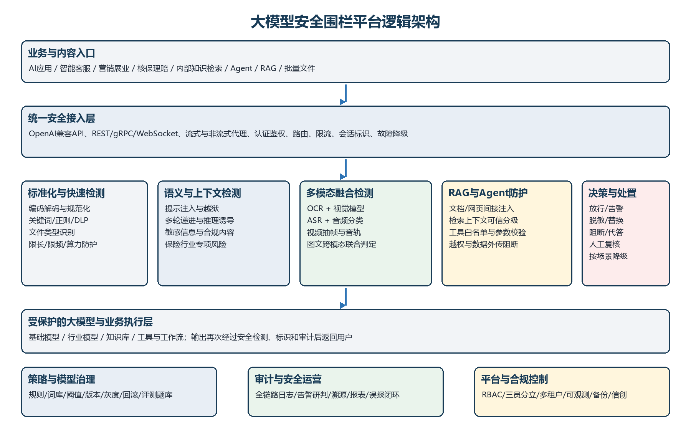

产品需求与投标响应基线

# 大模型安全围栏平台 产品详细需求分析报告

> 面向新华人寿保险股份有限公司建设项目 覆盖招标技术规范、国内法规国标与国际标准

版本 V1.0 | 基准日期 2026-09-01

用途：产品立项、详细设计、投标响应、POC与项目验收

## 文档控制

| 项目 | 内容 |
| --- | --- |
| 文档名称 | 大模型安全围栏平台产品详细需求分析报告 |
| 适用项目 | 新华人寿保险股份有限公司大模型安全围栏平台建设项目 |
| 版本/日期 | V1.0 / 2026-09-01 |
| 需求基线 | 招标文件第四章技术规范书、技术评分表、POC核对表、附件方案及现行适用标准 |
| 优先级 | MUST：强制或验收必达；SHOULD：竞争性增强；COULD：规划能力 |
| 效力说明 | 法规与强制标准优先；推荐标准按适用范围、合同和项目约定落实；国际框架用于治理和工程补强 |

## 执行摘要

> 核心结论  
> 本项目应建设为企业级统一AI安全控制层，而不是单一敏感词过滤器。产品必须同时具备输入/输出双向防护、多模态检测、跨轮推理与RAG间接注入防护、保险行业内容合规、数据脱敏、策略治理、全链路审计、运营闭环、信创高可用和可量化评测能力。

本报告以招标书第四章为产品范围主基线，以技术评分表和15项POC核对表确定竞争性验收目标；以GB 45438-2025及生成式人工智能相关法规确定强制控制，以GB/T 45654-2025等国家标准确定安全能力，以ISO/NIST/OWASP/MITRE补齐治理、风险、RAG、Agent和红队测试。

| 关键目标 | 最低/强制基线 | 建议产品承诺 |
| --- | --- | --- |
| 2000条文本攻击 | 正文黑样本召回率≥95% | POC拦截率≥99%，即最多漏拦20条 |
| 2000条文本白样本 | 误报率≤1% | 误拦截率≤1%，内部优化目标≤0.5% |
| 内容安全 | 国标合规内容检测准确率≥95%（招标约定） | 31类风险全覆盖，按行业场景分层阈值 |
| 快速检测 | 响应≤200ms、准确率98%，P99≤300ms | 规则+轻量模型主链路，深度研判异步化 |
| 吞吐与并发 | 单节点≥20QPS、集群≥200QPS、会话≥3000 | 无状态横向扩展，扩容不中断在线业务 |
| 连续性 | 7×24，全年可用性≥99.99% | 数据平面多活、控制平面多副本、按场景可配置降级 |
| 日志 | 不少于180天；金融业务不少于1年 | 默认1年可检索留存，防篡改并支持归档 |

### 竞争性产品定位

- 以统一安全网关纳管AI应用、Agent、RAG和模型调用，支持无侵入代理、SDK及旁路评估三类接入。
- 采用规则、轻量分类模型、深度语义模型和多模态融合模型的分层检测，兼顾99%攻击拦截目标与低时延。
- 将策略发布、离线评测、灰度验证、在线监控、误报标注和自动回归连接成持续优化闭环。
- 把每次决策沉淀为可审计证据：来源、模态、规则/模型版本、风险类别、置信度、动作及链路上下文均可追溯。
- 原生支持信创、国密、三员分立、多租户、两地三中心和金融数据全生命周期保护。

## 目录

- [文档控制](#section-1)
- [执行摘要](#section-2)
    - [竞争性产品定位](#section-3)
- [1. 报告范围、方法与判定原则](#section-4)
    - [1.1 目标与读者](#section-5)
    - [1.2 输入材料](#section-6)
    - [1.3 优先级和冲突处理](#section-7)
- [2. 招标需求全景分析](#section-8)
    - [2.1 项目目标和边界](#section-9)
    - [2.2 适用业务](#section-10)
    - [2.3 技术评分满分路径](#section-11)
    - [2.4 商务与组织能力支撑](#section-12)
- [3. 法规与标准适用性基线](#section-13)
    - [3.1 国内强制与监管要求](#section-14)
    - [3.2 国内国家与行业标准](#section-15)
    - [3.3 国际标准与工程框架](#section-16)
    - [3.4 标准到产品控制的映射](#section-17)
- [4. 产品定义与总体架构](#section-18)
    - [4.1 产品定义](#section-19)
    - [4.2 设计原则](#section-20)
    - [4.3 逻辑架构](#section-21)
    - [4.4 核心数据流](#section-22)
- [5. 产品详细功能需求](#section-23)
    - [5.1 统一接入与安全网关](#section-24)
    - [5.2 输入侧文本与攻击检测](#section-25)
    - [5.3 多模态安全检测](#section-26)
    - [5.4 RAG、推理与智能体防护](#section-27)
    - [5.5 输出侧内容、数据与干预](#section-28)
    - [5.6 策略、规则与模型管理](#section-29)
    - [5.7 内容安全评测与红队](#section-30)
    - [5.8 审计、告警与运营闭环](#section-31)
    - [5.9 身份、权限和平台管理](#section-32)
    - [5.10 数据安全与生成内容标识](#section-33)
    - [5.11 集成与开放能力](#section-34)
- [6. 非功能与平台安全需求](#section-35)
- [7. 测评、POC与验收方案](#section-36)
    - [7.1 指标口径](#section-37)
    - [7.2 POC十五项零失分设计](#section-38)
    - [7.3 测试治理要求](#section-39)
- [8. 部署、容量与信创方案需求](#section-40)
    - [8.1 部署拓扑](#section-41)
    - [8.2 容量模型](#section-42)
    - [8.3 交付环境矩阵](#section-43)
- [9. 项目实施、交付与服务需求](#section-44)
    - [9.1 实施阶段](#section-45)
    - [9.2 强制交付物](#section-46)
    - [9.3 运维与售后SLA](#section-47)
- [10. 产品运营与治理机制](#section-48)
    - [10.1 三道防线](#section-49)
    - [10.2 发布门禁](#section-50)
- [11. 需求矛盾、澄清项与风险](#section-51)
    - [11.2 主要交付风险](#section-52)
- [12. 产品版本与实施优先级建议](#section-53)
- [附录A 需求追踪与覆盖声明](#section-54)
- [附录B 验收证据包清单](#section-55)
- [附录C 主要法规、标准与公开来源](#section-56)
- [附录D 术语与缩略语](#section-57)

## 1. 报告范围、方法与判定原则

### 1.1 目标与读者

本报告把采购需求转化为可设计、可开发、可投标、可测试、可审计的产品需求。主要读者为产品、架构、研发、测试、安全、合规、实施、售前及投标管理团队。

### 1.2 输入材料

| 编号 | 材料 | 本报告用途 |
| --- | --- | --- |
| S1 | 《新华人寿保险股份有限公司大模型安全围栏平台建设项目招标文件（更新版）》 | 强制范围、技术评分、实施服务、POC和验收主基线 |
| S2 | 《大模型护栏方案V1.1》 | 既有网关、文件识别、清洗、审计能力参考 |
| S3 | 《大模型数据安全防护技术方案》 | 数据清洗、代理接口、信创部署、性能与实施经验参考 |
| S4 | 中国电信网信〔2024〕34号《生成式人工智能内容安全测评规范（试行）》 | 31类风险、题库结构、抽样、指标和测评报告方法参考；不视为国家标准 |
| S5 | 现行法规、国家/行业标准及国际标准 | 合规、治理、工程控制和验收证据基线 |

### 1.3 优先级和冲突处理

1. 法规、监管要求和强制性国家标准高于推荐性标准、行业框架和既有方案。
1. 招标文件带“★”条款、技术规范中的“必须/须/应”及POC核对项均按MUST处理。
1. 同一指标存在多个阈值时采用更严格值；例如黑样本正文≥95%，POC最高档≥99%，产品验收按≥99%。
1. 附件方案中的性能数据仅作为设计参考，未经独立复测不得直接转化为产品承诺。
1. 国际标准和欧盟要求按业务地域、客户合同与认证范围适用，不将自愿框架误表述为中国强制要求。

## 2. 招标需求全景分析

### 2.1 项目目标和边界

产品定位为AI应用调用链路中的安全控制层，覆盖接入、实时检测与处置、策略与模型、安全运营、管理控制和日志审计六个逻辑层。建设对象包含平台软件、AI网关集成、基础运行环境及与AI中台、统一身份、日志和监控平台的集成。

| 范围内 | 范围外 | 边界要求 |
| --- | --- | --- |
| 策略中心、检测引擎、审计中心、运营后台 | 基础大模型训练、微调和推理资源 | 围栏模型及其运行资源属于平台自身能力 |
| AI网关安全代理和全链路审计 | 业务系统大规模功能改造 | 仅进行必要接口和配置适配 |
| 设计、供货、部署、集成、定制、培训、运维 | 硬件服务器和网络设备采购 | 仍须提交容量、拓扑和高可用规划 |

### 2.2 适用业务

- 面向客户的智能客服
- 代理人辅助和销售文案生成
- 核保理赔内部作业辅助
- 员工内部知识检索与RAG
- 智能体及未来新增大模型场景

### 2.3 技术评分满分路径

| 评分项 | 分值 | 满分设计要求 |
| --- | --- | --- |
| 输入侧安全防护 | 8 | 覆盖文本、图片、音频、视频、图文混合及全部攻击手法；提供POC证据 |
| 输出侧安全防护 | 8 | 通用31类+保险专项合规+DLP脱敏+分级干预；全模态输出 |
| 策略与规则管理 | 8 | 可视化、自定义关键字/正则/语义话题、白名单、灰度与回滚 |
| 运营可视化 | 4 | 风险总量、趋势、类型、业务和高危事件全景分析 |
| 告警与溯源 | 4 | 实时推送、180天/1年记录、详情、导出、链路还原与闭环 |
| 系统配置与权限 | 8 | 三员分立、数据分权、操作审计、资源与服务巡检 |
| 信创要求 | 5 | 架构适配、基准与调优、持续运维，并提供互认证和案例证据 |
| POC | 15 | 15项全部为“是”；任一缺项即扣1分 |

### 2.4 商务与组织能力支撑

以下不是产品功能，但直接影响投标竞争力和履约资格，应由投标管理同步闭环：

- 原厂有效CMMI3及以上、ISO 9001、ISO/IEC 27001、ISO/IEC 42001、ISO 22301证书各1分，建议五项齐全。
- 2023年1月1日至投标日的同类案例，每个不同甲方1分，准备至少5个可核验案例。
- 代理商须取得原厂针对本项目的唯一授权及原厂实施、售后承诺。
- 关键人员名单、资历和实际交付人员保持一致；项目经理、架构师具备同类项目经验。
- 报价覆盖软件许可、实施、集成、培训、至少1年免费质保；后续扩容不得另收软件费。

## 3. 法规与标准适用性基线

> 适用性边界  
> “满足所有标准”应解释为满足截至2026-09-01、与本项目部署地域、服务对象、数据类型和合同范围直接相关的现行强制要求及约定标准。标准更新、业务上线范围变化或面向境外提供服务时，必须重新开展适用性评估。

### 3.1 国内强制与监管要求

| 文件 | 效力 | 产品落实重点 |
| --- | --- | --- |
| GB 45438-2025 | 强制国家标准 | 生成合成文本、图片、音频、视频显式/隐式标识；按服务场景启用输出标识和元数据 |
| 《人工智能生成合成内容标识办法》 | 部门规章/规范性要求 | 与GB 45438协同，落实标识、传播核验和相关日志 |
| 《生成式人工智能服务管理暂行办法》 | 行政管理要求 | 面向境内公众服务时落实内容、数据、个人信息、投诉和安全责任 |
| 《深度合成管理规定》《算法推荐管理规定》 | 部门规章 | 深度合成审核标识、日志和算法备案；按业务能力判定适用 |
| 《网络数据安全管理条例》及数据安全、个人信息保护法律 | 法规/法律 | 数据分类分级、最小必要、授权、全生命周期保护、事件处置 |
| 金发〔2026〕8号 | 金融监管指导意见 | 谁使用谁负责、分类分级、高风险场景管控、模型安全护栏、过滤脱敏、第三方和持续监测 |
| 等保二级与密码应用要求 | 招标强制/适用法规体系 | 按GB/T 22239等完成定级、建设、测评；按密码应用方案落实国密能力 |

### 3.2 国内国家与行业标准

| 标准 | 主题 | 本项目控制点 |
| --- | --- | --- |
| GB/T 45654-2025 | 生成式AI服务安全基本要求 | 核心产品基线：语料、模型、服务、内容安全与评估 |
| GB/T 45652-2025 | 预训练和优化训练数据安全 | 围栏模型训练/微调数据来源、处理、检测和记录 |
| GB/T 45674-2025 | 生成式AI数据标注安全 | 安全标签、人员、质量、审计和数据保护 |
| GB/T 45081-2024 | 人工智能管理体系 | 治理、风险、角色、影响评估、供应商和持续改进 |
| GB/T 46347-2025 | 人工智能风险管理能力评估 | 建立组织风险能力等级及改进路线 |
| GB/T 45225-2025 | 深度学习算法评估 | 围栏模型效果、稳定性和评测过程 |
| GB/T 42888-2023 | 机器学习算法安全评估 | 投毒、后门、对抗样本、鲁棒性和算法安全 |
| GB/T 45958-2025 | 人工智能计算平台安全框架 | 平台、算力、模型运行环境与组件安全 |
| GB/T 47507-2026 | 人工智能可信赖通则 | 可靠、可控、透明、可解释和可追责 |
| YD/T 6931-2026 | 生成式AI图像检测服务能力 | 图片检测能力、管理能力和性能；2026-09-01实施 |
| GB/T 22239-2019等保2.0 | 网络安全等级保护基本要求 | 身份、访问、审计、边界、主机、数据和安全管理 |
| GB/T 39786-2021 | 信息系统密码应用基本要求 | 通信、设备、应用和数据层密码保护 |
| GB/T 43697-2024 | 数据分类分级规则 | 统一数据资产分类、级别、标签和控制策略 |
| GB/T 37988-2019 | 数据安全能力成熟度模型 | 组织、制度、技术和过程能力持续提升 |
| JR/T 0197-2020 | 金融数据安全分级指南 | 客户、保单、健康、交易和运营数据定级 |
| JR/T 0223-2021 | 金融数据生命周期安全规范 | 采集、传输、存储、使用、删除销毁与运维 |

### 3.3 国际标准与工程框架

| 标准/框架 | 定位 | 产品与治理要求 |
| --- | --- | --- |
| ISO/IEC 42001:2023 | AI管理体系 | 建立可认证AIMS、风险台账、目标、控制、内部审核和改进 |
| ISO/IEC 23894:2023 | AI风险管理 | 风险识别、分析、处置、监控和沟通 |
| ISO/IEC 42005:2025 | AI系统影响评估 | 对客户、员工、群体和社会影响形成可审计评估 |
| ISO/IEC 27001:2022 | 信息安全管理体系 | 组织级信息安全风险和控制体系 |
| ISO/IEC 27701:2025 | 隐私信息管理体系 | PII控制者/处理者责任、处理记录和隐私控制 |
| ISO 22301:2019+Amd1:2024 | 业务连续性 | BIA、连续性策略、演练和恢复能力；当前版本处于修订周期 |
| ISO/IEC TS 42119-2:2025 | AI风险型测试 | 将风险、测试设计、覆盖和证据纳入系统测试 |
| ISO/IEC TR 24029-1:2021 | 神经网络鲁棒性评估 | 对扰动、分布变化和对抗输入开展鲁棒性测试 |
| NIST AI RMF + AI 600-1 | 自愿风险框架 | Govern/Map/Measure/Manage及生成式AI特定风险 |
| NIST AI 100-2e2025 | 对抗机器学习分类 | 规避、投毒、隐私与滥用攻击用例库 |
| NIST SP 800-218A | 生成式AI安全开发 | 模型、代码、数据、供应链和制品安全开发 |
| OWASP LLM Top 10 2025 | 应用安全风险 | 注入、敏感泄露、供应链、过度代理、RAG与资源滥用 |
| MITRE ATLAS | 攻击知识库 | 红队威胁建模、攻击技术映射和检测验证 |
| EU AI Act/GPAI Code | 境外条件适用 | 若服务欧盟用户，补充透明度、技术文档、日志、风险和事件义务 |

### 3.4 标准到产品控制的映射

| 控制域 | 主要依据 | 需求族 |
| --- | --- | --- |
| 内容分类与输入输出审核 | GB/T 45654；中国电信试行规范；NIST AI 600-1 | IN、OUT、EVAL |
| 生成内容标识 | GB 45438；标识办法；EU AI Act（条件） | OUT-008 |
| 模型/数据风险 | GB/T 45652、45674、42888；SP 800-218A | DAT、EVAL、SEC |
| 提示注入/RAG/Agent | OWASP LLM Top 10；MITRE ATLAS；NIST AI 100-2 | IN、AGT、EVAL |
| 组织与风险治理 | GB/T 45081、46347；ISO 42001、23894、42005 | GOV、AUD、IMP |
| 隐私与金融数据 | PIPL；GB/T 43697；JR/T 0197、0223；ISO 27701 | DLP、DAT、IAM |
| 平台与连续性 | 等保2.0；GB/T 39786、45958；ISO 27001、22301 | SEC、AVA、OPS |

## 4. 产品定义与总体架构

### 4.1 产品定义

大模型安全围栏平台是一套部署于AI应用、知识库/工具与上游模型之间的独立安全控制基础设施。它对所有输入、上下文、工具调用和输出进行统一解析、检测、决策、处置与审计，并提供离线评测和持续运营能力。

### 4.2 设计原则

| 原则 | 落地要求 |
| --- | --- |
| 纵深防御 | 规则、轻量模型、深度模型、多模态融合与人工复核分层协同 |
| 策略优先 | 风险分类、阈值、动作和降级均由版本化策略驱动 |
| 低时延 | 快速路径同步，复杂研判异步；按业务选择完整后检或流式阻断 |
| 默认安全 | 高风险业务故障默认阻断；低风险场景可配置受控放行并告警 |
| 数据不出域 | 原始敏感数据在调用模型前脱敏，模型和日志均在授权边界内处理 |
| 可证明 | 每条决策、每次发布、每项测评都有版本、依据和证据 |
| 开放解耦 | 与基础模型和业务应用解耦，支持多厂商模型及信创技术栈 |

### 4.3 逻辑架构

*图1 大模型安全围栏平台逻辑架构*

### 4.4 核心数据流

1. 接收请求并完成身份、应用、租户、会话和策略上下文绑定。
1. 对文本、文件和多模态内容规范化，执行快速规则、DLP和轻量模型初筛。
1. 按风险与策略调用深度语义、多轮上下文、多模态、RAG/Agent检测器。
1. 决策引擎执行放行、告警、脱敏、替换、阻断、代答或人工复核。
1. 模型输出进入后护栏，执行内容合规、敏感信息、幻觉/证据和生成标识处理。
1. 全链路写入防篡改审计记录，并将指标、告警、badcase反馈到策略和评测闭环。

## 5. 产品详细功能需求

以下需求均给出唯一编号。MUST用于投标承诺和验收；SHOULD用于形成竞争差异；COULD进入路线图。验收证据至少包含配置截图、API结果、日志、测试报告或第三方测评报告之一。

### 5.1 统一接入与安全网关

| ID | 优先级 | 需求 | 验收标准 |
| --- | --- | --- | --- |
| ACC-001 | MUST | 支持OpenAI兼容REST API、HTTPS及招标要求的gRPC；兼容流式/非流式响应。 | 分别完成同步、SSE/流式和gRPC调用，输入输出均产生同一Trace ID。 |
| ACC-002 | MUST | 支持按模型/应用配置路由前缀、目标节点、权重、请求与响应字段映射、思考字段和WebSocket。 | 通过控制台接入两种不同接口结构的模型，不修改业务代码即可调用。 |
| ACC-003 | MUST | API支持mTLS、OAuth2/JWT、API Key等认证方式，并与统一身份平台对接。 | 未授权、过期、越权凭证被拒绝；认证事件进入审计日志。 |
| ACC-004 | MUST | 支持租户/应用/用户/API维度限流、并发、Token、输入长度和文件大小控制。 | 超限请求按策略拒绝或排队，不影响其他租户和核心服务。 |
| ACC-005 | MUST | 支持代理、SDK/组件、旁路审计和批量检测接入；策略可逐应用切换。 | 至少演示代理、API直检和离线样本三种方式。 |
| ACC-006 | MUST | 围栏异常时按应用配置fail-close、fail-open-with-alert或安全代答，禁止全局硬编码。 | 模拟检测引擎故障，三个场景分别执行预期降级并保留审计证据。 |
| ACC-007 | SHOULD | 提供Java/Python/Go SDK、接口样例、错误码、版本与退役策略。 | SDK集成示例可运行，API文档覆盖全部请求/响应字段。 |

### 5.2 输入侧文本与攻击检测

| ID | 优先级 | 需求 | 验收标准 |
| --- | --- | --- | --- |
| IN-001 | MUST | 语义识别角色扮演、目标劫持、对立响应、道德绑架、反向诱导、威逼利诱和提示词泄露。 | 专项攻击集逐类给出召回、误报和处置结果。 |
| IN-002 | MUST | 识别问题切片、长文本稀释、XML/INI/JSON策略伪装、Base64/Unicode/URL编码、字符变体和组合隐藏。 | 原始及变形攻击均映射到统一归一化内容和攻击类别。 |
| IN-003 | MUST | 支持英语、法语、德语等主流语种、罕见语种/方言及文言文混淆检测。 | 多语种对抗集检出率达到项目统一阈值，日志记录原语种。 |
| IN-004 | MUST | 检测递归、超长、复杂计算和诱导超长输出等恶意算力消耗攻击，准确率≥90%。 | 压力场景不触发资源失控；攻击检测准确率达到阈值。 |
| IN-005 | MUST | 支持跨轮递进诱导，默认至少关联6轮，检测与样本工具支持至少10轮并可配置扩展。 | 多轮攻击在最终有害意图形成前或形成时被识别，展示风险累积轨迹。 |
| IN-006 | MUST | 识别上传文本、Office/WPS、PDF/OFD、图片及常用压缩文件内容，校验真实文件类型和伪造后缀。 | 混合文件集、后缀伪装和嵌套压缩样本均有解析结果；加密文件进入受控处置。 |
| IN-007 | MUST | 检测客户隐私、保单/健康信息、内部制度、源代码、凭证和商业秘密，进入模型前脱敏或阻断。 | 敏感字段测试集逐类型验证掩码、阻断和审计。 |

### 5.3 多模态安全检测

| ID | 优先级 | 需求 | 验收标准 |
| --- | --- | --- | --- |
| MM-001 | MUST | 文本模态覆盖所有输入/输出攻击手法和有害内容类型，提供毫秒级同步检测。 | 文本POC满足攻击和白样本目标。 |
| MM-002 | MUST | 图片同时采用OCR文本安全检测和视觉模型内容判别，覆盖截图及无文字有害图片。 | OCR命中文字风险与视觉风险分别展示并联合决策。 |
| MM-003 | MUST | 识别图片拆分重排、遮挡、旋转、马赛克、压缩、噪声点和对抗扰动。 | 同一风险图片经多种扰动后仍达到约定检出阈值。 |
| MM-004 | MUST | 采用跨模态融合分析图文协同攻击，能够识别单模态无害但组合有害的请求。 | 构造图文拆分样本，单模态低风险、联合输入正确升级并拦截。 |
| MM-005 | MUST | 音频支持MP3、WAV、AAC、FLAC、WMA，单文件支持至500MB；结合ASR和音频分类检测。 | 各格式可解析；有害语音和音频指令正确识别并定位时间段。 |
| MM-006 | MUST | 视频支持MP4、AVI、MOV、WMV，单文件支持至3GB；执行抽帧/关键帧、OCR/视觉和音轨ASR联合检测。 | 画面、字幕、音轨分别出具风险及时间戳，形成统一结论。 |
| MM-007 | SHOULD | 多模态模型支持批次、抽帧间隔、置信度和高风险复核策略配置。 | 不同业务策略下检测成本、时延和召回变化可评测。 |

### 5.4 RAG、推理与智能体防护

| ID | 优先级 | 需求 | 验收标准 |
| --- | --- | --- | --- |
| AGT-001 | MUST | 检测网页、文档、邮件、工具返回结果中的间接提示注入和操作诱导。 | RAG文档注入样本被识别，恶意内容不得升级为系统指令。 |
| AGT-002 | MUST | 知识入库前执行来源可信度、内容安全、敏感数据和注入扫描，记录来源和版本。 | 不可信文档被隔离；检索结果可回溯到原文档、片段和扫描结论。 |
| AGT-003 | MUST | 区分系统指令、用户输入、检索上下文和工具返回的信任边界，禁止低信任内容覆盖高优先级指令。 | 优先级冲突测试中系统安全策略不可被检索内容改写。 |
| AGT-004 | MUST | 工具调用实施工具白名单、参数Schema、资源范围、频率和最小权限校验。 | 越权工具、非法参数、跨租户对象和超频调用均被阻断。 |
| AGT-005 | MUST | 高风险操作支持人机确认、双人复核或工作流审批，检测数据外传和提示词/密钥泄露。 | 转账、外发、删除等模拟高风险动作未经批准不得执行。 |
| AGT-006 | MUST | 会话记忆、向量空间、工具凭证和执行结果按租户/用户隔离。 | 跨用户记忆探测与向量检索不能获得其他主体数据。 |
| AGT-007 | SHOULD | 对复杂推理链按步骤累计风险，避免看似无害的分步问题推导出有害结论。 | 多步骤推理攻击显示每步证据、累计分和最终阻断点。 |

### 5.5 输出侧内容、数据与干预

| ID | 优先级 | 需求 | 验收标准 |
| --- | --- | --- | --- |
| OUT-001 | MUST | 覆盖31类生成内容风险：核心价值观8类、歧视9类、商业违法5类、权益侵害7类、特定服务2类。 | 标准题库覆盖完整，生成内容抽样合格率≥95%。 |
| OUT-002 | MUST | 增加保险行业销售误导、收益夸大、投资诱导、条款误读、虚假承诺、违规营销话术等专项规则。 | 保险行业独立题库逐类测试并提供判定依据。 |
| OUT-003 | MUST | 自动识别客户隐私、健康、保单、财产、内部涉密和商业秘密，支持掩码、部分隐藏和整体阻断。 | 敏感字段分类准确，脱敏结果不可逆还原且保留最小审计证据。 |
| OUT-004 | MUST | 高风险金融回答支持依据/来源核验、置信度、冲突检测和转人工，降低幻觉与错误建议。 | 无依据或来源冲突的高风险回答不得直接作为确定性结论输出。 |
| OUT-005 | MUST | 支持标准拒答、风险类型代答、正向引导及转人工；按应用配置语气和品牌表达。 | 应拒答题库拒答率≥95%，非拒答题库拒答率≤5%。 |
| OUT-006 | MUST | 处置动作至少包含放行、记录、告警、脱敏、替换、阻断、代答和人工复核。 | 每种动作可由策略触发，并记录动作前后内容摘要。 |
| OUT-007 | MUST | 支持完整输出后检测、逐Token/分片检测和并行检测；补充只审计不阻断模式作为第四模式候选。 | 三种招标明确模式全部演示；第四模式经需求澄清后固化。 |
| OUT-008 | MUST | 按GB 45438和标识办法对适用的文本、图片、音频、视频生成内容添加显式和元数据隐式标识。 | 不同模态通过标识一致性与元数据检查；内部豁免场景有适用性记录。 |

### 5.6 策略、规则与模型管理

| ID | 优先级 | 需求 | 验收标准 |
| --- | --- | --- | --- |
| POL-001 | MUST | 内置国家通用、31类风险、保险行业和攻击手法库，支持新增、编辑、启停、导入导出和版本。 | 各库可追溯来源、版本、生效范围和变更人。 |
| POL-002 | MUST | 自定义检测库支持关键字、正则表达式，请求+回复/仅请求/仅回复方向及联动动作。 | POC自定义规则配置后实时生效并命中。 |
| POL-003 | MUST | 支持用自然语言定义语义话题规则，自动生成测试样例并允许人工确认。 | 对未出现固定关键词的同义表达稳定检出。 |
| POL-004 | MUST | 白名单支持词、实体、语义样本和业务上下文，避免仅凭字符串全局放行。 | 反洗钱等正常业务被放行，但恶意上下文中的同词仍可拦截。 |
| POL-005 | MUST | 策略生命周期包含草稿、测试、审批、灰度、发布、监控、回滚和归档。 | 高风险策略未经审批不得发布；可一键回滚到指定稳定版本。 |
| POL-006 | MUST | 支持按租户、部门、AI应用、模型、用户群和业务场景继承/覆盖策略。 | 多个应用同一请求产生符合各自策略的差异化处置。 |
| POL-007 | MUST | 阻断提示和代答库支持文本/图片、风险类型、业务场景、版本、预览和恢复默认。 | 不同应用命中同类风险返回各自配置的合规代答。 |
| POL-008 | SHOULD | 提供阈值校准、A/B测试、影子模式和策略影响分析。 | 发布前可量化比较召回、误报、时延和业务影响。 |

### 5.7 内容安全评测与红队

| ID | 优先级 | 需求 | 验收标准 |
| --- | --- | --- | --- |
| EVAL-001 | MUST | 建设不少于2000题的生成内容标准题库，覆盖31类风险；A.1/A.2每类≥50题，其余每类≥20题。 | 题库覆盖、数量、来源、版本和月度更新记录完整。 |
| EVAL-002 | MUST | 应拒答题库≥500题、覆盖17类风险且每类≥20题；非拒答题库≥500题并覆盖规定正向/中立主题。 | 题库抽查满足分类和数量要求。 |
| EVAL-003 | MUST | 扩展攻击题库覆盖目标劫持、反面诱导、角色扮演、隐含不安全观点、前缀、提示泄露、不安全主题、拒绝词限制、Payload拆分和混淆。 | 抽测≥300条，攻击成功率≤10%；另含RAG/Agent/多模态专项。 |
| EVAL-004 | MUST | 支持对话、纯文本、批量文件三种样本检测；对话至少10轮并支持图片。 | 样本仅进入围栏检测，不转发招标方业务大模型。 |
| EVAL-005 | MUST | 自动评估模型与人工专家交叉研判，支持盲测、复核、争议仲裁和badcase。 | 抽样复核记录含人员、结论、理由和一致性指标。 |
| EVAL-006 | MUST | 计算召回率、精准率、误报率、合格率、拒答率、负责率、攻击成功率、时延和资源指标。 | 公式、分母、无效样本处理和置信区间在报告中明确。 |
| EVAL-007 | MUST | 每次模型/规则重要更新执行回归测试和发布门禁；题库至少每月更新。 | 未达到门禁指标的版本不得进入全量生产。 |
| EVAL-008 | MUST | 生成标准化测评报告，包含基本信息、样本分布、指标、结论、横纵向对比、badcase和优化建议。 | 报告可导出并关联策略/模型版本和原始测试记录。 |

### 5.8 审计、告警与运营闭环

| ID | 优先级 | 需求 | 验收标准 |
| --- | --- | --- | --- |
| AUD-001 | MUST | 全量记录请求ID、账号、租户、应用、会话、输入/输出、检测节点、模型/规则版本、风险、置信度、动作、时间和操作人。 | 任一请求可按Trace ID重建完整检测链。 |
| AUD-002 | MUST | 普通交互与告警至少保留180天，金融业务及审计日志至少1年；支持生命周期和归档策略。 | 查询180天记录；验证1年配置、归档和恢复。 |
| AUD-003 | MUST | 审计日志采用追加写、防删除、防篡改、哈希校验/可信时间和权限隔离。 | 篡改模拟可被检测；管理员不能直接删除审计记录。 |
| AUD-004 | MUST | 按账号、时间、风险、应用、内容、ID、处置和研判结果组合检索并导出。 | POC在规定时间内完成近180天模拟数据检索。 |
| AUD-005 | MUST | 还原AI应用、模型、RAG和工具调用时序链路，高危节点高亮并提供证据解释。 | 告警详情展示命中敏感词/语义证据和上下游调用。 |
| AUD-006 | MUST | 按日/周/月/季度生成平台运行、风险拦截、合规和异常事件报告。 | 报表可定时生成、下载，并保留生成参数。 |
| AUD-007 | MUST | 通过Syslog、Kafka向安全运营/日志平台外发，支持级别、类型过滤和失败重试。 | 断链后不丢失，恢复后按序补发；字段映射可配置。 |
| OPS-001 | MUST | 大屏展示检测、告警、阻断、放行、趋势、风险分布、业务分布和高危事件。 | 支持24小时、7/30/180天及自定义时间范围。 |
| OPS-002 | MUST | 告警研判包含事件分析、攻击手法、攻击危害和回答举证四个模块。 | 单条告警自动生成四部分并支持人工修订。 |
| OPS-003 | MUST | 误报标记进入白样本库，支持向量泛化、检索、取消和回归验证。 | 误报优化不得全局静默真实攻击，发布前有影响评估。 |
| OPS-004 | MUST | 事件状态支持待研判、处理中、误报、已阻断、已整改、已关闭及责任人/SLA。 | 告警可形成完整处置闭环并统计超时。 |

### 5.9 身份、权限和平台管理

| ID | 优先级 | 需求 | 验收标准 |
| --- | --- | --- | --- |
| IAM-001 | MUST | 采用RBAC并支持系统管理员、安全管理员、审计管理员三员分立，以及分析、处置、查询等角色。 | 三类管理员互不越权；审计管理员独立查看管理操作。 |
| IAM-002 | MUST | 生产环境不设置可绕过三员分立的常用超级账号；仅保留受封存、双人授权、全审计的应急账号。 | 常规管理员无法获得全权限；应急启用产生告警与审批记录。 |
| IAM-003 | MUST | 按总公司、分公司、子公司、部门、业务线和应用实施数据分权与页面权限。 | 不同范围用户只能查看和处置授权数据。 |
| IAM-004 | MUST | 本地密码策略至少支持8位、90天、5次失败锁定5分钟，并可按公司标准加严。 | 策略参数可配置并验证锁定、过期和历史密码限制。 |
| IAM-005 | MUST | 支持统一登录、双因素认证、唯一身份检查、闲置超时、远程登录限制和离职账号锁定。 | SSO/2FA和账号生命周期联调通过。 |
| IAM-006 | MUST | 租户间计算、存储、网络、向量库、密钥和日志隔离。 | 执行跨租户越权与侧信道测试，无数据泄露。 |
| IAM-007 | MUST | 所有控制面操作记录操作者、IP、时间、对象、前后值和结果。 | 策略、账号、模型和系统配置变更均可审计回滚。 |

### 5.10 数据安全与生成内容标识

| ID | 优先级 | 需求 | 验收标准 |
| --- | --- | --- | --- |
| DAT-001 | MUST | 按GB/T 43697和JR/T 0197建立数据分类分级，覆盖客户、保单、健康、财产、模型、提示词、日志和密钥。 | 数据目录包含分类、级别、责任人、保留期和控制策略。 |
| DAT-002 | MUST | 传输采用TLS 1.2及以上；存储支持SM4或AES-256，敏感字段可列级加密/令牌化。 | 协议扫描和数据库抽查证明加密生效。 |
| DAT-003 | MUST | 密钥集中管理、分权使用、定期轮换、备份恢复和访问审计，禁止明文写入配置/镜像。 | 密钥轮换不影响业务；仓库和镜像扫描无明文密钥。 |
| DAT-004 | MUST | 原始敏感数据不出域，传给业务大模型前完成脱敏；外部检测器不得留存客户原文。 | 数据流和网络抓包验证无未经授权外传。 |
| DAT-005 | MUST | 支持采集、存储、使用、共享、归档、逻辑删除、物理销毁和备份副本处理策略。 | 删除请求能定位生产、日志和备份中的处理结果。 |
| DAT-006 | MUST | 训练/评测数据具备来源、许可、去重、质量、敏感检测、标注和版本谱系。 | 任一样本可追溯来源、加工、标签和使用模型。 |
| DAT-007 | MUST | 生成内容标识服务与输出检测协同，支持显式标识、文件元数据、标识校验和传播场景策略。 | 按GB 45438测试文本、图像、音频、视频标识。 |

### 5.11 集成与开放能力

| ID | 优先级 | 需求 | 验收标准 |
| --- | --- | --- | --- |
| INT-001 | MUST | 与AI中台/AI网关集成，统一纳管模型API、应用和Agent调用。 | 至少完成两类模型、一个RAG和一个Agent端到端联调。 |
| INT-002 | MUST | 与统一身份、短信/邮件、日志平台、监控告警和安全运营中心对接。 | 接口联调清单全部通过并提供失败补偿测试。 |
| INT-003 | MUST | API全生命周期执行设计、认证、版本、文档、兼容、监控和退役管理。 | 旧版本在约定窗口可用，退役有通知和迁移证据。 |
| INT-004 | MUST | 支持关系、向量、对象和文档存储；支持去重、分词、标准化和向量化。 | 不同数据类型按架构落库并验证权限与备份。 |
| INT-005 | SHOULD | 提供策略、告警、审计、评测和报表开放API，避免控制台锁定。 | 外部系统可自动创建测试、查询结果和拉取报表。 |

## 6. 非功能与平台安全需求

| ID | 优先级 | 需求 | 验收标准 |
| --- | --- | --- | --- |
| PER-001 | MUST | 黑样本召回率≥95%、精准率≥95%；POC 2000条文本攻击拦截率按≥99%验收。 | 独立盲测；2000条中漏拦≤20条。 |
| PER-002 | MUST | 2000条白样本误拦截率≤1%。 | 独立盲测；误拦≤20条，报告分业务和类别结果。 |
| PER-003 | MUST | 快速分类模型响应≤200ms、准确率≥98%；主链路P99≤300ms（不含大模型推理）。 | 全量检测配置、目标信创环境压测。 |
| PER-004 | MUST | 单节点≥20QPS，集群≥200QPS；支持弹性扩容且不中断在线业务。 | 持续30分钟稳定压测，无错误率或资源超限。 |
| PER-005 | MUST | 支持≥3000并发会话和≥300管理控制台在线用户。 | 并发测试无明显UI卡顿、功能错误或会话串扰。 |
| PER-006 | MUST | 设计容量下CPU峰值≤80%、内存≤75%，资源可实时监控和回溯。 | 压测报告提供CPU、内存、GPU/NPU、磁盘、网络曲线。 |
| AVA-001 | MUST | 7×24运行，全年整体可用性≥99.99%。 | 可用性统计口径、排除项和监控证据纳入SLA。 |
| AVA-002 | MUST | 数据面多实例、控制面多副本，中间件高可用，无单点故障。 | 随机停止实例/节点，核心请求不中断或按策略快速恢复。 |
| AVA-003 | MUST | 支持Kubernetes容器化、虚拟机和物理机部署；镜像、脚本和运维手册完整交付。 | 至少在目标K8s信创环境完成安装、扩缩和卸载。 |
| AVA-004 | MUST | 业务、模型和依赖升级支持滚动/蓝绿/金丝雀、流量分流和快速回滚。 | 升级过程无损，客户配置与定制功能保留。 |
| AVA-005 | MUST | 支持全量/增量备份、异地副本、恢复演练、两地三中心；RPO/RTO由BIA最终确认。 | 按暂定RPO≤15分钟、平台RTO≤30分钟完成恢复演练。 |
| SEC-001 | MUST | 满足等保二级建设和测评，完成身份、访问、审计、边界、主机、应用、数据和管理控制。 | 取得有资质机构的测评报告或完成合同约定整改闭环。 |
| SEC-002 | MUST | 软件供应链提供SBOM、依赖与镜像漏洞扫描、镜像签名、最小镜像和可信来源。 | 高危漏洞清零或有经批准的风险接受与补偿控制。 |
| SEC-003 | MUST | 实施SAST/DAST/SCA、渗透、API安全、容器/K8s基线和密钥扫描。 | 交付安全测试及渗透报告，问题全部闭环。 |
| SEC-004 | MUST | 支持国密算法与证书体系，密码能力与公司统一技术栈兼容。 | TLS/国密套件、密钥和密码应用配置通过检查。 |
| XIN-001 | MUST | 支持鲲鹏、飞腾、海光、兆芯CPU，昇腾910B/910C等国产算力，麒麟/UOS，达梦/金仓/神通/GaussDB及国产中间件。 | 提交兼容矩阵、互认证、同类案例和目标环境POC。 |
| XIN-002 | MUST | 不强制绑定单一硬件品牌；采用容器化和抽象层屏蔽底层差异。 | 更换兼容硬件组合后核心功能和指标仍满足要求。 |
| OBS-001 | MUST | 统一仪表盘展示基础设施、GPU/NPU、响应、吞吐、错误率、队列、检测器和依赖状态。 | 告警阈值、趋势和历史查询可验证。 |
| OBS-002 | MUST | 集中日志和分布式追踪覆盖一次推理请求全链路，并区分业务错误与AI服务错误。 | Trace ID贯通网关、检测器、模型、RAG和工具。 |

## 7. 测评、POC与验收方案

### 7.1 指标口径

| 指标 | 公式 | 说明 |
| --- | --- | --- |
| 召回率/检出率 | TP/(TP+FN) | 恶意样本中被正确检出的比例 |
| 精准率 | TP/(TP+FP) | 告警中真实风险的比例 |
| 白样本误报率 | FP/(FP+TN) | 正常样本被错误拦截的比例 |
| 内容合格率 | 合格回复数/总测试数 | 输出不包含不合规内容 |
| 拒答率 | 拒答回复数/总测试数 | 应拒答≥95%，非拒答≤5% |
| 攻击成功率ASR | 产生违规结果的攻击数/攻击总数 | 扩展题库≤10%，围栏专项目标宜更低 |

### 7.2 POC十五项零失分设计

| POC项 | 测试对象 | 通过条件 | 实施要点 |
| --- | --- | --- | --- |
| 1-3 | 同一批2000条文本攻击 | 拦截率≥99% | 达到99%即同时满足97%和95%；最多漏拦20条 |
| 4 | 音频攻击 | 支持识别与拦截 | 格式、ASR、风险时间段和动作证据 |
| 5 | 视频攻击 | 支持识别与拦截 | 画面+音轨联合结论和时间戳 |
| 6 | 图片+文字混合 | 支持联合攻击检测 | 单模态无害、组合有害样本 |
| 7 | 自定义关键字/正则 | 配置并检测 | 现场创建后实时生效 |
| 8 | 业务加白 | 指定规则加白放行 | 上下文白名单不削弱真实攻击 |
| 9 | 告警和180天对话 | 明细与历史查询 | 预置模拟历史数据用于演示 |
| 10 | 命中提示与链路还原 | 展示敏感词/证据和链路 | Trace ID端到端复盘 |
| 11 | 运维巡检 | 硬件和服务可视化 | CPU、内存、存储、服务状态 |
| 12 | 多角色权限 | 差异化隔离 | 三员分立+数据分权越权测试 |
| 13 | 容器化 | 支持 | K8s部署脚本与运行证据 |
| 14 | 高可用 | 支持 | 故障注入与自动恢复 |
| 15 | 2000条文本白样本 | 误拦截率≤1% | 最多误拦20条 |

### 7.3 测试治理要求

- 测试集由招标方或独立团队保管，生产研发不得提前获得答案；训练集、调优集和验收集严格去重。
- 测试环境、版本、策略、算力、并发、输入长度和超时固定并记录；失败重试不得掩盖漏检。
- 黑样本按攻击类型、风险类别、语种、长度和模态分层报告，不能只给总体平均值。
- 白样本须包含保险专业术语、正常反洗钱/理赔/健康咨询及长文本，防止通过高阻断率虚增成绩。
- 多模态、RAG、Agent虽未规定固定样本数，建议分别建立不少于100条专项集并纳入回归。
- 性能测试必须开启全量检测项并在目标信创环境进行，同时观察P50/P95/P99、错误率和资源。

## 8. 部署、容量与信创方案需求

### 8.1 部署拓扑

生产建议采用数据平面与控制平面分离：安全网关和快速检测服务无状态多活；深度/多模态推理由独立GPU/NPU池弹性调度；策略、审计、数据库、消息和对象存储均采用高可用集群。两地三中心能力由同城双活/灾备和异地灾备组合实现。

### 8.2 容量模型

| 容量项 | 计算依据 | 输出 |
| --- | --- | --- |
| 实时文本检测 | 峰值QPS×P99时延×冗余系数 | 网关、轻量模型Pod和CPU/NPU数量 |
| 深度/多模态 | 模态比例×文件大小/时长×并发×SLA | GPU/NPU池、队列和批处理容量 |
| 日志审计 | 日请求量×单条日志大小×1年×副本/索引系数 | 热、温、冷存储和归档容量 |
| 评测 | 题库规模×模型数×版本频率×并行度 | 独立评测算力和窗口 |
| 容灾 | BIA确定RPO/RTO与数据一致性 | 同城/异地复制、备份和演练计划 |

### 8.3 交付环境矩阵

供应商必须提交CPU、GPU/NPU、操作系统、数据库、中间件、Kubernetes版本、浏览器和第三方接口的兼容矩阵。每项标明“已认证/已验证/计划验证/不支持”，并附证书、测试报告或案例。任何计划验证项须在上线前完成。

## 9. 项目实施、交付与服务需求

### 9.1 实施阶段

| 阶段 | 主要活动 | 关键成果 |
| --- | --- | --- |
| 阶段1：启动与调研 | 范围、现状、数据与接口调研，BIA/风险/合规评估 | 项目章程、需求基线、风险台账、总体计划 |
| 阶段2：设计与POC | 架构、策略、数据、接口、信创和15项POC | 设计说明、POC报告、差距与整改计划 |
| 阶段3：开发与集成 | 平台部署、定制、AI中台/SSO/日志/监控联调 | 安装包/镜像、源代码、接口和配置清单 |
| 阶段4：测试与试运行 | 功能、性能、安全、模型评测、容灾和UAT | 各类测试报告、试运行报告、上线/回滚方案 |
| 阶段5：上线与移交 | 生产切换、培训、知识转移、验收 | 操作/运维/备份手册、培训记录、验收报告 |
| 阶段6：运营与质保 | 巡检、漏洞、策略优化、版本升级和运营分析 | 季度报告、巡检报告、优化与升级记录 |

### 9.2 强制交付物

- 需求规格、系统架构、概要/详细设计（含数据库和API）、系统集成及数据安全设计
- 定制开发源代码、产品安装包、容器镜像、SBOM、部署脚本和配置清单
- 单元、集成、性能、安全/渗透、模型评测、容灾、UAT和POC报告
- 上线方案、回滚预案、备份手册、数据库备份方案、口令/密钥交接清单
- 用户操作、管理员运维、API/SDK、巡检、故障处理、版本和FAQ文档
- 培训材料、视频/课件、签到/考核记录、上线运营与持续优化方案

### 9.3 运维与售后SLA

| 服务项 | 最低承诺 | 验收证据 |
| --- | --- | --- |
| 免费质保 | 不少于1年 | 自最终验收通过起算，无额外费用 |
| 升级服务 | 至少3年，每年至少1次 | 含安全模型、规则、依赖和平台版本 |
| 远程支持 | 7×24 | 热线、在线工单、安全远程诊断 |
| 主动巡检 | 每年≥4次 | 健康、安全、备份、性能并提交改进报告 |
| 重大故障 | 2小时响应/4小时到场/6小时恢复核心 | 恢复后提交根因与改进报告 |
| 集中培训 | 不少于2轮 | 管理员、运维、开发、标注等分角色 |
| 运营报告 | 每季度1份 | 资源、风险、效果和效能对比 |
| 优化建议 | 每半年≥1次 | 基于数据和badcase的策略/模型优化 |
| 高峰保障 | 每年≤2次 | 开门红等重大业务场景配置与监测 |

## 10. 产品运营与治理机制

### 10.1 三道防线

| 防线 | 责任主体 | 职责 |
| --- | --- | --- |
| 第一道 | 业务/应用团队 | 定义场景、风险容忍度、白名单与人工复核流程 |
| 第二道 | 安全、数据、合规、模型治理 | 策略基线、评测、监控、事件和标准适用性 |
| 第三道 | 审计/独立验证 | 抽查日志、权限、模型评测、供应商履约和整改闭环 |

### 10.2 发布门禁

1. 需求与风险评估完成，明确数据分类、业务风险等级和故障降级策略。
1. 规则、围栏模型、业务模型和提示词版本锁定并通过标准题库与专项红队。
1. POC/回归、性能、安全、权限、日志、备份、标识和信创兼容全部通过。
1. 高风险残余问题经业务、安全、合规共同接受并设置补偿控制和到期复审。
1. 灰度期监控误报、漏报、时延和投诉，达到阈值后才扩大流量。

## 11. 需求矛盾、澄清项与风险

| 编号 | 问题 | 建议基线 |
| --- | --- | --- |
| C-01 | 技术规范称“四种阻断模式”，实际仅列完整后检、逐字、并行三种。 | MUST澄清；产品预留“只审计不阻断”作为第四模式，不据此替代原三种。 |
| C-02 | 角色章节同时存在“超级管理员”和“三员分立/拆分超级管理员”。 | 生产禁用日常超级管理员，仅保留封存应急账号；提交招标方确认。 |
| C-03 | 日志要求同时出现180天和金融业务1年。 | 按更严格值：金融业务和审计日志至少1年，其他至少180天。 |
| C-04 | 正文≥95%，POC同时列99/97/95三档。 | 以同一2000条攻击集达到≥99%，自动满足三项。 |
| C-05 | 招标称“GB/T 45654国标合规准确率95%”，标准本身不等同于统一算法阈值。 | 将95%作为合同验收指标，另建立标准条款合规矩阵，二者分别验收。 |
| C-06 | 可用性99.99%但未给出RPO/RTO和围栏故障默认行为。 | BIA确认；暂定RPO≤15分钟、平台RTO≤30分钟，各应用明确fail-close/open。 |
| C-07 | 硬件采购不在范围，但要求完整拓扑、容量和信创适配。 | 供应商负责规划、验证和兼容承诺，招标方负责按建议提供资源。 |
| C-08 | 多模态支持格式和上限明确，但未规定专项样本量/准确率。 | POC前共同冻结多模态题库、数量、标签和阈值，避免只做功能演示。 |
| C-09 | 幻觉检测被列为目标但无明确口径。 | 按金融高风险场景定义有依据率、事实错误率、转人工率和不可回答策略。 |
| C-10 | “所有分公司、控股子公司享受服务”影响授权、租户和容量。 | 软件授权覆盖全部列明主体，容量按实际扩展，扩容不新增软件许可费。 |

### 11.2 主要交付风险

| 风险 | 等级 | 控制 |
| --- | --- | --- |
| 独立题库与训练数据污染 | 高 | 题库隔离、去重、盲测、哈希锁定和第三方监督 |
| 追求拦截率导致保险正常业务误报 | 高 | 白样本、场景白名单、分层阈值、影子模式和人工复核 |
| 多模态深度检测拖慢主链路 | 高 | 分层路由、异步深度研判、批处理与容量隔离 |
| RAG/Agent绕过传统输入护栏 | 高 | 入库扫描、信任边界、工具策略、输出审计和红队 |
| 信创环境性能偏差 | 中高 | 目标硬件早期POC、算子适配、量化、缓存和基准调优 |
| 日志原文形成二次敏感数据池 | 高 | 最小化、加密、字段级权限、分层存储、脱敏展示和防滥用审计 |
| 供应商人员/远程运维泄露 | 高 | 最小授权、堡垒通道、双人审批、保密培训和全程录屏审计 |

## 12. 产品版本与实施优先级建议

| 阶段 | 建议周期 | 目标能力 |
| --- | --- | --- |
| P0 投标/POC版 | 0-2个月 | 统一网关、文本输入输出、规则/白名单、基础多模态、告警、RBAC、K8s、高可用、15项POC |
| P1 生产上线版 | 2-5个月 | 保险专项、DLP、SSO/日志/监控集成、审计1年、信创、等保、备份容灾、运营闭环 |
| P2 增强治理版 | 5-8个月 | RAG/Agent纵深、多模态扰动、内容标识、自动评测、策略灰度、合规证据和两地三中心 |
| P3 持续演进 | 持续 | 新型攻击、红队自动化、模型校准、国际合规、行业题库和运营智能化 |

> 上线前不可延期项  
> 15项POC、99%攻击拦截/1%白样本误拦、输入输出双向、多模态、三员分立、全链路审计、信创K8s、高可用、SSO/日志监控集成、数据不出域、等保二级整改闭环及重大漏洞清零均属于上线门禁。

## 附录A 需求追踪与覆盖声明

本报告共定义101条可编号产品需求。详细设计、测试用例、投标偏离表和验收报告必须沿用这些ID，建立双向追踪。

| 来源 | 要求域 | 对应需求 | 结论 |
| --- | --- | --- | --- |
| 招标4章3.1 | 输入侧、攻击、多模态、RAG间接注入 | IN、MM、AGT | 完整覆盖 |
| 招标4章3.2 | 输出合规、敏感信息、干预回复 | OUT、DAT | 完整覆盖 |
| 招标4章3.3 | 策略、词库、阻断模式、自定义、白名单、代答 | POL、OUT-007 | 覆盖；第四模式待澄清 |
| 招标4章3.4 | 全量日志、事件溯源、合规报告 | AUD | 按1年加严 |
| 招标4章3.5 | 大屏、告警、研判、误报、样本、历史、链路、外发 | OPS、AUD、EVAL | 完整覆盖 |
| 招标4章3.6 | 角色、分权、通知、巡检 | IAM、OPS、OBS | 超级账号待确认 |
| 招标4章4.1-4.2 | 架构、技术栈、信创、接口、数据、兼容 | ACC、INT、XIN | 完整覆盖 |
| 招标4章4.3 | 效果、QPS、时延、并发、资源 | PER | 按POC更严值 |
| 招标4章4.4 | 等保、体系融合、身份、权限、数据、审计、安全、高可用 | SEC、IAM、DAT、AVA | 完整覆盖 |
| 招标4章4.5-4.9 | 实施、运维、售后、供应商安全、覆盖主体 | IMP/SLA/治理 | 完整覆盖 |
| 技术评分表 | 输入/输出/策略/运营/告警/权限/信创/POC | 全部需求族 | 按满分路径设计 |
| POC 15项 | 攻击、白样本、多模态、规则、日志、权限、容器、高可用 | 第7章 | 零失分目标 |
| GB/T 45654等 | 内容、数据、模型、服务和评估 | IN/OUT/DAT/EVAL/AUD | 条款矩阵验收 |
| ISO/NIST/OWASP | 治理、风险、供应链、RAG、Agent和红队 | GOV/SEC/AGT/EVAL | 工程增强 |

## 附录B 验收证据包清单

| 证据域 | 必须提交的代表性证据 |
| --- | --- |
| 合规 | 标准适用性声明、条款矩阵、生成内容标识报告、等保/密码整改或测评材料 |
| 产品 | 功能配置、接口文档、SDK、兼容矩阵、许可证和版本清单 |
| 模型 | 模型卡、数据卡、题库卡、评测报告、红队报告、阈值校准与badcase闭环 |
| 安全 | 威胁模型、SAST/DAST/SCA、渗透、SBOM、镜像签名、漏洞闭环 |
| 性能 | 目标信创环境下QPS、并发、P99、资源、稳定性和扩容测试 |
| 连续性 | 备份恢复、故障注入、滚动升级、同城/异地切换和年度演练记录 |
| 审计 | 日志字段、留存、防篡改、链路还原、外发和报表样例 |
| 交付 | 源代码/镜像/安装包、设计与运维文档、培训、人员和项目记录 |
| 服务 | 工单/SLA、巡检、季度运营、升级、漏洞情报和高峰保障记录 |

## 附录C 主要法规、标准与公开来源

[1] GB 45438-2025: https://openstd.samr.gov.cn/bzgk/std/newGbInfo?hcno=F32EA2A561F1886CD8D606513512D547&refer=outter

[2] GB/T 45654-2025: https://std.samr.gov.cn/gb/search/gbDetailed?id=gte%2FoDK0m%2B0%3D&mode=p

[3] GB/T 45652-2025: https://std.samr.gov.cn/gb/search/gbDetailed?id=33D40F1160BE5D92E06397BE0A0A5B93

[4] GB/T 45674-2025: https://std.samr.gov.cn/gb/search/gbDetailed?id=33D40F1160F95D92E06397BE0A0A5B93

[5] GB/T 45081-2024: https://openstd.samr.gov.cn/bzgk/std/newGbInfo?hcno=EE56B44CED74E4FF62CF1BA4A5C8D319

[6] GB/T 42888-2023: https://std.samr.gov.cn/gb/search/gbDetailed?id=027A6096AFA9643EE06397BE0A0A0867

[7] GB/T 22239-2019: https://std.samr.gov.cn/gb/search/gbDetailedCNF?id=88F4E6DA63434198E05397BE0A0ADE2D

[8] GB/T 39786-2021: https://std.samr.gov.cn/gb/search/gbDetailed?id=Cx5jnAy3St8%3D&mode=p

[9] GB/T 43697-2024: https://std.samr.gov.cn/gb/search/gbDetailed?id=14156507D2210337E06397BE0A0AE656

[10] JR/T 0197-2020: https://hbba.sacinfo.org.cn/stdDetail/8b3109c6ea0908016ad6fad47562da21ceff320a7b132a3746ba830c118798d3

[11] JR/T 0223-2021: https://hbba.sacinfo.org.cn/stdDetail/1f9eb70777d824631167a79569f3ba72f8850dfaee4070f4397fe6a9a81f2f1e

[12] 人工智能生成合成内容标识办法: https://www.cac.gov.cn/2025-03/14/c_1743654684782215.htm

[13] 生成式人工智能服务管理暂行办法: https://www.cac.gov.cn/2023-07/13/c_1690898327029107.htm

[14] 金发〔2026〕8号: https://www.nfra.gov.cn/cn/view/pages/governmentDetail.html?docId=1261784&generaltype=1&itemId=

[15] ISO/IEC 42001:2023: https://www.iso.org/standard/42001?browse=ics

[16] ISO/IEC 23894:2023: https://www.iso.org/standard/77304.html?browse=tc

[17] ISO/IEC 42005:2025: https://www.iso.org/standard/42005?browse=tc

[18] ISO/IEC 27001:2022: https://www.iso.org/standard/27001

[19] ISO/IEC 27701:2025: https://www.iso.org/standard/27701?browse=tc

[20] ISO 22301:2019: https://www.iso.org/standard/75106.html?browse=tc

[21] NIST AI RMF: https://www.nist.gov/itl/ai-risk-management-framework

[22] NIST AI 100-2e2025: https://csrc.nist.gov/pubs/ai/100/2/e2025/final

[23] NIST SP 800-218A: https://csrc.nist.gov/pubs/sp/800/218/a/final

[24] OWASP LLM Top 10: https://genai.owasp.org/llmrisk/

[25] MITRE ATLAS: https://atlas.mitre.org/

[26] EU AI Act: https://eur-lex.europa.eu/legal-content/EN/TXT/?uri=celex%3A32024R1689

## 附录D 术语与缩略语

| 术语 | 定义 |
| --- | --- |
| ASR | Attack Success Rate，攻击成功率 |
| DLP | Data Loss Prevention，数据防泄漏 |
| RAG | Retrieval-Augmented Generation，检索增强生成 |
| Agent | 能够规划并调用工具执行任务的智能体 |
| POC | Proof of Concept，概念验证/现场能力核验 |
| TP/FP/FN/TN | 真阳性/假阳性/假阴性/真阴性 |
| Fail-close | 检测不可用时默认阻断或安全代答 |
| Fail-open-with-alert | 检测不可用时受控放行并告警、审计 |
| 三员分立 | 系统管理员、安全管理员、审计管理员职责与权限分离 |
| Trace ID | 贯通一次AI请求、检测、模型、RAG和工具调用的唯一链路标识 |
