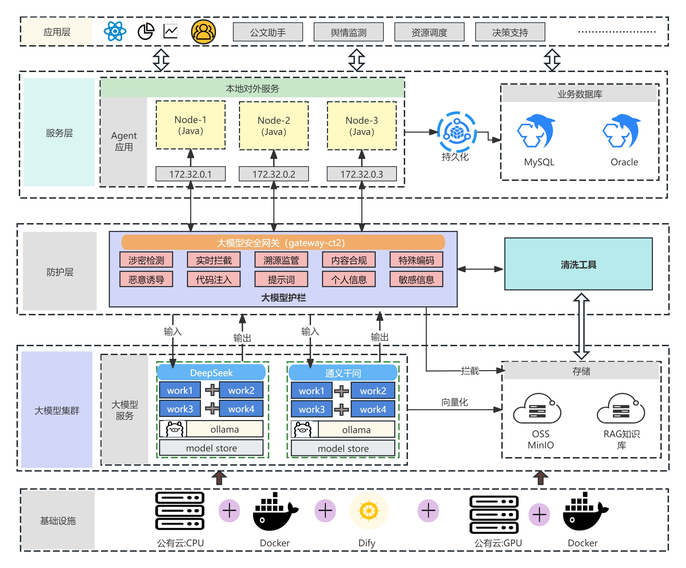
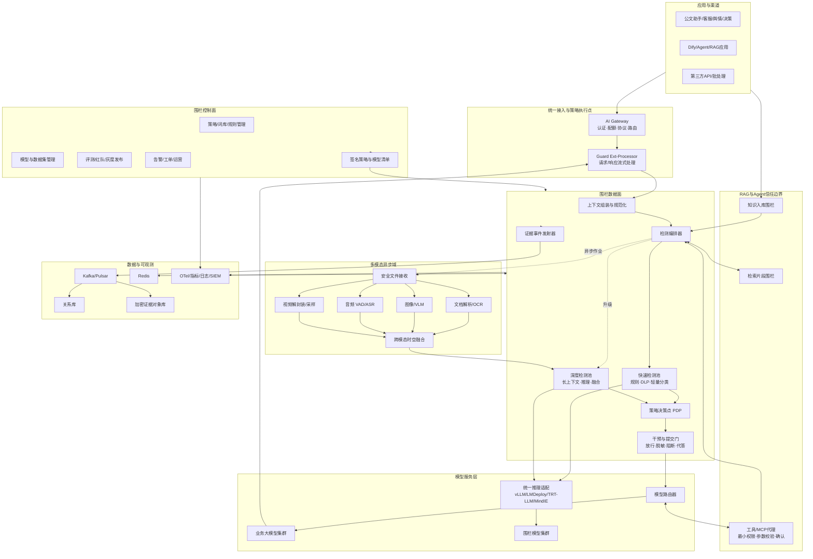
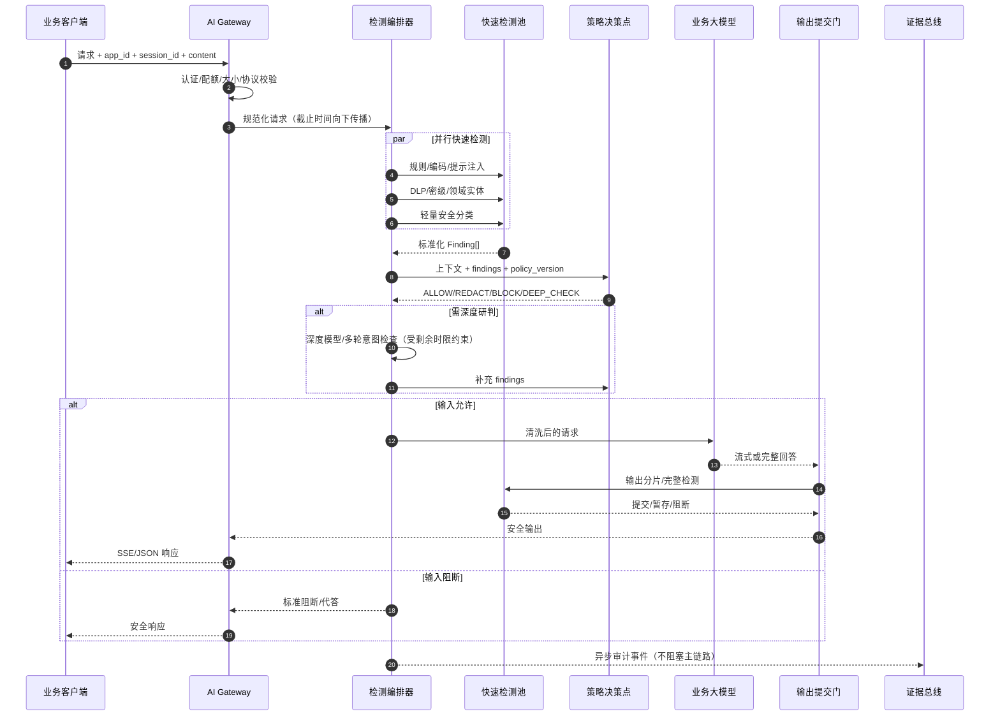
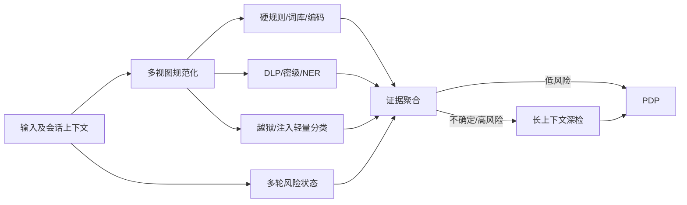
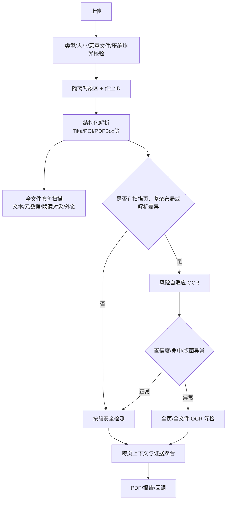
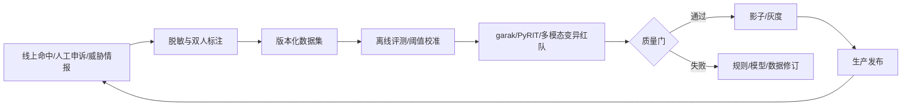

# 大模型安全围栏平台详细技术实现设计

> 文档版本：V1.0  
> 编制日期：2026-09-01  
> 配套需求基线：《大模型安全围栏产品详细需求分析报告 V1.0》  
> 文档性质：投标与实施级技术设计基线，不替代等保、密评、密码应用或正式上线评审

## 文档控制

| 项目 | 内容 |
|---|---|
| 设计目标 | 将需求报告中的 101 条产品需求落实为可开发、可部署、可压测、可审计的工程方案 |
| 主要输入 | 新华人寿招标技术规范、数据安全方案、护栏方案、电信内容安全测评规范、附件《电信大模型性能优化方案》及现状架构图 |
| 目标指标 | 快速分类响应不高于 200ms；围栏主链路 P99 不高于 300ms（不含业务大模型推理）；单节点不低于 20QPS，集群不低于 200QPS；平台可用性不低于 99.99% |
| 适用部署 | 私有化、公有云专有区、混合云；x86/ARM；GPU/NPU；国产数据库、中间件和操作系统适配 |
| 证据原则 | 所有模型、量化和性能结论以目标硬件、目标数据和全量策略实测为准；公开能力只作为选型依据，不作为验收成绩 |

## 0. 执行结论

本平台不应实现为“一个大模型判断另一个大模型是否安全”，而应实现为**网关强制接入、确定性规则与小模型快速判定、深度模型升级研判、策略引擎统一决策、全链路证据留存**的纵深防御系统。核心技术决策如下：

1. **控制面和数据面分离。** 数据面保持无状态、低时延和水平扩展；控制面负责策略、模型、样本、评测、发布和审计。策略以签名版本包下发，控制面故障不得拖垮在线请求。
2. **快慢双路径。** 纯文本和结构化输出走同步快速路径；复杂图像、音视频和大文件走异步深度路径。高风险业务可以等待深检，低风险业务允许“快速放行、异步复核”，但不得用审计模式替代招标明确的阻断能力。
3. **跨模态联合研判。** OCR/ASR 只解决“看见文字”，图像安全模型解决视觉内容，多模态融合器解决图文拆分指令；三者必须保留位置、时间和来源证据后联合决策。
4. **RAG 和工具零信任。** 网页、文档、检索片段、工具/MCP 描述与返回值均属于不可信数据；在入库、检索、拼装、调用和输出五个位置设置围栏，工具调用采用最小权限和高风险人工确认。
5. **流式输出采用提交门。** 已发送给客户端的 Token 无法撤回。高风险应用必须使用分片暂存或完整后检，不能先发送后判断；流式检测器只承诺检测尚未提交的窗口。
6. **Ollama 不作为核心生产推理底座。** 附件中的 Ollama 可用于开发、验证或边缘单机；生产环境按硬件选用 vLLM、SGLang、LMDeploy、TensorRT-LLM 或昇腾 MindIE，并通过统一推理适配层屏蔽差异。
7. **性能优化服从安全完整性。** 附件提出的首尾页抽样、OCR 裁剪拼接等仅作为加速分支；必须配套全文件廉价扫描、置信度回退和复杂版面全量 OCR，否则攻击者可将指令藏在中间页或裁剪边界。
8. **默认不记录明文提示词和回答。** 在线日志保留内容摘要、命中证据引用、决策与版本；只有合法授权的事件取证才将必要原文加密存入隔离证据库。

## 1. 范围、假设与约束

### 1.1 设计范围

本文覆盖统一接入、文本与多模态检测、提示词注入与越狱、RAG/智能体防护、输入输出干预、策略与模型管理、内容安全评测、审计运营、开放接口、性能容量、信创部署和交付验收。以下沿用需求报告的原始 ID 族名，共 101 条；设计文中出现的“网关、文本、RAG”等是能力名称，不替代原始 ID：

| 原始需求族 | 数量 | 本文实现域 |
|---|---:|---|
| ACC-001～007 | 7 | 统一入口、协议适配、租户鉴权、限流、模型路由 |
| IN-001～007 | 7 | 输入文本、编码、越狱、提示注入、多轮与敏感信息检测 |
| MM-001～007 | 7 | 图像、文件、音频、视频和图文联合检测 |
| AGT-001～007 | 7 | RAG 来源、间接注入、知识库投毒、智能体与工具控制 |
| OUT-001～008 | 8 | 输出检测、脱敏、阻断、代答、流式提交门 |
| POL-001～008 | 8 | 策略即代码、词库、规则、版本、灰度、回滚 |
| EVAL-001～008 | 8 | 数据集、自动化红队、离线评测、在线影子评测 |
| AUD-001～007 | 7 | 证据链、告警、工单、申诉与运营闭环 |
| IAM-001～007 | 7 | 三员权限、租户、应用、用户和授权管理 |
| DAT-001～007 | 7 | 数据分类分级、脱敏、加密、留存与生成内容标识 |
| INT-001～005 | 5 | API、SDK、Webhook、模型/RAG/工具和 SIEM/SOC 集成 |
| PER-001～006 | 6 | 时延、准确率、吞吐、并发、扩展和资源效率 |
| AVA-001～005 | 5 | 可用性、容错、备份、灾备和失败策略 |
| OBS-001～002 | 2 | 指标、日志、链路追踪和可观测语义 |
| SEC-001～004 | 4 | 平台、供应链、解析器与运行时安全 |
| OPS-001～004 | 4 | 部署、升级、运维、服务和交付 |
| XIN-001～002 | 2 | 信创与国产化适配矩阵 |

### 1.2 关键假设

- 200QPS 指围栏平台聚合请求吞吐，不等同于业务大模型 Token 吞吐；验收时需固定输入长度、模态比例、策略集和并发曲线。
- P99 300ms 指同步围栏主链路，不含基础大模型生成时间，也不含大文件、音频或视频的异步解析时间。
- “准确率不低于 98%”必须进一步拆成各风险类型的召回率、精确率、误报率和宏平均 F1；仅给总体准确率会被类别不平衡掩盖。
- 大文件上限可支持音频 500MB、视频 3GB，但上传、解析和检测采用异步作业接口，不在同步对话请求中传输完整文件。
- RPO、RTO、日志留存期、四种阻断模式的第四项仍以需求澄清结果为准；本文给出可落地默认值。

### 1.3 非目标

- 围栏不承诺消灭全部对抗攻击。NIST 明确指出现有对抗防御并非“银弹”；系统目标是降低成功率、限制影响面、快速发现与迭代。
- 围栏不替代业务授权、数据库行列权限、DLP、WAF、EDR、SIEM、堡垒机或人工审批。
- 围栏不保存或展示基础模型的隐藏思维链；“有害推理混淆”通过可观察的用户上下文、模型回答、行动计划、工具调用和状态变化检测。

## 2. 附件方案复核与现状架构修正

### 2.1 现状架构输入



现状图已经具备应用、Agent 服务、安全网关、大模型集群、知识库和基础设施分层，可作为迁移起点，但不能直接作为生产目标架构。主要修正项如下：

| 现状项 | 风险或缺口 | 目标修正 |
|---|---|---|
| gateway-ct2 内聚所有功能 | 网关、检测、策略、模型调用耦合，任一重任务可能拖慢全链路 | L7 入口、检测编排器、策略决策点、模型服务拆分；通过 gRPC/HTTP2 连接 |
| Java Node 静态 IP | 扩容、故障转移和发布依赖人工 | Kubernetes Service/Gateway API、服务发现、Pod 反亲和和滚动发布 |
| Dify 位于基础设施层 | Dify 是应用编排产品，不是计算、网络或容器底座 | 上移至应用/编排域；所有 Dify 模型、RAG 和工具流量仍强制经过围栏 |
| Ollama 承担模型集群服务 | 缺少生产 SLA 所需的连续批处理、资源调度和多机治理基线 | 开发环境保留；生产改用专业推理框架并抽象 OpenAI-compatible 接口 |
| 仅显示输入/输出检测 | 未覆盖 RAG 入库、检索片段、工具调用、流式提交和生成内容标识 | 增加五段式 RAG/Agent 围栏、输出提交门和标识器 |
| 清洗工具直连存储 | 可能把原始敏感内容默认落盘，数据流向不清 | 清洗采用最小化、按目的存储；原文进入隔离证据库需独立授权 |
| MySQL 与 Oracle 并列硬编码 | 形成双库耦合，难以信创迁移 | 定义关系库兼容层，按项目选择 Oracle/MySQL/PostgreSQL/达梦/人大金仓之一 |
| 未体现控制面 | 策略下发、签名、回滚、灰度和模型生命周期缺失 | 独立控制面，向数据面下发不可变签名包 |
| 未体现观测和消息总线 | 无法支撑异步检测、事件运营和 SLO | 增加 Kafka/Pulsar、OpenTelemetry、Prometheus、日志检索与证据存储 |

### 2.2 《电信大模型性能优化方案》采用矩阵

| 附件技术 | 采用方式 | 必须补强的安全边界 | 验证指标 |
|---|---|---|---|
| asyncio/协程并发 | 用于网络 I/O、模型 RPC、对象存储和消息投递 | 有界队列、截止时间传播、取消、背压；禁止无上限 `gather` | P99、事件循环延迟、队列等待、超时率 |
| 线程池处理文档/OCR | 仅包裹阻塞型 C 库或转换器；按任务类型隔离线程池 | 每租户并发配额、超时、内存/CPU 限制、熔断；CPU 重任务优先独立进程/Pod | 池饱和度、拒绝数、单文件峰值内存 |
| PNG 透明底去除 | 同时生成白底、黑底和棋盘底视图，保留原图 | 防止透明通道藏字；对多视图结果取并集并记录变换链 | 透明字攻击召回率、额外时延 |
| 拍照文档纠偏 | EXIF 纠正、文本角度检测、透视变换，多角度回退 | 纠偏置信度低时保留原图并多视图检测 | 旋转/透视攻击召回率 |
| 文本块膨胀、裁剪、拼接 | 用作快速 OCR 候选视图 | 保留坐标和原图哈希；复杂布局、低置信度、文本块边界异常时回退全页 OCR | OCR 字符召回、版面顺序准确率 |
| Word/PPT 首尾页 OCR | 只作为快速深检样本 | 先做全文件元数据和可提取文本扫描；随机/风险采样中间页；命中或异常则全量页 OCR | 中间页藏指令漏检率必须为 0（测试集） |
| Excel 直接解析 | 采用 POI/openpyxl 等结构化解析，按单元格、批注、隐藏表、公式和外链提取 | 禁止执行宏和公式；检测隐藏行列、VeryHidden、外部链接和对象 | 解析覆盖率、公式/批注/隐藏页命中率 |
| 文本文档只截取密级附近 | 可作为 DLP 加速提示 | 文本本身成本低，应先全量规则扫描；局部深模型仅用于上下文判定 | 全量规则扫描耗时、脱敏准确率 |

结论：附件的主要价值在**降低重复转换和 OCR 计算量**，而不是改变安全检测范围。所有裁剪、抽样和量化方案都必须设置安全质量门禁。

## 3. 技术选型与领先实践

### 3.1 推荐技术栈

| 能力 | 首选实现 | 可替代实现 | 选型理由与约束 |
|---|---|---|---|
| 边界网关 | Higress 或 Envoy Gateway | APISIX、Kong、Nginx Plus | Higress提供多模型路由、MCP、Token限流和AI可观测插件；Envoy `ext_proc` 适合把请求/响应交给独立围栏处理器。核心策略不得只写在网关插件内 |
| 检测编排 | 自研 Go/Java 无状态 DAG 服务 | NeMo Guardrails 作为能力参考/局部集成 | 需要严格时延、租户隔离和可控依赖；借鉴 NeMo 的 input/retrieval/execution/output rails 与并行 rail 设计 |
| 策略决策 | OPA/Rego + 签名 Bundle | Cedar、自研决策表/DMN | OPA 支持 REST/SDK/WASM、签名策略包、决策日志和热更新；高频规则可编译嵌入进程 |
| 规则与 DLP | RE2/Hyperscan、Aho-Corasick、校验算法、领域 NER | Drools、自研 DFA | 线性时间正则、确定性强、可解释；身份证/银行卡等需校验位，不能只靠正则 |
| 快速文本安全模型 | Qwen3Guard-0.6B Stream/同级国产分类器，经保险语料校准 | 自研 DistilBERT/RoBERTa 分类器 | 支持流式、中文和低延迟；必须在项目数据上重训/校准，不把公开基准当验收结果 |
| 深度文本研判 | Qwen3Guard-4B/8B Gen + 独立分类器集成 | 领域微调 Qwen/GLM/DeepSeek 分类模型 | 对长上下文、多轮、编码和推理诱导做升级研判；避免单模型单点失效 |
| 提示注入/工具行为 | PromptGuard 2/LlamaFirewall 思路 + 领域模型 + 确定性权限门 | 自研指令层级/污染传播检测 | 模型只提供风险信号，最终权限由策略和业务身份决定；Agent Alignment Checks 仅试验，不作为唯一阻断器 |
| 图像内容安全 | ShieldGemma 2 + 国产 VLM/分类器集成 | Qwen-VL/InternVL 领域微调 | 视觉内容、OCR 文本和图文联合三路判定；国外模型需完成许可证、数据出域和国产化评估 |
| OCR/文档布局 | PaddleOCR PP-OCR + PP-StructureV3 | 商用 OCR、Tesseract、其他国产 OCR | 支持布局、表格、公式和多栏阅读顺序；通用文件解析由隔离的 Tika/POI/PDFBox 补充 |
| 音频 | FunASR（VAD+ASR+标点+时间戳） | Whisper/商用离线 ASR | 中文和私有化友好；高风险片段可双 ASR 复核，必须保留时间轴 |
| 视频 | FFmpeg/ffprobe 沙箱 + 场景切分 + 图像/OCR/ASR管线 | GStreamer | 统一解封装，固定间隔与场景变化采样结合；解析进程禁网、限权、限资源 |
| NVIDIA 推理 | vLLM/LMDeploy；极致场景 TensorRT-LLM/SGLang | Triton + 自研后端 | Paged/blocked KV、连续批处理、量化、前缀缓存；TensorRT-LLM性能高但模型转换与运维成本更高 |
| 昇腾推理 | MindIE LLM/Service | vLLM-Ascend（经兼容验证） | MindIE 原生支持 Continuous Batching、PagedAttention、FlashDecoding 和多种兼容 API |
| 事件与缓存 | Kafka/Pulsar + Redis Cluster | RocketMQ、国产兼容产品 | Kafka/Pulsar承载异步检测和审计事件；Redis只存短期状态、限流和精确缓存，不存长期证据 |
| 观测 | OpenTelemetry + Prometheus/Grafana + 日志检索 | 商用 APM/SIEM | 统一 trace/metric/log；GenAI 内容字段默认关闭，避免观测系统成为泄密面 |
| 红队评测 | garak + PyRIT + 自研多模态变异器 | 商用红队平台 | garak覆盖多类探针，PyRIT适合多轮自动攻击；所有攻击需在隔离授权环境执行 |

### 3.2 不直接采用的方案

| 方案 | 不作为主方案的原因 | 保留用途 |
|---|---|---|
| 单一通用大模型做全量输入输出裁判 | 时延和成本高；自身也可被注入；结果不稳定且难以校准 | 低流量深度研判、样本辅助标注 |
| 只依赖关键词/正则 | 无法识别语义变形、跨模态组合和多轮意图 | 硬规则、DLP、编码与已知攻击快速拦截 |
| 只用 OCR 检测图片 | 无法识别无文字的色情、暴力、旗帜、姿态等视觉风险 | 图片文字提取分支 |
| 语义缓存直接复用安全决策 | 相似不等于同风险；策略或上下文变化会产生错误放行 | 精确内容哈希缓存；语义缓存只能做候选加速且必须复核 |
| 所有文件只检查首尾页 | 中间页可稳定绕过 | 低风险快速样本 + 全文件廉价扫描 + 风险自适应扩检 |
| 在在线线程内运行 Office/媒体转换 | 解析器漏洞、卡死和资源耗尽会影响网关 | 隔离 Worker、沙箱、异步作业 |

### 3.3 外部领先实践转化

- NVIDIA NeMo Guardrails 将控制点划分为输入、检索、对话、执行和输出 rails，并支持并行与流式输出检查；本设计将其转化为五段式数据面控制点，而非要求业务使用其 DSL。
- Qwen3Guard 同时提供完整上下文和流式分类思路；本设计采用“双模型/双节奏”，快速流模型负责提交门，完整上下文模型负责升级判定。
- AWS Bedrock Guardrails 的 grounding/relevance 和自动推理校验说明“内容安全、事实有据和业务规则一致性”应是不同检测器；本平台分别实现，禁止将一个分数混用。
- Azure Prompt Shields 将直接用户攻击与文档间接注入区分；本平台在请求来源和污染标签中保留这一区分。
- Google Model Armor、Anthropic Constitutional Classifiers 体现策略驱动分类器和持续合成对抗数据的重要性；本平台将政策分类、合成数据、红队、阈值校准纳入模型生命周期。

## 4. 目标总体架构

### 4.1 逻辑架构



### 4.2 物理部署域

| Kubernetes 命名空间/安全域 | 组件 | 关键隔离 |
|---|---|---|
| `guard-edge` | Gateway、WAF、ext-processor | 只开放业务入口；mTLS 到数据面；不持久化内容 |
| `guard-data` | 规范化、编排、规则、PDP、干预、模型路由 | 无状态；普通 CPU 节点；禁止直接公网访问 |
| `guard-model` | 文本/图像/VLM/ASR 围栏模型 | GPU/NPU 专属节点池；网络仅允许来自数据面和模型运维面 |
| `guard-media` | 文档、图片、音频、视频 Worker | 解析不可信文件；禁网、只读根文件系统、临时盘配额、seccomp/AppArmor/SELinux |
| `guard-control` | 策略、模型、样本、评测、发布、运营 | 与在线数据面隔离；强身份认证；双人审批 |
| `guard-data-store` | 关系库、Redis、消息、对象存储、日志检索 | 独立账号与密钥；静态加密；备份与审计 |
| `guard-ops` | OTel Collector、Prometheus、Grafana、告警适配 | 采集侧脱敏；观测账户不能反向调用业务模型 |

### 4.3 控制面与数据面发布协议

1. 控制面生成包含 `policy_version`、规则、词库摘要、阈值、模型版本、适用应用、有效期和回滚版本的不可变 Bundle。
2. 发布服务完成语法校验、冲突检查、离线回归、签名和双人审批。
3. 数据面代理通过 mTLS 拉取 Bundle，校验签名、版本单调性和内容哈希，在本地原子切换。
4. 灰度按租户、应用、用户散列或百分比生效；影子策略只产生决策事件，不改变主决策。
5. 新版本 SLO 或误报越限时自动回滚；数据面保留最近两个已验证版本。

OPA 的 Bundle、REST/SDK/WASM 和决策日志能力可直接支撑上述模式；如选自研策略引擎，也必须实现等价的签名、原子切换、决策 ID 和回滚语义。

## 5. 在线请求详细设计

### 5.1 同步请求时序



### 5.2 截止时间与降级

每个请求在入口写入绝对截止时间 `deadline_at`，下游不得各自重新开始超时计时。编排器根据剩余预算选择检测分支：

| 剩余预算/状态 | 行为 |
|---|---|
| 硬规则命中 | 立即阻断，不再调用其他模型；异步补充证据 |
| 充足且风险中高 | 执行快速检测并升级深检 |
| 预算不足但硬规则/DLP正常 | 按应用策略 fail-close、受限代答或进入人工复核；高风险应用禁止无条件放行 |
| 单一非关键检测器超时 | 熔断该检测器并使用冗余信号；记录 `DEGRADED` |
| PDP/策略不可用 | 使用本地最后可信 Bundle；无可信策略时按应用 fail-close |
| 证据总线不可用 | 写本地加密 WAL 并限量回放；WAL 水位过高触发保护，不能无限占盘 |

### 5.3 时延预算

以下是设计预算，不是已测结果。应在目标信创硬件、完整检测配置和真实长度分布下验收。

| 阶段 | P99 预算 | 实现措施 |
|---|---:|---|
| Gateway 认证、限流、协议 | 10ms | 本地公钥验证、Redis Lua 限流、连接复用 |
| 文本规范化与解码 | 15ms | 单遍扫描、递归深度/输出大小上限、保留多视图 |
| 规则、DLP、词库 | 20ms | Aho-Corasick、RE2/Hyperscan、并行确定性检查 |
| 快速分类器 RPC | 100ms | 0.6B/蒸馏模型、连续批处理、长度分桶、热实例 |
| 策略决策 | 5ms | 本地编译/WASM、无远程数据库依赖 |
| 编排、序列化与网络裕量 | 30ms | gRPC、Protobuf、同可用区部署、连接池 |
| 深检可选预算 | 100ms 内尽力完成 | 只对少量请求触发；无法在截止时间内完成则按业务策略处置 |
| **主链路设计 P99** | **不高于 280ms** | 为 300ms 验收线保留至少 20ms 抖动余量 |

快速分类器自身仍需满足“响应不高于 200ms”。若深度 4B/8B 模型无法稳定落入同步预算，只能转为阻断后复核、异步复核或延迟响应，不能用超时后默认允许掩盖性能问题。

### 5.4 统一检测结果

所有检测器只能返回证据和建议，不直接操作业务连接；最终动作由 PDP 决定。

```json
{
  "finding_id": "fd_01J...",
  "trace_id": "tr_01J...",
  "tenant_id": "tenant_x",
  "stage": "INPUT|RETRIEVAL|TOOL|OUTPUT|INGESTION",
  "modality": "TEXT|IMAGE|AUDIO|VIDEO|DOCUMENT|MIXED",
  "detector": {"id": "qwen3guard-stream", "version": "2026.08.2"},
  "risk_type": "PROMPT_INJECTION",
  "severity": "HIGH",
  "probability": 0.94,
  "calibration_version": "cal-insurance-12",
  "evidence": [{"artifact_ref": "sha256:...", "start": 182, "end": 264}],
  "provenance": {"source": "rag_chunk", "trust": "UNTRUSTED", "uri_hash": "..."},
  "suggested_action": "BLOCK",
  "latency_ms": 43,
  "degraded": false
}
```

### 5.5 风险聚合与决策

不得简单平均不同检测器分数。推荐采用“硬规则优先 + 按风险类型校准 + 证据增强 + 策略矩阵”的方式：

1. 先处理硬约束：恶意文件、禁止工具、密级越权、确定性敏感标识等。
2. 每个 `risk_type` 内将模型原始概率经温度缩放/等距回归校准。
3. 对同类独立证据采用带上限的 noisy-OR：`p = 1 - Π(1 - w_i × p_i)`；相关模型不得假装独立，应降权。
4. 按来源信任、用户身份、应用风险级别、多轮累计风险和动作影响修正。
5. PDP 依据阈值产生动作，并保存触发的具体规则和版本。

| 条件 | 默认动作 | 可配置例外 |
|---|---|---|
| 禁止类硬规则、恶意工具调用、确定性越权 | BLOCK | 无；仅安全管理员审批的短期例外 |
| PII 可安全定位且业务允许 | REDACT | 高敏字段可直接 BLOCK |
| 中风险、信号冲突 | DEEP_CHECK | 低风险应用可延迟放行并异步复核 |
| 低风险 | ALLOW | 输出仍必须检测 |
| 检测能力严重降级 | FAIL_CLOSE/RESTRICT | 只有经风险备案的低风险应用可 FAIL_OPEN |

## 6. 文本、编码与多轮攻击检测

### 6.1 规范化多视图

规范化不能覆盖原文。系统生成并关联以下视图：原始字节、UTF-8 文本、Unicode NFKC、去零宽字符、同形字标注、大小写折叠、空白压缩、HTML/Markdown 可见文本、JSON/XML 字段文本、已解码片段。每个视图保留从规范化位置到原始偏移的映射。

安全限制：

- Base64、URL、Unicode、HTML 实体等递归解码深度默认不超过 3；最大膨胀比和总输出字节受限。
- 压缩包限制文件数、嵌套层数、展开总量、单文件大小和 CPU 时间，防止压缩炸弹。
- XML 禁用外部实体和 DTD；JSON 限制深度和键数；正则使用线性时间引擎。
- 对“特殊编码”同时检查原文和解码视图，命中证据指向原始内容。

### 6.2 快速检测 DAG



### 6.3 提示注入与越狱

检测特征至少包括：指令层级篡改、要求忽略/泄露系统提示、虚构系统/助手轮次、角色替换、编码规避、后缀攻击、分隔符混淆、长上下文淹没、翻译/变体攻击、目标模型探测、系统提示抽取、越权工具调用和跨轮意图累积。

模型分类结果必须与确定性信号结合：请求是否包含伪造角色标记、是否引用系统提示片段、是否要求输出秘密、是否来自低信任检索源、是否导致高影响工具动作。单个“无攻击”模型结论不得覆盖硬规则。

### 6.4 有害推理混淆

该攻击不是简单的敏感词问题。实现采用会话级风险状态机：

| 状态信号 | 处理 |
|---|---|
| 多轮问题逐步收集同一受限目标的材料 | 累积 `goal_similarity` 和敏感能力分数 |
| 当前问题表面无害但依赖前轮有害中间结果 | 将最近 N 轮摘要与原始高风险证据送深检 |
| 模型生成计划后准备调用工具 | 检查“可观察计划 + 工具 + 参数 + 数据范围”，不读取隐藏思维链 |
| 任务分解为多个 Agent | 传播 `risk_context`、来源污染标签和剩余动作预算 |
| 用户切换语言/编码/图片继续同一目标 | 跨模态会话 ID 统一聚合，不重置风险 |

对高影响推理任务采用阶段门：`计划审查 -> 数据访问授权 -> 工具参数校验 -> 执行结果检查 -> 输出检查`。即使前一步安全，后一步也必须重新判定。

### 6.5 DLP 与敏感信息

- 确定性标识：身份证、银行卡、统一社会信用代码、手机号、账号等采用格式 + 校验位 + 上下文。
- 非确定性实体：客户姓名、保单号、健康信息、业务秘密使用领域 NER 和词典，输出字符偏移和置信度。
- 密级标识：检测页眉、页脚、水印、印章、正文和元数据；OCR 结果与版面位置联合。
- 脱敏：保留格式的替换、掩码、散列或令牌化，具体方式由数据类型和用途决定；禁止不可逆散列被误当作匿名化。
- 防泄漏：输出与受保护语料做精确片段、指纹和语义近似检查；相似命中只能触发升级，不能单独证明泄漏。

## 7. 多模态与文件检测

### 7.1 通用多模态对象模型

所有模态统一转换为 `Artifact` 图：

```text
Artifact(original hash, mime, source, owner, trust)
  -> DerivedView(transform, parameters, tool version, hash)
     -> Segment(page/region/time range, coordinates)
        -> Observation(OCR/ASR/visual label/embedding)
           -> Finding(risk, probability, evidence)
```

每个派生视图可追溯到原始文件，避免裁剪、转码和拼接后丢失取证能力。检测任务使用内容哈希幂等，同一租户同一策略版本可复用精确结果。

### 7.2 图像检测

处理流水线：

1. 校验 magic bytes、解码器支持、像素数、尺寸、帧数和解码时间；SVG 等主动内容先安全栅格化，禁止脚本和外链。
2. 生成原图、EXIF 纠正、0/90/180/270 度、透视纠偏、灰度/二值化、白/黑透明底、多尺度和局部瓦片视图。
3. OCR 检测文字、坐标、方向和置信度；布局模型恢复阅读顺序，保留表格/批注/水印。
4. 图像分类器/VLM 判断无文字视觉内容；模型提示使用固定模板，禁止将图片内文字提升为系统指令。
5. 图文融合器把用户文本、OCR 文本、视觉标签、区域关系和应用任务联合输入，识别单模态无害但组合有害的攻击。
6. 多视图结果显著不一致、OCR 置信度低、图片出现规则网格/拼接边界、异常噪声或马赛克时升级深检。

针对图像混淆的专项策略：

| 攻击 | 检测/恢复 |
|---|---|
| 拆分重排 | 网格/边缘检测、OCR 区域图、候选阅读顺序；候选数设上限，超过则深检/人工 |
| 遮挡/马赛克 | 局部纹理与文本检测器不一致、遮挡比例、超分辨率仅作辅助；不对不可恢复内容作无依据推断 |
| 旋转/透视 | 方向分类、霍夫线/文本基线纠偏、多角度 OCR |
| 噪声/低对比 | 去噪、对比度增强、二值化多视图，结果取证据并集 |
| 透明通道藏字 | 黑底、白底、棋盘底分别合成并检测 |
| 对抗贴片 | 局部异常、增强前后模型分歧、分块重判；高风险时拒绝不确定图片 |

### 7.3 文档检测



文件解析器必须作为敌对代码入口治理。Apache Tika 官方明确说明它不是安全边界，并建议对不可信文件采用进程隔离、网络隔离、资源限制和最小权限。实施要求：

- 一文件一沙箱/短生命周期进程；禁止挂载宿主敏感目录；禁网；只读根文件系统；临时目录独立配额。
- 按文件设置墙钟、CPU、内存、页数、对象数、解压量和输出字符上限；超限返回可解释状态，不能卡住队列。
- 禁止执行宏、脚本、公式、外部链接和嵌入对象；Office 转换服务不得与网关同进程。
- 比对 MIME、扩展名、文件签名和解析器结果，识别 polyglot/chimera 等差异文件并升级。
- 首尾页可优先，但至少执行全文件可提取文本与元数据扫描；对中间页采用固定 + 随机 + 风险采样，命中后全量扩检。

### 7.4 音频检测

1. 校验容器和编码，隔离调用 ffprobe/FFmpeg 统一转成受控 PCM；限制声道、采样率、时长和转码倍数。
2. VAD 划分语音片段，ASR 输出文字、词/句时间戳、语言和置信度；背景音/重叠语音标记为不确定。
3. 对 ASR 文本运行完整文本检测；对高风险或低置信度片段使用第二 ASR/不同增强视图复核。
4. 可选声学事件分类检测枪声、爆炸、尖叫等非语音有害信号；不能用 ASR 代替声学检测。
5. 将命中证据映射回原音频时间轴，支持播放器定位和人工复核。

MP3、WAV、AAC、FLAC、WMA 等格式由转码层解耦；500MB 仅是接收上限，实际还需配置最大时长、展开后 PCM 大小和租户配额。

### 7.5 视频检测

- 解封装视频、音频和字幕轨道，分别检测后按时间轴融合。
- 画面采样采用“固定间隔 + 场景变化 + OCR 变化 + 风险触发加密采样”；不能只取固定首帧/尾帧。
- 对短暂闪现文字保留相邻帧；对字幕既检查容器字幕，也检查画面烧录字幕。
- 视频画面进入图像安全模型，音轨进入 ASR/声学管线，字幕进入文本管线；时间窗口内证据联合决策。
- MP4、AVI、MOV、WMV 等由解封装层支持；3GB 文件必须分片上传、异步作业、断点续传和服务端校验。

### 7.6 图文协同检测

联合输入不是简单拼接 OCR 文本。融合器接收：用户文字、OCR 字符与区域、视觉标签、图片标题/来源、对话上下文、任务类型、指令层级和污染标签。构造两类输出：

- `joint_intent`：组合后的真实意图和受限能力类别；
- `cross_modal_dependency`：某条文字是否必须结合某个图片区域才构成指令。

训练/评测数据必须包含：文字半句 + 图片半句、图片中变量 + 文本中动作、图像藏系统指令、图片只给编码密钥、跨语言组合、重排/旋转/透明底等变体。单模态检测均安全但联合模型高风险时，按联合证据阻断。

## 8. RAG、间接注入与智能体防护

### 8.1 五段式 RAG 围栏

| 控制点 | 输入 | 核心控制 | 输出标签 |
|---|---|---|---|
| 入库前 | 网页、文件、数据库记录 | 来源认证、恶意文件、注入语句、敏感信息、版权/授权、数据投毒 | `source_trust`、`taint`、`classification` |
| 切分/向量化前 | 解析文本与结构 | 保留来源和 ACL；指令与数据分离；不清洗掉证据 | chunk 级 provenance/ACL |
| 检索后 | Top-K 片段 | 用户权限过滤、间接注入、冲突来源、异常相似度、陈旧性 | 可用/隔离片段及理由 |
| 上下文拼装 | 系统指令、用户问题、片段 | 结构化边界、引用 ID、来源预算、禁止片段改变系统策略 | 安全上下文 |
| 生成后 | 回答与引用 | 有害内容、PII、泄漏、引用一致性、grounding/relevance | 允许/改写/阻断/人工 |

间接注入检测必须区分“内容在讨论指令”与“内容试图对模型下达指令”。检索片段永远处于低于系统/开发者指令的层级，并以结构化字段传入，而不是靠自然语言警告模型自行忽略。

### 8.2 污染传播

每个外部来源带 `TRUSTED / INTERNAL / PARTNER / UNTRUSTED / QUARANTINED` 信任级别和 `PROMPT_INJECTION / SENSITIVE / MALWARE / UNKNOWN` 污染标签。标签随摘要、重排、Agent 消息和工具结果传播；只有确定性清洗器和审批流程可以降低标签，普通 LLM 总结不得自动“洗白”。

### 8.3 工具与 MCP 代理

MCP 官方规范要求把工具描述/注解视为不可信，敏感操作需要用户控制。平台实现独立 Tool Gateway：

- 工具注册：校验发布者、代码/镜像签名、输入输出 JSON Schema、数据域、读写性质、幂等性、外网能力和最大影响范围。
- 调用前：基于用户真实身份做授权，不使用通用高权服务账号；验证工具名、参数、资源范围、次数、金额/数据量等业务约束。
- 调用中：超时、速率、并发、网络出口、域名/IP 白名单、请求体和响应体大小限制。
- 调用后：把结果视为不可信内容再次检测，剥离主动脚本和未经授权的资源链接。
- 高影响动作：删除、转账、外发、修改保单/客户资料等必须明确展示参数并由人确认；模型不能代替用户确认。
- 递归 Agent：限制最大步数、总 Token、总工具次数、总费用和墙钟时间；传播 trace、风险和污染标签。

### 8.4 事实有据与业务规则校验

内容安全、事实有据和业务合规分别实现：

- Grounding：将回答中的原子主张与允许的检索证据做 NLI/引用匹配；返回支持、矛盾、无证据。
- Relevance：回答是否解决用户问题，独立于事实是否正确。
- 业务规则：对可形式化的资格、金额、地区、产品状态和审批条件使用规则/约束求解器；自然语言到变量的翻译结果需要完整性检查。
- 不可形式化或证据不足：显示不确定并转人工，禁止用“自动推理校验通过”包装未覆盖的主张。

## 9. 输出检测与四种干预模式

### 9.1 模式定义

| 模式 | 实现 | 适用 | 安全性质 |
|---|---|---|---|
| 完整输出后检测 | 服务端暂存全部回答，检测通过后一次提交 | 高风险、短回答、规则一致性检查 | 安全性最高，首字时延增加 |
| 分片/逐 Token 检测 | UTF-8 增量解码，滚动窗口检测，保留未提交尾部 | 对话、客服、长回答 | 平衡体验与安全；不能撤回已提交内容 |
| 并行检测/推测生成 | 业务模型生成与检测并行，只有安全提交门确认的前缀可下发 | 高吞吐流式场景 | 快，但需要严格提交水位和取消传播 |
| 只审计不阻断（候选第四模式） | 全量检测并告警，不改变响应 | 影子评测、策略试运行 | 不属于生产强防护；须经招标澄清确认 |

### 9.2 流式提交门

```text
模型 Token -> UTF-8 增量解码 -> 句/Token 滚动窗口 -> 并行检测 -> 提交水位 -> SSE
                                  | 命中/超时
                                  v
                         取消生成 + 安全终止事件
```

默认建议窗口为 128～256 tokens、重叠 32～64 tokens、未提交尾部 32～64 tokens；这些数值必须按中文分词、敏感片段长度和时延实测调优。检测器同时接收上一窗口摘要和当前会话风险，避免跨窗口拆分绕过。

SSE 语义：

- 正常片段只发送到已提交水位；
- 命中后立即取消下游生成，发送平台定义的安全结束事件和通用代答，不回显敏感证据；
- 客户端断开时取消业务模型与检测任务；
- 记录 `last_committed_offset`，用于证明未发送的风险片段位置。

### 9.3 输出处理优先级

`阻断 > 精确脱敏 > 安全改写 > 代答 > 放行`。安全改写本身也必须再次检测，最多重试一次，防止递归和时延失控。代码/SQL/HTML 等结构化输出先做语法解析和危险能力检查，再交给消费方；不得把模型输出直接拼接进命令、SQL、模板或网页 DOM。

### 9.4 生成合成内容标识

标识器位于输出安全处理之后、最终提交之前，遵循现行 GB 45438-2025 和《人工智能生成合成内容标识办法》：

| 内容类型 | 显式标识 | 隐式标识/元数据 | 导出与传播 |
|---|---|---|---|
| 文本 | 在起始、末尾、中间适当位置或交互界面周边显示 AI 生成提示 | 响应元数据记录生成合成属性、服务提供者名称/编码、内容编号 | 复制/导出时按适用规则保留；API 同时返回机器可读标识字段 |
| 图片 | 在不影响识别的适当位置添加显著标识 | 写入受支持文件元数据；可叠加数字水印和签名来源凭据 | 转码后重新写入并验证，避免元数据被无意剥离 |
| 音频 | 起始、末尾或适当位置增加语音/节奏提示，或由播放器界面显著显示 | 容器元数据写入生成属性、提供者和内容编号 | 格式转换后做标识完整性检查 |
| 视频/虚拟场景 | 起始画面和播放周边显著显示，按场景在中间/末尾补充 | 容器元数据与内容编号；可附带可验证来源清单 | 分发前验证显式、隐式标识和内容摘要绑定 |

实现要求：

1. 标识策略按服务类型、传播场景和法规适用性配置，但不得由普通业务用户关闭强制标识。
2. 标识元数据至少与 content_id、内容摘要、生成服务、模型/应用、生成时间和策略版本绑定；使用企业签名或 MAC 防止平台内部伪造。
3. 下载、复制、导出和转码后执行二次验证；发现标识缺失、篡改或用户声明与检测结果矛盾时，按“生成/疑似生成”规则提示并记录事件。
4. 对依法依约允许不含显式标识的特定输出建立专门授权、用户责任提示和不少于适用法规要求的日志留存；该通道不得成为通用开关。
5. C2PA Content Credentials 可作为跨平台可验证来源的增强能力，但不能替代国内强制显式/隐式标识要求，也不证明内容本身真实。
6. 标识事件写入 decision_id、content_id、标识模板/版本、写入结果和验证结果，纳入 DAT 需求验收。

## 10. 策略、模型与数据生命周期

### 10.1 策略示例

```yaml
apiVersion: guardrail.company/v1
kind: GuardPolicy
metadata:
  name: claims-assistant-prod
  version: 27
  owner: insurance-security
spec:
  appliesTo:
    applications: [claims-assistant]
    environments: [prod]
  input:
    detectors: [encoding, pii, prompt-injection-fast, harmful-content-fast]
    deepCheckThreshold: 0.62
  retrieval:
    minimumSourceTrust: INTERNAL
    blockTaints: [PROMPT_INJECTION, MALWARE]
  tools:
    allow: [policy.read, claim.status.read]
    deny: [claim.delete, customer.export]
    requireHumanApproval: [claim.update]
  output:
    mode: STREAM_HOLDBACK
    redact: [ID_CARD, BANK_CARD, HEALTH_DATA]
    blockThreshold: 0.85
  failure:
    detectorTimeout: RESTRICT
    noTrustedPolicy: FAIL_CLOSE
  evidence:
    storeRawOnBlock: false
    retentionDays: 180
```

### 10.2 策略冲突

冲突解析顺序：法律/监管硬规则 > 企业全局禁止 > 数据分类分级 > 应用策略 > 用户组策略 > 临时例外。白名单只降低明确的误报规则，不得覆盖恶意文件、越权访问、硬性禁止工具和法律禁止内容。每次决策返回实际命中的策略路径，防止“白名单生效但无法解释”。

### 10.3 模型注册与发布

模型注册项至少包括：来源、许可证、权重哈希、架构、上下文、训练/微调数据说明、风险分类体系、硬件兼容、推理镜像、量化方式、基准结果、已知限制、SBOM/AI BOM、签名和责任人。

发布门：

1. 供应链扫描、权重和镜像签名验证；禁止在线自动下载和 `trust_remote_code` 进入生产。
2. 功能回归、攻击集、白样本、多模态变体和领域样本评测。
3. 各类别阈值校准；分语言、渠道、长度和用户群报告指标。
4. 量化前后安全指标差异检查；任何关键风险召回下降超过审批阈值则拒绝发布。
5. 影子流量、1%/5%/20%/50% 灰度，监控误报、漏报、P99 和资源。
6. 发布不可变版本，支持一分钟级回滚到上一可信模型路由。

### 10.4 持续对抗数据闭环



训练集、校准集、测试集和红队保留集按攻击家族隔离，防止同源变体泄漏造成虚高成绩。人工标注保留分歧和裁决，不把模型自标结果直接当真值。

## 11. 推理服务与性能优化

### 11.1 统一推理适配层

对上提供内部稳定 API，对下适配 vLLM、SGLang、LMDeploy、TensorRT-LLM、MindIE 等。适配层统一：模型名、Token 计数、流式事件、取消、超时、最大上下文、批处理提示、健康检查、指标和错误码。业务不得依赖某个后端私有字段。

| 硬件/场景 | 推荐 | 说明 |
|---|---|---|
| NVIDIA，快速上线 | vLLM 或 LMDeploy | OpenAI 兼容、连续批处理、分页/分块 KV、量化；以实测选择 |
| NVIDIA，固定模型极致性能 | TensorRT-LLM | 支持 in-flight batching、paged attention、量化和 KV 复用；模型构建和版本治理更复杂 |
| 长上下文/前后处理分离 | SGLang 或具备 P/D 分离的后端 | 可做 prefill/decode 解耦；只有达到规模拐点后才引入，避免过早复杂化 |
| 昇腾 NPU | MindIE | 原生 Continuous Batching、PagedAttention、FlashDecoding、KV Block 管理和多 API 兼容 |
| 开发/单机边缘 | Ollama | 便捷但不作为本项目 200QPS/99.99% 主生产承诺基础 |

### 11.2 批处理与队列

- 按模型、租户等级、输入长度桶和截止时间分队列；短请求不能被长请求队头阻塞。
- 连续批处理由推理后端完成，编排器不重复造一个固定批处理层。
- `max_batch_size` 不是越大越好，应根据 KV block、目标 P99 和 OOM 安全水位压测；昇腾 MindIE 官方调优也建议结合可用 KV block 和序列长度计算上限。
- 每级队列设置最大长度和最大驻留时间；超限快速拒绝或降级，禁止无限堆积。
- 租户采用加权公平队列和突发桶；控制高频低价值请求对核心保险业务的影响。

### 11.3 KV 缓存、前缀缓存与租户隔离

Paged/blocked KV 减少显存碎片，前缀缓存可复用固定系统提示，但会引入跨租户侧信道和数据复用风险：

- 缓存键至少包含租户、应用、模型权重、Tokenizer、系统提示哈希、策略版本和权限域。
- 对支持 `cache_salt` 的后端为每租户/会话注入盐；不支持安全隔离的后端禁用跨租户前缀缓存。
- 敏感提示不进入共享缓存；缓存只在内存中并有短 TTL，不序列化到普通日志。
- 命中率、首 Token 时延、逐 Token 时延和潜在泄漏测试同时纳入验收。

### 11.4 量化和模型压缩

可评估 FP8、INT8、INT4/AWQ/GPTQ 和 KV Cache 量化，但必须按模型与硬件逐项确认支持。量化发布的最低门禁：

| 维度 | 门禁 |
|---|---|
| 安全质量 | 各高风险类别召回率不得低于基线阈值；不能只比较通用困惑度 |
| 业务质量 | 保险白样本误报、中文/方言/编码变体、长上下文均回归 |
| 性能 | P50/P95/P99、吞吐、TTFT、TPOT、显存、功耗 |
| 稳定性 | 24小时压力、OOM、批大小变化、热升级和异常输入 |
| 可回滚 | 同时保留未量化可信版本和一键路由切换 |

### 11.5 缓存

- **允许：** 规则编译结果、词典自动机、模型 Tokenizer、精确内容哈希检测结果、公开且非敏感的固定代答。
- **受限：** 语义相似结果只用于候选路由，最终放行必须经过当前策略的关键检查。
- **禁止：** 跨租户复用含敏感上下文的判定；在策略或模型版本变化后沿用旧安全决策。

精确缓存键：`HMAC(tenant_key, normalized_content_hash | context_hash | policy_version | detector_set_version)`。使用 HMAC 避免普通内容哈希被离线字典反推。

### 11.6 并发模型

附件中的异步方案在工程上拆成三类资源池：

| 池 | 工作 | 并发控制 |
|---|---|---|
| I/O 协程池 | 网关、模型 RPC、对象存储、消息 | 单事件循环监控；有界 semaphore；截止时间和取消传播 |
| CPU 线程/进程池 | 轻量 OpenCV、压缩、Tokenizer、阻塞库 | 不同任务独立池；CPU 重任务优先进程/Pod；配额和背压 |
| GPU/NPU 服务池 | 分类、VLM、ASR | 后端连续批处理；队列按长度和截止时间；显存水位保护 |

禁止从线程池任务无界地再创建子任务。OCR、Office 和 FFmpeg Worker 与在线文本池完全隔离，防止 3GB 视频耗尽对话容量。

### 11.7 容量计算

容量初算使用 Little 定律并以实测修正：

- 在线并发需求：`C = QPS_peak × S_p99 × H`，其中 `H` 为不低于 1.5 的突发/抖动系数。
- 副本数：`R = ceil(C / 单副本安全并发)`，再满足 N+1 和跨可用区要求。
- 模型吞吐需按 Token 计算：`TPS_in/out = QPS × 平均输入/输出Token`；QPS 不能替代 Token 吞吐。
- 异步 Worker：`R_worker = ceil(到达率 × 平均服务时间 / 目标利用率)`，目标利用率建议不高于 0.65～0.7 以控制尾时延。
- Kafka 分区数、Redis 连接、对象存储带宽和数据库写入也按峰值证据事件数容量化，不能只算 GPU。

示例：200QPS、围栏 P99 0.28s、突发系数 1.5 时，在线系统需承载至少 84 个在途请求；若单副本验证安全并发为 12，则理论至少 7 个业务副本，生产还需按跨区、N+1 和发布余量提高。该示例不替代真实压测。

## 12. 数据、接口与事件设计

### 12.1 核心数据实体

| 实体 | 主要字段 | 存储 |
|---|---|---|
| Tenant/Application | 租户、应用、业务风险级别、配额、失败策略 | 关系库 |
| Policy/PolicyVersion | 策略、不可变版本、签名、审批、适用范围 | 关系库 + 对象库 |
| Detector/ModelVersion | 模型清单、哈希、镜像、阈值、校准、硬件 | 关系库 + 模型库 |
| RequestContext | trace、session、来源、身份、风险状态、版本 | Redis 短期 + 事件库 |
| Artifact/DerivedView | 原始摘要、派生视图、转换链、坐标/时间 | 关系库元数据 + 隔离对象库 |
| Finding/Decision | 风险类型、概率、证据、规则、动作、降级 | 事件分析库/关系库 |
| Intervention | 脱敏位置、阻断、代答、提交水位 | 事件分析库 |
| AuditEvent | 主体、操作、对象、前后版本、decision_id | 防篡改审计库 |
| Dataset/EvalRun | 数据版本、样本谱系、指标、环境、报告 | 关系库 + 对象库 |
| Incident/Appeal | 告警、工单、处置、申诉、反馈标签 | 关系库 |

### 12.2 数据存储原则

- 关系库保存强一致元数据；ClickHouse/OpenSearch 类存储用于高吞吐事件分析；对象存储保存模型、数据集和经授权证据；Redis 只存短期状态。
- 原始提示词/回答默认不进入普通日志、指标或 trace。事件保存 HMAC 摘要、长度、模态、风险和证据引用。
- 需要原文取证时，以事件级授权、信封加密、字段级访问控制和独立留存期写入隔离桶；读取全审计并支持双人审批。
- 多租户在对象前缀、密钥、缓存键、数据库行级策略和查询权限上同时隔离。
- 审计事件采用追加写、对象锁/WORM 或哈希链；哈希链不能替代可信时间戳、访问控制和备份。

### 12.3 对外 API

| API | 用途 | 关键语义 |
|---|---|---|
| `POST /v1/chat/completions` | OpenAI 兼容代理 | 支持流式、模型路由、围栏扩展头；不破坏标准字段 |
| `POST /v1/guard/evaluate` | 独立文本/小图片同步检测 | 幂等键、策略版本、最长截止时间、标准 Findings/Decision |
| `POST /v1/guard/artifacts` | 分片上传文件/音视频 | 返回 artifact_id；服务端校验哈希与实际类型 |
| `POST /v1/guard/jobs` | 创建异步多模态检测 | 幂等、回调签名、优先级与租户配额 |
| `GET /v1/guard/jobs/{id}` | 查询进度和报告 | 只返回调用方有权查看的数据 |
| `POST /v1/guard/tool-calls/evaluate` | 工具调用前后检查 | 工具注册版本、参数、用户身份、动作影响 |
| `GET /v1/decisions/{id}` | 受控解释 | 返回规则和脱敏证据，不暴露系统提示或模型敏感信息 |
| 控制面 `/v1/policies`、`/v1/models`、`/v1/evals` | 管理 | 管理网开放；OAuth2/mTLS；双人审批和审计 |

### 12.4 错误码

| HTTP/业务码 | 含义 | 是否重试 |
|---|---|---|
| 400 `GRD_INVALID_INPUT` | 类型、结构或大小非法 | 否，修正请求 |
| 401/403 `GRD_AUTH_*` | 鉴权或授权失败 | 否 |
| 413 `GRD_ARTIFACT_TOO_LARGE` | 超出大小/展开量/时长限制 | 否或改用分片/离线流程 |
| 422 `GRD_BLOCKED` | 策略阻断 | 否；可按流程申诉 |
| 429 `GRD_QUOTA_EXCEEDED` | 配额/并发/Token 限流 | 按 `Retry-After` |
| 503 `GRD_DEGRADED_FAIL_CLOSE` | 关键检测不可用且应用要求闭锁 | 可退避重试 |
| 504 `GRD_DEADLINE_EXCEEDED` | 截止时间耗尽 | 视幂等性重试 |

阻断响应不回显具体绕过规则、敏感片段或内部阈值；受控运营端通过 `decision_id` 查看脱敏证据。

### 12.5 事件主题

建议主题：`guard.request.v1`、`guard.finding.v1`、`guard.decision.v1`、`guard.intervention.v1`、`guard.audit.v1`、`guard.incident.v1`、`guard.eval.v1`。采用 Schema Registry 兼容演进，事件包含 `schema_version`、`trace_id`、`decision_id`、`tenant_id`、策略/模型版本和事件时间；禁止生产者随意塞入原文。

## 13. 高可用、灾备与信创部署

### 13.1 高可用

- Gateway、数据面和模型路由至少 3 副本，跨故障域反亲和；PDB 保证维护期间最低可用副本。
- 数据面无状态；会话风险状态存 Redis Cluster 并允许短时退化到本地状态，不能把单 Redis 当同步单点。
- 模型池至少 N+1；健康判断同时观察进程、模型加载、实际推理探针和尾时延，避免“端口活但模型不可用”。
- 策略 Bundle 本地缓存，控制面、关系库或消息系统短时故障不影响已加载策略的在线判定。
- 多可用区流量由 Gateway 健康路由；数据库、消息、对象存储按产品能力部署同步/异步复制。

### 13.2 容灾默认值

在正式 BIA 澄清前采用：同城双活或主备、异地灾备；策略/元数据 RPO 不高于 15 分钟、平台 RTO 不高于 30 分钟。99.99% 年可用性约对应 52.6 分钟不可用预算，必须统一统计入口、计划维护、依赖故障和降级状态口径。

演练至少覆盖：单 Pod/节点/机架/可用区故障、GPU/NPU 故障、Redis 主从切换、消息积压、策略误发布、证据存储只读、模型服务超时、证书/密钥轮换和灾备切换。

### 13.3 信创适配

| 层 | 兼容要求 | 验证方式 |
|---|---|---|
| CPU/OS | x86_64、ARM64；主流 Linux 与国产服务器操作系统 | 镜像多架构构建、功能/性能/稳定性矩阵 |
| AI 芯片 | NVIDIA GPU、昇腾 NPU；其他国产卡按项目适配 | 算子、模型、量化、并发、精度和故障测试 |
| 容器平台 | 标准 Kubernetes/OCI/CSI/CNI/Gateway API | 不依赖单云私有控制面；离线安装包 |
| 数据库 | Oracle/MySQL/PostgreSQL/达梦/人大金仓等择一适配 | SQL 方言隔离、迁移脚本、HA/备份演练 |
| 消息/缓存/对象 | Kafka/Pulsar/RocketMQ、Redis兼容、S3兼容 | 协议一致性、性能、故障和数据一致性 |
| 密码 | 国密算法、硬件密码设备/KMS按密评方案接入 | 密钥全生命周期、TLS/国密套件、密码应用测评 |

接口兼容不等于性能兼容。每一种“CPU + OS + AI 芯片 + 推理框架 + 模型 + 量化”组合都必须形成有版本号的认证矩阵。

## 14. 可观测性、审计与运营

### 14.1 SLI/SLO

| 维度 | 指标 |
|---|---|
| 请求 | QPS、并发、P50/P95/P99、错误率、超时、取消、请求长度 |
| 检测器 | 各检测器延迟、队列等待、批大小、命中、超时、熔断、降级 |
| 模型 | TTFT、TPOT、tokens/s、KV 命中、显存/NPU内存、OOM、加载状态 |
| 策略 | 决策分布、策略版本、影子差异、白名单命中、自动回滚 |
| 安全质量 | 各类召回、精确率、FPR/FNR、申诉改判率、红队成功率 |
| 异步任务 | 上传、待处理、队龄、解析时间、失败重试、死信 |
| 存储 | 消息积压、WAL 水位、数据库/对象存储延迟、审计完整性 |

OpenTelemetry 的 GenAI 语义约定仍在演进，项目应锁定版本并自定义稳定的 `guard.*` 属性。提示词、回答和工具参数属于敏感内容，默认不采集；trace 中只保留长度、摘要、风险、模型和版本。

### 14.2 告警与处置

告警按单事件高危、聚合趋势、SLO、能力降级和数据完整性分类。事件自动合并必须基于攻击者、应用、风险类型、时间窗和相似证据，不能把同一攻击的 100 个分片变成 100 个工单。处置闭环：`发现 -> 分级 -> 阻断/隔离 -> 调查 -> 规则/模型修复 -> 回归 -> 发布 -> 复盘`。

### 14.3 三员与权限

系统管理员、安全管理员、审计管理员职责分离；策略发布、原文取证、模型上线和长期白名单至少双人审批。所有管理 API 使用企业统一身份、MFA、短时令牌、细粒度 RBAC/ABAC 和 mTLS；运维人员不得通过数据库直改策略绕过审计。

## 15. 平台自身安全设计

### 15.1 威胁与控制

| 威胁 | 主要控制 |
|---|---|
| 绕过网关直连模型 | 网络策略、服务身份、业务模型只接受 Gateway mTLS 身份 |
| 策略/词库投毒 | 双人审批、签名 Bundle、来源审查、离线回归、快速回滚 |
| 围栏模型供应链攻击 | 固定版本/哈希、离线模型库、SBOM/AI BOM、签名验证、禁生产远程代码 |
| 恶意文档接管解析器 | 一文件一沙箱、禁网、最小权限、资源上限、快速补丁 |
| 日志泄漏 | 默认不记原文、字段脱敏、隔离证据库、访问审计 |
| 跨租户缓存泄漏 | 租户盐、版本化缓存键、敏感前缀禁共享 |
| 模型拒绝服务 | Token/像素/时长/页数/工具步数配额、队列和超时、成本预算 |
| 输出代码注入下游 | 输出类型解析、编码、参数化调用、CSP/沙箱、禁止自动执行 |
| 管理面被攻陷 | 独立网络域、MFA、最小权限、双人审批、不可篡改审计 |
| 观测/评测数据反向泄漏 | 采集最小化、数据脱敏、隔离数据集、导出审批 |

### 15.2 软件与模型供应链

- CI 生成 CycloneDX SBOM/AI BOM，记录代码、容器、模型、数据集和配置组成。
- 使用企业 KMS/PKI 对镜像、模型权重、策略 Bundle 和离线包签名；准入控制验证签名与批准身份。
- 漏洞扫描覆盖 OS、语言依赖、CUDA/CANN、解析器、模型自定义代码和前端依赖。
- 生产镜像固定 digest、无包管理器、非 root、只读根文件系统；紧急补丁有旁路审批但必须事后补证据。
- 许可证、模型使用条款和数据出境单独评审；开源不等于可无条件商用或符合信创要求。

## 16. 测试、评测与验收

### 16.1 功能与安全数据集

在需求报告至少 2000 条攻击样本和 2000 条白样本基础上，建议形成分层保留集：

| 数据层 | 最低覆盖 |
|---|---|
| 文本攻击 | 直接/间接注入、越狱、编码、长上下文、多轮推理、提示抽取、敏感数据、违规内容 |
| 图像 | 色情/暴力等视觉风险、OCR文字、旋转/遮挡/拼接/透明/噪声/马赛克、图文拆分 |
| 音频 | 中英/方言、噪声、重叠说话、低音量、编码变体、有害语义和声学事件 |
| 视频 | 闪帧、字幕、画面+音频组合、场景切换、长视频中部藏内容 |
| RAG/Agent | 污染网页、文档注入、工具结果注入、权限越界、递归调用、数据外发 |
| 白样本 | 保险条款、理赔、医学/法律合理讨论、教育研究、引用恶意内容但不执行、正常图片文件 |

### 16.2 指标口径

- 每个风险类别分别报告 TP/FP/TN/FN、召回率、精确率、F1、FPR、FNR、ROC/PR 和置信区间。
- 总体准确率仅作附加指标；必须报告宏平均和最差类别，不允许被大量简单白样本稀释。
- 多模态报告单模态与联合模态结果，以及各变换强度下的鲁棒曲线。
- 流式检测报告“危险内容首次可判定位置、阻断位置、已提交危险 Token 数”；高风险测试要求已提交危险 Token 为 0。
- RAG 报告注入召回、正常文档误报、引用支持率、越权检索率和工具未授权执行数。
- 阈值在校准集确定后冻结，测试集不得反复调参。

### 16.3 性能测试模型

测试矩阵至少包含：短/中/长文本，多轮上下文，规则全开，DLP全开，快速分类器全开，1%/10%/30% 深检比例，缓存冷/热，流式/非流式，200/400QPS阶梯，3000会话，大文件并发和媒体队列突发。

验收记录环境：CPU/内存/GPU/NPU/网络/OS/驱动/CUDA或CANN、Kubernetes、推理框架、模型和量化版本、策略版本、样本长度分布。持续压测至少 30 分钟，稳定性测试建议 24 小时；观察 P50/P95/P99、错误、资源、积压和扩缩容抖动。

### 16.4 红队与对抗回归

- garak 用于批量探针、泄漏、越狱、毒性和编码类测试；PyRIT 用于 Crescendo/TAP 等多轮攻击编排。
- 自研变异器负责中文谐音、形近字、拼音、方言、图像变换、音频扰动、跨模态拆分和保险领域语境。
- 红队在隔离环境、授权目标和预算内运行；禁止对生产客户数据或未授权外部模型发起攻击。
- 每个已修复事件转为不可删除的回归用例，并记录在哪个策略/模型版本关闭。

### 16.5 故障与混沌测试

注入检测器超时、模型 OOM、Pod 驱逐、网络延迟、Redis切换、Kafka积压、对象存储失败、证书过期、控制面不可用、策略坏包和时钟偏差，验证失败策略、回滚、证据补写和 99.99% SLO。特别确认 fail-open 不会在高风险应用上意外生效。

## 17. 实施拆分与交付路径

### 17.1 阶段计划

| 阶段 | 周期建议 | 交付 |
|---|---:|---|
| 0. 基线与 POC | 2～4周 | 需求澄清、现状流量/数据/硬件画像、检测模型基准、网关旁路 POC、指标口径 |
| 1. 核心文本围栏 | 6～8周 | 统一接入、规范化、规则/DLP、快速分类、PDP、输入输出三种阻断、审计和基础控制台 |
| 2. RAG/Agent 与多模态 | 8～12周 | 五段式 RAG、Tool Gateway、图像/OCR、文档、音频、视频异步作业、跨模态融合 |
| 3. 运营与评测 | 4～6周 | 数据集/评测/红队、申诉工单、模型生命周期、影子灰度、质量看板 |
| 4. 规模化与信创 | 4～8周 | 目标国产环境适配、200QPS/3000会话压测、HA/灾备、等保密评整改、验收证据包 |

阶段可并行但门禁不可跳过：未完成指标口径和数据集基线，不进入模型验收；未完成失败策略和旁路封堵，不进入生产切流。

### 17.2 工作包与责任边界

| 工作包 | 主责 | 关键依赖 |
|---|---|---|
| Gateway/协议/SDK | 平台研发 | 应用清单、网络和身份体系 |
| 检测编排/策略/PDP | 安全产品研发 | 风险分类、业务策略、模型接口 |
| 文本/DLP/提示注入 | 算法+安全运营 | 样本、词库、标注规范 |
| 多模态/文件 | 多模态算法+平台 | 沙箱、对象存储、GPU/NPU |
| RAG/Tool Gateway | 应用安全+Agent平台 | 知识库 ACL、工具目录、业务授权 |
| 推理与性能 | AI平台/SRE | 目标芯片、模型、流量画像 |
| 数据/审计/运营 | 数据平台+安全运营 | 留存、取证、SIEM/SOC |
| 评测与验收 | 独立测试/安全团队 | 冻结版本、保留集、验收环境 |

### 17.3 首批技术验证清单

1. 在目标 NVIDIA/昇腾硬件上对 0.6B、4B/8B 文本围栏模型做 FP16/FP8/INT8 对比，输出每类安全指标与 P99。
2. 对 200QPS 流量完成快速路径压测，确认深检触发比例上升时的排队拐点。
3. 用真实保险 Word/PDF/PPT/Excel 验证结构化解析、首尾优化和全量回退，重点做中间页藏指令攻击。
4. 对图文拆分、透明字、旋转、拼接、噪声和马赛克形成至少 6 个强度档的鲁棒曲线。
5. 验证流式窗口和 holdback，在所有高风险用例中危险 Token 提交数为 0。
6. 对污染 RAG 文档和恶意工具返回做端到端攻击，证明每个信任边界都有 decision_id。
7. 拔除控制面、Redis、消息、单模型副本和可用区，验证最后可信策略、失败模式和证据补写。

## 18. 需求追溯矩阵

| 原始需求 ID 范围 | 数量 | 主要设计章节 | 验收证据 |
|---|---:|---|---|
| ACC-001～ACC-007 | 7 | 4、5、12、13 | 协议/鉴权/限流/路由测试、旁路扫描、扩缩容记录 |
| IN-001～IN-007 | 7 | 5、6、10 | 编码/注入/越狱/多轮/DLP 数据集报告、决策证据 |
| MM-001～MM-007 | 7 | 7、11、12 | 图像/文件/音频/视频/图文联合报告、异步作业演示 |
| AGT-001～AGT-007 | 7 | 8 | 入库到输出五段测试、污染传播、工具越权测试 |
| OUT-001～OUT-008 | 8 | 9 | 三种招标模式演示、候选第四模式澄清、流式零泄漏记录 |
| POL-001～POL-008 | 8 | 4.3、10 | 策略签名、审批、灰度、冲突、回滚和影子对比 |
| EVAL-001～EVAL-008 | 8 | 10.4、16 | 数据集谱系、garak/PyRIT、阈值冻结、回归报告 |
| AUD-001～AUD-007 | 7 | 12、14 | decision_id、证据链、告警工单、审计防篡改 |
| IAM-001～IAM-007 | 7 | 14.3、15 | 三员、MFA、RBAC/ABAC、双人审批、访问审计 |
| DAT-001～DAT-007 | 7 | 6.5、12、15 | 分类分级、脱敏、加密、留存、标识、原文取证审批 |
| INT-001～INT-005 | 5 | 8、12 | OpenAI兼容API、SDK、Webhook、MCP/工具、SIEM/SOC |
| PER-001～PER-006 | 6 | 5.3、11、16.3 | 全策略 P99、20/200QPS、3000会话、资源与稳定性报告 |
| AVA-001～AVA-005 | 5 | 13、16.5 | HA、容错、备份、灾备、失败策略和演练报告 |
| OBS-001～OBS-002 | 2 | 14 | 指标、日志、trace、告警和内容最小化检查 |
| SEC-001～SEC-004 | 4 | 7.3、15 | 渗透、解析沙箱、供应链、签名和运行时安全报告 |
| OPS-001～OPS-004 | 4 | 13、14、17 | 安装升级、运维监控、服务 SLA、交付物与培训证据 |
| XIN-001～XIN-002 | 2 | 11、13.3 | 国产 CPU/OS/AI芯片/数据库适配与实机性能矩阵 |
| **合计** | **101** | **全章** | **形成需求-设计-代码-测试-证据五级链路** |

详细实现任务应在项目 ALM 中进一步拆到每一条需求 ID（特别是 OUT-007、PER-003、PER-004、AVA-001），并关联设计、代码、测试用例和验收证据。上述范围映射用于证明整体覆盖，不能替代招标逐条应答表。

## 19. 关键 ADR 与待澄清项

### 19.1 架构决策记录

| ADR | 决策 | 原因 |
|---|---|---|
| ADR-001 | 数据面/控制面分离，数据面使用签名本地策略 | 控制面故障不影响在线防护，策略可审计和回滚 |
| ADR-002 | 快速级联而非单一大模型裁判 | 满足 300ms/200QPS，同时降低单模型绕过风险 |
| ADR-003 | Ollama只用于开发/边缘 | 生产 SLA、批处理、HA、可观测和硬件优化要求更高 |
| ADR-004 | 原始内容默认不进普通日志 | 降低日志二次泄漏和合规风险 |
| ADR-005 | 文件/音视频异步且解析沙箱化 | 文件体积、解析器漏洞和计算成本不适合同步网关 |
| ADR-006 | 首尾页/OCR裁剪必须有全量廉价扫描和回退 | 防止安全优化形成确定性漏检面 |
| ADR-007 | 高风险流式输出设置提交门 | 已发送 Token 无法撤回，审计不能代替阻断 |
| ADR-008 | 不读取/保存隐藏思维链 | 以可观察动作和业务约束治理推理风险，减少隐私与模型机密风险 |

### 19.2 上线前必须澄清

| 编号 | 问题 | 本文默认值 |
|---|---|---|
| C-01 | 技术规范称四种阻断模式但只明确三种 | 第四种按“只审计不阻断”预留，不替代前三种 |
| C-02 | 98%准确率的分类、样本和统计口径 | 按风险类别报告召回/精确/F1/FPR/FNR，宏平均且最差类达标 |
| C-03 | 300ms是否包含网络、排队和深检 | 包含围栏入口到围栏决策，排除业务大模型；完整检测配置 |
| C-04 | 200QPS请求长度和模态比例 | 以生产画像冻结测试模型；文本主链路和异步媒体分别验收 |
| C-05 | 原始内容留存和取证授权 | 默认不留；阻断证据按合法授权加密留存180天 |
| C-06 | RPO/RTO与失败策略 | RPO≤15分钟、RTO≤30分钟；高风险 fail-close |
| C-07 | 目标信创硬件与软件版本 | 建立认证矩阵后锁版，不用“兼容API”代替实机验收 |
| C-08 | 图像/音频/视频检测时限 | 文件异步；按时长/页数/分辨率建立分级 SLA |
| C-09 | 业务模型、知识库和工具旁路范围 | 所有生产访问强制 mTLS 经网关，旁路端口网络封闭 |

## 20. 主要参考技术资料

以下资料均为本设计研究输入。产品版本和文档会变化，实施时应锁定版本并重新验证。

### 20.1 护栏、攻击与评测

- [NVIDIA NeMo Guardrails：Rail types](https://docs.nvidia.com/nemo/guardrails/about-nemo-guardrails-library/rail-types)
- [NVIDIA NeMo Guardrails：Guardrails configuration](https://docs.nvidia.com/nemo/guardrails/configure-guardrails/yaml-schema/guardrails-configuration)
- [Qwen3Guard 官方仓库](https://github.com/QwenLM/Qwen3Guard)
- [Qwen3Guard 技术介绍](https://qwenlm.github.io/blog/qwen3guard/)
- [Google ShieldGemma 2 Model Card](https://ai.google.dev/gemma/docs/shieldgemma/model_card_2)
- [Meta PurpleLlama / LlamaFirewall](https://github.com/meta-llama/PurpleLlama)
- [Anthropic Constitutional Classifiers](https://www.anthropic.com/news/constitutional-classifiers)
- [AWS Bedrock Guardrails 组件](https://docs.aws.amazon.com/bedrock/latest/userguide/guardrails-components.html)
- [AWS Contextual Grounding Checks](https://docs.aws.amazon.com/bedrock/latest/userguide/guardrails-contextual-grounding-check.html)
- [AWS Automated Reasoning Checks 及限制](https://docs.aws.amazon.com/bedrock/latest/userguide/guardrails-automated-reasoning-checks.html)
- [Azure AI Content Safety Prompt Shields](https://learn.microsoft.com/en-us/azure/ai-services/content-safety/concepts/jailbreak-detection)
- [Google Cloud Model Armor](https://docs.cloud.google.com/model-armor/overview)
- [NIST AI 100-2 E2025：Adversarial Machine Learning](https://csrc.nist.gov/pubs/ai/100/2/e2025/final)
- [OWASP Top 10 for LLM Applications 2025](https://genai.owasp.org/resource/owasp-top-10-for-llm-applications-2025/)
- [NVIDIA garak](https://github.com/NVIDIA/garak)
- [Microsoft PyRIT](https://github.com/microsoft/PyRIT)

### 20.2 多模态与文件处理

- [PaddleOCR PP-StructureV3](https://github.com/PaddlePaddle/PaddleOCR/blob/main/docs/version3.x/pipeline_usage/PP-StructureV3.en.md)
- [FunASR 官方仓库](https://github.com/modelscope/FunASR)
- [Apache Tika Security Model](https://tika.apache.org/security-model.html)
- [Apache Tika Robustness](https://tika.apache.org/docs/4.0.x/advanced/robustness.html)
- [FFmpeg Documentation](https://www.ffmpeg.org/ffmpeg.html)

### 20.3 网关、策略、工具与观测

- [Higress AI Gateway](https://higress.ai/en/ai-gateway/)
- [Envoy Gateway External Processing](https://gateway.envoyproxy.io/docs/tasks/extensibility/ext-proc/)
- [Open Policy Agent Bundles](https://www.openpolicyagent.org/docs/management-bundles)
- [Open Policy Agent Decision Logs](https://www.openpolicyagent.org/docs/management-decision-logs)
- [Model Context Protocol Specification：Security and Trust](https://modelcontextprotocol.io/specification/2025-11-25)
- [Model Context Protocol Tools：Security Considerations](https://modelcontextprotocol.io/specification/2025-11-25/server/tools)
- [OpenTelemetry GenAI Attributes](https://opentelemetry.io/docs/specs/semconv/registry/attributes/gen-ai/)

### 20.4 生成合成内容标识

- [《人工智能生成合成内容标识办法》](https://www.cac.gov.cn/2025-03/14/c_1743654684782215.htm)
- [强制性国家标准 GB 45438-2025](https://openstd.samr.gov.cn/bzgk/std/newGbInfo?hcno=F32EA2A561F1886CD8D606513512D547)
- [C2PA Content Credentials Specification](https://spec.c2pa.org/post/contentcredentials/)

### 20.5 推理与供应链

- [vLLM / PagedAttention Paper](https://arxiv.org/abs/2309.06180)
- [TensorRT-LLM Documentation](https://docs.nvidia.com/tensorrt-llm/)
- [SGLang Prefill/Decode Disaggregation](https://docs.sglang.ai/backend/pd_disaggregation.html)
- [LMDeploy OpenAI-Compatible Server](https://github.com/InternLM/lmdeploy/blob/main/docs/en/llm/api_server.md)
- [昇腾 MindIE LLM 架构](https://www.hiascend.com/document/detail/en/mindie/300/LLMframe/llmdev/user_guide/user_manual/introduction.md)
- [Sigstore Cosign Signature Verification](https://docs.sigstore.dev/cosign/verifying/verify/)
- [CycloneDX SBOM Guide](https://cyclonedx.org/guides/sbom/)

## 结语

本设计的竞争力不在于堆叠更多模型名称，而在于把检测能力放入正确的信任边界、用明确的提交门和权限门把模型建议转成可控动作，并用策略版本、证据、评测和 SLO 形成可持续运营闭环。完成目标硬件 POC、逐条需求追溯和待澄清项确认后，本文可直接深化为概要设计、接口规范、数据库设计、部署手册、测试方案和投标技术偏离表。
