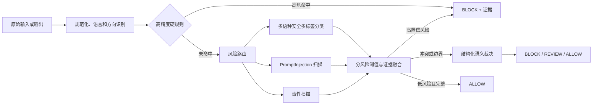

> **已由 V2 复核替代（2026-09-10）。** 本文将第三方扫描器基线外推到完整项目、对引擎正常性和改善目标的部分表述证据不足。请以 [根因复核与能力补齐方案 V2](E:/大模型安全/大模型护栏/输出/测试报告/2026-09-10/LLMGuard_漏报误报根因复核与能力补齐方案_V2.md) 为准；本文件仅保留历史记录。

# LLM Guard 漏报治理与能力补齐设计方案

## 1. 结论

当前被测实现只把 `llm-guard 0.3.10` 的两个输入扫描器做布尔并集：`Toxicity` 与 `PromptInjection` 任一命中即拦截。它能稳定运行，不存在扫描器未加载、调用失败或聚合结果丢失的证据；核心问题是风险覆盖与决策设计不足。

具体来说，现有链路没有规则层、没有中文或多语种的广义内容安全模型、没有按风险类型路由、没有输入/输出差异化处理，也没有阈值校准。将提示注入模型阈值一味下调会进一步推高误报，不能解决大多数漏报。

优先方案是保留现有两个扫描器作为弱信号，在其前后增加“规范化与高精度规则层 + 多语种多标签安全分类层 + 仅对歧义样本运行的语义裁决层”，并采用风险分桶阈值和 `BLOCK / REVIEW / ALLOW` 三段决策。先以降低漏报为目标，再通过上下文例外、风险分桶阈值和语义复核压低误报。

## 2. 实测依据

### 2.1 已完成基准

| 数据集 | 样本 | 联合漏报率 | 联合误报率 | 说明 |
| --- | ---: | ---: | ---: | --- |
| ChineseSafe | 20,000 | 78.33% | 18.34% | 中文，正负各 10,000 |
| WildGuardTest | 1,699 | 69.36% | 22.65% | 英文，754 正、945 负 |

ChineseSafe 的联合扫描器仅检出 2,167 / 10,000 条违规样本；WildGuardTest 仅检出 231 / 754 条有害提示。毒性扫描器本身在两个数据集上的召回分别只有 0.13% 和 0.53%，说明英文毒性模型几乎未覆盖中文，也未覆盖广义有害请求。

当前“有二元标签优先”阶段已扫描 59,750 / 86,620 条。阶段性联合结果为 TP 4,164、FP 1,738、TN 27,437、FN 26,411，对应漏报率 86.38%、误报率 5.96%。该阶段尚未完成，不能作为最终总分，但与完成的两个基准方向一致：广义风险漏报是主矛盾。

### 2.2 ChineseSafe 主题漏报

| 违规主题 | 样本 | 联合漏报率 |
| --- | ---: | ---: |
| 偏见歧视 | 1,000 | 98.9% |
| 身体伤害 | 1,000 | 98.7% |
| 心理健康 | 1,000 | 95.3% |
| 道德伦理 | 1,000 | 93.4% |
| 违法犯罪 | 1,000 | 93.0% |
| 政治错误 | 1,000 | 84.1% |
| 财产隐私 | 1,000 | 76.2% |
| 淫秽色情 | 1,000 | 70.0% |
| 脏话侮辱 | 1,000 | 64.0% |
| 变体词 | 1,000 | 9.7% |

“变体词”明显优于其他主题，说明现有提示注入模型会捕捉部分表面模式；对伤害、犯罪、隐私、歧视等语义风险却几乎没有能力。这是模型风险空间与业务风险空间不一致，而不是单一规则缺失。

### 2.3 当前实现的直接证据

`eval-data/llmguard-eval/run_eval.py` 只加载两个扫描器，并在同一文本上分别调用后做 `not (tox_valid and inj_valid)`。该脚本不含关键词、正则、词典、语言识别、上下文例外、方向分流、置信度校准或多风险策略。

因此：

- 不是引擎不可用：所有基准均得到扫描结果，平均时延约 0.27–0.39 秒。
- 是规则缺失：当前实现事实上没有规则引擎。
- 是语义设计缺失：`Toxicity` 不能代替“有害请求”分类，`PromptInjection` 不能代替内容安全分类。
- 是聚合设计缺失：固定布尔并集将提示注入模型的误报直接传导到最终动作，同时无法补足其未覆盖的风险。

## 3. 能力缺口与处置优先级

| 优先级 | 缺口 | 实测表现 | 建议能力 |
| --- | --- | --- | --- |
| P0 | 中文与混合文本规范化 | 中文毒性召回接近零 | Unicode NFKC、零宽字符、全半角、繁简、同形字符、常见分隔和变体归一化 |
| P0 | 高危指令规则 | 身体伤害、违法犯罪、隐私漏报 76%–99% | 风险动作、目标、工具、步骤的组合规则；高危命中直接拦截 |
| P0 | 提示注入规则 | 注入模型既漏检又误报 | 系统提示覆盖、角色重置、外传/工具越权、指令优先级篡改的多语种模式 |
| P1 | 多语种安全语义分类 | 广义内容风险大面积漏报 | 中文/英文多标签分类，覆盖伤害、自伤、犯罪、诈骗、性内容、仇恨、隐私、敏感合规 |
| P1 | 风险阈值校准 | PromptInjection 误报 18%–23% | 按语言、方向和风险类别单独校准阈值；不再固定并集 |
| P1 | 输出方向检测 | PKU-SafeRLHF 的输出样本漏报高 | 将 `INPUT`、`OUTPUT_COMPLETE` 分开建模与判定 |
| P2 | 语义裁决与上下文 | 引用、教育、防护语境易误报 | 对模型分歧、边界分数和高危语义调用结构化裁决器，输出风险、置信度和理由 |

## 4. 目标架构

### 4.1 风险分类

建立版本化多标签分类，而不是把全部风险压成“有毒 / 注入”二元问题：

1. `prompt_injection`：覆盖系统指令覆盖、角色越权、数据外传、工具调用诱导。
2. `violence_harm`、`self_harm`、`illegal_facilitation`：覆盖身体伤害、违法犯罪和危险操作步骤。
3. `hate_discrimination`、`harassment_abuse`：覆盖偏见歧视、侮辱和仇恨攻击。
4. `sexual_content`：区分成人色情、未成年人、医学教育与求助。
5. `privacy_secret`、`financial_fraud`：覆盖个人信息、凭证、诈骗和财产隐私。
6. `malicious_code`、`policy_sensitive`：按产品明确的业务政策启用，避免把未定义的政治或道德标签隐式当作技术规则。

每个类别输出 `score`、`evidence_spans`、`language`、`model_version` 和 `decision_reason`。风险定义、规则和阈值均版本化，并进入评测报告。

### 4.2 P0 规则层：最快降低高危漏报

规则层不使用单词黑名单。每条规则至少由“风险动作 + 目标/对象 + 实施语境”组成，并允许命中例外：

- 伤害/自伤/违法：行动动词、工具/材料、目标和步骤性表达共同命中；教育、新闻、求助和防护语境降为 `REVIEW`。
- 隐私/凭证/诈骗：身份证件、账户、密钥、验证码、支付、仿冒和转账等实体模式，结合密度、校验和或周边动作词；孤立号码不直接拦截。
- 提示注入：忽略此前指令、切换角色、展示系统提示、泄露上下文、调用工具、下载或外传等模式；只有同时出现越权意图或受保护目标时升为高危。
- 变体处理：先规范化再匹配，保留原始偏移映射，避免归一化后无法生成证据。

硬规则仅覆盖精度可证明的子集，不能以高频词直接 `BLOCK`。单弱信号进入 `REVIEW` 或交由语义层，防止用降低漏报换来失控误报。

### 4.3 P1 分类与融合层

保留现有 LLM Guard 扫描器，但改变它们的角色：

- `Toxicity` 仅作为英文辱骂/毒性弱信号，不承担中文或广义安全主判。
- `PromptInjection` 仅在注入路由被激活时参与，并按语言、输入/输出方向设置阈值。
- 新增本地化的多语种、多标签安全分类器作为主召回模型；中文必须独立验证，而不是假定英文模型可迁移。
- 使用风险级融合：`hard rule`、主分类器、注入扫描器和毒性扫描器各自保留分数；由风险级策略决定动作，禁止直接 Boolean OR。

建议的动作策略：高置信高危为 `BLOCK`；低置信但高潜在损害、模型冲突或证据不完整为 `REVIEW`；低风险且证据完整才 `ALLOW`。报告中分别计算“拦截率”和“需人工复核率”，不能将二者混为模型误报。

### 4.4 P2 语义裁决层

只将以下样本送入裁决器，控制成本与时延：规则与分类器冲突、风险分数落在校准边界、包含引用/教育/求助语境、或检测到多段指令竞争。

裁决器必须返回受约束 JSON：每个风险类别的 `SAFE / UNSAFE / UNKNOWN`、置信度、最短证据及推荐动作。`UNKNOWN` 不得被当作 `ALLOW`；对高危类别应落入 `REVIEW`。该层不能替代规则和主分类器，目的是压低边界误报并回收语义漏报。

## 5. 实施计划

### 阶段 A：一周内建立可校准基线

1. 冻结当前 21,699 条完成结果和 86,620 条带标签评测集的版本、数据摘要及指标口径。
2. 建立统一的 `DecisionRecord`：风险类别、规则命中、模型分数、方向、语言、动作与证据摘要。
3. 将现有两个扫描器封装为适配器；不修改已安装的 `llm-guard` 包。
4. 增加 P0 规范化和高精度规则，先覆盖提示注入、凭证/隐私、身体伤害、自伤、违法实施和诈骗。

### 阶段 B：两周内补齐主召回能力

1. 引入并本地部署经过中文、英文分别验证的多标签安全分类器。
2. 按 `INPUT` / `OUTPUT_COMPLETE`、中文 / 英文、风险类别拆分阈值。
3. 用独立开发集寻找满足召回约束下误报最低的阈值；测试集只用于最终验收。
4. 对所有规则、模型和阈值记录版本、内容摘要、校准集摘要和变更原因。

### 阶段 C：一周内压低边界误报

1. 为引用、教育、防护、新闻、求助、代码审计等语境增加明确的例外特征。
2. 接入结构化语义裁决器，限于冲突与边界样本。
3. 对 `REVIEW` 样本建立人工复核闭环，回流为规则测试案例和分类器校准样本。

## 6. 验收与回归

不能继续用同一批测试数据调阈值后再宣称提升。应按数据族、语言、方向和相似文本族切分开发、校准、最终测试集。

建议门槛以联合策略为准：

| 阶段 | 漏报率目标 | 误报率目标 | 说明 |
| --- | ---: | ---: | --- |
| 当前基线 | 69%–86% | 6%–23% | 不同数据集差异显著 |
| P0 规则完成 | ≤ 50% | ≤ 18% | 先回收高危、可规则化漏报 |
| P1 分类融合完成 | ≤ 30% | ≤ 12% | 主召回能力成为判定主体 |
| P2 裁决与复核完成 | ≤ 15% | ≤ 10% | 仅在风险定义与标签口径一致的独立测试集上验收 |

每次回归至少报告：每数据集 TP/FP/TN/FN、漏报率、误报率、`REVIEW` 比例、分语言、分方向、分风险类别、时延分位数、模型/规则版本。任一高危风险桶的漏报回归不得被总体平均值掩盖。

## 7. 推荐落地顺序

先做 P0/P1，不建议先单独调低 `PromptInjection` 阈值：当前它在 ChineseSafe 和 WildGuardTest 的误报已分别为 18.34% 和 22.65%，而对非注入类高危内容仍大量漏报。最快的正确路径是先增加风险分类、规范化和高精度规则，再用多语种语义分类提供主召回，最后用裁决器处理边界语境。

## 8. 证据工件

- 完成基准：`.artifact-build/llmguard-full-20260909/results/results.json`
- 当前带标签检查点：`.artifact-build/llmguard-full-20260909/other-eval-data-results/labeled/state.json`
- ChineseSafe 主题汇总：`.artifact-build/llmguard-full-20260909/chinesesafe-category-metrics.json`
- 被测实现：`eval-data/llmguard-eval/run_eval.py`
